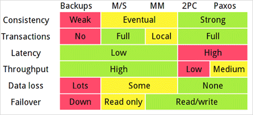

## 前言:

由於之前無論文有點久遠，先把論文瞭解的部分先寫成文章．之後再來把Lab3寫出來....  這一篇主要是講[Paxos算法](https://zh.wikipedia.org/wiki/Paxos%E7%AE%97%E6%B3%95)的部分

## MIT 6.824 分散式系統 系列文章

[6.824: Distributed Systems](http://nil.csail.mit.edu/6.824/2015/index.html)

- [[MOOCS][Golang]MIT6_824 Distributed Systems Week2(Lec2/Lab2A)](http://www.evanlin.com/mit6824-week1/)
- [[MOOCS][Golang]MIT6_824 Distributed Systems Week2(Lec2/Lab2A)](http://www.evanlin.com/mit6824-week2A/)
- [[MOOCS][Golang]MIT6_824 Distributed Systems Week2(Lec2/Lab2B)](http://www.evanlin.com/mit6824-week2B/)
- [[MOOCS][Golang]MIT6_824 Distributed Systems Week3- About Paxos Algorithm](http://www.evanlin.com/mit6824-week3-paxos/)
- [[MOOCS][Golang]MIT6_824 Distributed Systems Week4- 關於Consensus協定 Raft 學習(一):  簡介，資料格式與領導者選舉](http://www.evanlin.com/raft-study-1/)

##論文-Paxos

先拿出一張各種的consensus的解決方式比較圖．

[論文的原文](http://nil.csail.mit.edu/6.824/2015/papers/paxos-simple.pdf)，Leslie Lamport，(就是 LaTeX 中的"La")在1990提出該演算法後，由於太難懂沒有受到重視．於是他又寫了一篇來解釋自己的演算法其實很簡單． 很有趣.... 

#### 共識問題

Paxose主要是要解決共識(consensus)的問題，這一個[Quora](http://www.quora.com/Distributed-Systems/What-is-a-simple-explanation-of-the-Paxos-algorithm)舉了一個很有趣的案例討論什麼叫做共識(consensus)，就像是婚禮的誓詞一樣．

      神父: 新娘你願意嫁給新郎? 
      新娘: 願意
      神父: 新郎你願意娶新娘嗎?
      新郎: 願意
      神父: 那..我宣佈你們成為夫妻

#### 2PC (Two Phase Commit)
類似這樣就叫做共識問題，而一開始提出的解法就是2PC(Two Phase Commit) 

- **Vote-Phase**: 由協調者(也可以稱為提案者，原本也是其中一個節點)提案所有節點(node)，是否同意某個數值(或是交易)．其中協調者需要詢問所有的節點，確認大家都是同意的．
- **Commit-Phase**: 當協調者確認全部人同意後，他會執行這個動作．並且也告訴所有的節點，要執行這個部分（數值或是交易）

**缺點:**

- 指令相當繁瑣，需要一共三次的溝通．如果有n個節點，就需要有3n的資訊往來．
    - 協調者 -> 節點 (是否同意?)
    - 節點  -> 協調者 (我同意)
    - 協調者宣布提案成立
- 任何一個節點的失敗不會造成該提案失敗，但是如果在詢問的過程中協調者忽然離線了．其他的人就無法知道狀況與結果．

為了避免協調者離線的問題，於是乎有了3PC的方式 (Three Phase Commit)

#### 3PC (Three Phase Commit)

- **Phase 1**: 跟Vote-Phase一樣，協調者會問所有的節點．
- **Phase 2**(新步驟): 協調者取得所有人的共識後，會發送一個"Prepare to Commit"的訊息給所有的節點．這個動作的重點是，告訴所有的節點我們已經取得所有人的共識．要開始執行提案．(表示該提案已經成立，不會退回)．此時所有節點也會回傳給協調者告知是否有收到．
- **Phase 3**: 跟Commit-Phase一樣，協調者會執行提案後也告訴所有節點要執行該提案．

**解決的問題** 

- 如果在3PC的狀況下，如果在Phase 2發生了協調者離線(crash)，新的協調者只要重跑一次Phase2 即可，不需要重新詢問Phase 1．
- 如果是在Phase 3發生crash，由於已經收到回應確認全部人都已經有收到Prepare to Commit．所以新的協調者繼續執行最後步驟即可．

**缺點**

雖然3PC解決了重大問題，但是還是存在一些問題如下:

- 步驟變得更繁瑣，需要訊息量也從3n變成5n  (2 + 2 + 1)
- 無法解決如果網路發生問題造成某些節點以為還在第二步驟，某一些節點卻又到了第三步驟．

#### Paxos Algorithm

(Image comes from [here](http://the-paper-trail.org/blog/consensus-protocols-paxos/))

##### 為何我們需要Paxos Algorithm?

- 雖然解決了協調者crash問題，但是無法結果Partition Failure．也就是由於某些網路問題造成數個節點離開．（或是中間節點鍛造成兩個子網路）這也是所謂的 Partition tolerant algorithm．(尤其現今網路的狀況，這種情況更容易發生)
- 原來不論是在2PC或是3PC討論的都是協調者失效後，由其他人來替代的方案．但是現在要討論的是，節點失效後採取的復原方式與相關的處理．這樣會更有效用．根據原文也就是說 3PC是 fail-stop resilient但是比較需要的應該是fail-recover resilient．

##### 關於Paxos的起源與假設

Paxos主要是根據Lamport所提出的一個寓言故事，也就說個古希臘愛琴海上的被稱為Paxos的小島的故事．根據該小島議會制度所提出的演算法，裡面有幾個主要的假設:

- 小島上的人忙著經商，所以不會一直在議會裡面．也就是共識可能是在大家不一定全部都在的狀況下產生．所以他只需要大多數的人同意即可．
- 不會有拜占庭將軍問題(也就是一個訊息被傳遞兩次的問題)．而且訊息不管要經過多久，都會被傳到．
- Paxos小島上的人性本善，基本上提出的提案都會被同意．

##### 主要運作原理:

某些層面跟2PC很類似，但是主要精神不同:

- 選舉出一個leader(或是提案者)
- 提案者提出一個提案(acceptor)傳給大家(這個訊息稱為acceptor-request)在一個限定的時間內(a given time)．
- 不同於2PC，Paxos只需要大多數的人回覆同意即可繼續發送commit message給所有節點

###### 如果leader(提案者)failure?

由於原本2PC方式沒有辦法處理leader錯誤的狀況．在這裏Paxos提供以下兩個機制來處理:

- **Assign an order to leaders**: Paxos不像是 2PC ，他可以存在多個Leader．在他們發現leader failure的時候，其他節點就會推選出新的leader．並且給予每個leader一個順序．預防原本的leade又從failure recover回來．
- **Restricting leader's choice in selecting value**: 要如何能讓consensus的過程在新的leader上面繼續？ 就是要限制在這個時候被推選的leader的提案．必須是之前的acceptor (也就是說正在進行中的consensus的數值)．

##### Protocol Step:

以下的敘述，主要以議會的方式來解釋各個狀態：

- 準備階段(Prepare Stage):
    - 被選為提案者提出了一個提案，其中Proposal 1的數學表示為 P1(x, y) (x: 提案的流水號， y: 提案的內容)
    - 如果是第一個提案，所有議員都會同意．而且同意該提案後．並且議員回覆自己上次同意的號碼給提案者．並且承諾之後所有提案流水號小於x的提案都會被拒絕
     - 議員大多數狀況下只會同意，但是在以下狀況會拒絕:
        - 該提案內容(v)與前一次的提案內容相同．
        - 該提案號碼小於之前同意的提案流水號．
- 核准階段(Commit stage):
    - 提案者會在收到大多數的人回覆同意之後，將告知所有節點要把提案交付．並且把上一次的提案數據附上．如果沒有前一次數據，提案者可以自行加入任何數值．
    - 議員再收到交付的訊息後，為了不違背之前的承諾．都會把提案內容交付．
       

## 參考資料:

- [Quora: Distributed Systems: What is a simple explanation of the Paxos algorithm?](http://www.quora.com/Distributed-Systems/What-is-a-simple-explanation-of-the-Paxos-algorithm)
    - 有人在問答網站上面詢問關於Paxos Algorithm的部分，有人提出了以婚姻的方式來思考．算是挺有趣的．相當建議從這篇來了解consensus
- [Paper Trail: Computer Systems, Distributed Algorithms and Databases](http://the-paper-trail.org/blog/consensus-protocols-paxos/)    
- [分布式一致性Paxos算法学习笔记（一）：paxos大杂烩](http://www.cnblogs.com/ychellboy/archive/2009/12/29/1634685.html)
- [分布式一致性Paxos算法学习笔记（二）：算法详解](http://www.cnblogs.com/ychellboy/archive/2009/12/29/1634801.html)
- [从混乱中引导秩序——Paxos算法介绍 ](http://blog.sina.com.cn/s/blog_478fa0650100sbcf.html)
    - 這一篇文章很有趣的是有介紹到Paxos論文當初發表的經過，從拜占庭的歷史淵源到Lamport發表論文的經過．
- [分布式一致性算法：Paxos (學習總結)](http://fanli7.net/a/caozuoxitong/OS/20111115/143232.html)    
- [Wiki: Paxos](https://zh.wikipedia.org/wiki/Paxos%E7%AE%97%E6%B3%95)
- [Zookeeper用的是 zab，算是 paxos 的變形](https://cwiki.apache.org/confluence/display/ZOOKEEPER/Zab+vs.+Paxos)
- [看三國志學習 Paxos](http://blog.csdn.net/russell_tao/article/details/7244530)
- [這篇介紹得挺仔細地，還有許多圖片](http://harry.me/blog/2014/12/27/neat-algorithms-paxos/)
- [raft: Introduction透過raft的consensus介紹圖，裡面有對於paxos演算法的示意圖](https://raftconsensus.github.io/)
