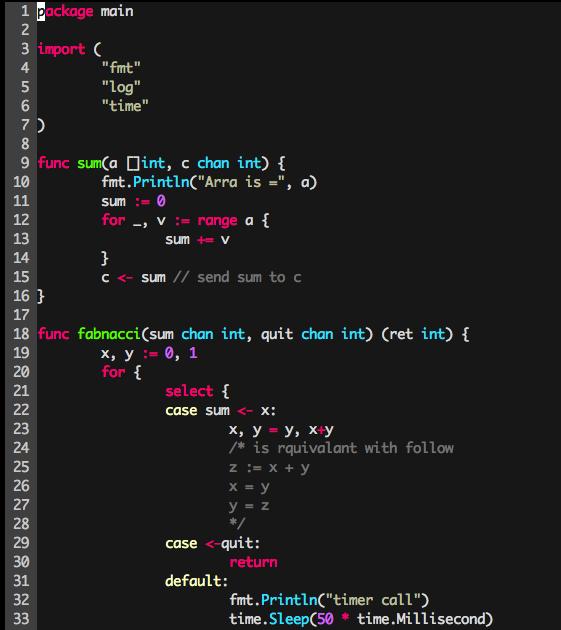
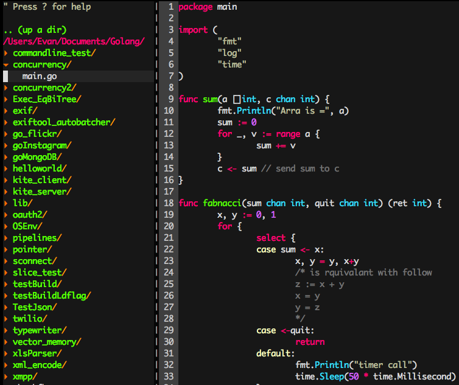

##前言

主要是[vim-go](https://github.com/fatih/vim-go)版號進步到了1.1，在社群裡面大家一面倒都使用vim來作為Go的開發環境．所以還是來試試看．

##安裝

#### 初始VIM環境

- 清乾淨環境，避免之前有裝過太多plugin

        rm -Rf ~/.vim
        rm ~/.vimrc

#### 安裝vim-pathogen

先要先裝[vim-pathogen](https://github.com/tpope/vim-pathogen)，這個可以幫助我們接下來要安裝的一些工具．

        mkdir -p ~/.vim/autoload ~/.vim/bundle && \
        curl -LSso ~/.vim/autoload/pathogen.vim https://tpo.pe/pathogen.vim

接下來要編輯`vim ~/.vimrc`:

        execute pathogen#infect()

#### 安裝Vim-Plug

- 先裝[vim-plug](https://github.com/junegunn/vim-plug)，來管理vim的plugin

        curl -fLo ~/.vim/autoload/plug.vim --create-dirs \
            https://raw.githubusercontent.com/junegunn/vim-plug/master/plug.vim 

#### 透過Vim-Plug安裝 Vim-go

- 記得還得編輯設定檔  `vim ~/.vimrc` 把以下加上去

        call plug#begin('~/.vim/plugged')
        Plug 'fatih/vim-go'
        call plug#end() 

- 還沒完，還需要啟動pluginstall

        vim
        
        :PluginInstall

他會把vim-go裝起來，透過vim 去打開go檔案，就會有基本的syntax highlighter

#### 一些vim-go進階設定

根據vim-go作者建議，你可以把以下部分加上去`vim ~/.vimrc`：

- 打開各種syntax highlighter

        let g:go_highlight_functions = 1
        let g:go_highlight_methods = 1
        let g:go_highlight_structs = 1
        let g:go_highlight_operators = 1
        let g:go_highlight_build_constraints = 1

- 各種快速鍵，其中 <leader>代表的是 '\'

        au FileType go nmap <leader>r <Plug>(go-run)
        au FileType go nmap <leader>b <Plug>(go-build)
        au FileType go nmap <leader>t <Plug>(go-test)
        au FileType go nmap <leader>c <Plug>(go-coverage)

- 把go-fmt 換成 go-import 強烈推薦 :p

        let g:go_fmt_command = "goimports"

#### 初始安裝完成

到目前為止，你可能會需要使用的功能如下(都是在`vim`下面)
      
        #Save it and check goimport result
        :w

        #Build current project
        :GoBuild 
        
        #Run it
        :GoRun
        
        #Run Go Run directly 
        \r
        
        #Run Go Build directly
        \b
        
        #Go to definition
        g d
        
#### monokai 顏色配置

如果你跟我一樣喜歡sublime text的monokai配色，你一定要跟我這樣弄:

- 從[fatih/molokai](https://github.com/fatih/molokai)下載`molokai.vim` 到 `~/.vim/colors`
- 修改設定，`vim ~/.vimrc`:

        set t_Co=256
        :colorscheme molokai

如果你跟我一樣是Mac OSX的環境，`set t_Co=256`這個設定是不能減少的． 

所以目前畫面會是這樣．

#### 資料夾開啟檔案 NERDTreeToggle

想要左半部跟Sublime Text一樣有資料結構可以選擇開啟檔案？就要裝[NERDTreeToggle](https://github.com/scrooloose/nerdtree)．一樣透過vim-pathogen來加入，透過`vim ~/.vimrc`

        map <C-n> :NERDTreeToggle<CR>

就可以透過`ctrl + N`來開啟如下：

#### tagbar: class outline viewer

[tagbar](https://github.com/majutsushi/tagbar)是一個功能強大的需要先安裝好ctags，在Mac OSX底下相當的方便

透過brew就可以直接安裝:

        brew install ctags

記得還是得裝gotag

        go get -u github.com/jstemmer/gotags

修改`vim ~/.vimrc`增加以下設定:
        
        let g:tagbar_type_go = {  
            \ 'ctagstype' : 'go',
            \ 'kinds'     : [
                \ 'p:package',
                \ 'i:imports:1',
                \ 'c:constants',
                \ 'v:variables',
                \ 't:types',
                \ 'n:interfaces',
                \ 'w:fields',
                \ 'e:embedded',
                \ 'm:methods',
                \ 'r:constructor',
                \ 'f:functions'
            \ ],
            \ 'sro' : '.',
            \ 'kind2scope' : {
                \ 't' : 'ctype',
                \ 'n' : 'ntype'
            \ },
            \ 'scope2kind' : {
                \ 'ctype' : 't',
                \ 'ntype' : 'n'
            \ },
            \ 'ctagsbin'  : 'gotags',
            \ 'ctagsargs' : '-sort -silent'
        \ }        

#### neocomplete: 即時自動補字

vim需要lua支援，可以查看是否有:
 
        :echo has("lua")

如果沒有可以更新:

        brew update vim --with-lua

這樣應該都搞定了．

## 可能會遇到的問題

#### 關於QuickFix

當跑`:GoBuild` 產生錯誤的時候，會跳出[quickfix](http://vimdoc.sourceforge.net/htmldoc/quickfix.html)，這時候可以透過以下的快速鍵使用：

- 跳到quickfix

        :.cc
        
- 關閉quickfix

        :.ccl
        
#### 關於autocomplete Preview畫面需要關閉

可以直接打

        :pclose

或是改在 `vim ~/.vimrc`

        # insert mode
        autocmd CursorMovedI * if pumvisible() == 0|pclose|endif
        autocmd InsertLeave * if pumvisible() == 0|pclose|endif

## 增加更多的順手設定(更新: 2015/08/20)

這裏記錄一些，我認為很順手的設定．此外，所有的設定檔可以參考我開源出來的[設定:https://github.com/kkdai/vimfiles](https://github.com/kkdai/vimfiles):

主要都是要修改`vim ~/.vimrc`:

        ""//主要是修改Mac上面Insert Mode: backspace 的行為．不需要再透過"x" 來刪除東西
        set backspace=indent,eol,start
        
        ""//啟動滑鼠功能，你可以用滑鼠做以下事情:
        ""//切換不同的分割畫面，透過滑鼠在NerdTree去展開與打開檔案，甚至是選取文字
        set mouse=a

        “”//啟動系統的剪貼簿，再作選取與複製的時候，不僅僅會複製到vim的記憶體中，更可以在系統剪貼簿使用．
        set clipboard=unnamed

##心得

##### 不要找人家的 .vimrc，一定要親手一步一步地安裝
##### 不要找人家的 .vimrc，一定要親手一步一步地安裝
##### 不要找人家的 .vimrc，一定要親手一步一步地安裝

很重要，講三次的原因是....  我一開始很興奮地裝了一堆plugin．其實都不會用 orz．最好的方式.. 還是自己一個個安裝.. 也一個個來瞭解怎麼用．  畢竟vim 本來就是學習曲線的進入很難，熟了以後就跟飛的一樣的一個工具．

接下來就要強迫自己儘量不用sublime text而使用vim .... orz

##相關資源:

- [Gopher Academy: vimgo env setup](http://blog.gopheracademy.com/vimgo-development-environment/)
- [Vim-go](https://github.com/fatih/vim-go)
- [關於vim vundle管理](https://www.digitalocean.com/community/tutorials/how-to-use-vundle-to-manage-vim-plugins-on-a-linux-vps)
- [要看vim指令，看這裡](http://coolshell.cn/articles/5426.html)
- 大家使用vim心得:
    - [0value: Go-vim-setup](http://0value.com/my-Go-centric-Vim-setup)
    - [初嚐vim](http://sillygodxd.blogspot.tw/2013/09/vim.html)
    - [配置 VIM 的 Go 语言开发环境](http://wuwen.org/article/38/setup-vim-go-dev-environment.html)
- [Vim Wiki](http://vim.wikia.com/wiki/Mac_OS_X_clipboard_sharing)    
    
