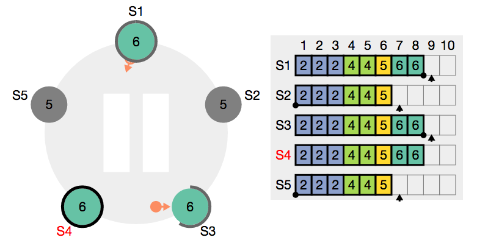
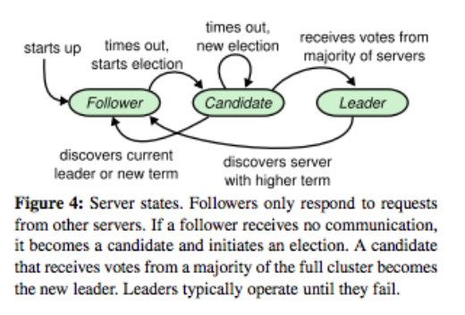
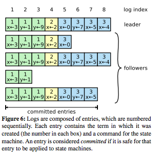
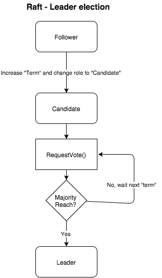

論文: [Raft Paper](https://ramcloud.stanford.edu/raft.pdf)

(這是Raft Consensus Algorithm 的展示工具[Raft Scope](https://github.com/ongardie/raftscope))

## MIT 6.824 分散式系統 系列文章

[6.824: Distributed Systems](http://nil.csail.mit.edu/6.824/2015/index.html)

- [[MOOCS][Golang]MIT6_824 Distributed Systems Week2(Lec2/Lab2A)](http://www.evanlin.com/mit6824-week1/)
- [[MOOCS][Golang]MIT6_824 Distributed Systems Week2(Lec2/Lab2A)](http://www.evanlin.com/mit6824-week2A/)
- [[MOOCS][Golang]MIT6_824 Distributed Systems Week2(Lec2/Lab2B)](http://www.evanlin.com/mit6824-week2B/)
- [[MOOCS][Golang]MIT6_824 Distributed Systems Week3- About Paxos Algorithm](http://www.evanlin.com/mit6824-week3-paxos/)
- [[MOOCS][Golang]MIT6_824 Distributed Systems Week4- 關於Consensus協定 Raft 學習(一):  簡介，資料格式與領導者選舉](http://www.evanlin.com/raft-study-1/)

## 前言

持續學習[MIT分散式系統](http://nil.csail.mit.edu/6.824/2015/)課程的時候．學完了Paxos，接下來就要學習很多系統都有使用到的Raft系統．  這次一樣直接看Paper後，試著把整個邏輯實現出來．這裡先把演算法根據我瞭解的部分在記錄一下學習心得．

## Raft介紹

這裏整理出一些關於Raft的介紹．

### 什麼是Raft Consensus

[Raft](https://ramcloud.stanford.edu/raft.pdf)跟[Paxos](http://research.microsoft.com/en-us/um/people/lamport/pubs/paxos-simple.pdf)一樣，都是為了讓多個log伺服器的備份機制所產生出來的溝通演算法．

不過，根據[Raft](https://ramcloud.stanford.edu/raft.pdf)Paper裡面提到的，為什麼會提出一個新的演算法．就是因為Paxos真的太難理解了(這裏引用的已經是簡化過的演算法，但是還是相當難理解)．所以他們提出Raft演算法，並且針對兩個主要的*目標*:

- **可理解性**: 務必讓Raft的理論容易了解．
- **容易實現**: 必須讓整套系統是容易被實現並且是容易建置的．並且能達到所保證的效能．

### Raft機制用在哪裡

如同前面說的，由於Paxos本身太過於困難了．所以Raft演算法在2014發布後迅速地成為許多分散式伺服器對於資料的同步協調最佳的應用． 以下列出幾個最近比較知名的伺服器架構:

 1. [etcd](https://github.com/coreos/etcd): 相當知名的分散式key/value的資料庫
 2.  [cockroachdb](https://github.com/cockroachdb/cockroach)被稱為是小強資料庫，不論有沒有連到Server都可以保證你可以使用．並且在連線後自動同步與協調相關資料．
 
這邊只挑出兩個最近比較紅的，其實還有相當的多． 基本上分散式資料庫近幾年都會採用Raft架構．

### Raft主要關鍵:

在Raft系統裡面，主要分成三個關鍵的功能：

- `Leader Election (領導者選舉)`: 
    - 這裏講的是關於領導者的選舉過程，還有其他角色(候選人, 跟隨者)如何轉換角色的過程．
- `Log Replication (資料複製)`:
    - 這裏提到對於log的相關記錄與處理方式，主要是要確保每一台伺服器的資料能夠精確同步而達到資料最少的遺失率．
- `Safty(安全性)`:
    - 透過Raft可以達到資料的準確性與資料可恢復性．

## 主要角色:

(圖片來自: Raft Paper，本圖主要講解三個角色關係切換示意圖)

再來要提到提到主要的角色:

- `Follower (追隨者)`: 基本上一開始每一台機器都被設定成為追隨者的角色．但是有一台收到來自狀態機的指令後，就會開始競選成領導者．
- `Leader (領導者)`: 主要接受來自於狀態機(在Raft中，狀態機就是我們的client，由狀態機發送每一個指令的log．透過Raft來達成多台同步的效果）
- `Candidate (候選人)`: 領導者不一定永遠都是完好的狀態等待狀態機的發送，某些狀況下如果領導者發生斷線或是系統出問題的時候．就會有一個跟隨者跳出來要競選成領導者． 相關的細項之後會提到．

## 關於資料結構(Log Structure) (ch. 5.3)

這裏先解釋一下，這一張圖主要表示的就是在多台Raft伺服器中，主要資料`Log`的儲存方式:

- `log index`: 是一個流水號碼，代表你處理的的資料個數．
    - 產生的人：每個Server自己保留一份`log index`
- `term`: 也就是在每個小方格上面的號碼，代表的是處理的第幾個指令集（複數個指令）． 
    - `term`的產生是由狀態機(state machine: 在這裏也可以說是client)產生出來的． 也就是說`term`是由 領導者收到後傳給每個跟隨者，而不是跟隨者自己產生的．
    - 這裏要注意的是一個指令集可能會有兩三個指令．  比如說 領導者的 Term 1: 就有 x <- 3, y <- 1, y <- 9． 但是他們代表的資料Index (Log Index各不相同)
- `operation`: 也就是主要的log資料，代表的是Client傳過來的指令(單一個)． 比如說是 x <- 3
    - 產生的人: 也是由狀態機(client)產生．

回過頭來解釋，這一張圖想要代表的意思:

- 每個橫向代表著一台伺服器儲存資料的內容． 第一個為領導者，其餘都是跟隨者
- 正常而言: 每一個伺服器的資料之間，如果`term`的數值是相同的，並且`log index`也相同就會認為兩個伺服器是相同的資料． 舉例而言， 領導者跟 跟隨者(2) (第三橫列)是相同的

### 關於資料的比對

#### 兩個伺服器如何比較自己所擁有資料比較齊全呢?   

這裏是先提到，基於這樣的資料結構，我們要怎麼說伺服器A所有的資料比伺服器B還要多，還要新呢?  以下這邊有一些原則:

- `LogIndex`與`LogTerm`組成伺服器本身的權重代表，擁有最多的`LogIndex`與最多的`LogTerm`就代表擁有教多的權重．
- 比較上，會先比較`LogTerm`再去比較`LogIndex`

## 主要指令 

Raft系統者要只有兩個RPC Call: 

- 一個是負責選舉領導者的`RequestVote()`:
    - 主要是由`候選人`來發起．發送給所有的跟隨者來尋求大家的投票成為接下來的`領導者`．
- 另一個是負責傳遞資料的 `AppendEntitries()`
    - 主要是由`領導者`來發起，主要是管理Log Replicate的工作．
- `HeartBeat()`負責領導者與`之間確認是否有存在的協定．
- `Request()` 也就是由狀態機發送過來的資料，裡面存放著狀態機指令的log．

這邊只大概講解一下，這兩個RPC Call是做什麼的，之後每一個章節會透過這兩個指令將Raft整個系統兜出來．

## 領導者選舉 (Leader Election):

#### 主要內容:

Raft 的領導者選舉，主要就是講解如何在`跟隨者`中讓某些人成為`候選人`並且順利的成為`領導者`的過程．由於一開始全部的伺服器都是`跟隨者`，有可能同時產生許多組`候選人`． 那麼如何要在這些`候選人`中挑選就是一件重要的事情．

#### 啟動領導者選舉的時間點:

讓所有的Raft伺服器群組產生選舉的時間點，有以下幾個時機:
- 一開始的時候，這時候每個跟隨者 權重(rank)都是相同的．只是看各個Server 何時送出訊息．
- `領導者`的`Hearbeat()`指令間隔太久，這裡要提一下．根據論文，**每個伺服器對於`Heartbeat()`的忍受時間間隔**可以是不同的．這樣一來才不會造成一次有一堆跟隨者吵著要參加競選．

#### 跟隨者 參加Leader Election 流程:

根據這張示意圖， 從跟隨者變成領導者的流程．我簡單地用條列式把該做的事情講一遍．

- 根據剛剛提過的當跟隨者發現太久沒有收到`Heartbeat()`的時候，就會增加自己手上的`term`．
- 將自己角色由跟隨者轉換成候選人
- 發送`RequestVote()`除了自己以外的跟隨者 (裡面會帶有候選人自身的`term`，`LastLogIndex`跟`LastLogTerm`)
- 等待每個跟隨者的回覆，如果同意的人超過**大多數**(就consensus algorithm裡面，"大多數"就剛好是 `1/2m + 1`其中`m`為總伺服器個數) 就將自己身份改成 領導者
- 如果沒有成功，則等待這段的`term`時間過了，在來發送一次．

這樣的選舉機制會不會造成多人參選？無法選出領導者? 或是如何挑選出擁有最多commited log的候選人？ 以下的部分會更詳細的解釋:

## 安全性 (Safety): 

### 選舉(election)的限制 (5.4.1)

#### RequestVote 的限制與安全性

所有與具有領導者角色的溝通演算法中，領導者最重要的角色就是必須具有所以已經交付(committed)的紀錄(log)． 所以如何讓選舉出來的領導者能具有越多已經交付的紀錄越好，就變得是重要的方式． 每個準備參與選舉的候選人必須要透過以下的方式來保證:

- 每一個候選人必須透過`RequestVote`來顯示目前自己擁有最新(update-to-date)的紀錄．
    - 這邊使用的是`RequestVote()`裡面的`lastLogIndex`跟`lastLogTerm`來傳遞溝通． 
    - 資料的比對上主要以`lastLogTerm`為主要比對項目．如果相同的時候，就會比對資料的總個數`lastLogIndex`．
- 跟隨者在回覆投票結果的時候，除了要回覆'贊成'或是'否決'外，還必須要回覆自己最新交付的紀錄（如果否決的話）．

#### 當候選人收到其他伺服器的要求

這裏有幾個例外可能性:

- 如果候選人在發送`RequestVote()`的時候，忽然收到其他成為領導者的人送來的`AppendEntitries()`．
    - 如果候選人收到的`term`與`logIndex`比自己高，這時候候選人就會轉回跟隨者的身份．
    - 反之，則候選人會繼續自己的選舉流程．
    - 最後有一種可能是都沒有候選人能夠獲得大多數的同意，所以等到time out之後就必須要重選．  

- 此外，如果候選人收到其他候選人的需求．這個時會有以下的狀態:
    - 兩個候選人會相互的比較權重(rank)，這裡的權重就是前面有介紹過的`LogIndex`與`LogTerm`的比較．透過這兩個數字可以比較出來哪位候選人比較有多一點的資料，也就是說獲得比較高的權重．
    - 比較低權重的候選人會轉換身份回跟隨者，而高權重的候選人會得到回應正確的投票(`RequestVote()`)．

#### 解決分散投票的問題

- 每個跟隨者的time out都不相同，事實上每一個伺服器在起來的時候都會隨機從一個範圍中挑選自己的time out時間(舉例 150~300 ms)．  
- 這個機制幫助我們在選舉機制裡面，大多數的狀況下只會有一個跟隨者先跳出來變成候選人並且順利地贏得選舉．

## 接下來:

接下來，我打算開始整理關於Log Replica部分的心得． 也順便會把一些pseudo code擺上來．

## 全部文章列表:

- [關於Consensus協定 Raft 學習(一): 簡介，資料格式與領導者選舉(本篇)](http://www.evanlin.com/raft-study-1/)

## 相關鏈結

- [Raft.io: 有簡單的圖示還有相當多的介紹影片與投影片](raft.github.io) 
- [Raft - Wiki](https://en.wikipedia.org/wiki/Raft_(computer_science))
- [Raft Algorithm](https://raftconsensus.github.io/)
- [Raft Paper](https://ramcloud.stanford.edu/raft.pdf)
- [MIT分散式系統: MIT6.824 Distribution System](http://nil.csail.mit.edu/6.824/2015/)
- [Paxos](http://research.microsoft.com/en-us/um/people/lamport/pubs/paxos-simple.pdf)
