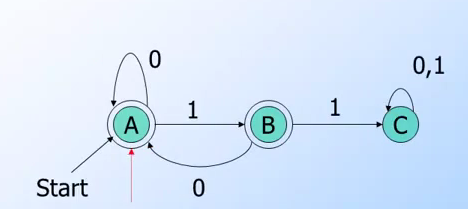

## 前言

主要是因為有[大師](https://twitter.com/william_yeh)推薦，然後發現這堂課的教授就是所謂的Compiler恐龍課本的作者[Jeffrey Ullman](https://en.wikipedia.org/wiki/Jeffrey_Ullman)([Compiler Design的聖經](https://en.wikipedia.org/wiki/Principles_of_Compiler_Design))． 加上自動機本身不僅僅實作牽扯到regular expression之外，更在分散式系統中的狀態機(state machine)扮有相當重要的部分． 所以需要來好好學習．   

課程鏈結在這裡[https://class.coursera.org/automata-004](https://class.coursera.org/automata-004)．

## 相關文章
- [[Coursera][Automata] 自動機理論-Automata筆記-第一週Finite Automata(本篇)](http://www.evanlin.com/moocs-coursera-automata-note1/)
- [[Coursera][Automata] 自動機理論-Automata筆記-第二週: Regular Expression](http://www.evanlin.com/moocs-coursera-automata-note2/)
- [[Coursera][Automata] 自動機理論-Automata筆記-第三週: Context-Free Grammars and Pushdown Automata](http://www.evanlin.com/moocs-coursera-automata-note3/)
- [[Coursera][Automata] 自動機理論-Automata筆記-第四週: Pushdown Automata and Properties of Context-Free Languages](http://www.evanlin.com/moocs-coursera-automata-note4/)
- [[Coursera][Automata] 自動機理論-Automata筆記-第五週: Turing Machines and Undecidability](http://www.evanlin.com/moocs-coursera-automata-note5/)
- [[Coursera][Automata] 自動機理論-Automata筆記-第六週(上): Intractable Problems and NP-completeness](http://www.evanlin.com/moocs-coursera-automata-note6-1/)
- [[Coursera][Automata] 自動機理論-Automata筆記-第六週(下): Intractable Problems and NP-completeness](http://www.evanlin.com/moocs-coursera-automata-note6-2/)

## 第一週課程

### DFA(Deterministic Finite Automata)基本定義

- `alphabet`: 
    - 任何有限的符號集合． (可以是ASCII也可以是Unicode)
    - ex: {0,1} (binary alphabet), {a,b} {s,p} 都是alphabet
- `string`:
    - 透過`alphabet`產生的list，其中每一個元素都要是該`alphabet`其中一個元素．
    - `length`代表的是該`string`有的個數． 
        - ex `alphabet` {0, 1} 其 `string` {01} `length`=2
    - `ε` 代表是empty string其中他的length=0
- `language`:
    - 為`alphabedt`產生出所有`string`的subset．

- `DFA: Deterministic Finite Automata`: A formalism for defining languages．由以下組成:
    - 有限的狀態(states) 表示為 `Q`
    - 固定的input `alphabet` 表示為 `Σ`
    - 一個起始狀態 (start state) 表示為`q0`
    - 至少一個結束狀態 (final state) (這裏指的final state也是指可接受的狀態) 表示為 `F`
    - 一個transition function 表示為 `δ(Q, A)`其中 `A` 代表是一個輸入的 `alphabet`
        - transition function代表的是，一個輸入所要進入的一個狀態．
        - `δ(Q, A)` 代表是從狀態`Q`透過輸入`A`來計算下一個狀態會是哪裡．
    

**範例:**

{0, 1} 是一個`alphabet`

{0, 1}* = {ε, 0, 1, 00, 01, 10, 11, 010, ...} 是`alphabet` {0,1}為可能出現的`string`組合，其中

-  {e} `length`=0
-  {0} `length`=1
-  {00} {01} {10} {11} `length`=2

如果要討論`language`，我們可以說 {ε, 0, 1,00,01,10,11} 是我們將要用到的`language`

    

(pic: from [coursera automata course lecture](https://class.coursera.org/automata-004))

以上的圖，代表一個簡單的DFA，其中:

- 輸入`alphabet`為{0, 1}
- final state為 B
- dead state為 C (`dead node: 也就是只走到C後不論怎麼輸入都無法到達final note`)
- start state為 A
- transition function可以表示以下方式: A -> δ(B, 1) -> δ(C, 1)

根據以上的圖形，其實可以表示成另外一種表格方式(Transition Table):

    

(pic: from [coursera automata course lecture](https://class.coursera.org/automata-004))

左邊為所在的狀態節點，右邊為透過輸入0或是1將要到的狀態節點． 

#### Transition Table 簡單範例

- 在A狀態輸入0會回到A狀態，輸入1會到B狀態．
- 狀態A輸入1, 1 會到狀態C。

##### Transitio Function 運算範例:

- `δ(B, 011)` -> `δ(δ(B, 01), 1)` -> `δ(δ(δ(B, 0), 1), 1)` -> `δ(δ(A, 1), 1)` -> `δ(B, 1)` -> `C`
-  `δ(A, 0)` -> `A`

### NFA(Nondeterministic Finite Automata)基本定義

NFA跟DFA有些許的不同，這裡先列出幾個幾本定義

- NFA中，可以同時存在多個狀態中，也就是說`δ(Q1, A)`有可能出現不僅僅一個狀態Q2，而是`δ(Q1, A)-> {Q2, Q3}`．這代表這裡`有路可以從Q1透過路線A可以到達Q2跟Q3`．
- 跟DFA一樣，NFA一樣開始在一個start state
- 跟DFA一樣，NFA一樣結束在一個以上的final state

 

(pic: from [coursera automata course lecture](https://class.coursera.org/automata-004))

        NFA 表現起來，比較像是棋盤式．每一個狀態(格子)同一個輸入有不僅僅一個可以走得下一步(狀態)

#### 如何把NFA轉化成DFA

從基本定義可以看得出來，NFA跟DFA的差異最大的就是:

- DFA: 每一次transition function會到唯一一個狀態，也就是: `δ(Q1, A)-> Q2`
- NFA: 每一個transition function不一定只會指向一個狀態，所以:   `δ(Q1, A)-> {Q2, Q3, ...}`

也就是說，我們可以說任何一個DFA也可以說是一個NFA，也就是說只要DFA收到同樣的語言(language)由於輸入會是一連串，也就是說輸出也會是不僅僅一個狀態．也可以說DFA透過同一個language input可以轉換成NFA．

        δD(Q1, A) -> P
        δN(Q1, A) -> {P} 可以視為 P 為 所有輸出集合的其中一個

那麼要如何反過來將NFA轉換成DFA呢?

**先就定義上的轉換**

其實某種角度來說，如果把NFA的結果當成一個language的話，其實就可以被視為是DFA．
也就是說：

        δD(Q1, A) -> P     //一般習慣的DFA表示方式
        δN(Q1, A) -> {P}   //一般習慣的NFA表示方式
        
如果把{p}當成是一種state而非是一群state，這樣就可以把NFA表示式看成是另外一種DFA。
只是那麼transition function與transition table要如何運算呢?  這時候就需要用到subset construction．

#### Subset construction             

`δD({q1, q2, q3, ... qk}, A)` 為一個將NFA轉換成DFA的transition function，而結果就是將所有結果的`聯集合(union)` i = 1, 2, 3 ... k是 `δN(qi, A)`    

也就是 

        δD({q1, q2, q3, ... qk}, A) = union(δN(qi, A))  其中 i = 1, 2, 3 ... k

#### Subset construction的範例

透過以下的方式，我們可以將NFA的transition table，轉換成DFA的．

 

以下將每個流程，用文字敘述：

- 首先走到state {1} 這時候會透過 r 跟 b 走到 2,4 跟5 ． `由於我們要取每個結果的聯集．所以 {2,4} {5} 會被當作是我們的一個State`．
- 接下來先走到 `{2,4}, 這時候要查看 {2} 與 {4}的結果`，也就是 將 {4,6}{2,8}做聯集{2,4,6,8}為r的結果，而將{1,3,5}跟{1,5,7}做聯集{1,3,5,7}．
- 並且將以上兩個結果當作新的state加入之後要走的路途
- 接下來走 {1,3,5,7} 於是又繼續看 {1} {3} {5} {7}的結果．以此類推....

會得到以下結果

 

### ε-NFA 的基本定義

 對於NFA，其實是可以允許不需要任何輸入的情況下狀態(state)自己改變． 這時候我們可以說是輸入為ε (因為 `ε`為空字串，代表的是沒有輸入)． 如此一來，所出現的NFA就稱為 ε-NFA．
 
 
(pic: from [coursera automata course lecture](https://class.coursera.org/automata-004))

最後我們會導出一個定義是

        每一個NFA都是ε-NFA

#### Closure of States : CL(q)

這裏同時會有一個新的函式 `CL(q)` : 其中CL(q)代表的就是 q 狀態的closure 也就是說透過q 所有不需要input能夠到達的state．（換句話說，也就是透過q 能夠透過輸入 ε 來到達的狀態． 也就是說 CL(q) = δN(q, ε)．

#### Example of Closure Starte

以上圖來說，這裡有一些Closure of States的範例:

- `CL(A)` = {A} 因為沒有任何ε 的輸入可以到達的狀態．
- `CL(B)` = {B, D} ，這裡`δN(B, ε) -> D`
- `CL(E)` = {B, C, D, E}

#### 更多在ε-NFA關於transition function 的運算  

- `δ(q, w)`在NFA中代表由狀態q開始透過輸入w，可以到達的狀態集合．
- `δ(q, ε) = CL(q)` 也就是說由狀態q 在沒有輸入(也就是說輸入為空集合ε)可以到達的狀態．
- `δ(q, A) = δ(q, Aε) = δ(δ(q, A), ε)` 所以可以推導出以下
- `δ(q, A) = δ(δ(q, A), ε)) = CL(δ(q, A)) = CL({E})`  (假設δ(q, A)={E})

## 關於第一週作業

這次作業主要都是一些基本觀念跟圖形來推到transition function 的結果． 主要是多看幾次就會找出來其中的規律性．（似乎也沒有方法論可以快速找到）．

## 相關程式

由於根據定義NFA與ε-NFA其實是無法去Implement的最後，我也把DFA的概念加以實現成一個小工具．放在[https://github.com/kkdai/dfa](https://github.com/kkdai/dfa)

## 參考網址

- [Coursera: Automata Course](https://class.coursera.org/automata-004)
- [DFA: wiki](https://en.wikipedia.org/wiki/Deterministic_finite_automaton)
