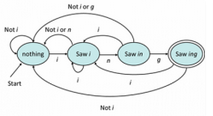
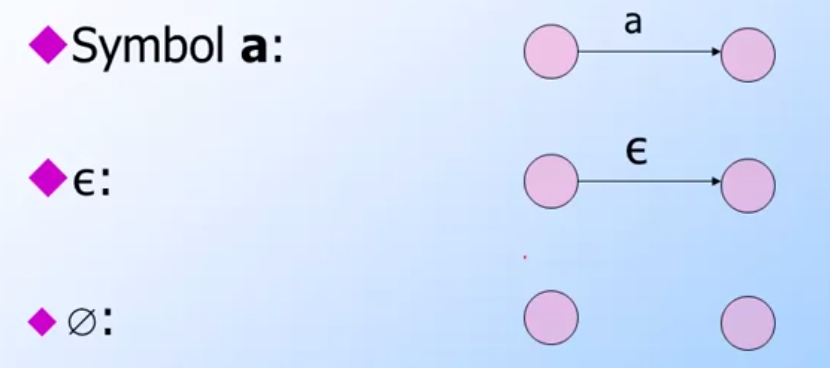
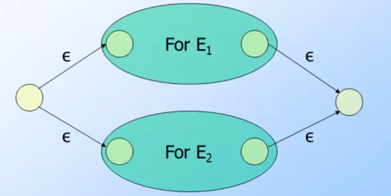
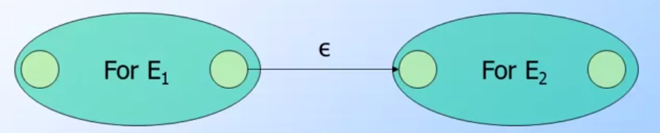
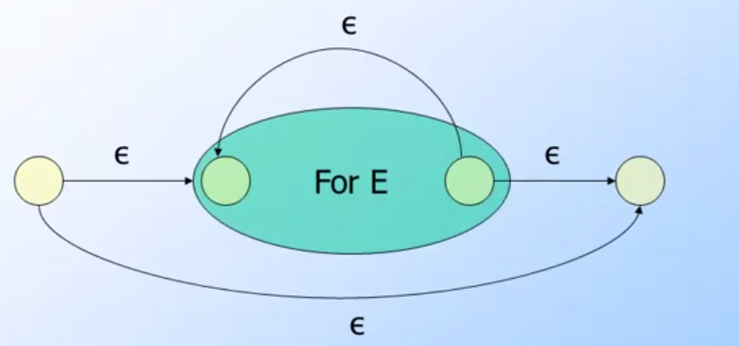
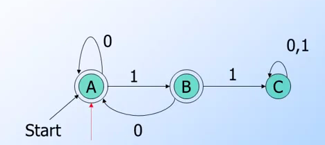
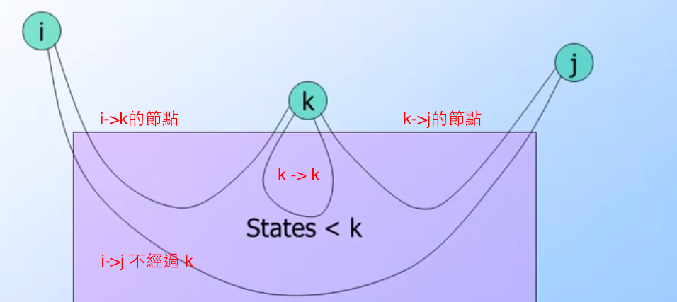
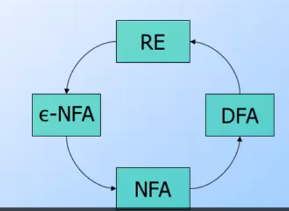
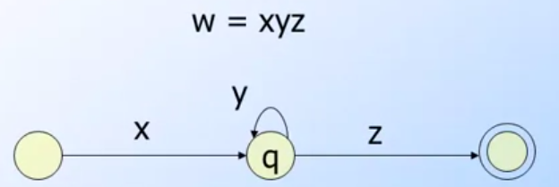
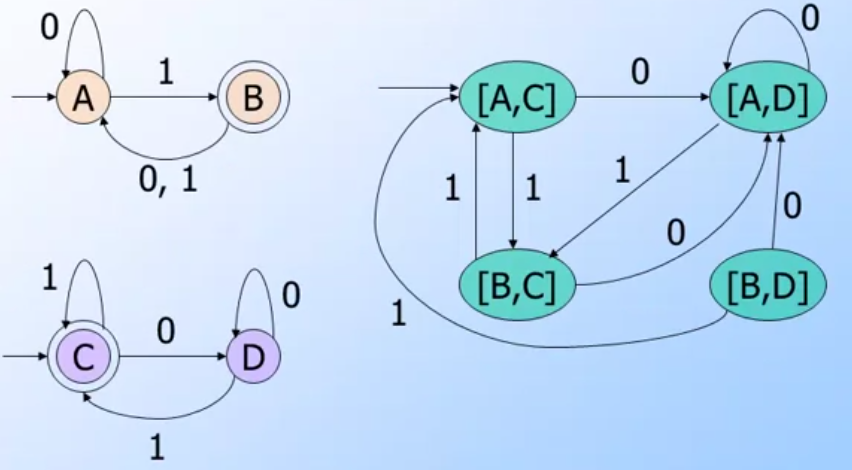

## 前言與心得整理

進入到第二週，不知道會不會有更困難的主題出現．寫筆記寫著寫著，發現自己筆記內容比原本老師講的還要多，代表自己不懂得真的太多，需要不斷的補充資料來讓自己更清楚．

## 相關文章

- [[Coursera][Automata] 自動機理論-Automata筆記-第一週Finite Automata](http://www.evanlin.com/moocs-coursera-automata-note1/)
- [[Coursera][Automata] 自動機理論-Automata筆記-第二週: Regular Expression](http://www.evanlin.com/moocs-coursera-automata-note2/)
- [[Coursera][Automata] 自動機理論-Automata筆記-第三週: Context-Free Grammars and Pushdown Automata](http://www.evanlin.com/moocs-coursera-automata-note3/)
- [[Coursera][Automata] 自動機理論-Automata筆記-第四週: Pushdown Automata and Properties of Context-Free Languages](http://www.evanlin.com/moocs-coursera-automata-note4/)
- [[Coursera][Automata] 自動機理論-Automata筆記-第五週: Turing Machines and Undecidability](http://www.evanlin.com/moocs-coursera-automata-note5/)
- [[Coursera][Automata] 自動機理論-Automata筆記-第六週(上): Intractable Problems and NP-completeness](http://www.evanlin.com/moocs-coursera-automata-note6-1/)
- [[Coursera][Automata] 自動機理論-Automata筆記-第六週(下): Intractable Problems and NP-completeness](http://www.evanlin.com/moocs-coursera-automata-note6-2/)

## 第二週課程內容:

### Regular Express 基本定義 與 運算

#### 符號定義:

通常顯示`E`來表達一個regular expression，而`L(E)` 就表示一個regular expression 能表達出來的語言(`language`)．

#### Language的運算: (Union/Concatenation/Kleene Star)

- `Union (U)`: 就是把兩個language做一個簡單的聯集． 
    - ex:   {01, 11, 101} U {10, 11, 101} = {01, 10, 11, 101}
- `Concatenaion (LM)`: 把兩個language做一個連接，但是注意這裡跟字串的concatenation是不同的．基本定義而顏，把語言L跟語言M連接在一起就稱為LM．` LM = wx | w in L and x in M`．
    - ex: 
        - L = { 01, 11}
        - M = { 10, 11}
        - LM = { 0110, 0111, 1110, 1111} 也就是 第一個L元素配上第一個M元素，第二個L元素配上第一個M元素．繼續類推．
- `Kleene Star (*)`:  就是regex裡面的*，表達任何子集合在L中與空集合或是一個以上的子集合的聯集． `L* = {ε} U L U LL ...`
    - ex:  L = {01, 11}  `L*= {} or {01, 11} or {0101, 0111, 1101, 1111} ....`

#### Regular Expression定義

- `a`是一個symbol, 如果`a`是一個regular express(記作`RE`)，則 `L(A) = {a}`
- `L{ε} = {ε}` 
- `L(empty set) = empty set`

將Langugage的運算套用過來，其中`E1` 跟 `E2`代表兩個`RE`:

- U運算： `L(E1+ E2) = L(E1) U L(E2)`
- Concatenation: `L(E1E2) = L(E1)L(E2)`
- Kleene Star (*) : `L(E*) = (L(E))*`

以下列出一些範例：

- 基本定義: `L(0) = {0}, L(01) = {01}`
- Union: `L(01+0) = L(01) U  L(0)= {01} U {0} = {01, 0}`
- Concatenation: `L(0(1+0))= L(0)L(1+0) = {0}{1,0} = {01, 00}`
- Kleene Star: `L(0*)={ε, 0, 00, 000, ... }`
- 複雜一點的綜合運算： `L((0+10)*(ε+1)) = L((0+10)*) L(ε+1) = L({0, 10}*) L(1)` 
    - 根據以上得結果，所有的Language，不論是0開頭或是1開頭，1結尾，但是只要沒有兩個連續的1就符合．
    - ex: {01} {0001} {0101010101} 
    - 連續兩個1不再其中，因為是 `({0} + {10})* U {1} `

### 將RE用ε-NFA表示:

要將RE(Regular Expression)用ε-NFA來表示，基礎的概念如下:

        邊線(arc)代表一個symbol，而路徑可以表示成 a, ε, empty set

(image from coursera Automata Course)

套用基礎運算的上如下:

**Union: 就是一個分支的圖形**
 

(image from coursera Automata Course)

**Concatenation: 就是一個連接的圖形**

(image from coursera Automata Course)

**Closure: (CL) 就是一個自己與自己迴圈的圖形(簡單來說 Kleene Star -> Closure)**

(image from coursera Automata Course)

### 將RE用DFA表示

概念上就是依照以下的方式:

        狀態(state)也就是我們節點
        而邊線(arc)就是我們會出現的symbol
        所以DFA所能接受的路線(path)就是我們要的語言(language)．

拿前一章節出現過的圖，舉例來說:

- 這個DFA要表達的A->B 的Language可以是{11} 或是 {0011} 或是 {0001} 也可以說`L(E)={1,01,0101...}`
- 所以這個RE可以表達為`E=(0)*1+(10)*1`  也就是說
    - 0可以出現一次或是無限次，但是最後一定要有一個1    
    - 或是(01)可以出現一次或是無限次，但是最後一定要接著1

#### k-Path

這邊指的K-Path指的是要透過狀態i到達狀態j其中只能經過k(其中k代表1...k, 比如說k=2 也就是 0, 1, 2)能到達目的狀態的路線，先用簡單的DFA來舉例，舉例而言．  請注意所謂的 k-path**不代表必須經過k**，是可以不經過的．

**由狀態A->B的k-path**

- 0-path 也就是A->B不經過任何其他狀態，結果`1`
- A-path 也就是A->B可以經過狀態A，結果`0*1+1`，也就是可以走無限個0然後走到B或是直接走到B．
- B-path 可以經過B，也可以經過A(這裏假設 A = B - 1)，當然可以都不經過．所以推導出來也就是整個DFA的RE：也就是 `0*1+(10)*1`

#### 關於 k-path的推導題

k-path通常指的是由狀態i 到狀態j 必須經過k狀態（其中k代表的是 0, 1, 2, ... k)． 

        記作 R_ij^(k) (其中 ij 為下標，k為上標)

所以R_ij^(k) 也可以換成思考為:

- 路徑由 i到j 不經過 k (k-path是可以不經過k，也代表經過k個數是0)
- 或是:
    - 路徑由i到k
    - 路徑k走到過所有k-1的狀態回到k
    - 路徑由k走到j
    
如以下圖:

    
透過以上的圖示，可以推導出公式如下：

        R_ij^k = R_ij^(k-1) #也就是 i->j 不經過 k
                +  R_ik^(k-1)   R_kk^(k-1)*  R_kj^(k-1)   # 就是 i->k, k-k, k->j   

### UNIX (REGEX) Regular Expression

接下來，課程談到介紹UNIX上面常使用的Regular Express．這邊大家應該比較熟悉，只把幾個常用符號整理一下:

- [a-c] 指的是 a, b, c 都可以
- [a-z] 同理可證，就是所有小寫字母．
- “+” 指的是出現至少一次．
- “*” 指的是零次或是以上．
- “?” 指的是零或是一次．

還有一些跟RE與NFA跟DFA的轉換可以筆記一下:

- UNIX RE 先轉換成 ε-NFA (並且擁有自己的final state)
- 設定一個新的start state 並且將原本的ε-NFA 作為 ε-translations
- 透過ε-translations就可以轉換成DFA
- 透過DFA可以再度的轉換到RE去

詳細的轉換方式，可以參考以下圖片

### Decision Properties of Regular Language 

####定義: 

Decision Properties of Regular Language指的是是一個演算法來作為正式敘述一個語言的方式．

舉例:

- Is string w in language L?
- Are those two language the same?

####The Emptiness Problem

指的是給予的Language是不是符合這個RE也就是說，假設是DFA給予的語言，能不能夠從start state 跑到 final state．

####The Infinitness Problem

指的是RE中是否有發生迴圈的圖形．
而檢查圖形是否為 Inifitness 最簡單的方法是: 

        如果全部的狀態個數為n， 只要可以接受輸入language個數，而且 m >n．  代表就會有迴圈發生．

        

就會像是以上的圖形一樣．

##### Pumping Lemma

需要先定義一下，什麼是[Pumping Lemma](https://en.wikipedia.org/wiki/Pumping_lemma_for_regular_languages)，根據[wiki](https://en.wikipedia.org/wiki/Pumping_lemma_for_regular_languages)上面解釋如下:

        RE中一個長字串，其中有一段文字有出現超過一次以上．
        
簡單的說，[Pumping Lemma](https://en.wikipedia.org/wiki/Pumping_lemma_for_regular_languages) 也就是上面圖形所呈現的狀態．

那接下來就要顯示．基礎定義：

- 全部的狀態個數為n，輸入的語言為w
- w = xyz
- |xz] <= n 
    - 這邊解釋一下|xz|代表的是出現的alphabet個數，比如說 x=abca z=bcdb `|xz|=abcd`      
- |y| > 0
- For all i>=0 xy^i z is in L

這幾個定義裡面，最重要的其實是`|xz] <= n`．因為找出`y`的方式不是在找出重複的，而是要確認`|xz]`．以下舉一個例子:

##### Pumping Lemma 範例:

ex: 語言L他的狀態為1,2,3 輸入為{a, b, c} 輸入為 {abacca}，他們的狀態變化是 1(a)->2(b)->3(a)->2(c)->1(c)->3(a)->2 找出他的w =xyz的pumping lemma

解法：

- 首先試著去找出第一個重複的狀態．也就是1->2->3->2->...   
- 這時候抽出2->3的輸入{ba} 即為 y
- 同理，可以分解出前面的x={a} z={cca}．同時驗證 |xz|= {ac} <= 3 

#### 如何驗證兩個DFA L與M 是否equivalence
 
 要證明兩個DFA是否equivalence，需要透過以下方式:
 
 - 計算 L product M
 - 找出 w 滿足L也滿足M(滿足:accept 代表能由start state到final state)
 - 這樣就可以證明 L與M是 equivalence
 
 接下來，要如何做 `L product M`方法如下:
 
 - 假設Q1 是 L的所有狀態， Q2是M的所有狀態
 - 找出Q1與Q2的start state [q1, q2]
 - 開始iterate 每一個transition function，並且找出product DFA
 - 透過最後的Product DFA找出一個w 可以由start state走到final state．
 - 即代表兩個DFA L與M是equivalence
 

(image from coursera Automata Course)

##### 範例:

- 起始點為[A, C]
- 走第一個transition input 0
    - [A, D]
- 走第二個transuion input 1
    - [B, C]
- 依照這個方式... 慢慢建構出所有的DFA如上圖右         

     
        
### Closure Properties of Regular Language

這裏主要是敘述定理，還有一些證明方式，主要定義如下:

- L 跟 M 都是 `Regular Language (可以使用regular expression表示出來)`

進行以下的操作，並且證明結果都是屬於regular language:

- **Union**: L U M 仍然是regular language (可以用regular expression來表示)
    - R是L的regular expression， S 是 M的regular expression．`L U M = R + S`．可以得知 `R + S仍然是regular expression (根據 union law)
- **Concatenation / Kleene Star**: 根據以上的方式， RS (concatenation)，及 R* , S* 仍然都符合regular expression (concatenation and kleene star law)
- **Intersection**: L intersect M   代表裡面的 R S要找出交集的部分，使用的方式是將兩個圖形做 product 然後找出product的regular expression 即為 L intersect M．
- **Difference**: L - M 也會是符合regular language． 根據上一則的方式，透過 product DFA LM 可以找出一個流程是 L 可以由start state跑到 final state但是 M不行． 由於該流程regular expression 是存在於L的其中一個，所以該流程也是符合regular expression． 所以  L - M 也符合regular langugage
- **Completement**: `completement in L = sigma(Σ)* - L` sigma(Σ) 是regular languge 當然Σ* 也是regular languge根據剛剛的difference 定理  L - M 也符合regular langugage自然而然 Σ* - L 也是．
- **Reversal**:  L^R 表示Reversal 代表的是 L = {0, 01, 11}  `L^R = { 0^R, (01)^R, (11)^R}= { 0, 10, 00}`
    - 需要注意的是 `(0)^R = 0` 同理可證 `(1)^R = 1`
    - 相關的Reversal Law:
        - `(F+G)^R= F^R + G^R`
        - `(FG)^R = G^R F^R`
        - `((F)*)^R = ((F)^R)*`
    - 範例: E = 01* + 10* + 1 找出 E^R
        - `E^R = (01*)^R  + (10*)^R + 1^R`
        - ` (1*)^R 0^R + (0*)^R 1^R + 1`
        - ` (1^R)* 0 + (0^R)* 1 + 1`
        - `1*0 + 0*1 + 1`
- **Homomorphism**: h(L)就是透過某些轉換是來把原先的alphabet做一個替換．
    - ex L = {0, 10, 11} h(0)->A, h(1)->B  則 `h(L) = { A, BA, BB}`
- **Inverse Homomorphism**: h^-1(L)是將把透過 h(L2)的結果轉換回 L2.  `h(L) = L1, h^-1(L1)= L`

## 相關程式

我也把NFA的概念加以實現成一個小工具．放在[https://github.com/kkdai/nfa](https://github.com/kkdai/nfa)

原本根據定義是無法實現，但是我透過BFS還是可以做出來．只是還在思考是不是有遺漏的案例．

## 參考網址

- [Coursera: Automata Course](https://class.coursera.org/automata-004)
- [Regular_language: wiki](https://en.wikipedia.org/wiki/Regular_language)
- [Pumping_lemma_for_regular_languages wiki](https://en.wikipedia.org/wiki/Pumping_lemma_for_regular_languages)
