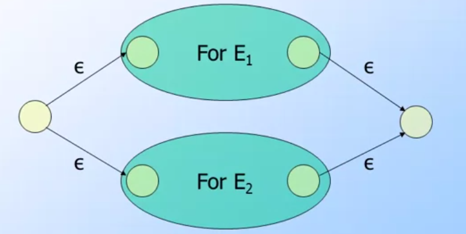

## 前言與心得整理

進入到第三週，前兩個章節都是在介紹可以透過RE(Regular Expression)來表示的語言．這一次就是無法透過RE來表示的語言(CFG: Content-Free Grammar)還有相關的定義與運算．

## 相關文章

- [[Coursera][Automata] 自動機理論-Automata筆記-第一週Finite Automata](http://www.evanlin.com/moocs-coursera-automata-note1/)
- [[Coursera][Automata] 自動機理論-Automata筆記-第二週: Regular Expression](http://www.evanlin.com/moocs-coursera-automata-note2/)
- [[Coursera][Automata] 自動機理論-Automata筆記-第三週: Context-Free Grammars and Pushdown Automata](http://www.evanlin.com/moocs-coursera-automata-note3/)
- [[Coursera][Automata] 自動機理論-Automata筆記-第四週: Pushdown Automata and Properties of Context-Free Languages](http://www.evanlin.com/moocs-coursera-automata-note4/)
- [[Coursera][Automata] 自動機理論-Automata筆記-第五週: Turing Machines and Undecidability](http://www.evanlin.com/moocs-coursera-automata-note5/)
- [[Coursera][Automata] 自動機理論-Automata筆記-第六週(上): Intractable Problems and NP-completeness](http://www.evanlin.com/moocs-coursera-automata-note6-1/)
- [[Coursera][Automata] 自動機理論-Automata筆記-第六週(下): Intractable Problems and NP-completeness](http://www.evanlin.com/moocs-coursera-automata-note6-2/)

## 第三週課程內容:

### Context-Free Grammar 

Content-Free Grammar(以下簡稱`CFG`) 是一種可以透過符號來敘述語言，可以表達比RE更多的語言(但是不是全部)．特別是在表現巢狀結構的語言．

以下只介紹正式的定義:

- `Terminals`: 定義好的符號，類似語言中的alphabet．
- `Variables`: 又稱為`non-terminals`，有限集合的符號，另一種表示語言的方式．
- `Start Symbol`:類似於RE中的start state．
- `Production`(投射): 也就一種對應的關係，通常表示為 `->`． 其中左邊是 `variables`  右邊是 `terminals跟variables的字串`．   ex: S-> {0, 1}
- `Derivations`(推導): 主要就是將CFG由start symbol開始，並且開始將`variable`投射出相對應的`variables或是terminals`其中的代表符號是`=>`．
    - S->01  S->0S1  則 S=>0S1(將S->0S1)=>00SS11(將一個S->0, 另一個S->1)=>000111
- `Iterated Derivation`: 符號為 `=>*` 如同Kleene Star定義一樣，這個代表推導為0或是更多．
    - a =>* a (就是代表任意個a)
    - `a =>* b and b=> c 則 a=>* c`
- `Sentential Forms` (句型): 指的是字串可以由Start Symbol加上 terminal 或是 variables．
    - S =>* a  那麼 a就可以被稱為 `sentential form` (因為a是一start symbol，而且加上variable a組合而成．)

以下是一個簡單的範例:

`CFG : { 0^n 1^n | n >=1 }`

- `terminals`: {0, 1}
- `variables`: {S}
- `start symbol`: S
- `product`: S -> {01} S -> 0S1
- 關於`Iterated Derivation`範例: 
    - S -> 01; S->0S1
    - 則 S=> 0S1 => 00S11 => 000111
    - 由前面的式子推導出來， S可以推導出 S或是沒有S 所以 `S =>*S`
        - 於是 S =>* S =>* 0S1;   S=>* 00S11 ;  S=>* 000111
        
### Backus-Naur Form

程式語言的語法，通常會被寫成`BNF(Backus-Naur Form)`．這裡會開始把CFG的一些定義轉換到BNF上面，才能方便我們開始用在程式語言上面．

- 變數(variables)寫在 `<...>`裡面
- Terminal通常會用**粗體**或是底線
- `::=` 就是代表 CFG裡面的production `->`
- `|` 就是 OR
- 如果symbol緊接著`...`:代表 Kleene Star (`*`)的意思
- 如果是`...`在輸入`{}`之後，代表有更多的輸入． (類似function parameter裡面的 `...`)

範例:

`L -> a[{ab} ...]` 開始推導:

- L -> aB ; B=[{ab}...] 
- L-> aB ; B-> C| ε; C={ab}...  (其中 `[{ab}...]`代表出現 0或是以上個 {ab} 所以先用ε替代出0) 而 `{ab}...代表的就是 1個或是以上`
- L-> aB ; B-> C | ε;  C=AC; A={ab}   (由於出現 {ab}... 一個或以上，可以用符號 `C->AC 因為 A={ab} C可以繼續推導出A或是AC`)
- 解答就是 L->aB B->C|ε   C->AC A->{ab}

#### 關於 Derivation的順序(Leftmost or Rightmost)

根據定義，其實BNF可以是Leftmost 也可以是 Rightmost．但是必須要在Derivation上面寫清楚．

        L ->_lm A[{ab}...] (_lm代表 leftmost 左邊作為優先順序)

### Parse Tree

#### 定義

- `Parse Tree`:是拿來表達CFG的樹狀結構，其中:
- 根節點(root): 為CFG中的Start Symbol
- 葉節點(Leaves): 一定都是`terminals`或是ε
- 中間節點(iterate node): 可以是variable或是terminals

(image from [Coursera Automata Course](https://class.coursera.org/automata-004))

以上是一個範例圖形，主要是敘述  `S-> SS | (S) | ()`，可以看出來:

- 葉節點一定為`(`或是`)`，必須要中間節點才會出現Variable `S`
- Start Symbol 也就是Root 是 `S`
- 其中的`yield`為此parse tree的trabersal 結果 yield : `( () ) ()`

#### Leftmost Induction 與 Rightmost Indction

如果要用Leftmost Induction的順序來分析Parse Tree:

範例:

- Induction: Xi =>*_lm Wi
- Start Symbol: A
- 於是乎:  
    - A=>_lm X1 X2 X3 ... Xn 
    - A=>_lm W1 X2 X3 ... Xn (將Xi換為W1)
    - A=>_lm W1 W2 W3 ... Wn
    - 最後的結果為 W1 W2 ... Wn

#### Ambiguity Grammars

其實就是簡單指有 `|`的 grammar 比如說 `S-> S | {S}`就是．

範例：

        B-> (RB|ε  R-> )| (RR

一開始會覺得這個很難解讀，甚至完全不瞭解該如何解讀這段題目．其實他應該要拆解成兩段敘述:

- `B-> (RB|ε` 代表的是  B 可以推導出 `(RB`  或是 `ε` (代表結束)
- `R-> ) | (RR` 代表 R可以推導出 `)` 或是 `(RR`

透過課堂給的範例，我們來跑一次

        B-> (RB|ε  R-> )| (RR
                
        Input: (()) ()

分析的流程如下(走Leftmost方式):

- 一開始從 `B`開始
- 輸入`(`: 
    - 能找到的只有 `B-> (RB` 於是替換成 `(RB`
- 輸入`(`:
    - `(RB` 將其中的 R替換成 `(RR`  於是結果是 `((RRB`
- 輸入`)`:
    - `((RRB`  將其中的R(由於是Leftmost，所以是挑左手邊第一個R) 換成 `)` ，於是結果是 `(()RB`
- 輸入`)`:
    - `(()RB` 跟上一步一樣，改成 `(())B`

....之後分析方式都一樣． 最後結果是 `(())()`．

這一個章節談的是 `Ambiguity Grammars`但是 ` B-> (RB|ε  R-> )| (RR`不算是．因為輸入為 `(`或是`)` 都只會找到一個 不會有兩個比如說  `B-> (RB | (`．

#### Derive Nothing

這裏是指CFG有可能造成持續有variable而無法完全轉換成symbol的狀態．拿以下的例子:
**注意: 大寫字母是Variable，小寫字母代表是Symbol**

        S -> AB | C, A -> aA | a, B-> bB, C -> c
        
由這個例子可以看到:

- 由start symbol S -> AB之後， A 可以透過 aA 或是在轉換成 a來轉換成symbol (這裏稱為reach symbol)．
- 但是 B ->  bB 於是持續有個variable B存在．
- 這樣的CFG無法轉換出全部symbol的語句．

#### Elimilate Variable

這裏主要是消除一些造成`Derive Nothing`的grammar，在上面的例子：

        `B -> bB` 

會造成無窮的variable B產生，所以我們必須要把`B`消除掉．

        S -> A|C, A-> aA | a, C->c
        
這樣就能確保能夠Derive Symbol．

                
#### Nullable Symbol

所謂的Nullable Symbol指的是某些Variable會推導出`ε(epsilon)`．也就是說 `A->ε`，同時我們也稱為`A->ε`這樣的production叫做`ε-productions`．舉例來說:

                S -> AB | C, A -> aA | ε, B-> bB | A, C -> c
  
                
- 根據以上的例子  `A -> aA | ε`所以我們可以說 A 是 Nullable Symbol．
- 由於 `B-> bB | A`．所以 `B->A->ε`． B 也是Nullable Symbol
- 推導出 S->AB  所以 `S -> AB -> εε`．S也是Nullable Symbol

#### Elimilate ε-Productions

由於 `ε-productions`會產生出`Nullable Symbol`．所以我們必須要把會產生`ε-productions`的grammar消除掉．使用的流程如下:

        S -> ABC,  A-> aA|ε , B-> bB | ε , C-> ε
        
- 由於推導出 A->ε B->ε C->ε 導致 S -> ε．         
- 找出新的grammars 透過S找出所有`會找出epsilon變數`(以這個為例: S, A, B ,C 都是，但是如果S->ABCD, D->d 的話就不需要找D的宇集合)的`宇集合`，並修改如下    
    - S -> ABC | AB | AC | BC | A | B | C
    - A-> aA (已經把ε去除)
    - B->bB (已經把ε去除)
    - C -> ε (先不去除ε等等要拿來消去grammar)
- 去除掉所有的`ε-productions`，由於剩下 `C -> ε`，消去所有跟`C`有關的Grammar
- 結果如下:
    - S -> ~~ABC~~ | AB | ~~AC~~ | ~~BC~~ | A | B | ~~C~~
    - 推導出 S -> AB |  A | B 
    - A-> aA 
    - B->bB 

#### Unit Production 跟 Pair

Unit Production 指的是grammar剛好能夠 product 到一個variable． 也就是 `A => * B`．所以 `S=>* S, A=>*A`．

Pair A, B 寫成`(A, B)`代表存在著unit production `A=>*B`．

Pair同時具有遞移律，如果 (A, B)且 (B, C)則我們必定能夠找到 `A=>*B , B=>*C` 根據law of induction必定能夠推導出 `A=>*C`．所以也存在著 (A, C)．

**範例:** 

        S→AB|Aa; A→cD; B→aCb|C|A; C→D; D→a|b|c  
        找出所有的pair               

- 一開始就能得知，必定存在著 (S, S), (A, A) (B, B) (C,C) (D, D)
- 接下來要找`unit production`可以找到  `B->C` `B->D` `B->A` `C->D` 於是我們取得 (B, D), (B, D), (B,A) (C, D)
- 所有的Pair 即為(S, S), (A, A) (B, B) (C,C) (D, D)(B, D), (B, D), (B,A) (C, D)

#### Cleaning Up a Grammar

所謂的Cleaning Up grammar就是必須要消除:

- No useless symbol
- No ε-Productions
- No Unit Productions

### Chomsky Normal Form

CFG 如果滿足以下兩個條件，可以被稱為是[CNF(Chomsky Normal Form)](https://en.wikipedia.org/wiki/Chomsky_normal_form):

- 只存在兩個variable在body   A->BC
- 或是只存在一個terminal  A->a
- 或是 S->ε

        定理: L 是CFG，L-ε必定存在一個CFG是屬於CNF (L- ε 代表語言減去ε之後的其他集合)
        
這個定理也表示，任何的CFG(除了ε)一定都可以轉換成CNF的格式．

**舉例**

        A->BCDE

- 先轉換成 A-> BF, F->CDE
- A->BF, F->CG  G->DE 即完成        

### Pushdown Automata

Pushdown Automata(PDA)主要是透過stack來存放某些symbol(可能是代表marker或是狀態，不侷限)．其實整體架構不難，只是何時要把symbol push進stack何時需要把symbol pop就是靠原本的定義．

- 類似[Pushdown Automata wiki](https://en.wikipedia.org/wiki/Pushdown_automaton)用更多個參數的宣告來表示push/pop

(圖片來自課堂 Automata [Course]((https://class.coursera.org/automata-004)))

**範例:**

在這樣的宣告下，這個PDA主要是幫助我們檢查全部的輸入(input)中，0與1的個數是否成對．

基本宣告如下:

- PDA 可以接受 `{ 0^n 1^n | n>=1 }`
- `q`是start state
- 輸入為1的時候會走到 `p` state並且pop
- `f` 是 final state
- 關於symbol 的宣告:
    - `Z` 代表stack 底部，代表1與0的個數相同．
    - `X` 代表一個0輸入，每輸入一個0, 就push 一個`X`進stack
- 關於transition function 的表示
    - `δ(q, 0, Z)={(q,Z)}` 代表從q 狀態開始，輸入為0，其中symbol為Z． `{(q,Z)}` 左邊代表透過input 0所走到的狀態`q`，右邊代表stack狀態有一個`Z`．
    - `δ(q, 0, X)={(q,XZ)}` 代表從繼續從q出發輸入0，到達q．其中stack為ZX
    - `δ(q, 1, X)={(p,Z)}` 代表從繼續從q出發輸入1，到達p．其中stack為Z．注意第三個參數會提到要pop X．
    
#### ID: Instantaneous Descriptions    

ID: Instantaneous Descriptions是一個算式可以幫助我們知道總共輸入多少，進行到哪個階段，並且也顯示stack狀態的一個算式．

`(q, w, a)` 其中`q`代表目前狀態，`w`代表剩下的輸入，`a`代表stack狀態(top在左邊)．

其中每個`ID`之前或用一個 "Goes-To"(符號沒有了 XD要用圖形) 符號代表下一個推導．

**範例**

- (q, 000111, Z) "Goes-To" 
- (q, 00111, XZ) 輸入一個`0`並且放入一個`X`到stack頂端
- (q, 0111, XXZ) 輸入一個`0`並且放入一個`X`到stack頂端
- (q, 111, XXXZ) 輸入一個`0`並且放入一個`X`到stack頂端
- (q, 11, XXZ) 輸入一個`1`並且從stack頂端移走一個`X`
- (q, 1, XZ) 輸入一個`1`並且從stack頂端移走一個`X`

**如何判斷輸入的字串有沒有被PDA所接受? **

- 確認 ID最後stack為狀況為Z並且狀態走到`f` 也就是整個ID為 `(f, ε, Z)`

## 程式作業

主要是實作 `RE -> ε-NFA`的程式．
其實大部分已經都完成好了，主要是考觀念關於 `union`， `concatenation`跟 `closure`
大概五分鐘就搞定（如果概念沒問題的話....)，基本觀念重新敘述如下:

- `union`: ex: A union B
    - 主要是會產生兩個新的狀態，
    - 新的start state分別連到原先 A start state 與 B start state．
    - 新的fianl state分別會被A與B的final state所連接．
    - 連接的輸入都是 `ε`

- `concatenation`:  ex: A concatenation B
    - 主要是將A與B的圖形連接，A的final state會連到B的start state
    - 當然連接的輸入都是 `ε`
    
    
    
    

- `closure`: ex: Closure(A)
    - Closure 主要就是要將幾個`ε-translation function` 加上去
    - 建立兩個新的狀態
    - new start -> orignal start
    - orignal final -> new final
    - final->start
    - new start -> new final
    - 當然連接的輸入都是 `ε`

其實可以參考slide 5 (14~16) 主要就是把這三個部分實現出來．

## 相關程式

本週雖然課堂都在講CFG的部分，但是程式的部分先試著把 `ε-NFA`完成．  程式碼在這裡 [https://github.com/kkdai/e-nfa](https://github.com/kkdai/e-nfa)

幾個註解:

- Epsilon-NFA 其實不難實現，主要是走完input到每一個(guess)猜想狀態後，需要將自己所有擁有的`ε`路徑(也就是輸入的input為空)把他再走一次．
- 而`ε`的input也是需要有輸入才能知道`ε`要走到那些states

## 參考網址

- [Coursera: Automata Course](https://class.coursera.org/automata-004)
- [Context-free_grammar:wiki](https://en.wikipedia.org/wiki/Context-free_grammar)
- [CNF: Chomsky Normal Form](https://en.wikipedia.org/wiki/Chomsky_normal_form)
- [Pushdown Automata](https://en.wikipedia.org/wiki/Pushdown_automaton)
