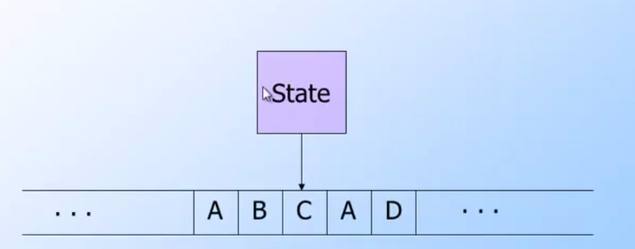
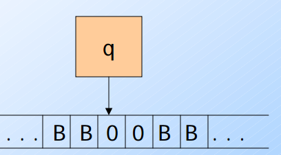

## 前言與心得整理

進入到第四週，這個章節會透過深入了解PDA(Pushdown Automata)來導入CYK演算法與計算機的基礎- 圖靈機(Turing Machine)．  算是我一開始就相當期待的課程．

## 相關文章

- [[Coursera][Automata] 自動機理論-Automata筆記-第一週Finite Automata](http://www.evanlin.com/moocs-coursera-automata-note1/)
- [[Coursera][Automata] 自動機理論-Automata筆記-第二週: Regular Expression](http://www.evanlin.com/moocs-coursera-automata-note2/)
- [[Coursera][Automata] 自動機理論-Automata筆記-第三週: Context-Free Grammars and Pushdown Automata](http://www.evanlin.com/moocs-coursera-automata-note3/)
- [[Coursera][Automata] 自動機理論-Automata筆記-第四週: Pushdown Automata and Properties of Context-Free Languages](http://www.evanlin.com/moocs-coursera-automata-note4/)
- [[Coursera][Automata] 自動機理論-Automata筆記-第五週: Turing Machines and Undecidability](http://www.evanlin.com/moocs-coursera-automata-note5/)
- [[Coursera][Automata] 自動機理論-Automata筆記-第六週(上): Intractable Problems and NP-completeness](http://www.evanlin.com/moocs-coursera-automata-note6-1/)
- [[Coursera][Automata] 自動機理論-Automata筆記-第六週(下): Intractable Problems and NP-completeness](http://www.evanlin.com/moocs-coursera-automata-note6-2/)

## 第四週課程內容:

### Equivalence of PDA's and CFG's 

主要這個章節是會提到如何將CFG(Context-Free Grammar)轉換成 PDA(Pushdown Automata)，  首先先來符號介紹:

- L(G): 屬於CFG `G`所以符合的Language `L` 
- 我們想要透過 PDA `P`來找出一個轉換方式可以產生 `N(P) = L`
    - 在這個 PDA(`P`)裡面有:
    - start node `q`
    - 所有的輸入symbol 屬於 `G`
    - 相同的stack會存入的就是symbol所以也是從`G`挑出來
    - 一開始的symbol也是從`G`挑出來．

**範例:**

- CFG: `S->Aa` ; `A->cc`
- Stack start symbol: `S`
- Input: `acc`

以下分開成δ()與stack狀態

- δ(q, a, S), stack: [S], input: cc (輸入a 進去了)
    - 這時候會從input  移除a, S 可以轉換成 Aa
    - 去除掉a stack剩下 [A]
- δ(q, c, A), stack: [A], input: c     
    - 這時候轉換A->cc
    - 並且一個c 被input 修除
- δ(q, c, c), stack: [c], input: ε    
- δ(q, ε, ε), stack: [ε], input: ε    
    
於是結果為Stack變更的流程為: **[S]->[aA]->[A]->[cc]->[c]->ε**

### Convert PDA to CFG

接下來要來將PDA的轉換式，轉換成CFG．根據定義我們會從

        L = N(P)

來建立相同L的 CFG `G`，並且滿足 `L(G) = L = N(P)`．

首先這裡有一個假設 `[pXq]` 指的是從`p`state透過輸入`X`可以到`q` state．

**範例:**

        δ(p, a, X) contains (q, ε) 可以表示  [pXq]->a

- 就是所有從`p`輸入a的時候
- 此時stack裡面有`X`． 而且可以到達q 
- 使得stack 為空 (ε)．就可以求得 `[pXq]->a`

**範例**

        δ(p, a, X) contains (r, Y) 可以表示  [pXq]->a[rYq]
        
- 是`p`透過a會先到達`r`(此時會先把X從stack pop出來)
- 而且stack 剩下Y(表示有push Y)
- 所以是production 是 `[pXq]->a[rYq]`  
- 也就是說如果要達到`q`還必須要輸入`Y`才能夠從`r`到達`q`．
      

### The pumping lemma for CFL's

首先先來回顧一下，什麼是[pumping lemma](https://en.wikipedia.org/wiki/Pumping_lemma_for_regular_languages):

- 在一個Regular Language其中有著n個狀態，在字串長度`w > 輸入個數`的時候，總能夠找到 xyz 符合:
- `w = xyz`
- |xz| <= n
- |y| > 0
- For all i>=0 xy^i z is in L

同樣的在CFG(Context-Free Language)一樣也能夠找到Pumping Lemma只是有不同的是:

        同樣的RE Pumping Lemma定義下 y 有兩段 z=uvwxy

- 在一段CFL之中，有著n個數字．如果字串`z>=n`則存在z=uvwxy 其中
- |vwx| <= n
- |vx| >=0
- For all i >=0;  uv^i wx^i y in L
 

### Decision and closure properties for CFL's

如何證明字串w是不是屬於L(G)，可以使用[`CYK algorithm`](https://en.wikipedia.org/wiki/CYK_algorithm)． (它具有的時間複雜度為 O(n^3))

#### CYK Algorithm

CYK演算法可以來計算某些輸入字串是否符合CFG(Context-Free Grammar)．如同上勉提到的算法．如果最後計算出來的symbol沒有非終端的符號(non-terminal symbol，一般而言就是S)的話．就代表字串不能被CFG所產生．

一般而言，要計算某段文字是否能被CFG來產生，需要透過回朔法(backtracking)原本需要指數時間 O = C^n ．但是使用CYK可以把所需要得時間縮短到 O = n^3． 算是有相當程度的優化． 

直接透過範例來解釋會比較容易了解:

**範例:**

        S->AB, A-> BC|a, B->AC|b, C-> a|b    input string w= ababa

**解題流程** 

- 首先先找 X_ii:
    - 拿出第一個input `a`，來找X_11:
        - 找出 A-> BC| `a`  取出 A
        - 找出 C-> `a`|b    取出 C
        - 於是 X_11 = {A, C}
    - 拿出第二個input `b`, 來找X_22:
        - 找出 B-> AC|`b`   取出 B
        - 找出 C-> a|`b`    取出 C
        - 於是 X_22 = {B, C}
    - 拿出第三個input `a`，跟第一個解法相同得到  X_33 = {A, C}
    - 拿出第四個input `b`，跟第一個解法相同得到  X_44 = {B, C}
    - 拿出第五個input `a`，跟第一個解法相同得到  X_33 = {A, C}
- 接下來要找 X_ij 
    - 舉例要找出 X_12，需要參考  X_11 跟 X_22
        - 第一個symbol 要找 A 在X_11中(第一個)，B在X_22中(第二個)．能夠找到 AB的就是 S-> AB 於是得到S
        - 第二個symbol 要找 A 在X_11中(第一個)，C在X_22中(第一個)．能夠找到 AC就是 B-> AC 於是得到 B
        - 答案就是 X_12 = { S, B }
    - 舉例 X_23，需要參考 X_22 = {B, C}與 X_33 = {A, C}
        - 第一個symbol 要找 B在X_22(第一個) 找 C在X_33(第二個)，能夠找到 A->BC 於是得到Ababa
        - 第二個symbol 要找 B在X_22(第一個) 找 A在X_33(第一個) 沒有找到能夠推導出 BA的，於是沒有．
        - 答案: X_23 = {A}
    - 再舉例一個 X_34，需要參考  X_33={ A, C} X_44={B, C}
        - 第一個symbol 找 A在X_33 (第一個)再找 C在X_44(第二個) 於是要找 AC 得到B
        - 第二個symbol 找 A在X_33 (第一個)再找 B在X_44(第一個) 於是要找AB 得到S
        - 答案: X_34 = { B, S}
- 依此類推....        
- 如果要找 X_13 就得找 X_12跟 X_23 其他步驟同上
- 依此類推找到 X_15 為 {A}
- `由於X_15的結果不含{S}，而是只有A．所以我們知道 w=ababa不存在這個L(G)裡面`

### Turing Machine

一開始先講解資料與程式相關的部分．其實編碼就可以視為是一種automata的轉換方式． 接下來有一些名詞解釋:

- **Finite Set** 有固定長度的集合，裡面找不到任何一對一的關係．只是資料的集合． 
    - 範例:
        -  {A, B, C} 是一個 Finite Set而他的基數(cardinality)為3 (也就是集合中的元素個數)
- **Infinite Set** 代表一個集合有一對一的關係，不論是對於自己或是其他集合．
    - 範例:
        - {1, 2, 3, 4, ....} 其中  1<->2, 2<->4 
- **Countable sets** 其中有一對一的正整數關係(並不是代表全部數字都是正整數，而是代表可以用正整數找出他們的關係)
    - 範例:
        - {0, -1 1, -2 2, ....}  其中 -1跟1 為 -i 與 i 的關係（i為正整數)

#### Turing Machine Theory

**目的**: 透過Turing Machine Theory可以證明特定的Language是否含有algorithm                        

下面橫向的A,B,C,D 為 type是一個由已知的輸入符號({A,B,C,D})所構成的無止盡的集合．根據這張圖，Turing Machine Theory主要是根據輸入的symbol(下方的ABCD)與本身的狀態來改寫symbol(就是會改寫下方的輸入)並且檢查是否會到達final state．這樣的計算方式可以被用程式語言來實現，而且這樣的計算比較簡單與易懂．

基本原理很像PDA(Pushdown Automata)不過TM(Turing Machine)本身會改寫symbol．圖靈機(Turing Machine)被認為是電腦架構的原型，主要有以下幾個因素：

- 輸入: 透過Type的輸入，可以將資料輸入到電腦．
- 處理: 圖靈機會根據輸入來做相對地移動或是動作（改寫資料）
- 狀態: 這也是圖靈機跟其他不同是，一般而言輸入1或是輸入0應該都要能夠期待有相同的結果．但是由於有狀態概念，所以相同輸入在圖靈機不一定會有相同的動作(除非狀態也相同)．

**範例**

- 主要需求: 
    - TM來判別一連串的輸入是否有1，如果遇到輸入為1就停止並且接受．
    - 全部輸入為 {0, 1, B(空白)}
- 邏輯:
    - 如果遇到輸入為0，繼續向又去找
    - 如果遇到輸入為B，退回一部，並且將B改成1
    - 如果遇到輸入為1，停止並且接受．
- 輸入:
    - 全部輸入為{BB00BB}，從第一個0開始．

- 透過轉換式(transition function)來表示:   
    - δ(q, 0) = (q, 0, R) (其中R代表方向，向右)  此時輸入剩下 0BB
    - δ(q, 0) = (q, 0, R) (其中R代表方向，向右)  此時輸入剩下 BB
    - δ(q, B) = (q, B, L) (其中`L`代表方向，向`左`)  此時輸入剩下 `01B`
    - δ(q, 0) = (q, 0, R) (其中R代表方向，向右)  此時輸入剩下 1B
    - δ(q, 1) = (f, 0, R) (其中R代表方向，向右)  此時輸入剩下 B，因為到達`f`所以結束．
- 透過ID( Instantaneous Descriptions)來表示目前狀態  
    - 不同於PDA裡面的ID，這裡的ID是透過 `q00 來代表 (目前狀態是q 即將輸入的symbol 為 00)`
    -  q00 (goes to) 0q0 (goes to) 00q(注意其實q右邊還有blank)(goes to) 0q01 (goes to) 00q1 (goes to) 000f       

#### Formal Definition of Turing Machine Moves

- δ(q, Z) = (p, Y, R)
    - 可以寫成 aqZb (goes to) `aYpb`
    - 如果Z等同於B(blank)也可以寫成  aq (goes to) aYp (b被消除)
- δ(q, Z) = (p, Y, L)
    - 可以寫成 aqZb (goes to) `apYb` 
    - 對於任何X aXqZb (goes to) `apXYb`  

**演算法(Algorithm)**可以視為是一個TM(Turing Machine)，並且能夠到達的被接受與停止(f)的狀態．

`L = L(M)` 如果`M`為一個演算法，我們可以說`L`是一個`Recursive Language`． 所以我們可以說:

- `CFL`(Context-Free Language)是一個recursive language．使用CYK演算法． 
    
## 程式作業 (CYK演算法)

這星期的作業是講`CYK演算法`， 其實不算是太困難，不過題目裡面的資料呈現方式相當的詭異．竟然是用三個陣列來表示． S->AB 這樣的概念． 這樣在寫作上會比較困難，

作業本身就是要熟悉這樣的資料方式．與表現symbol的方式來做出CYK演算法．我將會在下一個章節的相關程式使用Go來完成CYK演算法．

主要概念與解法提示:

- 記得要從 X_11 X_22 X_33... 先算
- 再來算 X_12 X_23 X_34  
- 比較需要注意的是，由於資料表示用 [0]表示S [1]表示B．所以 S必定在B的前面，但是這個問題要解決，不然計算答案會錯．
- 這邊要提醒，其實除了 X_11 X_22 以外，其他計算的時候都需要有展開多項式

'''

	k= j-i
	X_i,j = (X_i,i+k-1,  X_i+k,j) | k=1  聯集  (X_i,i+k-1,  X_i+k,j) | k=2....	  
'''

- 更多部分可以參考  [wiki](https://en.wikipedia.org/wiki/CYK_algorithm) 

## 相關程式

本週的相關程式，主要是使用第一次的程式作業的內容， 第一次程式作業主要是將`RE -> Epsilon-NFA`． 作業雖然很簡單，但是作業本身就是一個值得學習的課題．

有興趣可以參考這裡[https://github.com/kkdai/re2epsnfa](https://github.com/kkdai/re2epsnfa)

## 參考網址

- [Coursera: Automata Course](https://class.coursera.org/automata-004)
- [CYK Algorithm](https://en.wikipedia.org/wiki/CYK_algorithm)
- [PDA: Constructing -NFA’s From Regular Expressions](https://people.cs.umass.edu/~immerman/cs250/regExpToNFA.pdf)
- [Youtube: Regular Expression to NFA](https://www.youtube.com/watch?v=RYNN-tb9WxI)
- [CYK演算法 wiki](https://zh.wikipedia.org/wiki/CYK%E7%AE%97%E6%B3%95)
- [CYK演算法的推倒影片](https://www.youtube.com/watch?v=b98Uyj7JHIU)
- [計算機理論的始祖---圖靈機](http://blog.xuite.net/wellsli/002/32646708-%E8%A8%88%E7%AE%97%E6%A9%9F%E7%90%86%E8%AB%96%E7%9A%84%E5%A7%8B%E7%A5%96---%E5%9C%96%E9%9D%88%E6%A9%9F)
- [CYK slide in standford](http://infolab.stanford.edu/~ullman/ialc/spr10/slides/cfl5.pdf)
