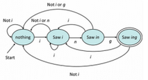

## 前言與心得整理

剩下兩週了，就是開始深入了解圖靈機．本週會提到多軌圖靈機的計算方式PCP問題．

此外，本週也開始更多了對於無法判定(undecidable)的問題(problem)的探討．這一系列需要更多的證明，其實如果光看老師課堂上的講義跟講解，其實不是很好了解．  

需要相當多的輔助學習跟查詢，我只能就我自己了解的部分．希望能幫助大家，也能給自己做些紀錄．


## 相關文章

- [[Coursera][Automata] 自動機理論-Automata筆記-第一週Finite Automata](http://www.evanlin.com/moocs-coursera-automata-note1/)
- [[Coursera][Automata] 自動機理論-Automata筆記-第二週: Regular Expression](http://www.evanlin.com/moocs-coursera-automata-note2/)
- [[Coursera][Automata] 自動機理論-Automata筆記-第三週: Context-Free Grammars and Pushdown Automata](http://www.evanlin.com/moocs-coursera-automata-note3/)
- [[Coursera][Automata] 自動機理論-Automata筆記-第四週: Pushdown Automata and Properties of Context-Free Languages](http://www.evanlin.com/moocs-coursera-automata-note4/)
- [[Coursera][Automata] 自動機理論-Automata筆記-第五週: Turing Machines and Undecidability](http://www.evanlin.com/moocs-coursera-automata-note5/)
- [[Coursera][Automata] 自動機理論-Automata筆記-第六週(上): Intractable Problems and NP-completeness](http://www.evanlin.com/moocs-coursera-automata-note6-1/)
- [[Coursera][Automata] 自動機理論-Automata筆記-第六週(下): Intractable Problems and NP-completeness](http://www.evanlin.com/moocs-coursera-automata-note6-2/)

## 第五週課程內容:

###Extensions and properties of Turing machines

一開始繼續來探討圖靈機，順便看看有沒有一些衍伸的部分可以加以討論．

#### Multiple Tape Track

一開始我們都只有定義一個圖靈機是擁有: 一個狀態，一個輸入tape跟相關的動作． 但是如果有`多個tape track`的話，圖靈機該如何處理呢？


最常見的就是類似上面圖形的圖形機，上面 BXB 代表的是 data tape(track)，而下方WYZ代表的是`marker tape`．也就是說下方的資料是用來紀錄目前執行到哪個地方，以便後來做相對應的處理之用．

#### 範例:

首先要注意的是，這個範例僅僅是在課堂上提出來的．並不代表所有的Turing Machine都應該這樣處理．主要還是看如何去處理transition functio與資料輸入的時候該如何查表．

首先要先來解釋一下，幾個transition function的動作說明．再來看δ()之前，我們需要知道幾個符號的定義：

- `B, X`: 代表是輸入的符號B是空白，X某些資料．
- `a, b`: 代表是0, 1(都可以，這裡只是代表數字)
- `p, q, r`: 代表的是狀態(state)
- `R, L` :代表的是要向左移動或是向右移動．
- `tape`指的是資料帶，裡面通常有兩個track，一個是輸入，一個是紀錄marker(或是給TM紀錄輸出)  `1 tape = 2 tracks`

基礎符號複習好之後，我們就可以開始來看**transition function**: `δ()`的意思．

- δ([q, B], [B, a]) = ([p, a], [X, a], R):
    - 先從一開始來看 `δ([q, B], [B, a])` 裡面的 
        - `[q, B]`: 代表的是目前圖靈機的狀態與cache，其中`q`是狀態，`B`是cache．
        - `[B, a]`: 代表的是輸入的tape(其中B為第一個tape, a為第二個type-可以是0或是1)
    - 接下來看到等式的右方 `([p,a], [X,a], R)`:
        - `[p,a]` 這個代表執行過後的狀態為p，cache變成了a．(注意: 因為a等式左方的a是相同，所以原先是0就是0, 如果是1就取出1)
        - `[X,a]` 這代表執行過後的tape的變化，變成了[X,a]
        - `R` 就是代表要繼續向右移動一個來讀取新的數值．

其他幾個就不詳述，只是先列出來等等查表需要用到：

1. δ([q, B], [B, a]) = ([p, a], [X, a], R)(上面的式子，我只是放在一起方便參考)
2. δ([p, a], [B, b]) = ([p, a], [B, b], R)
3. δ([p, a], [B, B]) = ([r, B], [B, a], L)
4. δ([r, B], [B, a]) = ([r, B], [B, a], L)
5. δ([r, B], [X, a]) = ([q, B], [B, a], R)        

一共是以上五個轉換式，接下來就要看圖說故事了．


- 這是一開始的狀態，圖靈機一開始的狀態是`q`，並且cache的數值為B
- 這時候要讀取到 [B, 0] 要參考到轉換式 (1) `δ([q, B], [B, a]) = ([p, a], [X, a], R)`
    - 別忘記 `[B, a]` 可以轉成 `[B, 0]， a=0`
- 會將自身狀態改成`p`並且把cache改成`0`然後將資料改成[X, 0]，最後向右移動一個．


- 這時候由於自身狀態與cache是`[p, 0]`遇到了[B, 1] 要參考(2) `δ([p, a], [B, b]) = ([p, a], [B, b], R)`
    - 此時 a=0 b=1
- 這時候會將自身狀態改成 [p, 0]，並且把數值改成 [B, b]也就是維持 [B, 1] 向右移動一格．

    

- 本身資料為[p,0]讀取到[B, B]要參考 (3) `δ([p, a], [B, B]) = ([r, B], [B, a], L)`
- 此時會將圖靈機改成 `[r, B]`並且將資料改成 `[B, 0]`向左移動一格

    

- 本身資料為 [r, B]讀取到[B, 1]參考(4) `δ([r, B], [B, a]) = ([r, B], [B, a], L)`
- 圖靈機維持 [r, B]也不變動資料[B, 1] 向左移動一格

    


接下來幾個步驟就不推導了.........

#### 更多圖靈機的架構

- Semi-Infinite Tape (只具有單方向的圖靈機)
    - 以上介紹的是透過兩個無窮(infinite)的track來呈現圖靈機的動作方式．當然也是可以加上一個限制是不允許圖靈機向左(L)移動的．這個時候通常會把兩個tape分開表示成 U/L(代表Upper/Lower) 的資料，而圖靈機本身可以記錄目前要讀取的tape是U或是L．
- Two stack simulate in one Tape
    - 這裡指的是可以透過增加圖靈機的stack到兩個(原本是一個，作為cache) 透過第二個stack來模擬目前位置．


#### 圖靈機的延伸應用

- Multipletape TM(Turing Machine) 多重資料組的圖靈機
    - 一般而言是使用兩個tape，但是這裡提到是使用2K個tape．也就是說有k組的track來給圖靈機操作．根據不同的輸入也可以輸出不同的資料．
- Nondeterministric TM 非可判定的圖靈機
    - 一般而言，根據輸入與目前狀態是可以判定出圖靈機的下一步，但是在這裡指的是圖靈機本身可以自己決定下一步．也就是說在相同的狀態下給予一樣的輸入可能會引發不一樣的動作．

#### Closure Properties of Recursive Languages and Recursively Enumerable Language(簡稱 RE Language)

首先要先解釋一下Recursive Lanugage 跟 RE Language的不同:

- Recursirve Language: 
	- 根據[定義](https://en.wikipedia.org/wiki/Recursive_language)，Recursive Language每跑一個input都會停下來決定是否接受(accept)．然後繼續讀入下一個文字(string)．
	- 一般而言這種語言代表的圖靈機會被稱為是可以判定的(decidable)
	- 舉例如下: 
		- CFL L= { w = 0^n 1^n } 就算是Recursive Language．  L = {01, 000111, 0001111111...} 
- RE Language:  在RE Language 裡面，這個`圖靈機只有接受的輸入才會停止`，不然會持續一直運行下去．
    - 根據[定義](https://courses.engr.illinois.edu/cs373/sp2013/Lectures/lec21.pdf)，所謂的RE Language也就是指某個圖靈機在某個點會將特定的符號寫回tape(enumerator)並且當成下一個輸入來讀入．
	- 一般而言這種語言代表的圖靈機會被稱為是可以認知的(recognizable)，但是是不可以判定的(undecidable)． 

詳細的RE Language可以如下:

		Definition 5. An enumerator M is said to enumerate a string w if and only if at some point M writes a word w on the output tape. E(M) = {w | M enumerates w}
		//以上代表， Enumerator 代表輸入w 可以寫回tape
		
		Definition 6. L is recursively enumerable (r.e.) iff there is an enumerator M such that L = E(M).	    
		
		//可以產生遞迴列舉(enumberate)的語言就是RE Language．也是上星期有提到的圖靈機範例．


這裡主要提到關於TM的一些特性(union/concatetion/intersection....)．
也就是說當將兩個TM做聯集(union)或是交集(intersection)的運算的時候．面對同一個輸入到底是會輸出接受或是不接受．

- Union:
    - Recursive Language:
	    - Accept (OR), Reject(AND)．也就是說兩個TM都不接受的時候才會才會reject．但是只要有一個接受就會接受(accept)．由於每一次輸入都會停止，所以可以判定是否為接受或是reject．
    - RE Language:
	    - 由於預設不會停止，所以只有被M1或是M2接受的時候．這樣的圖靈機才會停止．

    

這裡要注意，就算是`不接受．但是由於是屬於Recursive Language TM依舊會停止(halt)`．

    

	    
- Intersection:
    -  Recursive Language:
	    -  交集就是需要兩個都接受(accept)才能接受．但是一個不接受就會不接受(reject)．
    -  RE Language:
	    -  跟Union一樣，只有接受才會停止．如果有不接受的依舊會繼續的執行．
- Difference/Complement:
    -  Recursive Language:
	    -  差集就是需要找M1接受，但是M2不接受的．此時可以找到，因為M2會halt．
    -  RE Language:
	    -  無法找，因為M1接受，M2不接受的時候．由於TM不會停止，無法找出Difference．
- Concatetion:
    -  Recursive Language:
		    - 不能在NTM (Nondeterministic TM)套用Concatenation，因為相同輸入與狀態不一定有．
		    - 都要接受才會接受，但是某一個可能會停止．	   
    -  RE Language:
	    - 假設輸入為 w=xy  圖靈機有M1 M2 並且已經知道 M1 + M2 ．
	    - 所以這樣來說只要判定 M1 能夠接受x ，並且M2能夠接受y，就能夠判定M1+M2能夠接受w 
相同的動作產生．
- Kleene Star(*):
    -  Recursive Language:
	    -  雖然會中斷(由halt造成的)，但是可以檢查是否每個中斷都是被接受．
    -  RE Language:
		 - 需要額外去由系統來中斷．
- Reverse/Homomorphism
	- RE Language/Recursive Language是一樣的不再詳述．

### Decidability 

這一個章節要來了解問題的可判定性要如何決定．也就是針對某個問題是否有相對應的圖靈機(turing machine)可以找到演算法(algorithm)．不過要仔細地瞭解的話就必須要要回過頭來討論"什麼是問題"，就必須要了解在圖靈機裡面對於"問題"的定義．

		問題: 是一個針對無窮集合的個題可以做出的Yes/No 回答
	
透過利用圖靈機所學到的名詞來表示:

		問題可以說是一種語言(Language)，而裡面所構成的每一個字串(string)都代表對於這個個體(instance)的編碼(ex: 13579 代表第一台，第三台，第五台車子...)．	

對於問題有相當程度的定義之後，就可以回來討論那麼什麼是可判定性(decidability)．

		一個問題被定義是可以判定(decidable)的，如果一個問題有存在著一個演算法(algorithm)可以來回答他． 除此之外，這樣的問題是無法判定的(undecidable)
		
		


根據這張牛眼圖，可以來了解問題的可判定性與語言之間的關係:

- 最內層是所有Recursive Language都是可以判定的問題．
	- 因為所有Recursive Language的問題，都是跑一個就會停下來(halt)判定．所以可以了解是不是可以判定的問題．
- 根據剛剛的定義，除了可以判定的問題之外，都屬於無判定的問題．其中包含著 RE Language與 Not RE Language．


**關於可以判定與不可判定問題的範例**:

以下稍微收集了一些可以判定與不可判定的問題，來了解之間的差異:

- 可以判定(decidable):
	- 已知一個DFA，針對某個特定的語言L．那麼來回答輸入w是否被DFA L(M)所接受?
		- 這是可以判定的問題，因為問題是可結束的(字串有限制)．並且DFA可以正確地回答是否接受與不接受．
	- 已知一個NFA，回答輸入w是否被NFA L(M)接受?
		- 一樣是可以接受，因為NFA雖然有多種路徑(path)並不代表無法判定是接受或是不能接受．而且都是在受限制的輸入底下．表示語言本身是會停機來判斷的．


- 不可以判定(undecidable):
	- 兩個CFG是否能產生相同的語言?
		- 這個問題是一個不可以判定的問題，因為CFG可以無限展開．而並須得到可接受才會停止(一般狀況下不會停止，因為CFG可以不停展開)．		


**關於可判定(Deciding)與可認知(Recognizing)**

課堂的Slide沒有提到，但是Wiki上面有查到．加以補充一下:

- 圖靈可識別語言 (TM recognize):
	- 根據[wiki](https://zh.wikipedia.org/wiki/%E9%80%92%E5%BD%92%E5%8F%AF%E6%9E%9A%E4%B8%BE%E8%AF%AD%E8%A8%80)，設M是一台圖靈機，若在輸入串w上M運行後可進入接受狀態並停機，則稱M接受串w。M所接受的所有字符串的集合稱為M所識別的語言，簡稱M的語言，記作L(M)。
- 圖靈可判定語言 
	- 根據[wiki](https://zh.wikipedia.org/wiki/%E5%8F%AF%E5%88%A4%E5%AE%9A%E6%80%A7)，簡單的定義如下:
		- 語言L與L'的補集(completement) 都是被圖靈機接受的話，就稱為可判定(decidate)語言．
		- 如果只有L 沒有 L的補集，就稱為半可判定圖靈語言．

#### Universal Turing Machine (UTM)

 針對圖靈機本身，可以設計出一個通用(萬能)圖靈機他可以模擬其他圖靈機在某些資料輸入下給予相同的動作與回覆．


###More Undecidable Problems

本章捷會更深入的來探討所謂的無法判定(undecidable)的問題． 針對這些會開始有一些基本的定義．

#### Properties of Language

關於語言的特性(properties)，可以分成兩種: 

- 對於任何語言都是用的特性，被稱為trivial properties． 
	- 範例：  
		- 圖靈機執行100步之後，能不能夠結束並且接受?
- 除此之外，只能某些語言適用的．都被稱為是non-trivial properties．
	- 範例:
		- 這個圖靈機的結果會不會有字元?
		- 這個圖靈機接不接受"hello"這個字元?  (RE Language TM 只知道接受，但是無法確認不接受)

其實透過Properties的定義，主要是要推導出 `Rice’s Theorem`

		Rice’s Theorem:  Any nontrivial property about the language of a Turing machine is undecidable.


也就是說，語言特性中具有non-trivial properties的圖靈機，是屬於`無法判定`的．

換個角度來說，其實每個Language Properties可以被視為是該圖靈機的問題(problem)．那麼對於該圖靈機是否為`可以判定`的依據，就可以透過它能接受的語言`特性(properties)`．


#### Reduction and Transducers


我們可以透過Reduction與Transducer來對問題可否判定做一個解讀．要解釋Reduction與Transducer就必須要透過這一張流程圖．裡面包含了幾個名詞解釋:

- **Reduction**:
	- 如同這張圖，原先的語言L(假設接受字串w) 透過某種Reduction．可以找出 L'並且可以接受x(x也是透過某種轉換油w->x)
	- 如果我們發現 `L'是可以判定(decidable)的，我們也可以說 L 是可以判定的`．
- **Transducer**
	- Transducer是一個轉換器，可以將w轉換成x．並且可以讓x被L'所接受．

通常而言，這個定理都是這樣使用:

		如果L是不可判定，那麼該語言的補集L'必定也是不可判定．
		
#### Post’s Correspondence Problem

接下來要說明另外一種不能判定(undecidable)的問題．不過這系列的問題與圖靈機無關，可以先把相關的定義都先放到旁邊． 

所謂的PGP問題，是在尋找倆倆配對的問題．首先題目會給予你許多字串．舉例來說:

**Pairs**

1. (01110, 011)
2. (101, 0101)
3. (1110, 10111)

那麼他會問你，是否可以透過以上的配對組合找出完全相同的串列使得

```
	w_i1, w_i2, .... win = x_i1, x_i2, .... x_in | i= 1...k
	
```

這樣講有點繞口，簡單的來說就是要透過給予的1~3 的配對來搭配出兩個完全相同的序列串．

比如說: 1+3+2 會產出

```
           1    3       2 
	A:[011  10][111  0][101]
	B:[011][10  111][0  101]  
```

可以看得出來，A跟B所有出現的字元都相同，最後的長度也相同．接下來要講怎麼計算:

- `第一步一定都需要放第一個配對，因為只有第一組的左右是起始相同的`，換句話說如果有其他起始相同，其實不需要從第一組開始．左邊放在A, 右邊放在B．會得到以下的部分

```
         1    
	A:[011  10]
	B:[011]

```

- 第二步之後，我們就可以隨便從1~3挑選．由於可以看到A比B多出了 [10]這個字元．我們來挑選 1~3之間可以找到． 3 的右邊 [10111]的開頭是 [`10`111] 是否和我們需要的．試著放上去:


```
           1    3   
	A:[011  10][111  0]
	B:[011][10  111]
```

- 目前為止都沒有出現問題，再來發現A比上B多出了 [0] 來挑選1~3發現第二個的右邊是以[`0`101]作為開頭．於是我們這樣放:

```
           1    3       2 
	A:[011  10][111  0][101]
	B:[011][10  111][0  101]  
```

- A 跟 B 兩個是等長並且是相同的．我們就可以回答這個PGP的問題是`Yes`．


#### MPCP for Reduction 

接下來會透過PCP這種問題，來解釋Reduction的用處． 首先我們會先定義更嚴格的PCP定義，稱為Modified PCP:

- MPCP: 基本定義跟PCP一樣，只是第一步必須挑選pair 第一個．

接下來，我們會來將MPCP簡化成PCP，其實課堂裡面的slide講得很清楚，不過我們就直接做一次:


**MPCP Pairs to PCP Paris**

1. (01110, 011)
2. (101, 0101)
3. (110, 10111)

- 首先拿出(1)，在左邊的每個字元`後面加上*`，在右邊的每個字元`前面加上*`
	- (1')  `(0*1*1*1*0*, *0*1*1)`
- 第(2)個之後，把每個字元的`後面加上*`:
	- (2') `(1*0*1* , 0*1*0*1*)`
	- (3') `(1*1*0*, 1*0*1*1*1*)`
- 套完之後，我們還需要增加一個額外的
	- (4)  `($, *$)`
- 最後還有一個結尾要加上special pair，這邊是參考原先的(1)，只是把`左右兩邊每個字元前面都加*`:
	- (5)  `(*0*1*1*1*0, *0*1*1)`

這樣就完成了.....

這邊的做法是，把剛剛對於PCP的Pair數據改寫到MPCP後．透過`Transducer`(也就是上面這種轉換方式，簡化為PCP後．）  主要是為了達成以下的定義:

		能夠在MPCP裡面判定(decidable)的問題(內容為w)，透過以上得轉換後，必定可以在PCP找到可以判定的語言(x)
		
換句話來說， 

		已知MPCP ->(reduction) PCP:
		如果可以證明PCP 是undecidable的話，那麼也可以判定MPCP是undecidable．

接下來有另外一種簡化方式，簡單來說整個簡化流程圖為:

		Lu -> (Transducer) Lm(MPCP) -> (Transducer) -> Lp (PCP)

這邊的證明有點繁瑣，先留給大家有興趣再來鑽研．


## 程式作業/Homework

本週沒有程式作業，不過有homework． 而Homework都是圖靈機的題目，算是五週以來最簡單的了．只要了解Turing Machine與 ID(Instantaneous Descriptions)的寫法，應該都可以全對．

## 相關程式

這次的相關程式是寫CYK Alogrithm，恰巧老師在課堂上的範例是比較簡單的．所以整個多項式的展開沒有仔細地講出來． 

不過要自己寫出[CYK Algorithm for Golang](https://github.com/kkdai/cyk)的時候，可就遇到了許多問題．  由於要找CFL的範例來測試CYK，多找了[兩個](https://zh.wikipedia.org/wiki/CYK%E7%AE%97%E6%B3%95)就發現不work．  才發現: 除了 X_11, X_22 以外 要找X_ij的時候其實需要相對應的展開，舉例而言:

```

	X_12 = (X_11, X_22)
	
	X_13 = (X_11, X_23) 聯集 (X_12, X_33)
	
	X_14 = (X_11, X_24) 聯集 (X_12, X_34) 聯集 (X_13, X_44)

```

關於演算法的方式，也可以參考這份[slide](http://web.cs.ucdavis.edu/~rogaway/classes/120/winter12/CYK.pdf)裡面有蠻清楚的算法．

更多詳細，可以參考我寫的cyk演算法: [https://github.com/kkdai/cyk](https://github.com/kkdai/cyk)


## 參考網址

- [Coursera: Automata Course](https://class.coursera.org/automata-004)
- [計算機理論的始祖---圖靈機](http://blog.xuite.net/wellsli/002/32646708-%E8%A8%88%E7%AE%97%E6%A9%9F%E7%90%86%E8%AB%96%E7%9A%84%E5%A7%8B%E7%A5%96---%E5%9C%96%E9%9D%88%E6%A9%9F)
- [wiki: Recursively enumerable language](https://en.wikipedia.org/wiki/Recursively_enumerable_language)
- [Wiki: Halting_problem](https://en.wikipedia.org/wiki/Halting_problem)
- [Wiki: Recursive_language](https://en.wikipedia.org/wiki/Recursive_language)
- [Wiki: Undecidable_problem](https://en.wikipedia.org/wiki/Undecidable_problem)
- [Lecture Slide](https://courses.engr.illinois.edu/cs373/sp2013/Lectures/lec21.pdf)
- [Youtube: L12: Universal Turing Machines; The Halting Problem is Recognizable but Not Decidable](https://www.youtube.com/watch?v=3x8mSr8ZPGQ)
- [L17: Using Reductions to Prove Language Undecidable](https://www.youtube.com/watch?v=Iml62oxyOIQ)
