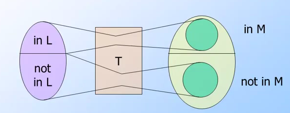

## 前言與心得整理

由於第六週的內容牽扯到`P=NP`相關理論還有`NP-Complete`的證明．所以我把內容拆成兩個禮拜，希望能夠更仔細地來了解這個部分．

## 相關文章

- [[Coursera][Automata] 自動機理論-Automata筆記-第一週Finite Automata](http://www.evanlin.com/moocs-coursera-automata-note1/)
- [[Coursera][Automata] 自動機理論-Automata筆記-第二週: Regular Expression](http://www.evanlin.com/moocs-coursera-automata-note2/)
- [[Coursera][Automata] 自動機理論-Automata筆記-第三週: Context-Free Grammars and Pushdown Automata](http://www.evanlin.com/moocs-coursera-automata-note3/)
- [[Coursera][Automata] 自動機理論-Automata筆記-第四週: Pushdown Automata and Properties of Context-Free Languages](http://www.evanlin.com/moocs-coursera-automata-note4/)
- [[Coursera][Automata] 自動機理論-Automata筆記-第五週: Turing Machines and Undecidability](http://www.evanlin.com/moocs-coursera-automata-note5/)
- [[Coursera][Automata] 自動機理論-Automata筆記-第六週(上): Intractable Problems and NP-completeness](http://www.evanlin.com/moocs-coursera-automata-note6-1/)
- [[Coursera][Automata] 自動機理論-Automata筆記-第六週(下): Intractable Problems and NP-completeness](http://www.evanlin.com/moocs-coursera-automata-note6-2/)

## 第六週前半部分的課程內容:

###Intractable Problems

#### P類問題

接下來會介紹一些需要耗費相當多的時間(指的是處理時間超過指數時間(polynomial-time)的問題．

回過頭來先要定義如何指出圖靈機的時間限制: 

	T(n): 指的是輸入w長度為n的時候，該圖靈機一定會停止的

這時候就會帶出第一個名詞: `P` 也就是如何定義一個問題是屬於`P類的問題` (Class P problem)

		Class P:  指的是在DTM(Deterministic Turing Machine)下，其T(n)= polynomial-time (指數時間)
		

**關於"P類"問題的範例**

DTM可以被來當成是否可以用DFA(Deterministic Finite Automata_來表示其狀態的TM(Turing Machine)． 所以其實要尋找類似的範例其實不難，只是該問題必須要是在指數時間才能解決的，課堂上提供的範例如下:

- 在CFG的 L(G) 給予一個字串w．判斷w in L(G)
	- 之前有提過要快的話，必須使用CYK演算法．然後其時間複雜度為O(n^3)

	
#### NP類問題		

在介紹NP類問題前，雖然課堂上老師直接透過[背包問題(Knapsack Problem)](http://www.csie.ntnu.edu.tw/~u91029/KnapsackProblem.html)來引導NP類問題．不過我個人認為，還是需要簡單的瞭解一下`NP類問題｀的定義:

		Class NP: 指在NTM(Nondeterministic Turing Machine)下，其T(n)為指數時間(polynomial-time)
		
沒有錯，P類問題與NP類問題最大的差異是TM讀入一個輸入的時候．其反應是唯一的(DFA)或是多重的(NFA)．  接下來就可以將[背包問題(Knapsack Problem)](http://www.csie.ntnu.edu.tw/~u91029/KnapsackProblem.html)開始帶入:

##### 什麼是背包問題(Knapsack Problem)

關於背包問題的定義，種類與範例．其實這一篇[台師大的文章](http://www.csie.ntnu.edu.tw/~u91029/KnapsackProblem.html)講得非常好．這裡僅僅簡單的帶過:

**背包問題**: 將一堆東西放進背包，每一件物品有它的重量與價值，透過有限制重量的背包來取得放入價值的最大化．

**解法與時間複雜度**: 對於背包問題的解法，一般而言就是透過動態規劃(Dynamic Programming)的方式來找．如此一來: 如果有n個物件，就必須要找出該物件放進背包與不放進背包的價值．所以時間複雜度為`O(n * 2^n)` (2是因為要計算 出現與不出現．必須要反覆計算n回) 

#### P = NP ?

接下來就帶入大家都了解的`P=NP`這個被稱為史上[七大難解問題之一](https://zh.wikipedia.org/wiki/%E5%8D%83%E7%A6%A7%E5%B9%B4%E5%A4%A7%E5%A5%96%E9%9A%BE%E9%A2%98)．  究竟P是不是相同於NP？ 其實課堂上也有一些簡單的討論．

以上的圖是來是Wiki，主要是講解如果認為P不等於NP的時候．他的概念是以這樣的方式作為出發來討論．

#### NP-Complete Problem

首先要討論P是否相同於NP，可以透過一個面向來探討．就是透過NP完全(NP-Complete Problem)．

A decision problem C is NP-complete if:

- C is in NP, and
- Every problem in NP is reducible to C in polynomial time

這是從[NP-Completeness](https://en.wikipedia.org/wiki/NP-completeness)看到比較formal的定義．也就是說，如果我們能夠透過`polytime reductions`的方式來朝向證明`NP-Completeness`

#### Polytime Reductions

Polytime Reductions 又稱為Polynomial-time reduction，以下會解釋這種reduction 的目標與方法:

**目標**:  如果可以找到一個方式將所有的NP問題歸約(reduction)成語言L，並且能夠找到多項式的解決時間(Polytime)．那麼就可以找到多項式的演算法(deterministic polytime
algorithm)來計算所有的NP問題．

簡單的來說:

-  只要能夠找到一個方式來將所有的NP -> (Polytime Reduction)   L
-  只要能夠找到Polytime Algorithm for L
-  那麼就能夠推導出其他Deterministic Polytime Algorithm給所有的NP

**方法**:  

- 先定義有L與M兩種語言
- L->(polytime reduction) M
- Transducer
	- 先做Transducer將原本的資料由長度為n作轉換為x
	- 透過Transducer轉換的資料長度會大於n，但是會 <= p(n)
	- 將這系列動作既做 T(w) = x 
- 如果w是在L裡面，那麼透過這樣轉換出來的x 必定也在M裡面．

#### Proof that Polytime Reduction "Work"!!

要如何證明Polytime Reduction是有作用的．

- 先定義有L與M兩種語言，其中:
	- L有輸入w其長度為n，M有輸入x
	- L有演算法p(n)， M有演算法q(x)
- L->(polytime reduction) M
- 可以透過transducer轉換出 p(n)=x
- 可以計算出M的演算法為q(x) = q(p(n))
- 全部的時間相同 L的計算時間+M的計算時間 = p(n) + q(p(n))
- 已經知道 p(n)為polytime 並且也知道 q(p(n))也為polytime
- p(n) + q(p(n)) 也是 polynomial time

### The Satisfiability Problem (SAT)

SAT是NP問題裡面的最常被提到的問題之一，而所謂的SAT就是給予一個運算式來(ex: `(x+y)(-x + -y) `) 來尋找該式子為true的狀況，該x與y的組合． 這個範例裡面，解答為:

- x=0; y=1
- x=1; y=0

**注意**: SAT裡面的優先順序是 NOT(!)->AND(.)->OR(+)

####   講解Cook-Levin理論 (或稱為Cook's Theorem)

[講解Cook-Levin理論](https://zh.wikipedia.org/wiki/Cook-Levin%E7%90%86%E8%AB%96)提供了一個方式來證明[SAT](https://zh.wikipedia.org/wiki/%E5%B8%83%E7%88%BE%E5%8F%AF%E6%BB%BF%E8%B6%B3%E6%80%A7%E5%95%8F%E9%A1%8C)是NP-Complete(NP完全問題)．

個人很推薦這段兩分鐘的[Youtube: Cook's Theorem](https://www.youtube.com/watch?v=nKNd9iExRO8)，裡面雖然沒有講解Cook's Theorem的流程，但是把主要精神講解出來．（重點是他只有兩分鐘)

**Cook's Theroem 準則**

，Cook–Levin理論提供了很不同的思路去解決SAT是NP-Complete的問題(不過人家也花了十一年)．也就是透過演算法轉換的方式來證明這個問題是NP-Complete，而不是直接去證明這個問題是NP-Complete（from [wiki](https://zh.wikipedia.org/wiki/Cook-Levin%E7%90%86%E8%AB%96))

- 已知一個NP-Complete的問題必定存在一個Algorithm，可以在Polytime解決這個NP-Complete問題．
- 如果能夠把任何演算法透過圖靈機轉換成 Boolean Formula(一個布林方程式是否存在解)
- 那麼也就能證明這個問題是NP-Complete

**NTM(Nondetermistic Turing Machine) for SAT**

透過這樣的思路，完整定理是:

		讓L屬於NP，而M代表NTM(Nondeterministic Turing Machine)．我們需要設計一個L，並且使得它的time-bond <= p(n) (其中n是輸入的個數)，並且 p 是 polynomial．

關於詳細的證明流程，我還在仔細研究．目前看了好幾份slide跟課程都無法正常理解．  證明 NP-Complete 陷入了一個 各家slide 方向與準則相同... 但是沒有一家證明流程是一樣的  XDD

希望下周可以完成．

## 程式作業/Homework

下週再做Homework

## 相關程式

本週相關程式，是把NP問題中的PCP拿來當作練習的題目． 本來很好奇為何在網路上沒有找到比較好的解法． 仔細研究才發現PCP(Post’s Correspondence Problems)其實還沒有一個比較好的解法． 主要原因可能因為PCP本身有太多比較難以解決得部分，比如說:

- 判定錯誤的停止條件． 由於PCP是NP問題，而且又是屬於Recursively enumerable language (根據我了解的定義） 所以它無法正確的知道，何時可以停止(halt)
- 目前判斷了循環的一個case，根據我這星期研究PCP循環的case可能目前只發現兩個 (1) 解答循環 (2) 一方的長度無限制延長..

我的解法在這裡，[https://github.com/kkdai/pcp](https://github.com/kkdai/pcp) 不是一個完整解法，但是持續研究如何解決．

## 參考網址

- [Coursera: Automata Course](https://class.coursera.org/automata-004)
- [Knapsack Problem: 台師大的中文解釋與範例](http://www.csie.ntnu.edu.tw/~u91029/KnapsackProblem.html)
- [Lecture 29: Tractable and Intractable Problems](http://www.cs.ucc.ie/~dgb/courses/toc/handout29.pdf)
- [The Class P Slide](http://sma.epfl.ch/~moustafa/Other/Complexityslides/lec3.pdf)
- [背包問題(Knapsack Problem)](http://www.csie.ntnu.edu.tw/~u91029/KnapsackProblem.html)
- [P/NP問題](https://zh.wikipedia.org/wiki/P/NP%E9%97%AE%E9%A2%98)
- [Youtube: UC Davis- L20: P, NP and Polynomial-Time Reductions](https://www.youtube.com/watch?v=f7BvvtG9rsY)
- [Youtube: Cook's Theorem](https://www.youtube.com/watch?v=nKNd9iExRO8)
- [Youtube: Cook Levin - Georgia Tech - Computability, Complexity, Theory: Complexity](https://www.youtube.com/watch?v=dKS4iDWQVnI&list=PLS4py2LeEJNDzezHTc0G3EsttsoKWQhGz)
