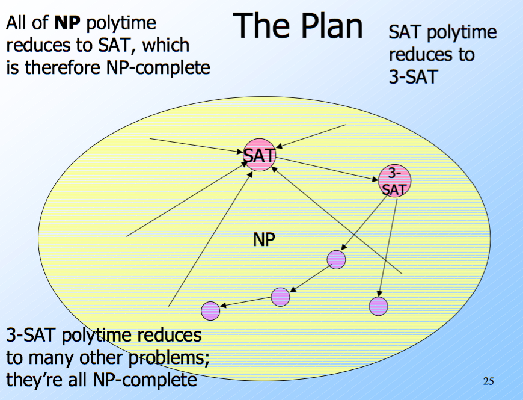
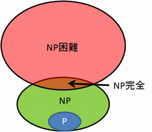
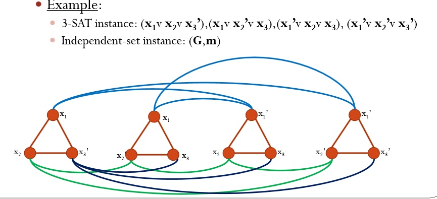
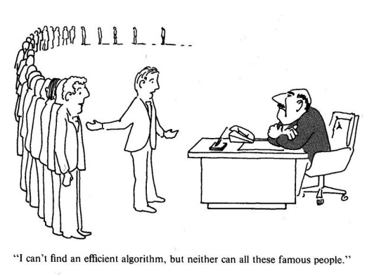

## 前言與心得整理

我把第六週的部分拆成上跟下，上半部主要解釋P與NP之間的定義與關係．下半部就是要介紹一些證明P=NP的一些理論與方法． 

課堂到了最後，其實課堂裡面有許多有用的理論與推導想法，尤其是NP Complete推導的思路，真的能改變解決問題的思考脈絡與方法．相信也可以在以後解決問題的時候，更快可以判別問題的難度．

## 相關文章

- [[Coursera][Automata] 自動機理論-Automata筆記-第一週Finite Automata](http://www.evanlin.com/moocs-coursera-automata-note1/)
- [[Coursera][Automata] 自動機理論-Automata筆記-第二週: Regular Expression](http://www.evanlin.com/moocs-coursera-automata-note2/)
- [[Coursera][Automata] 自動機理論-Automata筆記-第三週: Context-Free Grammars and Pushdown Automata](http://www.evanlin.com/moocs-coursera-automata-note3/)
- [[Coursera][Automata] 自動機理論-Automata筆記-第四週: Pushdown Automata and Properties of Context-Free Languages](http://www.evanlin.com/moocs-coursera-automata-note4/)
- [[Coursera][Automata] 自動機理論-Automata筆記-第五週: Turing Machines and Undecidability](http://www.evanlin.com/moocs-coursera-automata-note5/)
- [[Coursera][Automata] 自動機理論-Automata筆記-第六週(上): Intractable Problems and NP-completeness](http://www.evanlin.com/moocs-coursera-automata-note6-1/)
- [[Coursera][Automata] 自動機理論-Automata筆記-第六週(下): Intractable Problems and NP-completeness](http://www.evanlin.com/moocs-coursera-automata-note6-2/)

## 第六週後半部分的課程內容:

### 問題難度的排序

根據前一個章節的整理，我們可以把問題依照困難度排列(難->簡單)如下: (假設 P不等於NP)

- 無解的問題
- 需要Exponatial Time才能解決的問題
- 多項式時間，還不能決定的問題  (所謂的 NP類問題)
	- 裡面可以再分成 NP Complete(較難) -> NP (較簡單)
- 多項式時間，可以決定的問題 (所謂的 P類問題)

### 先回過頭看 Polynomial Reduction

在繼續看Cook's Theorem定義之前，根據NPTEL的[影片](https://youtu.be/qpCvPS-WwGA?t=1097)，其實有很多詳細的介紹．不過針對許多名詞有不同的定義:

首先先回過頭來看`polynomial time reducibility`定義如下:

假設一個可判定圖靈機(DTM)，從輸入為x處理並且輸出y的處理時間為Polynomial time-bond．如果x屬於L2，我們可以寫L2從L1`polynomial time reducible`過來的如果滿足以下條件:

- L2 屬於NP類問題，如果L原本是NP類問題
- L2 屬於P類問題，如果原本L是屬於P類問題

這邊也就是解釋，我們可以透過reduction把不同的問題經過歸約(reduction)後到可以處理(或是判斷)為哪一類問題． 就可以回過頭來判斷轉換錢的問題是屬於那一類的問題．

再來，根據原有的`plynomial time reducibility`，我們會引入另外一個名詞定義`polynomially transformable`如下:

		A language L1 is polynomially transformable to L2, if there is a deterministic polynomial-time-bounded Turing machine M which will convert each string w1 in the alphabet of L1 into a string w2 in the alphabet of L2, such that w1 is in L1 if and only if w2 is in L2 

- L1 is NP-Complete and L1 polynomially transformable L2. To prove NP L2 is NP-Complete
- Two condition must be satisfied:
	- L2 belong to NP (It is given)
	- Try to find L' which belong to NP, and let  L' polynomially transformable to L2
		- How?:
			- Because L1 is NP, So L' must could polynomially transformable L2
			- According to transition theroem:
				- L' polynomially transformable L1 (because L' is NP)
				- (given) L1 polynomially transformable L2
				- So L' must polynomially transformable L2

###   繼續講解Cook-Levin理論 (或稱為Cook's Theorem)
			
回過頭來試圖去證明 SAT(SATisfiability problem)是NP-Complete，首先我們已經知道SAT是NP類的問題． 

(這張圖就是我們的計劃）

**想要證明SAT是NP Complete**

- 先證明SAT是NP Hard (被Reduction後依舊是NP類問題)
- SAT Reduction 成 3SAT 而 3SAT又被Reduction 成其他 NP類問題
- 可以證明SAT是NP Complete 

#### 將所有NP類問題，透過歸約都能轉換成SAT

不過這個時候，為了要證明`P=NP`我們需要證明任何NP類問題L都能被歸約(Polynomial Reduction)成SAT．以下是我們的目標與方向:

- 已知 L為一個NP類的問題
- 針對L建立一個圖靈機`M`，`M`為一個NTM(Nondeterministic Turing Machine)
- 針對這樣的問題L的圖靈機M，我們會有輸入`w`
- 針對`w`我們能夠建立出一個布林表示式(Boolean Expression) 並且讓 w 可以透過Boolean Expression來表示．

接下來，就是要建立一個方式可以將所有的問題．將他們的輸入全部轉換成布林表示式．

#### 透過表列式來轉換所有的輸入為布林表示式

**概念**： 透過查表 K=1,2,.... k 代表第K個輸入

**範例**:

- 假設輸入的個數有K個(ex: a, b, c, .... k)．
- 那麼如何透過輸入來表示呢． 假設第一個輸入是b．原先的表示會是X_ij="b"．
- 透過轉換，我們會將所有的輸入多了一個維度K (K= 1...k)於是要表達X_ij 就會改成 X_ij1, X_ij2 ... X_ijk ． 
- 由於X_ij="b" ==> 所以  X_ij1= false, X_ij2=true, X_ij3=false ...... X_ijk=false
- 另外一個例子: 假設是X_38= "c"  --> X_381= false, X_382=false, X_384=true.

透過這樣的方式，我們可以把所有的NP類問題轉換成SAT的問題．接下來我們可以繼續往下做．

## 更多關於 NP類的問題

接下來的部分會提到更多關於NP類的問題，會提到NP-Hard，Co-NP．主軸會圍繞在透過將3-SAT轉換成其他的問題來解釋更多關於NP的定義．

#### Tautology Problem 

`Tautology Problem`(也就是[恆真式](https://zh.wikipedia.org/wiki/%E6%81%86%E7%9C%9F%E5%BC%8F)): 指的就是一個表示式一定為真(true)． 比如說:

- X or !X (不論X是什麼一定為真)
- ! (A or B) = !A and !B

#### Co-NP(反NP)

所謂的[Co-NP](https://zh.wikipedia.org/wiki/%E5%8F%8DNP)也就是該語言L的補集L'(Completement)為NP，如此一來就稱L為Co-NP類問題．

這邊也有一個開放的問題(open problem:只尚未解決的問題)，就是`if P=Co-NP then P=NP=Co-NP`

#### NP-Hard (NP困難)

[NP困難](https://zh.wikipedia.org/wiki/NP%E5%9B%B0%E9%9A%BE)指的是原先是NP類的問題，但是透過Reduction之後才會到目前的問題．看了許多的文章都直接稱它為"就是有NP這麼難的問題"．

透過NP-Hard可以再來回頭看，所謂的NP-Complete

#### NP Complete(NP完全)

[NP完全](https://zh.wikipedia.org/wiki/NP%E5%AE%8C%E5%85%A8)被稱為是最困難的問題，主要是因為如果一個問題被稱為是NP Complete，它會滿足以下:

- 本身是NP類問題
- 就算被歸約(reduction)過，依舊是屬於NP類問題 (`NP困難`)

套句簡單的話來說，`NP完全`的問題相當的困難．因為就算被歸約後，他依舊屬於NP類的問題．所以是相當困難的象徵．

#### 證明其為NP-Complete問題的變換流程圖

接下來會提到，如果遇到一個問題的時候，要如何證明它是NP-Complete?

**流程概念會是**:

- 先證明該問題為NP類問題
- 透過下圖的轉換方式，可以轉換成任何其中一個．(ex: 歸約成SAT or 3-CNF SAT...)
- 由於SAT與3-CNF SAT都是NP-Complete問題，於是就可以證明它也是NP-Complete

回過頭來看，為何會說SAT問題是NP完全呢? 因為SAT問題可以透過歸約(Reduction)成3SAT(等等會提到)．由於3SAT問題依舊是NP問題，所以我們就可以知道SAT是NP完全問題．

#### SAT -> 3SAT 轉換

首先回顧一下SAT(SATisfiability problem)，指的是一連串的布林表示式，像下者:

		X1 or X2 

如果透過轉換:

		(X1 or X2 or Y) and (X1 or X2 or notY)

這樣的轉換主要是加入`Y`並且讓原本的邏輯沒有改變．而類似以上的布林表示式(三個為一組的)就稱為 3SAT． 而上面簡單的轉換方式就是Polynomial Reduction．

順便附帶一下，如果x為以下各種個數的時候，由SAT->3SAT的轉換方式:

- SAT: `X`:
	- 3SAT: 
		- (X or Y1 or Y2)	 and (X or (not Y1) or Y2) and (X or Y1 ir (not Y2)) and (X or (not Y1) or (not Y2))
- SAT: `X1 or X2`:
	- 3SAT: 
		- (X1 or X2 or Y) and (X1 or X2 or notY)
- SAT: `X1 or X2 or X3` -> 3SAT一樣不用轉換
- SAT: `X1 or X2 .... Xk`
	- 3SAT:
		- (X1 or X2 or Y1) and ((not Y1) or X3 or Y2) and ( (not Y2) or X4 or Y3) ..... ( (not Yk-4) or Xk-2 or Yk-3) and ( (not)Yk-3 or Xk-1 or Xk)

	
經過轉換，由於3SAT本身被證明依舊是`NP類問題`．所以可以知道SAT本身是`NP困難`．也可以說SAT是`NP完全`問題．

###  學Automata 對我們的好處

接下來的課程，主要都是不斷的轉換不論是從`3SAT`歸約成`背包問題`．或是其他的轉換． 這部分，我就不再去提了... 

由於要找轉換，我找了不少其他的學校的投影片與影片．這一篇[聯合大學資管系:演算法講義](http://sjchen.im.nuu.edu.tw/Algorithm/97Spring/Course09.pdf)我相當的推薦． 裡面也有提到學P與NP究竟對工作上有什麼樣的影響．(slide p 18)

(引用如下):

假設你在一個公司上班。有一天，上司叫你去為某個對公司很重要的問題找出有效率的演算法。‹結果，你研究了很長的一段時間，沒有任何進展．就在快被解雇的時候，忽然想到世界上很多的電腦科學家正在為旅行推銷員問題(TSP)找尋一個較有效率的演算法。但是，到目前為止卻沒有人能發展出一個在最差情況下，時間複雜度比指數複雜度要來得好的TSP演算法。不過，也沒有人証明出找到這種演算法是不可能的…

你找到了一線生機!! 因為，你只要能証明找出公司問題之有效率演算法的難度和找出旅行推銷員問題的有效率演算法是一樣難的 (亦即：兩者是同一
類的問題)，代表著上司要求你解決的問題也曾難倒很多電腦科學家。

你終於証明出來公司的問題和旅行推銷員問題是同一等級的… （`這就是Polynomial Reduction`，並且也代表原本的問題是`NP完全`問題)

## 程式作業/Homework

homework比較多是考關於Polytime reduction的觀念，還算可以．不過11/02~11/09有Final Exam倒是真的讓我需要K書了．

## Final Exam: (update on 11/08)

記錄一些值得再去看看的部分，不要因為考完就忘記:

- [DFA_minimization](https://en.wikipedia.org/wiki/DFA_minimization)
	- 透過簡化的方式，可以找出相同輸入與輸出下能夠將一些DFA的State做合併．
	- 基本上計算方式透過是否透過相同Input可以到相同的state，來作為合併的挑選．
		- ex: [這張圖](https://upload.wikimedia.org/wikipedia/commons/c/cd/DFA_to_be_minimized.jpg) 中，c跟d 輸入 1都會到 f，而輸入0都會到e．所以可以合併．

## 相關程式

這星期主要是實作TM(Turing Machine)，其實要實作圖靈機並不難，只是要找到比較好的圖靈機範例可以測試倒是比較麻煩的．

可以到這裡看看[https://github.com/kkdai/tm](https://github.com/kkdai/tm)

## 參考網址

- [Coursera: Automata Course](https://class.coursera.org/automata-004)
- [未來數學家的挑戰](http://episte.math.ntu.edu.tw/articles/mm/mm_10_2_04/)
- [論P,NP,NP-hard,NP-complete問題 @ 藍色情懷](http://bluelove1968.pixnet.net/blog/post/222283186-%E8%AB%96p,np,np-hard,np-complete%E5%95%8F%E9%A1%8C)
- [聯合大學資管系:演算法講義](http://sjchen.im.nuu.edu.tw/Algorithm/97Spring/Course09.pdf)
- [Youtube: UC Davis- L20: P, NP and Polynomial-Time Reductions](https://www.youtube.com/watch?v=f7BvvtG9rsY)
- [Youtube: Cook's Theorem](https://www.youtube.com/watch?v=nKNd9iExRO8)
- [Youtube: Cook Levin - Georgia Tech - Computability, Complexity, Theory: Complexity](https://www.youtube.com/watch?v=dKS4iDWQVnI&list=PLS4py2LeEJNDzezHTc0G3EsttsoKWQhGz)
- [ P、NP、NP-complete、NP-hard问题闲谈](http://blog.csdn.net/xujinpeng99/article/details/6847083)
