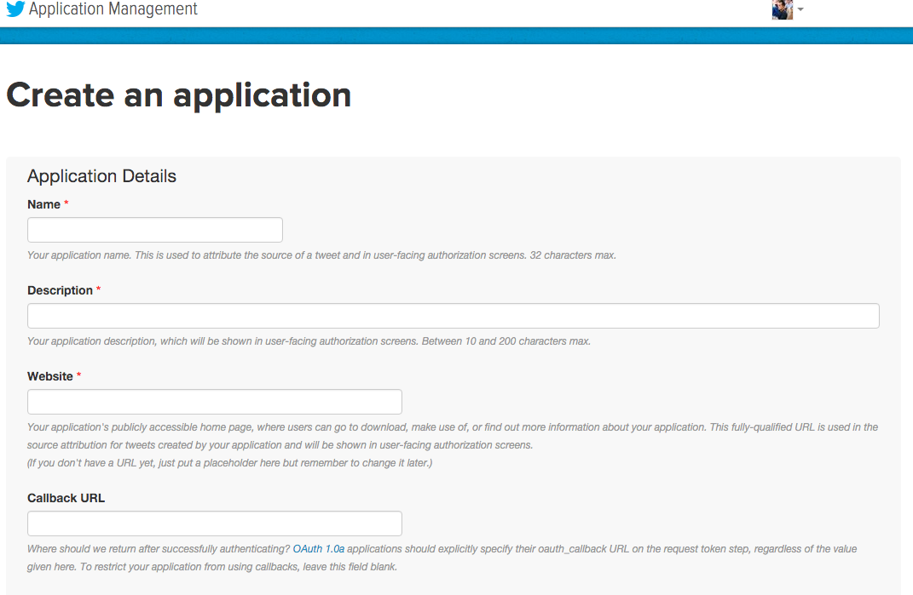
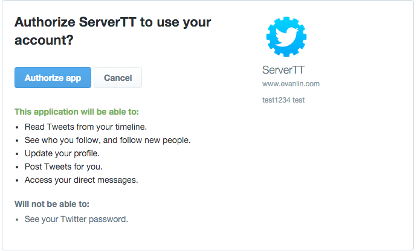

## 前言

主要是因為[Twitter](https://twitter.com/b123400)上面有人提出來想寫一個小遊戲

<blockquote class="twitter-tweet" lang="en">
idea: fetch twitter timeline，隨便抽幾個tweet出來然後叫user猜這個tweet是誰發的遊戲
&mdash; bちゃん (@b123400) <a href="https://twitter.com/b123400/status/659342036424744960">October 28, 2015</a></blockquote>

當然，這時候就給了正在愁不知道要怎麼讓自己[Project52](https://github.com/kkdai/project52)新的專案的我有了想法來寫．

所以我的目標是寫一個Golang的Package可以去做server-side oauth，並且讀取一些Twitter上面的資訊．

## 關於Twitter的Three-legged Authentication

上面這張圖清楚的顯示該如何做Twitter的OAuth Login，這裡講的主要都是Server-side的部分．簡單來說步驟主要分為以下數個:

- 透過你在[Twittter Dev App申請](https://dev.twitter.com/apps/new)的App Consumer Key 跟 Consumer Secret連線到oauth/request_token 開始認證
- Twitter  Server會給你另外一個 token URL 會連線到另外一個網址(該網址為Twitter擁有)去輸入帳號密碼或是同意該App使用你的帳戶資料．
- Twitter確認完畢後，會自動轉移到當初App設定好的Callback URL
- 你所架設Callback URL會收到Twitter Server呼叫，並且給你以下三個資料確認你登入的狀況．
	- `oauth_token`
	- `oauth_token_secret`
	- `oauth_callback_confirmed`
-  只要`oauth_callback_confirmed`是正確的，你就可以透過`oauth_token`與`oauth_token_secret`去連接到該使用者的一些資訊．

## 設定正確的App資訊

只要到Twitter的[Dev App 申請頁面](https://dev.twitter.com/apps/new)，就會看到以下的幾個欄位．

不過最重要的欄位還是

- `Callback URL`
- `Callback URL`
- `Callback URL`

很重要要講三次，因為很容易讓你卡很久就是這裡．  

如果你要寫server-side的oauth的話，你`必須要填入可以被接受的網址`． 這裡定義`可以被接受`網址如下:

- 必須不是 localhost
- 必須有 https://

如果你沒有填入資料到`Callback URL`的話，你就會被當成是Desktop App而無法進行`Three-legged Authentication`．

填好這一切的資訊，就可以拿到`consumer key`跟`consumer secret`來繼續以下的部分．

##  開始架設本地端測試流程

等等！  你剛剛不是說不能把`Callback URL`寫成 localhost嗎？  這邊就是要教導各位，如何在本地端測試與撰寫關於Server-side OAuth的流程．

- 修改你的[hosts](http://www.tekrevue.com/tip/edit-hosts-file-mac-os-x/)，並且將localhost改成比較有意義的． (ex: 個人改成  testgoserver.com)
- 記得testgoserver.com 填入`Callback URL`

這邊建議各位，直接參考這一段[Twitter Server Go](https://github.com/mrjones/oauth/blob/master/examples/twitterserver/twitterserver.go)．

跑起來後，記得在瀏覽器打上 http://testgoserver.com就可以了．

## 常見的錯誤

### Desktop applications only support the oauth_callback value 'oob'

詳細討論看[這裡](https://twittercommunity.com/t/desktop-applications-only-support-the-oauth-callback-value-oob-oauth-request-token/252)

表示App被認為是Desktop App，這時候需要去 [https://apps.twitter.com/app/YOUAPPID/settings](https://apps.twitter.com/app/YOUAPPID/settings) 設定Callback URL

此外，這邊的網址還不能使用localhost．所以你可能得寫成某個真正的網址．

不過建議不要lock，不然會出現以下錯誤

		This client application's callback url has been locked

## 小專案 

最後，我還是整理整個架構與將幾個我馬上會用到的API成一個packagey．放在[https://github.com/kkdai/twitter](https://github.com/kkdai/twitter)		
		

## 參考鏈結

- [Twitter API authentication in Go](http://venkat.io/posts/twitter-api-auth-golang/)		
- [https://github.com/mrjones/oauth](https://github.com/mrjones/oauth)
- [Twitter:sign-in Doc](https://dev.twitter.com/web/sign-in)
- [Twitter: Browser sign in flow Overview](https://dev.twitter.com/web/sign-in/desktop-browser)
