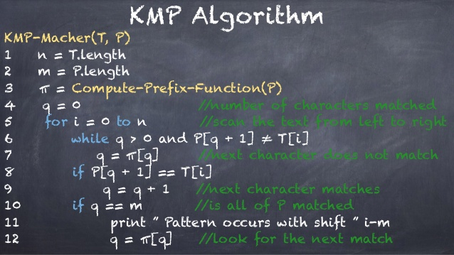

## TL;DR

KMP(Knuth–Morris–Pratt algorithm) 是字串搜尋的最佳化演算法，是由 MP Algorithm 優化而成，並且 KMP Algorithm 主要也只能解決某些問題 (要搜尋字串連鎖過多造成過多移動) ．

暴力法 -> MP (提供比對與快速移動的方式) -> KMP (提供連鎖的減少移動方式)

## 相關程式

如果需要可以執行的相關 MP KMP 程式，可以去拿這個 Go 的版本．

[https://github.com/kkdai/kmp](https://github.com/kkdai/kmp)

## 前言

紀錄一下關於 KMP 的學習紀錄，會講到 KMP(Knuth–Morris–Pratt algorithm) 主要就是因為一篇 DevOps 的[求職文章](https://www.facebook.com/groups/DevOpsTaiwan/permalink/991032070983839)．


所以決定去把它搞懂一下，順便寫一下相關程式．

**注意**  以下的部分由於我懶得畫圖，就沒有圖表介紹．如果要看圖表或是影片． 這一對教學影片很清楚．  [youtube: Knuth–Morris–Pratt(KMP) Pattern Matching(Substring search)](https://www.youtube.com/watch?v=GTJr8OvyEVQ)

## 原理

KMP(Knuth–Morris–Pratt algorithm) 本身是用來做字串搜尋的演算法．也就是有點類似 C 語言本身會提供的 [strstr](http://www.cplusplus.com/reference/cstring/strstr/) 也就是在一個字串裡面搜尋一個字串．

當然 `KMP` 跟 `strstr` 有些許的不同由於回傳的資料不同． `KMP` 回傳所有符合的索引位置，而 `strstr`只回傳第一個．

### 字串搜尋:

方便以下講解，字串 `target` 為我們的目標字串， `want` 就是我們想要找出的字串．  其中:

- `n = len(target)`
- `m = len(want)`

### 暴力搜尋

**解決問題:**

講到在一個字串裡面要搜尋一個比較小的字串．比較直覺方式就是暴力法，也就是一個個比對．

**方法論:**

-  從字串 `target` 的第 `i` 個位置開始找 ( `i` 從 0, 1, ... n )
-  如果 `target[i] == want[0]` 則繼續往下比對，一直比對到整串字串比對完畢．
-  如果不成功，將指標移到 `target[i+1]`

```
// 1
// Target [ 1 2 3 4 7 4 5 6 7]
// Want   [ 5 6 7

// 2
// Target [ 1 2 3 4 7 4 5 6 7]
// Want     [ 5 6 7 ]

// 3
// Target [ 1 2 3 4 7 4 5 6 7]
// Want       [ 5 6 7 ]
```


**時間複雜度:**

- 最差狀況: `O(m * n)`

<br>
### MP 演算法 (Morris–Pratt Algorithm)
 
**解決問題:**

使用暴力解法最大的問題是最差狀況的時間複雜度代價太高，需要想一些辦法減少比對的次數． 所以有人想到是不是搜尋過的地方可以直接跳到後面？

```
// 1
// Target [ 1 2 3 4 7 4 5 6 7]
// Want   [ 5 6 7

// 2
// Target [ 1 2 3 4 7 4 5 6 7]
// Want         [ 5 6 7 ]
```

這樣問題來了，如果你要搜尋的字串其實有某種程度是具有重複性的．比如說 `[ 1 2 3 1 2 4]` 可以看出來 `1 2` 是重複有兩組在裡面． 那麼在搜尋的時候就無法一次跳掉所有的 target ． 所以 MP 演算法提供以下的方式．

**方法論:**

- 先分析要找尋的字串 want ，所有重複出現的字串列出一個列表．成為 failure index
	- want: `[A B C A B B D]` ->  failure function: `[0 0 0 1 2 2 0]` 
- 開始搜尋，如果遇到不符合的字串． 尋找 want 前一個字元去尋找他的相對應的 failure index． 要往後移動的數字為:
	-  `已經比對的個數 - 前一個重複的位置`
	-  假設比對到:  

```
target: [ABCABCDDDD]
want:   [ABCABBD]
              ^ 比對到第6個
//時候要移動的會是 5-2=3

target: [ABCABCDDDD]
want:   [   ABCABBD]

```

留下的問題是，對於往後移動的計算方式．往往會因為後面一個跟移動後的第一個不搭配．要頻繁地移動．

**時間複雜度:**
 
- 最差狀況 `O(m+n)`


### KMP 演算法 (Knuth–Morris-Pratt Algorithm)


**原先MP演算法的問題**

為了要解決移動後可能會遭遇的頻繁移動的問題，換句話說想要試著一次就把想要移動的部分到位． Knuth 在 failure function 上面增加了不少的判斷方式． 

也就是試著在做 failed function 的時候，希望把之後可能會遇到的 failure function 移動兩次的狀態減少．


先來看看透過計算過後的 failure function 索引表．

```
           0  1 2 3  4 5 6
string    [A  B C D  A B D]
mpNext  = [-1 0 0 0  0 1 2]
kmpNext = [-1 0 0 0 -1 0 2]
``` 

透過這個範例可以看到，當有不相同的字串發生在 `5` 的時候． 由於前面是`A`，你也會發現 `4` `5` 的 `AB` 跟 `0` `1` 的 `AB`一樣是連鎖的．

以下透過上面的例子來推導一次(先透過 MP 來推倒，查看原先容易出現的問題):

```
           0  1 2 4 5 6
目標字串   [A  B C A B D]
mpNext  = [-1 0 0 0 1 2]


//1
搜尋字串   [A BCACCDDDAACABCDABD]
目標字串   [A BCABD]
           ^ 
//2
搜尋字串   [A B CDACCDDDAACABCDABD]
目標字串   [A B CDABD]
             ^  

//3
搜尋字串   [AB C DACCDDDAACABCDABD]
目標字串   [AB C DABD]
              ^  

//4
搜尋字串   [ABC D ACCDDDAACABCDABD]
目標字串   [ABC D ABD]
               ^  

//5
搜尋字串   [ABCD A CCDDDAACABCDABD]
目標字串   [ABCD A BD]
                ^   

//6
搜尋字串   [ABCDA C CDDDAACABCDABD]
目標字串   [ABCDA B D]
                 ^   

// 這時候發生不符合的狀態，根據 MP 的演算法
// 我們會移動到前面一個 A 的位址並且從 B 繼續開始比對

//7
搜尋字串   [ABCDA C CDDDAACABCDABD]
目標字串       [A B CDABD]
                 ^   

//由於 [0,1] AB 的連鎖跟 [4,5] AB 一樣，
//所以既然錯誤發生在[5] B，移動到前面的時候．
//接下來一定也會遇到 B ，就像現在．
//只好移動到最前面再比對一次

//8
搜尋字串   [ABCDA C CDDDAACABCDABD]
目標字串         [A BCDABD]
                 ^
```

這就是問題所在， KMP 主要就要解決這種問題． 所以如果你只單單的移到 `A` 接下來往後的一定是 `B` 一定又會發生不同，而必須要在移動一次． 

**方法論:**

簡單的原理條列如下，主要是修改在 failure function 索引表的數字:

- 如果發現前面有同樣的，先查看下一個是否跟前面的下一個是同樣． 如果是就在往前面一個相同的找． 簡單的說： **遇到連鎖，就再往前找．**
- 如果不是"連鎖"，就可以單純的把前面的位址記錄下來．

以下拿上面的例子來做一次 `kmpNext`

```
目標字串   [ABCAB]

依照MP演算法，計算數字如下


目標字串   [A  B C A B]
mpNex    [-1  0 0 0 1]

但是由於找到第二個A的時候，發現第二個A的後面是B，而第一個A的後面也是B．於是就必須往前找． （往前找的動作，在程式碼裡面就是直接把前一個的 kmpNext 數值直接給後面．


目標字串   [A  B C A  B]
mpNext   [-1  0 0 0  1]
kmpNex   [-1  0 0 -1 0]

```

**時間複雜度:**
 
- 最差狀況 `O(m+n)` 但是在某些狀況下，也就是你要尋找的字串如果具有相當多的連鎖． 比如說 `ABCABCAB` 或是 `AAABCDBCDBCD` 的狀態下就會變得比較快．

## 參考鏈結

- [Knuth-Morris-Pratt algorithm](http://www-igm.univ-mlv.fr/~lecroq/string/node8.html)
- [理解KMP算法](http://zhangbuhuai.com/2015/07/06/KMP/)
- [String Matching: 各種演算法介紹](http://www.csie.ntnu.edu.tw/~u91029/StringMatching.html)
- [youtube: Tutorial: The Knuth-Morris-Pratt (KMP) String Matching Algorithm](https://www.youtube.com/watch?v=2ogqPWJSftE)
- [youtube: Knuth–Morris–Pratt(KMP) Pattern Matching(Substring search)](https://www.youtube.com/watch?v=GTJr8OvyEVQ)
- [Regular Expression Matching with a Trigram Index](https://swtch.com/~rsc/regexp/regexp4.html)