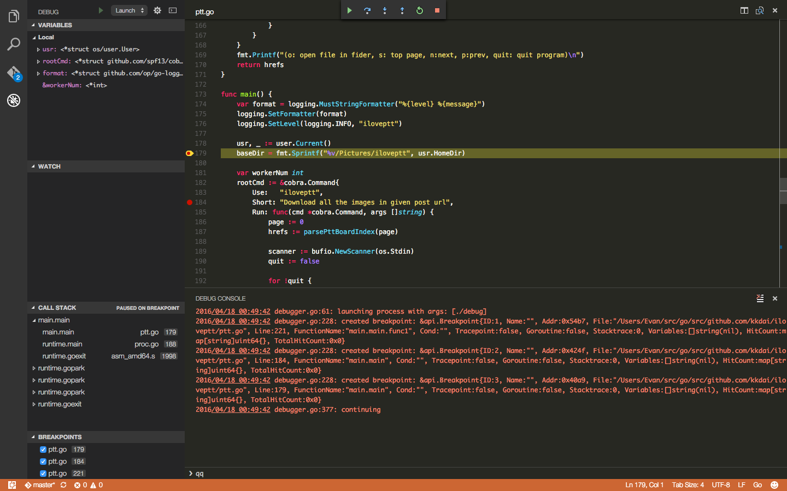

## VS Code Debugging for Golang:  

前幾天正式邁入 [1.0 的 VS Code](https://code.visualstudio.com/blogs)，不少 [Redit](https://www.reddit.com/r/golang/comments/4ewxjo/visual_studio_code_for_go_programming_real_good/) 上面有討論到似乎很好用? 

其實 CS Code 的 Golang debugging 就已經很吸引人，但是因為MacOSX上面要使用 [Delve 需要跑 Codesign流程](https://github.com/derekparker/delve/blob/master/Documentation/installation/osx/install.md) 實在很煩人．

最近有兩個 Golang IDE 的更新都圍繞 [delve](https://github.com/derekparker/delve) 

1. [VS Code 正式邁入 1.0](https://code.visualstudio.com/blogs/2016/04/14/vscode-1.0) 
2. [LiteIDE](https://sourceforge.net/projects/liteide/) 釋出新的版本 X29
	- 也是支援 delve
	- QT5 支援

於是週末很認真的把 [delve](https://github.com/derekparker/delve) 好好的設定起來． (Mac OSX 上面的codesign 實在有點討厭)

依照[官方作法](https://github.com/derekparker/delve/blob/master/Documentation/installation/osx/install.md)，一直會失敗而無法讓 delve 無法正常載入就會出現 

		"delve could not launch process: could not fork/exec"
	

重新跑了兩次，在灰心的狀態下重開機.. 竟然就成功了..

原來設定完 codesign 一定要重開機...

原來設定完 codesign 一定要重開機...

原來設定完 codesign 一定要重開機...

### 全部金鑰簽署的設定流程

以下提供中文版本的設定方式，避免有人看不懂:( 如果我沒有特別寫的，請盡量就不要改)

- 打開「鑰匙圈存取」的系統App
- 選單「鑰匙圈存取」-> 「憑證輔助程式」-> 「製作憑證授權..」
	- "名稱" -> 請打入 "dlv-cert"
	- "識別身份類型" -> “自簽根 CA "
	- "使用者憑證" -> "代碼簽名"
	- 選取 "覆蓋預設值"
	- 點選 next
- 第二頁，憑證資訊有效日期:
	- 從 365 -> 3650 
	- "簽署邀請" 取消點選
	- 點選 next
- 個人資訊: 不改->點選 next
- 密鑰配對資訊: 不改->點選 next
- 為此 CA 使用者指定密鑰配對資訊: 不改->點選 next
- 此 CA 的密鑰用法擴充欄位: 不改->點選 next
- 此 CA 使用者密鑰用法擴充欄位: 不改->點選 next
- 此 CA 延伸密鑰擴充欄位: 不改->點選 next
- 此 CA 使用者延伸密鑰擴充欄位: 不改->點選 next
- 此 CA 基本限制擴充欄位: 不改->點選 next
- 此 CA 使用者基本限制擴充欄位: 不改->點選 next
- 此 CA 的主題替用名稱擴充欄位: 不改->點選 next
- 此 CA 使用者的主題替用名稱擴充欄位: 不改->點選 next
- 指定憑證存放位置
	- 鑰匙圈從 "登入" -> "系統"
	- 輸入電腦admin的帳號，密碼
- 打開原來 「鑰匙圈存取」到 -> （左上角）「系統」->（左下角) 「憑證」
	- 會看到你剛剛加入的憑證，點擊兩次．
	- 「信任」改成 "永遠信任"
	- 輸入電腦admin的帳號，密碼
- 最重要的事情來了
	- 重開機
	- 重開機
	- 重開機
- 就可以跑 `codesign -s $GOBIN/dlv`

#### [更新] 除了重開機以外的方法

可以試著將taskgate 重啟，方法如下:
		 sudo kill `pgrep taskgated`

參考 [Visual Studio CodeによるGo言語のデバッグ](http://dev.classmethod.jp/go/visual-studio-code-golang-debug/)

### 測試方式:

到一個你的 Go Project 位置，並且打上 `dlv debug` 如果沒有出現 `delve could not launch process: could not fork/exec` 就是 `codesign` 成功．

  

### 小小心得:

使用 VS Code debugging Golang 畫面還不錯．整體流程也很簡單．就是按下 F5 直接編譯並且開始 Debug ． 透過滑鼠可以設定 breakpoint， F10 可以 Step ． 發現了嗎？ 就是整套的 Visual Studio 的熱鍵．

沒有 Integrated Console (我有發 issue 要加入這個功能但是一直被擱置) 要邊 debug 邊輸入資料可能有點困難． （還在想怎麼弄)

有點麻煩是... 就算要 `go build` 都需要建立一個 task 才可以． 如果直接要 debug 可以按下 F5 ．

### 結論:

我寫 Golang 應該會繼續使用 vim + vim-go 因為目前比較熟悉． 如果有 debugging 的需求才會考慮使用 vscode ，畢竟有個 IDE 設定變數名稱跟 step debug 還挺方便的．
 
此外，由於 VS Code 還支援 Python 跟 Node.JS ．  所以之後我有考慮好好的重要 VS Code.