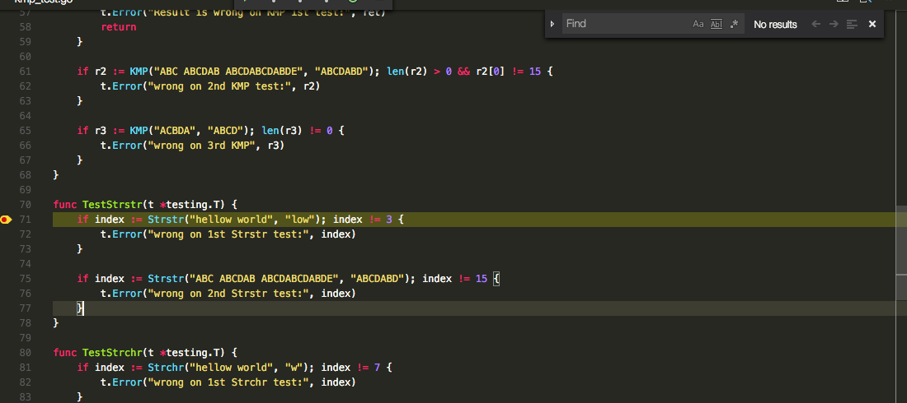

## 前提

[Visual Studio Code ](https://code.visualstudio.com/)(以下簡稱: VS Code) 是微軟的跨平台的開源 IDE ，目前已經進入了 [1.0 的正式版本](https://code.visualstudio.com/blogs/2016/04/14/vscode-1.0)． 由於功能強大，預設就能 debug python, node.js 與 java script ．玩了一兩天，將所有與 Golang 相關常用到的情境加以記錄下來，希望能夠幫助到某些人．


## 阿鬼，你還是講英文吧!!

第一次安裝 VS Code，會發現他有一個相當"貼心"的功能．就是他會幫你的 IDE UI 選取到**中文介面**．  貼首先，先修改 locale 將"中文" VS Code 改回英文介面:

- 按下 `F1` 點選  “設定語言"
- locale 改成 "en-US"
- 重啟 VS Code

## 安裝 vscode-go

- 安裝 VS Code 1.0.0 以上版本
- `cmd-shift-p`
- `Install Extension`
- `Go`

### vscode-go 基本設定

- `cmd + , `
- 如果你使用 homebrew 可以設定
  - `"go.goroot": "/usr/local/opt/go/libexec",`
  - 如果不是記得將該目錄指向 `$GOROOT`


## 常用熱鍵:

- (`F1` 或是 `Shift + cmd + p`) command palette: 
  - 呼叫出命令列，可以跑一些 IDE 的指令：比如說安裝 extension  那類的．
- (`F2`) Rename (`gorename`): 
  - 可以快速幫你把整個專案裡面的變數修改名稱，就像是 VS  跟 XCode 裡面的 Refactor．

- (`F5`) Debug : 
  - 直接幫你 compile 目前的專案，並且直接進入 debug 模式．就像是 VS 一樣，使用起來相當的方便． 並且可以透過以下的 hot-key 來進行 debug :
    - `F5` continue
    - `F10` step over
    - `F11` step into
    - `SHIFT+F11` step out (目前 [delve](https://github.com/derekparker/delve/issues/358) 尚未支援)
    - `SHIFT+F5` stop
- (`F8`) Go to Next Error or Warning:
  - 可以快速切到如果有任何 error 或是 warning 的部分． 要切換到前一個，可以試著 (`Shift + F8`)
- (`F12`) Go to Definition (`godef`): 
  - 跳到 function 定義的地方，就如同 VS 裡面的 `F12` 是相同的．
- (`Shift+F12`) Show References (`guru`):  
  - 跳到參考的地方，跟 `F12` 是成對的． 當你跳到 function 定義的地方，可以透過這個跳回呼叫 function 的地方．
- (`Cmd + =`) 縮放整個畫面：
  - Zoom in : `Cmd + =`,  Zoom out: `Cmd + -`
- (`Cmd + Shift + n`)  開啟新的 IDE
  - 當你要開發多個專案（應該超容易使用到），就必需要使用這個 hotkey ．

## 自訂 task  部分 (for build, test, install)

**以下修改的 `task.json` 是每個專案都需要改一次．**目前該專案打算整合成預設，但是還沒完成 (參考: [issue 287](https://github.com/Microsoft/vscode-go/issues/287), [issue 21](https://github.com/Microsoft/vscode-go/issues/21) )


首先按下 `F1` 呼叫出 `Tasks: Configure Task Runner` ．貼下以下的部分，記得 `gopath` 要改

```
{
    "version": "0.1.0",
    "command": "go",
    "isShellCommand": true,
    "showOutput": "silent",
    "options": {
        "env": {
            "GOPATH": "YOUR_GO_PATH"
        }
    },
    "tasks": [
        {
            "taskName": "install",
            "args": [ "-v", "./..."],
            "isBuildCommand": true
        },
        {
            "taskName": "test",
            "args": [ "-v", "./..."],
            "isTestCommand": true
        }
    ]
}
```

更多 task 相關設定可以參考[官方文件](http://code.visualstudio.com/docs/editor/tasks)．

就可以執行以下的部分:

- (`Shift+cmd+B`) Go build:
  - 編譯當下這個專案全部的檔案．

[ 2016/05/17 更新: 原本 1.0.0 是可以透過 `Shift+cmd+T` 跑 Go Test，不過在 [1.1.0](https://code.visualstudio.com/updates#vscode) 被改成 Reopen the Close File.

要增加跑 `Go Test` 的 Keyboard shortcut ，需要透過以下流程:

[Code]->[Preference]->[Keyboard Shortcuts] 新增以下的設定．

```
// Place your key bindings in this file to overwrite the defaults
[
    { "key": "shift+cmd+r",           "command": "go.test.package" },
]
```

你就可以透過 `Shift + cmd + r` 來跑 `Go Test`．


更多與 Golang 熱鍵有關的問題，可以比對 [keymap](https://code.visualstudio.com/Docs/customization/keybindings) 跟 [vs-code 的 tools](https://github.com/Microsoft/vscode-go#tools)

### 解決 build error 

如果跑 `go build` 發現有一堆的 error 在顯示視窗，該如何快速切換到錯誤的地方？ 這時候可以按下 `F8`
​	
## 常用情境


**注意： 關於 debug 設定 `launch.json` 是跟著專案走，每個專案都得設定一次．**

### Debugging Application

當你透過 folder 打開你的專案目錄． 然後直接按下 `F5`，就是那麼簡單． 這時候會先跳出設定選項 `launch.json` 要填．你如果要 debugging application 就直接存擋關閉就好了．

記得要用滑鼠加上一些 breakpoint ，並且用 `F10` 來做簡單的 step over debugging． 其他關於 debugging 視窗的部分就跟 Visual Stido 很像就不多加解釋．

### Debugging "go test"

`go test` 是 Golang 內建的 unit testing 的方式，所以很多 package 其實可以很快速地將所有的 unit testing 完成即可． 就不需要很麻煩的寫出相關的 CLI 就可以完成所需要的測試單元． 要來 debug `go test` 其實不難，只要依照以下方式即可:

- 修改 `launch.json` 將以下參數改掉:
- `"mode" = "debug",` 改成  `"mode" = "test",`

直接按下 `F5` 就可以 debugging `go test`．


當然，你也可以直接選取部分的測試項目，透過 `F1` 來呼叫出 command palette 然後直接執行:

- `Go: Run test at cursor`: 僅僅跑目前游標 function 的測試項目．
- `Go: Run test at cursor package `: 跑目前 package 的測試項目．
- `Go: Run tests in current file`: 僅僅跑目前檔案的測試項目．

### Debugging with attach

目前還在測試，感覺我手邊的 delve 在 attach 方面有些問題．

關於要用 vs code debugging CLI ,  想要跑 vs code 去 attach 看起來有點問題..  回過頭來說 delve debug 看起來對於 `bufio.scanner` 會跳掉... 又得花時間去看 delve. gdb 就沒這個問題． 持續觀察與更新．


## 讓你在 Mac Terminal 直接把 VS Code 叫起來

1. Open Visual Studio Code
2. Open the command pallette with Command + Shift + P (or F1)
3. Type `Shell` in command palette
4. Select `Shell Command: Install code in PATH` from suggested list


## 心得:

目前還在持續使用，雖然可以將 Python, Node.js 跟 Golang 全部整合在同一個 IDE ，不過因為他是 Project-based 你還是得開很多個 IDE ．

### 優點:

- 整個 debugging 的體驗是相當的驚人，就像是使用 Visual Studio 在 debugging C/C++ 一樣．
- 整合多個程式語言，使用起來可以相當的快速．（當然前提你把他的 [keymap](https://code.visualstudio.com/Docs/customization/keybindings) 用熟了)


### 缺點

- `go build`, `go install` 與 `go test` 目前都得透過 task 設定的方式，而且是以 Project-based 有點累贅．
- Debugging CLI with input 看起來有些問題，不過這一點我保留，因為我還要查看一下是不是 delve 造成的問題．