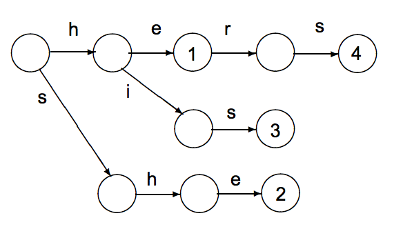
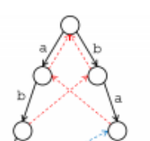
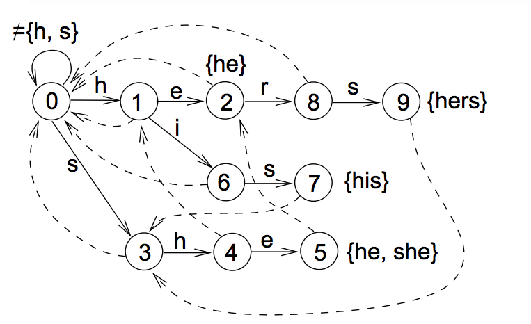

## 前提

前一篇文章介紹到[字串比對的演算法 KMP ](http://www.evanlin.com/about-kmp/) 那時候在 Twitter 上面就有人介紹我說其實可以繼續去研究字典樹 (trie) 與 Aho–Corasick Algorithm 

<blockquote class="twitter-tweet" data-lang="en">
<a href="https://twitter.com/Evan_Lin">@Evan_Lin</a> KMP + Trie 的概念可以延伸成 AC-Automaton 單文本多模板匹配自動機，有興趣可以研究看看 <a href="https://t.co/v87XrLLiwT">https://t.co/v87XrLLiwT</a>
&mdash; Quexint  (@Quexint) <a href="https://twitter.com/Quexint/status/721110451795263488">April 15, 2016</a></blockquote>

所以就開始研究[這一篇 slide ](http://www.cs.uku.fi/~kilpelai/BSA05/lectures/slides04.pdf)  想不到意外的有趣．於是也把本週專案也決定改成 AC Automation ．

### **本週專案**: [Aho–Corasick algorithm automation implement in Golang](https://github.com/kkdai/aca)

## 開始介紹 Aho–Corasick Algorithm (AC Algorithm)

### 為何需要 AC Algorithm?

原先在 KMP Algorithm 我們解決了可以在一個長字串 (haystack) 裡面找到所有具有單個字串 (needle) 的位置集合． 並且可以把時間複雜度縮小到 $$ O(n + m) $$ 其中 $$ n $$ 是 haystack 的字串長度，而 $$ m $$ 是 needle 的長度．

那麼.. 問題來了：  如果我們要比對的 needle 是多數個呢？ （比如說掃毒程式) 那這時候時間複雜度就會變成以下狀態: 

( 題外話: [參考這篇可以在 Jekyll 裡面加上 Latex](http://bit.ly/1SnrXKP) )

以下是時間複雜度的推導過程: TL;DR $$ O(n + km)$$ .

### 透過 KMP 如果要處理多個搜尋字串的時間複雜度

要尋找字串集合 (needles) $$P$$ 其中 $$ P = { P_1, P_2, ... P_k } $$

目標字串 (haystack) $$T[1 ... m]$$

在 KMP 之中，我們已經知道要計算一個  needle $$ P_i $$ 的時間複雜度為 $$ O( n_i + m) $$ 

所以要處理多個字串 $$P$$ 就必須要經過: ( Latex 有點忘記，詳細推導後補)

$$ 
\begin{align*}

((| P_1| )+ m) + ((| P_2| )+ m) + .... ((| P_k| )+ m)

&= \sum_{i=1}^k | Pi | + k*m
\end{align*}
$$

### AC Automation 的時間複雜度

先講結論，要能夠比 KMP  的 $$ O(n + km)$$  ， ACA 時間複雜度為 $$ O(n + m + z) $$ 其中 $$ z $$  是字串重複出現的次數．

### 建立字典樹

要開始討論 AC Automation 之前，必須要先會建立字典樹．字典樹的建立會是一個類似以下的範例：

這張圖是透過 `[say, she, shr, her]` 來建立的字典樹 (trie) ．但是這個字典樹還沒有建立錯誤索引． 可以看得出來，字典樹就是透過 prefix tree 來建立而成． 這邊的數字之後會討論到．

### 關於字典樹的錯誤索引

這邊字典樹錯誤索引的建立可以參考 KMP 的 fail index ，但是有些不同． 以下是我的見解:

**KMP Fail Index (Function) :**

- 透過**單個**搜尋字串建立
- 建立每個字元的錯誤索引 ( fail index )也就是比對到該字元如果發生錯誤，需要退到哪個 index 繼續之後的比對．
- Fail Index 在 KMP 中特別注意到**連鎖字元** 也就是 `ABCEABC` 其中的 `ABC` 就被認為是連鎖字元． 會直接尋找該字元前面的錯誤索引 (Fail Index) 避免在比對的時候多餘的移動． （這也是 KMP 勝過 MP  的重點)

在 AC Automation 裡面的錯誤處理索引方式跟 KMP 有些不同，整理如下: 

**ACA Fail Index :**

- 針對處理**多個**字串
- 專注在多個字串重複出現的字元，不專注在**連鎖**字元

以這張圖來看，一開始左邊的 a 標記成 $$ a_l $$ 而右邊的 a 標記成 $$ a_r $$ ． 以下條列式脈絡給大家了解:  並且將每一個節點編號 [ root(0), $$ a_l $$ (1) , $$ b_r $$ (2) , $$ b_l $$ (3), $$  a_r $$ (4) ].

-  將 root node 放入 node list ，並將移動的**目標節點** 移動到 node list 的第一個 (也就是 Root)
-  **目標節點**往 $$ a_l $$  走，該點的 fail index 為計算方式為:
	-  Parent node 的 fail index 是否有相當的位置 `a`
	-  如果 Parent node 是 root ，則該點的 fail index 為 root
-  **目標節點**往 $$ b_r $$ (這邊是採取 BFS 走法) ，方法跟 $ a_l $$ 一樣，結果 fail index  也是 root
-  將**目標節點** 移動到 node list 的第二個 (也就是 $$ a_l $$ )
-  將**目標節點** 移動往 $$ b_l $$ 移動，該點的 fail index 計算方式，如下:
	-  由 $$ a_l $$ 的 fail index 也就是 root 來看是否有 `b` 的路徑 ( 有的！ 就是 $$ b_r $$ (2) )
	-  所以 $$ b_l $$ 的 fail index 記錄為 `2` ，也就是說當他往下比對發生錯誤的時候，會移動到 $$ b_r $$ (2) 繼續比對．
-  為了確保大家了解，再做一個，將**目標節點** 移動到 node list 的第三個 (也就是 $$ b_r $$ ) ，並且往 $$ a_r $$ 移動． 他的 fail index 計算如下:
-  由 parent $$ b_r $$ 的 fail index （也就是 root ) 往下看是否有 `a` 
-  有找到由 root 出發的 `a` 也就是 $$ a_l $$ (1)
-  將 $$ a_r $$ 的 fail index 記錄為 `1`

這裡的時間複雜度為 $$ O(n) $$ 其中 $$ n $$ 就是每個字串建立ACA 的時間．

### AC Automation 的查詢

假設我們透過 [`she`, `his`, `hers`, `he`] ，建立了以下的AC Automation ．

並且我們有一個字串 haystack = `ashersa` 來做搜尋的用．我們的思考脈絡如下:

- 挑出第一個字 haystack[0] = `a`，從節點 root (0) 開始，沒有`a` 的路徑，往下
- haystack[1] = `s`，(0) 有 `s` 的路徑，往節點 (3) 走
- haystack[2] = `h`，(3) 有 `h` 的路徑，往節點 (4) 走
- haystack[3] = `e`，(4) 沒有 `e`的路徑，往 fail index (1) 走，並且走到 (2)
- haystack[4] = `r`，(2) 有 `r` 的路徑，往節點 (8) 走
- haystack[5] = `s`，(8) 有 `s` 的路徑，往節點 (9) 走，並且找到整串字串 `hers` 
- haystack[6] = `a`, (9) 沒有 `a` 往 (0) 走

搜尋的時間複雜度為 $$ O(z + m) $$ 其中 $$ z $$ 就是每個字元重複出現的次數．

## 心得

AC Algorithm 其實寫程式的部分並不難．如同所有樹狀結構的演算法一樣，如何能夠清楚地呈現，並且能夠清楚的除錯才是困難的．

不過，由於 Latex 忘得差不多．這一篇寫起來，在弄 Latex 的時間反而是最多的． 哈.. 

## 參考文章

- [跳跃表，字典树（单词查找树，Trie树），后缀树，KMP算法，AC 自动机相关算法原理详细汇总](http://blog.csdn.net/zhongwen7710/article/details/39274349)
- [Biosequence Algorithms, Spring 2005 Lecture 4: Set Matching and Aho-Corasick Algorithm](http://www.cs.uku.fi/~kilpelai/BSA05/lectures/slides04.pdf)
- [Wiki: Aho–Corasick algorithm](https://en.wikipedia.org/wiki/Aho%E2%80%93Corasick_algorithm)