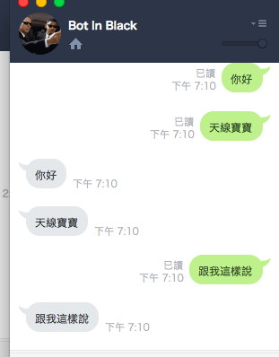

**更新**:  由於 `GitHub.com/line/line-bot-go/line-bot` 底層更新，相關 vendor 也更新了．

## 前提

LINE 推出了機器人 API ，並且透過(幾乎不審核) 的方式來開放機器人的功能．  大家可以來試試看．

## 如何建立自己的 LINE Bot 機器人

#### 1. 先去 LINE 官方網站申請機器人帳號 (LINE Bot )

- [請先確認有在 LINE Developer Console 開啟帳號](https://developers.line.biz/console/)
- 然後建立一個 `Messaging API Channel` 
- 在 "Basic Setting" 頁面，取得 `Channel Secret` 
- 在 "Messaging API" 頁面，去申請 `Channel Access Token`  
- 在  "Basic Setting" 頁面，將 LINE 官方帳號管理介面打開
- 到回覆設定的選項中，選擇啟動  "webhook"

#### 2. Deploy LINE Bot template

記得到 https://github.com/kkdai/LineBotTemplate 然後點選下方的 Deploy 按鈕，將基本的程式碼 Deploy 到你的 heroku 之中．

- 輸入剛剛取得的 `Channel Access Token`跟 `Channel Secret` 。
- 請記住你設定的 Heroku App ID ，稍後會使用到。

#### 3. 回到 LINE Bot Dashboard 設定基本資料

到你的 “Ｂasic account information” 來設定，以下一些資料需要填好:

- `Callback URL`:  https://{YOUR_HEROKU_SERVER_ID}.herokuapp.com/callback 

好了… 加入你的機器人．開始跟他講話吧．

這份程式碼是最簡單的範例，設定好之後他只會重複你打的文字．更多的功能會放在另外一份．

#### 影片教學

可以根據以下影片的教學來看如何在五分鐘之內部署自己的 LINE Bot

<iframe width="560" height="315" src="https://www.youtube.com/embed/0BIknEz1f8k" frameborder="0" allow="accelerometer; autoplay; encrypted-media; gyroscope; picture-in-picture" allowfullscreen></iframe>

想要修改代碼嗎？參考以下的影片教學吧

<iframe width="560" height="315" src="https://www.youtube.com/embed/xpP51Kwuy2U" frameborder="0" allow="accelerometer; autoplay; encrypted-media; gyroscope; picture-in-picture" allowfullscreen></iframe>

## 還有任何問題?

### 在這裡留下你的問題，或是在 github 上面開啟 [issue](https://github.com/kkdai/LineBotTemplate/issues) 詢問

## 參考鏈結:

- [Golang (heroku) で LINE Bot 作ってみる](http://qiita.com/dongri/items/ba150f04a98e96b160e7)
- [LINE BOT をとりあえずタダで Heroku で動かす](http://qiita.com/yuya_takeyama/items/0660a59d13e2cd0b2516)
- [阿美語萌典 BOT](https://github.com/miaoski/amis-linebot)