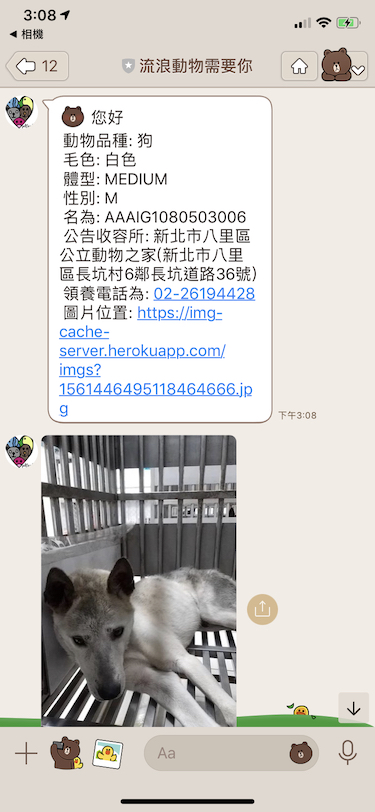

## 關於小黃(狗)

(圖片摘自: [癡心的小黃狗](https://www.youtube.com/watch?v=5O2_ieVwT0o))

我家以前是開雜貨店的緊鄰著一個傳統市場．祖母與我妹非常喜歡小狗，常常在逛市場的時候就會帶著一隻流浪狗回來說:" 這隻狗一直跟著我，我們就來養他吧" 

就這樣，前前後後我家的雜貨店也收養了接近 10 隻狗 （不包括後來生的送人）．裡面最讓我記憶的就是小黃這隻小土狗．

他很壞，每個進來我家的人都會被他兇過．不過他一離開家裡面就乖乖的不敢亂叫．

他很黏，不論去哪都要跟．常常小時候要出去坐公車得要先把他綁好好，不然就跟你到公車站台（當然他不敢上車）．

那個年代，我們都將他放在店面的旁邊讓他亂跑．他也都很乖的不會亂下客人，並且乖乖的店門口當招牌．

有一天，小黃忽然不見了．我們四處尋找都找不到，就在大概第十天左右得時候．祖母懷疑可能被抓狗隊的人抓走，我們到收容所的時候．他已經嚇到沒有力氣癱坐在那邊．大概就差一兩天就變成[十二夜](https://www.youtube.com/watch?v=aCRzgAWj7nI)的主角．

他回家之後不知道是不是心理的陰影，就再也不敢亂跑了．只敢乖乖的在家裡面．直到他走了之前．

收容所的狗，每一隻其實都曾經是你我的寶貝．他們透過不同的原因進了收容所，卻因為得不到適當得收容得要走向安樂死的路．

這就是我寫這個 Line 機器人的原因，希望大家有事沒事可以滑滑 Line 看看有沒有你喜歡的朋友，一起帶他回家好嗎？

## Line Bot - Pet Need Me

### Github: [https://github.com/kkdai/LineBotPetNeedMe](https://github.com/kkdai/LineBotPetNeedMe)

透過 Line 來查看台北市目前有哪些流浪動物需要領養？ 請用你的  QR Code 掃描並且加入為好友．

## 主要功能:

目前僅僅支援顯示台北市流浪動物資料，並且顯示該動物圖片．打入任何自就會依序顯示．

歡迎各位建議任何新的功能．

## 使用方式:

就掃描上面的 QR Code ，加入好友之後．隨便**傳任何文字**給他就會回傳一個動物資料給你．你不斷傳，他就會一個個動物給你看．

## 資料來源:

[「臺北市開放認養動物」API存取](http://data.taipei/opendata/datalist/datasetMeta/outboundDesc?id=6a3e862a-e1cb-4e44-b989-d35609559463&rid=f4a75ba9-7721-4363-884d-c3820b0b917c)

## 致謝

感謝[g0v](http://g0v.tw/)的許多人不斷地提起這個專案，讓我可以注意到並且能夠一起幫忙．