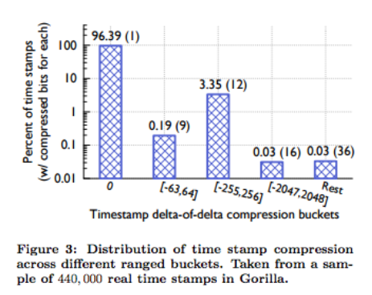

(come from [Paper](http://www.vldb.org/pvldb/vol8/p1816-teller.pdf))

##  前言:

本文會介紹最近被討論的 Facebook [時間序列資料庫的論文](http://www.vldb.org/pvldb/vol8/p1816-teller.pdf)，並且會介紹資料庫壓縮演算法． 其中不少解讀都是參考 [Morning Paper](https://blog.acolyer.org/) 裡面的[論文導讀](https://blog.acolyer.org/2016/05/03/gorilla-a-fast-scalable-in-memory-time-series-database/)．

最後會導入 [Damian Gryski](https://github.com/dgryski) 根據論文推導出的演算法 [dgryski/go-tsz](https://github.com/dgryski/go-tsz) ．
 
 <br><br>
 
## 原始論文:

### [Gorilla: A Fast, Scalable, In-Memory Time Series Database](http://www.vldb.org/pvldb/vol8/p1816-teller.pdf)

<br><br>

## 導讀:

###  什麼是 Gorilla ?

Gorilla 是 Facebook 開發的時間序列資料庫．其實市場上已經有很多的時間序列資料庫 (HBase on TSDB(time-series database)) ，為什麼還需要自己開發一個呢?

- 資料的儲存過於龐大
- 查詢的延遲過長

所以 Gorilla 針對這些有了以下的優化:

- 針對 timestamp 的壓縮
- 分析並且針對資料的壓縮
- 放在記憶體 (in-memory databse)


### 那麼 Gorilla 比起一般的時間序列資料庫究竟有多強大呢?

透過將時間與數值的壓縮，並且透過儲放在記憶體的操作． Gorilla 可以達到:

- 73 倍的 Query Latency 減少
- 14 倍的 Query Throughput 增加

為了要儲存到 26 小時以上的時間序列資料，並切壓縮到 1.3 TB 的記憶體之中(分散在 20 部伺服器中)．所以 Gorilla 針對儲存資料有相當程度的壓縮．

透過資料的壓縮最佳狀態可以達到:


(come from [Paper](http://www.vldb.org/pvldb/vol8/p1816-teller.pdf))


####  高達 12 倍的壓縮比: 原先 16 bytes 的數值資料(包括 timestamp 與 value )透過壓縮，一般而言平均可以達到 1.37 bytes (通常在經過 240 分鐘後) 


### 12倍的壓縮比？ 那麼大的壓縮比是如何做到?

簡單的來說 Gorilla 透過將時間資料( timestamp )與數值資料( value ) 的壓縮． 其壓縮的方式是參考前一次的資料，透過時間序列資料庫的特性:

- 連續性資料
- 在比較小的取樣時間中，每筆資料間的變化不大

透過這樣的方式，可以拿目前的資料 $$t_n$$ 去與前一筆資料 $$t_(n-1)$$ 比對的方式， 來拿到差異值 (delta) ．並且將差異值做一定程度的壓縮． 達到整個資料庫數值的壓縮．

### 壓縮的演算法: 關於時間資料的壓縮

首先針對時間資料的壓縮部分，讓我們先看看以前的時間可能如何紀錄: (舉例)

- $$t_0$$  => 02: 00 : 00
- $$t_1$$  => 02: 01 : 02
- $$t_2$$  => 02: 02 : 02
- $$t_3$$  => 02: 03 : 02

如果要直接紀錄的話，其實資料長度會變得相當大． 讓我們換個角度來看:

- $$t_0$$  => 02: 00 : 00 (跟之前差距 0)
- $$t_1$$  => 02: 01 : 02 (跟之前差距 62 秒)
- $$t_2$$  => 02: 02 : 02 (跟之前差距 60 秒)
- $$t_3$$  => 02: 03 : 02 (跟之前差距 60 秒)

這樣紀錄 `delta` 只要紀錄差異就好，那有可能更簡短嗎？


- $$t_0$$  => 02: 00 : 00 (跟之前差距 0)
- $$t_1$$  => 02: 01 : 02 (跟之前差距 62 秒)
- $$t_2$$  => 02: 02 : 02 (跟之前差距 60 秒，跟上一個差距的差異 `-2` 秒 )
- $$t_3$$  => 02: 03 : 02 (跟之前差距 60 秒,跟上一個差距的差異 0)

這個概念就是紀錄 `delta of delta`，也就是**差距中的差異**．

將 **差距中的差異**  以字母 $$D$$ 來代替，透過 `Tag Bit` 與 `Value Bits` 來表示．


(Pic: from [Morning Paper](https://blog.acolyer.org/2016/05/03/gorilla-a-fast-scalable-in-memory-time-series-database/) )

轉換之前的範例為:

- $$t_0$$  => 02: 00 : 00 => D = 0, tag bit `0`.
- $$t_1$$  => 02: 01 : 02 => D = 62, tag bit `10`, value 62 (`011 1110`) 總共 9 bits
- $$t_2$$  => 02: 02 : 02 => D = -2, tag bit `10`, value -2 (`111 1101`) 總共 9 bits
- $$t_3$$  => 02: 03 : 02 => D = 0, tag bit `0` 總共 1 bit

這樣就可以節省不少空間來儲存時間資料．



(come from [Paper](http://www.vldb.org/pvldb/vol8/p1816-teller.pdf))

這張圖，顯示了大部分的時間資料的分佈． 可以透過這張圖看到，不少的時間差異的差距 (delta of delta) 其實都是屬於 `0` (具有 96%)．

也就是說經常兩兩儲存的時間差距是相同的，這樣的話其實可以不需要儲存那麼繁瑣的時間資料．而透過一個方式來儲存．


### 壓縮的演算法: 關於時間資料的壓縮 (程式碼)

```go
func (s *Series) Push(t uint32, v float64) {
	s.Lock()
	defer s.Unlock()

	if s.t == 0 {
		// first point
		s.t = t
		s.val = v
		//s.T0 是第一筆時間資料
		//s.tDelta 就是前兩筆的差異
		s.tDelta = t - s.T0
		s.bw.writeBits(uint64(s.tDelta), 14)
		s.bw.writeBits(math.Float64bits(v), 64)
		return
	}

	//tDelta 就是現在的目前的時間跟上一次時間的差異
	tDelta := t - s.t
	//dod (Delta of Delta): 就是 (tn - t(n-1) ) - (t(n-1) - t(n-2) )
	dod := int32(tDelta - s.tDelta)

	//透過 dod 來放置 tag but 䢎 vakye
	switch {
	case dod == 0:
		s.bw.writeBit(zero)
	case -63 <= dod && dod <= 64:
		// 放置 tag bit
		s.bw.writeBits(0x02, 2) // '10'
		// 放置 value bit
		s.bw.writeBits(uint64(dod), 7)
	case -255 <= dod && dod <= 256:
		s.bw.writeBits(0x06, 3) // '110'
		s.bw.writeBits(uint64(dod), 9)
	case -2047 <= dod && dod <= 2048:
		s.bw.writeBits(0x0e, 4) // '1110'
		s.bw.writeBits(uint64(dod), 12)
	default:
		s.bw.writeBits(0x0f, 4) // '1111'
		s.bw.writeBits(uint64(dod), 32)
	}
	
	...
```

(code from [https://github.com/dgryski/go-tsz/blob/master/tsz.go](https://github.com/dgryski/go-tsz/blob/master/tsz.go#L69) )	


<br><br><br>


### 壓縮的演算法: 關於數值資料的壓縮

到數值的部分，一樣使用之前的概念．也就是 `delta of delta` 的概念來處理數值壓縮．而差異的部分不再使用 `minus` 而是透過 `XOR`  的方式．


(come from [Paper](http://www.vldb.org/pvldb/vol8/p1816-teller.pdf))

將以上的資料做個簡單的 XOR 運算，來計算數值資料中的差距:

- $$v_1$$ 12 -> `0x40280` -> XOR: N/A
- $$v_2$$ 24 -> `0x40380` -> XOR: `0x00100`
- $$v_3$$ 15 -> `0x402e0` -> XOR: `0x00160`
- $$v_4$$ 12 -> `0x40280` -> XOR: `0x00060`
- $$v_5$$ 12 -> `0x40280` -> XOR: `0x0`

計算好各個數值資料間的 XOR 之後，我們要來針對這樣的資料壓縮:


(Pic: from [Morning Paper](https://blog.acolyer.org/2016/05/03/gorilla-a-fast-scalable-in-memory-time-series-database/) )

針對以上的圖片，主要壓縮方式如下:

假設計算數值，如下

- $$v_2$$ -> XOR: `0x001000000000000`
- $$v_3$$ -> XOR: `0x001600000000000`

<br><br>

#### 計算各個數值 XOR 的 leading/meaning/trailing bits


- $$v_2$$ -> XOR: `0x001000000000000`, 
	- leading bit: 2
	- meaningful bit: 1
- $$v_3$$ -> XOR: `0x001600000000000`
	- leading bit: 2
	- meaningful bit: 2

其中:

- Leading Bit: 就是 XOR 遇到第一個非零數值"前"的 零 的個數
- Meaningful Bit: 中間所有非零的個數


<br><br>

#### 計算 control bit ，其規則如下:

- 如果 XOR 是 `0`, control bit = `0`
- 如果 XOR 不是 `0`, control bit = `1`，並且透過以下方式來計算下一個 control bit
	- Leading bit, Meaningful bit 個數相同，但是其中 Meaningful 數值不同． Control Bit `0` ，接下來是 Meaningful value.
	- 如果 Leading bit 跟 Meaningful 個數與數值不同， Control bit `1` ．並且接下來存放資料:
		- 5 bits: 放 Leading bit 個數
		- 6 bits: 放 Meaningful bit 個數
		- 放置所有的 Meaningful bit 數值．

<br><br>

#### 拿個範例拿來做壓縮範例:

會拿以下的數值來做壓縮運算，真實數值比較大這邊只做範例：

- $$v_1$$ 12 -> `0x40280` -> XOR: N/A
- $$v_2$$ 24 -> `0x40380` -> XOR: `0x00100`
- $$v_3$$ 15 -> `0x402e0` -> XOR: `0x00160`
- $$v_4$$ 12 -> `0x40280` -> XOR: `0x00060`
- $$v_5$$ 12 -> `0x40280` -> XOR: `0x0`

經過計算後:

- $$v_1$$ : treat XOR : `0x40280`
	- Control bit: `11` (bit)
	- Leading bit: `00000` (bit)
	- Meaningful bit: `00101` (5 bit)
	- Meaningful value: `0x40280`
- $$v_2$$ : XOR : `0x00100` 上一個 XOR: `0x40280`
	- Control bit: `11` (bit)
	- Leading bit: `00000` (bit)
	- Meaningful bit: `00101` -> 5 (bit)
	- Meaningful value: `0x40280`
- $$v_2$$ : XOR : `0x00160 ` 上一個 XOR: `0x00100 `
	- Control bit: `10` (bit)
	- Leading bit: `00010` -> 2 (bit)
	- Meaningful value: `0x160`
- $$v_4$$ : XOR : `0x00060 ` 上一個 XOR: `0x00160 `
	- Control bit: `11` (bit)
	- Leading bit: `00011` -> 3 (bit)
	- Meaningful bit: `00010` -> 2 (bit)
	- Meaningful value: `0x60`

### 壓縮的演算法: 關於數值資料壓縮的程式碼:

```go
func (s *Series) Push(t uint32, v float64) {
	...
	
	//計算 XOR 數值
	vDelta := math.Float64bits(v) ^ math.Float64bits(s.val)

	// 如果 XOR ==0
	if vDelta == 0 {
		//只寫一個 Bit `0`
		s.bw.writeBit(zero)
	} else {
		//如果是零，先寫入第一個 control bit `1`
		s.bw.writeBit(one)

		//計算 leading 跟 trailing 個數
		leading := uint8(bits.Clz(vDelta))
		trailing := uint8(bits.Ctz(vDelta))

		// clamp number of leading zeros to avoid overflow when encoding
		if leading >= 32 {
			leading = 31
		}

		// TODO(dgryski): check if it's 'cheaper' to reset the leading/trailing bits instead
		
		// leading 跟 trail 相同，但是 meaningful 數值不同
		if s.leading != ^uint8(0) && leading >= s.leading && trailing >= s.trailing {
			//寫入第二個 control bit `0`
			s.bw.writeBit(zero)
			//寫入meaningful value
			s.bw.writeBits(vDelta>>s.trailing, 64-int(s.leading)-int(s.trailing))
		} else {
			s.leading, s.trailing = leading, trailing

			//連 leading 都不相同，落入其他 case
			//寫第二個 control bit `1`
			s.bw.writeBit(one)
			//寫入 leading 個數
			s.bw.writeBits(uint64(leading), 5)

			// Note that if leading == trailing == 0, then sigbits == 64.  But that value doesn't actually fit into the 6 bits we have.
			// Luckily, we never need to encode 0 significant bits, since that would put us in the other case (vdelta == 0).
			// So instead we write out a 0 and adjust it back to 64 on unpacking.
			sigbits := 64 - leading - trailing
			//寫入 meaningful bit 個數
			s.bw.writeBits(uint64(sigbits), 6)
			//寫入 meaningful value
			s.bw.writeBits(vDelta>>trailing, int(sigbits))
		}
	}
	
	...
```

(code from [https://github.com/dgryski/go-tsz/blob/master/tsz.go](https://github.com/dgryski/go-tsz/blob/master/tsz.go#L103) )	


### 數值資料壓縮的成果計算:


(come from [Paper](http://www.vldb.org/pvldb/vol8/p1816-teller.pdf))


經過論文中計算，一般而言透過 XOR 計算過後．有 59%的數值資料都會落入 `0` 也就是說跟前一個數值相同． 另外 control bit `10` 的 case 會達到 28.3 % ．最後比較長 (可能) 的 control bit `11` 的 case 只有 12 % ．

這個表格也表示，透過這樣的壓縮有效的將數值資料可以做一定程度的壓縮．


## 心得:

這篇論文其實很棒，也是我第一篇透過 "Morning Paper" 來看懂的第一篇論文．我相信 Gorilla 對於資料壓縮的方式，對於之後如果有機會處理 Streamming Data 或是針對 時間序列資料庫的處理都會有更有效率的方式．

## 參考

- [HBase Open TSDB Data Schema](http://opentsdb.net/docs/build/html/user_guide/backends/hbase.html)
- [Morning Paper 英文論文導讀](https://blog.acolyer.org/2016/05/03/gorilla-a-fast-scalable-in-memory-time-series-database/)
- [Gorilla 壓縮演算法 Golang 實作](https://github.com/dgryski/go-tsz)