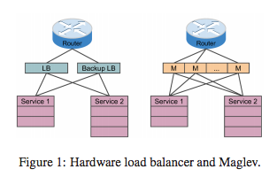
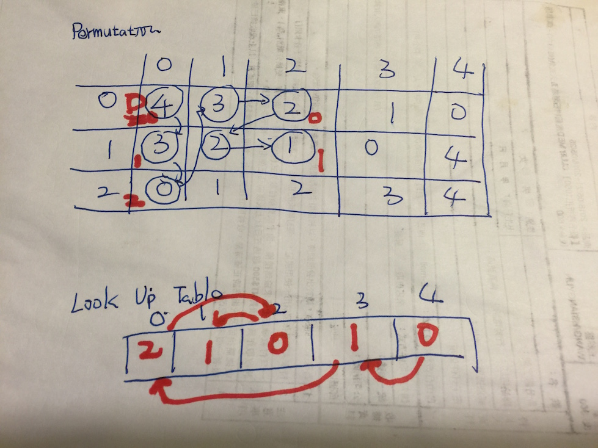

## 前言 （為何想讀這一篇論文)

這一篇論文吸引我注意的原因是， [Consistent Hashing](https://en.wikipedia.org/wiki/Consistent_hashing) 本來的特性就是作為  Distributed Caching 之用． 但是 Google 將他們的 Load Balancer (代號: Maglev ) 公布他的實作方式，裡面並且將 Consistent Hashing 做了一些小改版來符合他們的需求．

由於我之前就有學習過 [Consistent Hashing](https://github.com/kkdai/consistent) ，所以相當好奇 Google 能夠如何地將它更進一步地做提升． 就想要閱讀這一篇論文． 

本篇導讀主要內容如下:

- 介紹 Maglev 的特性與其改善的部分
- 回顧 Consistent Hashing
- 介紹 Maglev Hashing

<br><br>

## 原始論文

### [Maglev: A Fast and Reliable Software Network Load Balancer](http://static.googleusercontent.com/media/research.google.com/zh-TW//pubs/archive/44824.pdf)

<br><br>

## 導讀

### 什麼是 Maglev?

Maglev 是 Google 的軟體 Load Balancer ，不像是一般硬體的 Load Balancer ， 他可以運行在一般的 Linux 機器上面． Maglev 在 Google 內部已經運行了超過 六年 ( since 2008 ) ．一台 Maglev 可以處理 10Gbps 的小封包連結．

<br>

### Maglev 主要的功能與特色

Maglev 作為 Google 內部的高效能軟體 Load Balancer ，他有以下兩個主要功能：

- 新的 Consistent Hashing Algorithm 稱為 **Maglev Hashing**
- Connection Tracking

<br>


### 回過來講，那什麼是 Consistent Hashing ?


講到 Consistent Hashing 就必須要提到原本 distributed caching 的運作是靠 Hash Table 的方式來達成，比如說:

- 來源 ip : `1.2.3.4` 透過將來源 ip 做 Hashing 過後指向 `server1`
- 來源 ip : `1.2.3.5` 透過將來源 ip 做 Hashing 過後指向 `server2`
- 來源 ip : `1.2.4.6` 透過將來源 ip 做 Hashing 過後指向 `server3`

依照原先的設計如果 `server1` 發生了故障，那麼不論如何 `1.2.3.4` 就無法連接到任何一個伺服器．

於是 Consistent Hashing 就是在這裡發揮效果． 根據[定義](https://en.wikipedia.org/wiki/Consistent_hashing) Consistent Hashing 為一個**排序的**環狀的表格，上面根據 Hashing 的數值來存放不同的節點資訊，並且需要滿足以下兩個條件:


- **Minimal Disruption** : 這邊指的就是如果有節點被刪除，應該要達到只有該節點影響到的部分要修改而已． 在 Consistent Hashing 裡面透過選取下一個的方式． 透過將索引排序後，直接選取下一個節點作為 Hashing 後的結果節點．簡單的範例如下:
	- 來源 IP 位置 `1.2.3.4` ，經過 Hashing 後得到位置 1024 (假設) 
	- 到表格 1024 查詢資料，發現 1024 的節點伺服器 `server1` 已經出現故障．
	- 尋找 1024 最接近的下一個節點 （假設是 1028 ) 並且對應到 `server2`
	- 分配 `server2`


- **Load Balancing** : 也就是盡可能地讓每個節點都能運用到，不會有某些節點有過分運用的疑慮． 在 Consistent Hashing 裡面是使用 Virtual Node ．
	- 簡單的說，也就是在加入節點的時候，會一併複製數個虛擬節點 (通常使用 `節點#1, 節點#2 ... ` 命名方式．
	- 透過多個虛擬節點散佈在各地，讓尋找的時候更容易平均的分配到不同的節點．


<br>

### 對於 Maglev 而言，原本的 Consistent Hashing 有哪些缺點（限制)？

雖然 Consisten Hashing 本身已經解決了許多的問題，但是對於 Google 而言，他們有以下兩個額外的部份需要考量：

- **需要更均勻地分配每隔節點位置**： 由於 Google 的每個節點可能都是數百台的機器，由於來源資料龐大，根據舊的演算法可能需要相當大的 lookup table 才能負荷．
- **需要更減少 Disruption** : 對於 Google 的需求，演算法需要容忍小量的 disruption ．

<br>

### 關於 Maglev Hashing Algorithm 的介紹

根據以上兩個需要額外考量（應該說是要更加強化）的部分， Google 提出了新的 Consistent Hashing 的演算法，稱為 **Maglev Hashing Algorithm**

#### 主要概念: 新增 Preference List 概念

Preference List (偏好清單) 會分配給每一個節點，讓每一個節點去填上自己**偏好的位址( Permutation )**．直到整個表格是填滿的狀態．

<br>

#### 效能:

這裡需要注意，如果 $$M$$ 相當接近 $$N$$ 的話，整體效能很容易落入最差狀況．

但是如果 $$M >> N$$ ，比較容易將效能落入平均的狀況．

- 平均狀況: $$ O(M log M) $$
- 最差狀況: $$ O(M^2) $$

其中：

-  $$M$$ 是表示 lookup table 的大小．
-  $$N$$ 是表示 節點的個數．

<br>

#### 流程:


- 首先 Maglev Hashing 會先把所有的 Preference List 產生出來．
- 透過產生好的 Preference List 開始將節點一個個地加入並且產生出Lookup table


<br>

### 程式碼分析:

#### 計算 "排列表格" Permutation Table

以下先簡單列出 `generatePopulation()`，主要目的就是建立 permutation table 也就一個排列組合的表格．

```go
//name is the list of backend.
func generatePopulation() {
	//如果 []name 是空的就離開
	if len(name) == 0 {
		return
	}

	for i := 0; i < len(name); i++ {
		bData := []byte(name[i])

		//計算 offset 透過 Hash K1
		offset := siphash.Hash(0xdeadbabe, 0, bData) % M
		//計算 skip 透過 Hash K2
		skip := (siphash.Hash(0xdeadbeef, 0, bData) % (M - 1)) + 1

		iRow := make([]uint64, M)
		var j uint64
		for j = 0; j < m.m; j++ {
			//排列組合的表格
			iRow[j] = (offset + uint64(j)*skip) % M
		}

		permutation = append(permutation, iRow)
	}
}

```

由於 `M` 必須是一個 prime number （如果不給 prime number ，找出的 permutation 就會有重複值) ，舉例 `M=7` 這個函式就會產生可能是 `[3, 2, 5, 6, 0, 4, 1]` 或是 `[0, 5, 6, 4, 2, 3, 1]` ． 這樣的排列表格是為之後使用的．


#### 產生查表表格(Lookup Table)

論文中的 Populate Maglev Hashing lookup table 的 Golang 程式碼．

這邊有兩個表格:

- `entry`:  代表表格中有沒有走過．架設 lookup table 大小為 7，就得 0 ~ 6 都走過一次． （不然為 -1)．而最後裡面的數值就是節點的索引．
- `next`:   代表排列表格的下一個位置．如果節點有三個，那麼排列表格就有三組．於是 `next` 大小也有三個，分別記錄每一個排列表格走到第幾個位置．

#### 範例資料


```
unc (m *Maglev) populate() {
	if len(m.nodeList) == 0 {
		return
	}

	var i, j uint64
	next := make([]uint64, m.n)
	entry := make([]int64, m.m)
	for j = 0; j < m.m; j++ {
		entry[j] = -1
	}

	var n uint64

	for { //true
		for i = 0; i < m.n; i++ {
			c := m.permutation[i][next[i]]
			for entry[c] >= 0 {
				next[i] = next[i] + 1
				c = m.permutation[i][next[i]]
			}

			entry[c] = int64(i)
			next[i] = next[i] + 1
			n++

			if n == m.m {
				m.lookup = entry
				return
			}
		}

	}

}

```

以下用簡單的範例資料，希望能夠讓大家更容易了解．

```
N = 3
M = 5

m.permutation [0] = [4, 3, 2, 1, 0]
m.permutation [1] = [3, 2, 1, 0, 4]
m.permutation [2] = [0, 1, 2, 3, 4]

```

透過這個範例，建立出 Lookup table  的方式如下：

- 將剛剛建立出的排列表格拿出來
- `i=0` ，從第一個排列表格的第一個挑出數值  `c1=4` ，那麼 `entry[4] = 0` (代表 lookup table 中的 `entry[4]` 是指向節點 `0`．
- `i=1` ，從第二個排列表格的第一個挑出數值  `c2=3` ，那麼 `entry[3] = 1`
- `i=2` ，從第三個排列表個的第一個挑出數值  `c3=0` ，那麼 `entry[0] = 2`
-  重跑 `i` 迴圈， `i=0` ． 從第一個排列表格的第二個( index=1 )挑出數值 `c4=3` ，由於 `entry[3]` 走過了，往後走一個 （`next[0] +1`) 走到 `m.permutation[0][2]=2`， 於是 `entry[2]=0`
-  依此類推，直到所有的 `n == M` ．此時，也會發現 `entry[]` 不再存在任何 `-1`

詳細走法如下圖:



## Maglev Hashing 跟 Consistent Hashing 的比較

*這部分比較屬於我的心得，建議各位看完論文後再看這段．*

- Consistent Hashing
	- 準備工作:
		- 將每個節點數值根據 Hashing key 加入 lookup table
		- 製作出 Virtual Node 來達到平衡．
	- 如何查詢:
		- 將數值透過 Hash Key 對應到一個 lookup table 的索引 index
		- 如果該 index 沒有節點，往下尋找最接近的節點
- Maglev Hashing
	- 準備工作:
		- 需要先建立一個排列表格
		- 並請需要先 透過排列表格做出偏好清單．注意這時候所有 lookup table 每一個索引都有一個節點分配．
	- 如何查詢:
		- 數值透過 Hash Key 對應到一個 lookup table 的索引 index
		- 由於準備工作，該 index 必定存在數值
		- 傳回節點資料


## 完整程式碼

這邊有我的完整程式碼，大家可以參考一下： 

### [https://github.com/kkdai/maglev](https://github.com/kkdai/maglev)

## 參考

- [Wiki Consistent_hashing](https://en.wikipedia.org/wiki/Consistent_hashing)
- [Go implementation of maglev hashing](https://github.com/dgryski/go-maglev)
- [每天进步一点点——五分钟理解一致性哈希算法(consistent hashing)](http://blog.csdn.net/cywosp/article/details/23397179)
- [Distributed Systems Part-1: A peek into consistent hashing!](https://loveforprogramming.quora.com/Distributed-Systems-Part-1-A-peek-into-consistent-hashing)