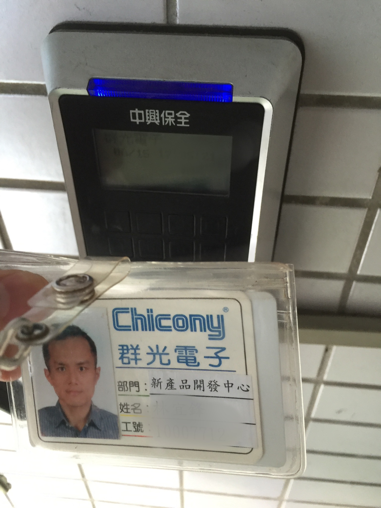

打完卡後，就要離開群光電子．
在這兩年多，不務正業的完成以下目標:

0. 有一個可愛的女兒(滿足...)
1. 完成 8 堂 MOOCs (本想一年 10 堂，但是硬生生拖了兩年還是上不完)
2. 程式語言 Scala, Swift, Golang, Ruby， R 學習． Python 算複習． ObjC / Android 工作上的就不算了．
3. 完成了 Project 52 (眼淚...)
4. 將要站上 COSCUP 講者台 (順便也將要站上 Morden Web)
5. 讀了 4 篇非工作上的相關論文 (Paxos, Raft, Gorrila, Maglev)
6. 很開心地加入了碼天狗，認識很多厲害的大大．

勇敢邁向下一步吧... 我是這麼想著..
