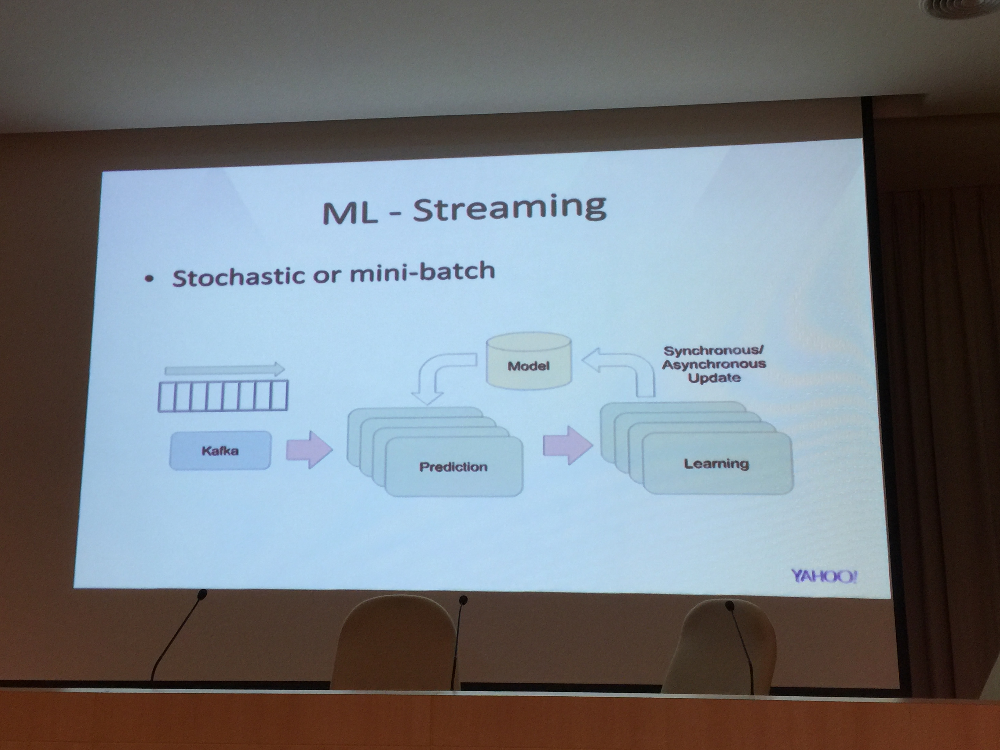
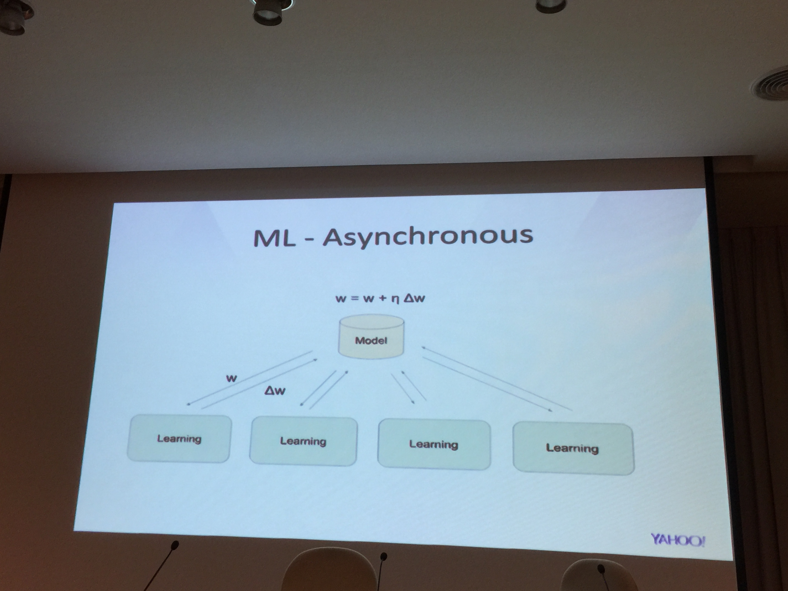

## 前提:

今年是第三年參加 COSCUP ，其實也有些時候沒有參加任何的研討會．大概是因為已經給自己立定想法，必須要有想辦法當講者才能參加的信念． 

而今年 COSCUP 我覺得議題都很不錯，可惜我因為要顧小孩只能參加第二天的場次（也是因為自己的場次在第二天）．

## 參與場次:

### Evan Lin -  Project 52 每週一個小專案來學習Golang

#### Slide:

<iframe src="//www.slideshare.net/slideshow/embed_code/key/JvzhM8oH6mRhnD" width="595" height="485" frameborder="0" marginwidth="0" marginheight="0" scrolling="no" style="border:1px solid #CCC; border-width:1px; margin-bottom:5px; max-width: 100%;" allowfullscreen> </iframe> 
 <strong> <a href="//www.slideshare.net/EvansLin/coscup-2016-project-52-for-golang" title="COSCUP 2016: Project 52 每週一個小專案來學習 Golang" target="_blank">COSCUP 2016: Project 52 每週一個小專案來學習 Golang</a> </strong> from <strong><a target="_blank" href="//www.slideshare.net/EvansLin">Evan Lin</a></strong> 

詳細的 [Hackpad 在這裡](https://coscup.hackpad.com/2016-day2-h0#2016-day2-h0)，不少同學有做了一些筆記 ．

#### 影片:

[鏈結在這裡](https://livehouse.in/embed/channel/coscup2016h0/record/41A7e7z5bL?t=1h14m38s)

#### 講者心得:

第一次參與大型研討會，加上是 H0 有點大 XD ，說不緊張是不可能的． 一緊張就容易講得快，所以大概在 25 分鐘就把所有 slide 都講完了． 後面的時候還好有 appleboy 的救援與講解一些心得． 

以下整理一些心得:

- 盡量準備多一點的 slide ，往往一張 slide 很難講到一分鐘．所以基本上應該要兩倍以上．
- 每張 slide 之間需要讓自己喘一口氣，避免讓台下的人也吸收不良．
- 如果想講一些 "木更" 也請記得慢慢講，讓台下的人有時間笑 (或是不笑 orz )

身為講者，其實都會很希望能跟聽眾互動．如果沒有辦法提問題，就算是結束後，你來講一句話也好．也期勉自己以後參加任何研討會都要想辦法跟講者互動．

### Appleboy - 用 Golang 寫 Microservice

### slide: 

<iframe src="//www.slideshare.net/slideshow/embed_code/key/xyazpMY7enAZjz" width="595" height="485" frameborder="0" marginwidth="0" marginheight="0" scrolling="no" style="border:1px solid #CCC; border-width:1px; margin-bottom:5px; max-width: 100%;" allowfullscreen> </iframe> 
 <strong> <a href="//www.slideshare.net/appleboy/write-microservice-in-golang" title="Write microservice in golang" target="_blank">Write microservice in golang</a> </strong> from <strong><a target="_blank" href="//www.slideshare.net/appleboy">Bo-Yi Wu</a></strong> 

### 影片:

[鏈結在這裡](https://livehouse.in/embed/channel/coscup2016h0/record/41A7e7z5bL?t=2h15m40s)

### 心得：

這場是我當主持的， Appleboy 幫我把許多 Golang 的概念與基礎介紹都講得相當清楚．如果你想了解如何寫 Golang ，很建議好好的閱讀他的 slide ．

### Jason Lin, Sas Chen - A High Scale ML Platform Using SPARK and KAFKA

### 內容:

擷取自 Hackpad (其實不少都是我打的 :p )

#### Batch Processing

- Recommendation
	- Alternating Least Sq
	- Log Regression
	- GBDT
	- Clustering 
	- Top-k rank
- Text mining
	- naive bayes
	- latent dirichlet allocation 
	- word2vec

- Streaming Data
	- Original:
		- product id -> get inventory -> update inventory 
	- Using multiple thread:
		- Cannot promise the threading ordering. 
- Kafka also requires key partitioning
	- Using product ID hash as key

- How to determine if your Kafka scalable

#### ML
- Synchronous:
	- Get w, update back w'
- Asynchronous
	- Get w, update delta w.

### Davide Casali / Tammie Lister -  Designing Inclusive Open Source Communities

### 影片：

[鏈結在這裡](https://livehouse.in/embed/channel/coscup2016h0/record/VyFJuBG5ZL?t=1h14m29s)

### 心得:

兩位來自 WordPress 公司的人來講解如何建立一個開源程式碼社群． 裡面提到很多的概念，都相當的棒． 不過聽的人不太多，真是可惜． 

主要內容都是當你的開源專案慢慢受到注意的時候，你該如何的分別主要開發者 (core lead team) 還有貢獻者 (contributors) ．

如何參與開源專案的貢獻：

- 先了解每個專案的指南
- 可以試著問 issue 或是直接幫忙寫文件（應該會是最受歡迎的 PR :p)
- 幫忙翻譯
- 對於開源專案的貢獻絕對不僅僅是程式碼．可以是文件，可以是幫忙行銷．幫忙推廣都算是貢獻的一種．

並且如何去鼓勵每個參與者來積極的供獻你的開源專案，關於這部分有提到一些：

- 建立良好的指南，讓每個貢獻者覺得簡單並且受到重視．
- 對於每個貢獻者，絕對不要客氣地提到並且誇獎他們．
	- 可以透過 Badge
	- 當有任何 Release ，記得提到所有貢獻者．（就算只是問問題，寫個 README 的）
	- 針對不同團隊來提到每個貢獻者．（如果有幫忙推廣的，也請記得提到）
	- 不論如何，只要有幫助開源專案的人，都得想辦法提到他們讓他們有參與感．

#### 以下部分截自 Hackpad (其實是我寫的)

- Culture Problem
	- Timezone
- Power Problem
	- Decision problem is in the code
	- Decision making
	- Personalities
- Diversity
	- Kinds of diversity (age, gender ...)

- Persona
- Core team growth
- Delegate 
- Onboarding
	- Feel welcome
	- Encourage how to contribute
- Many ways to contribute
	- Most easy way : write documentation
	- Improve existing ticket (make it more valuable)
	- Translation
- Transparency
	- Discussion in the open
	- Meeting etiqutte
		- Call for topic
		- Archive whole discussion

- Credit
	- Not only commit, but also contribution. 
	- Profile Badges (coder, translator...)
	- Show contribution history.

- Open to Failure
	- Admin your failure
	- Show people who failure but still can participate

Q&A:

- Q1: Who has the right the apply huge change?
	- A: 
		- Depends on project side, could be project leader.
		- Vote could be leading team who has bigger view of project.

- Q2: How to reject some PR you may not want to (nicely)?
	- A:
		- Some PR may wrong but come from great institute. Try to understand it.
		- Try to understand the PR

## 參考鏈結

- [COSCUP 2016 HackFolder](http://hackfoldr.org/coscup2016/)
