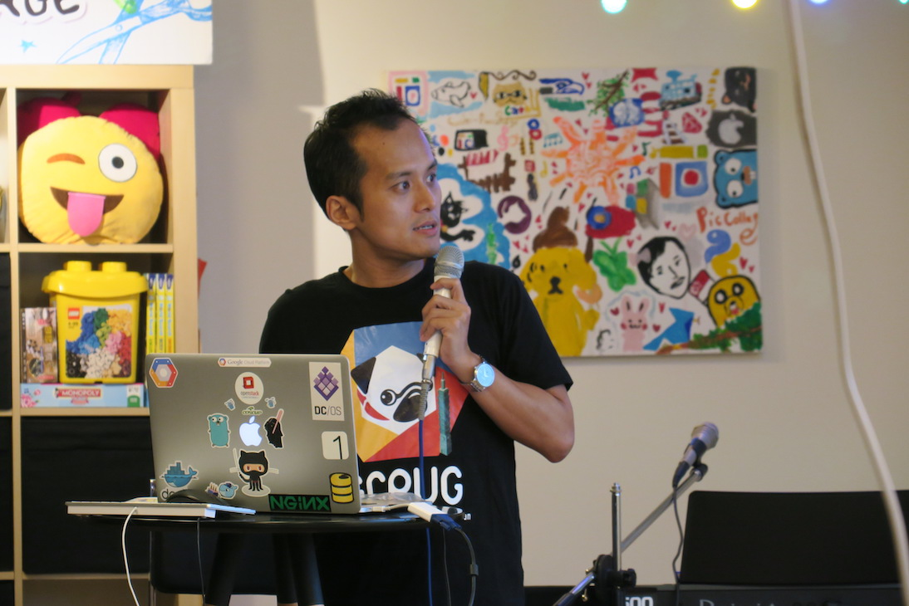

(照片拍得真好，感謝專業大師 [gtg16](http://golang.kktix.cc/events/gtg16)）

終於順利把 Golang 社群活動成功地重新啟動，也順利完成主辦了 [GTG#16](http://golang.kktix.cc/events/gtg16) 的聚會 ．心裡其實有不少感受想分享給大家．

## 起源

*你啟發的人會有幾個，是一個兩個？ 還是很多很多?*

離開 Corel 後的兩年間，其實參加過不少的研討會，當然也有參加不少的社群聚會． 舉凡: Docker Taipei, Python Tapei, Golang TW 等等．

但是，其實讓我印象很深刻的就是第一次在 [Golang 社群](http://golang.kktix.cc/) 發表的 [Lightning Talk](http://www.slideshare.net/EvansLin/project52)．  也就是剛開始準備 [Project 52](https://github.com/kkdai/project52) (當時寫到 Week 13 ) 的一個 Lightning Talk．

還記得那一次的報名，只是想要試試看分享自己 [Project 52](https://github.com/kkdai/project52) 的決心． (當然絕大部分的原因是因為沒有搶到票） 

膽戰心驚的花了十分鐘講完了（那霎那... ）馬上忘記整個十分鐘講了什麼 XDDD ． 於是要準備收包包回家得時候，就有個人跑來跟我用英文交談． 

(太神奇了，原來 Golang 可以將中文投影片轉譯成英文 XD ) 

反正我們交談的內容大約是: 他剛從香港來台灣找前端的工作．結果看到我在 Golang 分享 [Project 52](https://github.com/kkdai/project52) 的想法大受啟發，他說他希望也能夠感染我的熱情好好的來學習一下 Golang (雖然他是前端工程師） ．並且也好奇的詢問我，到底需要多久的時間才能熟悉 Golang ．

		很多時候，當你啟發別人的時候．其實，最受到啟發的將會是你自己．

原來，開源的專案不僅僅開啟了我自己的眼界與心態．由於我的分享，更有可能啟發別人進而讓別人也能有相同的感受．

## 大研討會時代 

就是上個月，我不小心一次報名同一個禮拜的兩個研討會． 分別是 COSCUP 跟 Modern Web 2016  ， 雖然要準備兩份投影片讓我七月底到八月每天半夜都熬夜趕投影片．但是想到如果有機會能夠讓其他人感受到我自己心中的熱情，進而改變他們的想法或是面對事情的態度，我就又打起精神來努力做投影片．

### 第一次大型研討會： COSCUP 2016 H0 會議室

還好，一切都還算順利． 雖然 COSCUP 講得太快而 Modern Web 卻又講得太慢． （是哪招？）  但是在 COSCUP 發生了印象很深刻的一些小事如下:

- 認識了不少原來在臉書上面看到的人
- 有個部落格讀者在我前往廁所的路上堵到我，然後跟我說有長期訂閱我部落格． 也有鼓勵我說，希望我繼續寫下去．（還好，我尿急應該沒有顯現出來 XD ）
- 不少攤位的人，看到我的臉就問我說．你是不是那個要講 Golang ( 原來我長得像 Gopher (驚!) )

		有人問我 COSCUP 上台到底會不會緊張？ 如果你是來分享你喜歡的事物．你會緊張嗎？

### 第二次研討會： 認識人跟聊天比聽講多的 Modern Web

身為講者最大的好處，大概就是不斷地認識其他的講者． 可能也由於講者們本身的個性就是屬於樂於分享的人．（不然也不會來研討會講） 於是乎，大家很容易就能夠打成一片． 整個研討會也變成很像是來認識人一樣．

## Golang 社群重裝上陣

開完了幾個研討會，也想把 Golang 社群好好的經營起來．希望能讓更多人使用這個語言． 當然也不希望我講完 Lightning Talk 之後的 [GTG#15](http://golang.kktix.cc/events/gtg15) 就讓社群倒了． 

於是乎，我花了很多時間開始找講者．希望能有一些講者一起來籌辦第十六次的聚會．不過事與願違，實在找不到兩個講者． 這時候公司同事的社群經營王 - Simon 就講了一句話：

		找不到講者，一開始都是自己來講的！！

就在轉眼一年前夕，我自己決定來籌辦第十六次的 Golang 聚會． 就先把之前在 Modern Web 沒有講很清楚的部分來一次講個清楚．（給自己一個交代）  另外一方面也來開始找講者． 還好，高雄有講者很彭場得願意講，只要有辦法連線．

		講者就像是專案進度一樣是靠問出來的！！

有了兩個講者後，我就印了貼紙．趕快來開售票亭開始訂票（騙人進來）．一如往常，　Golang 社群只要限定在 20 人左右就能夠秒殺．然後就可以來找閃電秀跟下一個講者． 最後，好不容易湊齊了差不多的閃電秀講者．

		Here comes the new inspiration!!!
		
記得在研討會開始的前一個禮拜，收到一封很有趣的信件．大綱是說，一個學生他並沒有搶到票．他願意捐錢給開源軟體協會來換取一張票． 這個人讓我想到在學生時代很熱血的我，於是我給他了一張閃電秀的票，並且期待他以後來分享．

當天[研討會](http://golang.kktix.cc/events/gtg16)，這位學生跑過來找我，很感謝我讓他能夠參加這次的聚會． （其實我比較感謝大家願意來參加！！）  一問之下，才知道原來還是個成大的碩士生． 什麼？ 成大碩士生跑來參加台北週二的研討會？

”對啊，這裡是高鐵票．我還特地翹下午在成大的課才能北上台北來聽研討會．“  在這個學生的眼裡，我看到滿滿的熱情．

		是洋蔥！！ 聚會的場地上有人叫了麥當勞洋蔥圈！
		
原來，受到社群啟發的熱情之火會不斷的延續下去的．希望我們經營社群得夥伴們一起努力吧！！！
