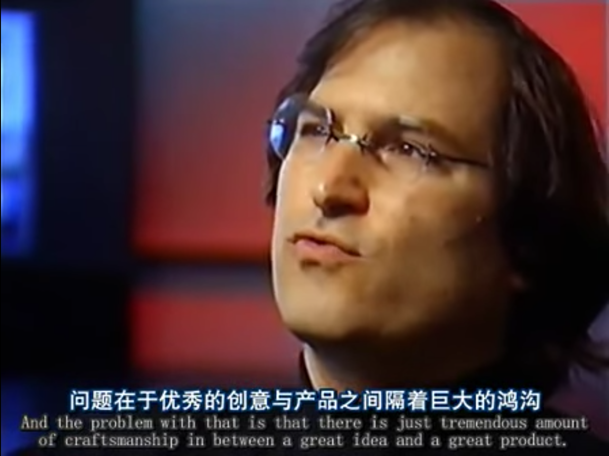

這是什麼?
-----

程式週記主要內容如下:

#### Gihub project 介紹:
- 主要會貼一些github，但是會盡量寫上一些有用的評語（或是我容易想到的關鍵詞）幫助以後查詢

#### 網路文章心得:
- 會寫些心得，強迫自己閱讀．

"程式週記"並且定期週期性更新．

大部分內容在我的[twitter](https://twitter.com/Evan_Lin)都會有，這邊只是將一些簡單的心得與感想註解一下．

本週摘要
-----

工作上許多事情排擠我學習的時間，時間太少只好犧牲掉睡眠時間來學習與寫代碼． 

	神是公平的，不論你的種族與性別．他都只給你 24 小時，你要把時間花在哪些地方，成功就在哪些地方． 
	
（半夜醒來，發現一堆大大已經在努力學習有感）
 

[下週三要有 Golang Taipei](http://golang.kktix.cc/events/gtg17) 聚會，希望大家都來參加啊． 沒有票的可以來找我拿閃電秀的票（前提是來當講者 :p )

  

Go
-----

#### [redspread/spread : Docker to Kubernetes in one command https://redspread.com](https://github.com/redspread/spread)

透過 git-like 的指令能夠部署 Docker 跟 Kubernetes ， RedSpread 提供相當方便的指令來部署你的服務．

最近 RedSpread 加入 CoreOS 了....  CoreOS 越來越多 Go 的大專案 

#### [Why you should not use iris for your Go projects](http://www.florinpatan.ro/2016/10/why-you-should-not-use-iris-for-your-go.html )

Iris 是一個號稱地表上最快的 Web Framework，擁有 5000+ star 的專案，但是想要申請 Awesome-Go 卻被 ban 掉的整個故事．  這篇文章，從多個角度建議你不應該把 Iris 當作你的專案中，故事精彩就直接看內文吧．

懶人包:

1. Iris 被 Awesome-Go 移除
2. Iris 的 Kataras 申請重新加入．
3. 被人發現把 PR 改掉，License 亂寫
4. 被 Awesome-Go 拒絕並且 Ban 掉
5. Kataras 把 Iris commit 改成只有兩個 (哪招？)
6. Kataras 修改自己在 git issue 裡面的發言 

參考 : [Awesome-Go Github PR](https://github.com/avelino/awesome-go/pull/1137)    

#### [mesosphere/mesos-dns : DNS-based service discovery for Mesos](https://github.com/mesosphere/mesos-dns)

各種 Cluster Orchestration 軟體 (mesos or kubernetes ) 都會內建一套有用的 DNS ．  Mesos 用的就是這套的 mesos-dns ，而 Kubernetes 就是會逐漸轉向使用 [SkyDNS](https://github.com/skynetservices/skydns)．

有趣的是兩套都是 Golang 寫的．

#### [go-vgo/robotgo : RobotGo,Golang Native cross-platform system automation](https://github.com/go-vgo/robotgo)

這個很實用啊．跨平台的自動化系統.. (滑鼠精靈，自動點擊）都可以用

#### 
https://github.com/campoy/go-web-workshop Francesc Campoy Google 傳教士帶來一系列的課程關於如何透過 #Golang 來建置 Web Application

#### [ASP.NET Core vs Go data ingestion benchmark](https://stefanprodan.com/2016/aspnetcore-vs-golang-data-ingestion-benchmark/?utm_source=golangweekly&utm_medium=email)

效能評比關於 Go 與 ASP .NET Core (也就是 .Net 跨平台的版本) 在 Data Ingestion 上的比較．

結論: Go 快三倍

#### [rekihattori/awesome-programmers : A list of history's greatest](https://github.com/rekihattori/awesome-programmers)

傑出程序員(捲舌音) 清單 

裡面有四個人跟 Golang 有關係

在作業系統分類中:

- Ken Thompson: Go 創始人之一，也是 C 語言的共同發明者．
- Rob Pike: Go 創始人之一，主要管理整體架構與之後發展．
- Russ Cox: 許多好用的 Go 工具都是他起頭撰寫，不論是 gofmt 還是 goimport ． 
- Brian Kernighan:  賣最好的 Go book作者 .  [書本的鏈結](http://buff.ly/2dHhYpe)

還有一個在資料庫的分類:

- [Brad Fitzpatrick](https://zh.wikipedia.org/wiki/%E5%B8%83%E8%90%8A%E5%BE%B7%C2%B7%E8%8F%B2%E8%8C%B2%E6%B4%BE%E7%BF%A0%E5%85%8B): LiveJournal 的創辦人，並且是 OpenID 制定協定的人．目前主要負責 Golang `net/http` 的相關開發．

#### [Write React Components in Go](http://bepsays.com/en/2016/10/13/react-in-go/)

如何透過 GopherJS 來撰寫 React Component ．

  

Python
-----

  

Android/JAVA/NODE.JS/Scala
-----

#### [comdan66/livemaps: LiveMaps](https://github.com/comdan66/livemaps)

LiveMaps 是一個即時地圖聊天室，城市角落的心情寫照，網站藉由 Google 所提供的 Firebase 的 Realtime Database 以及 Google Maps JavaScript API 免費服務實作。

透過 LBS 的即時聊天系統．

  

Docker
-----

  

Kubernetes
-----

#### [Running Socket.IO Applications on Kubernetes](https://deis.com/blog/2016/socket.io-applications-kubernetes/)

如何在 架設在 AWS 的 Kubernetes 上面建立一個 Socket.IO 的應用服務．

找機會改成給 GCP 的  :)

##### [Red Hat Announced Fully Containerized Red Hat Mobile Application Platform 4.2](http://blog.calsoftinc.com/industry_insights/red-hat-announced-fully-containerized-red-hat-mobile-application-platform-4-2)

Red Hat 許多動作都讓人覺得他們在 Container 架構下會越來越有發展性． 不論是 Windows Container 或是這個 Mobile Application Platform

  

iOS/Swift
-----

  

其他程式語言
-----

  

論文收集
-----

  

Machine Learning
-----

#### [AI领域，中国人/华人有多牛？](http://36kr.com/p/5054731.html?ktm_source=feed)

除卻人口比較多外，華人的論文數與影響力都不容小覷．

#### [What is POS (Part of Speech) Tagging? How can I use it?](http://www.jamiemaguire.net/index.php/2016/06/06/what-is-pos-part-of-speech-tagging-how-can-i-use-it/?preview=true)

關於 NLP 裡面如何妥善利用 Part Of Speech ．

#### [論文: Using Reinforcement Learning for Autonomic Resource Allocation in Clouds: Towards a Fully Automated Workflow](http://www.kirgizov.link/publications/Using%20Reinforcement%20Learning%20for%20Autonomic%20Resource%20Allocation%20in%20Clouds_%20towards%20a%20fully%20automated%20workflow.pdf)

這篇論文透過 Q-Learning 來做電腦資源的重配置．裡面有談到不少有趣的點子． 

主要的點子如下:

- s: Situation
- w: Workload
- u: VM (or Machines)

(s, w, u) $$->_a$$ (s, w', u')

	U' = U + a (action) 
	
其中 `a` 指的是新開的機器．

最後就是要談到 Q-Learning 中的 Reward

		R(s', a) = CO(a) + PE(s')

其中:

	CO(a): 為開啟機器的動作 a 所造成的成本
	PE(s'): 處罰，也就是改變後的情況如果依舊不滿足 SLA ．的處罰費用．

感謝同事的指導．

  

網站文章
-----

  

網站收集
-----

  

有聲書/影片心得
-----

#### Podcast: Netflix Scheduling with Sharma Podila (Mesos)

這篇文章主要訪問了 Netflix - distributed systems software architect  來討論 Netflix 如何來使用 Mesos 做 Scheduling 所有的服務．

並且透過 Matis (reactive stream processing platform) 

完整內容可以參考這篇 [Netflix 技術文章](http://softwareengineeringdaily.com/2016/10/12/netflix-scheduling-with-sharma-podila/)  

#### [Steve Jobs 遺失的訪談](https://youtu.be/xRtcvDBdu1k?t=1856)

每次看到這段，都會提醒自己不要忘記熱情

公司變得大之後，就容易因循守舊
他們認為只要遵守流程，就能夠再度奇蹟似取得成功
員工很快地... 就把遵守流程與紀律當作是工作本身...

IBM 就是如此...
他們是世界上最完善流程的公司...
員工是最守紀律的，但是他們忘記產品

Apple 也是如此 (接近 20 年前)
我們有很多擅長管理流程的人才
他們卻忽略了產品的本身...

**經驗告訴我，優秀的人才是一心想著讓產品更好的人**

而光靠流程是做不出好的產品...

  

