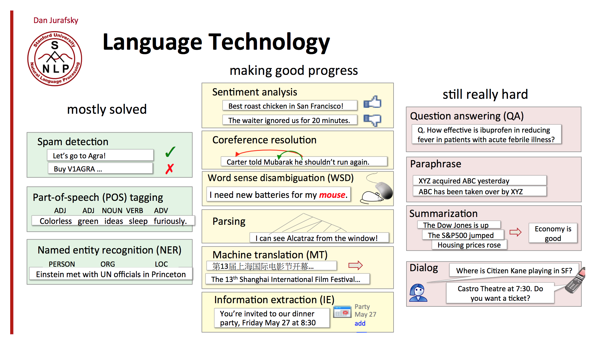

[Meetup link](http://chatbot.kktix.cc/events/meetup-01)

## Microsoft - Microsoft Bot Framework x Cognitive Service 快速打造智能聊天機器人

### [投影片](https://onedrive.live.com/redir?resid=B0BDB6415B1F5E4C!790456&authkey=!AP2SDYHTfABwJck&ithint=file%2cpptx)

- Introduce Bot Framework
- Cognitive service
- [Bot Service](https://azure.microsoft.com/en-us/services/bot-service/) just launch in few days.

## Compose.Ai - Introduction to NLP for Chatbots

### [投影片](https://drive.google.com/file/d/0B8VkVaZ57JBbNUZRNUFPejhEY1U/view)

NLP Problem: Standford Course [Slide](http://spark-public.s3.amazonaws.com/nlp/slides/intro.pdf)

- 如何獲得最多回饋的 Bot?
	- A: 就罵髒話
- Entity 個數的專一性
	- A: 不超過 10 個

### Ref:

- [fasttext](https://github.com/facebookresearch/fastText)

## Botimize.io - Messenger Platform's New Opportunities and Insights

### [投影片](https://docs.google.com/presentation/d/1BtCJaYGrLvB17Yd_8U-fGbPrb4t_Ev_eFATVYC1mwSw/edit#slide=id.g35f391192_00)

[Zeroth.Ai](http://www.zeroth.ai/) Asia AI/ML Accelerator.

### 工人智慧到人工智慧

- [Travelflan](https://www.travelflan.com/)

## Linker Networks - Golang

就我的 [投影片](https://docs.google.com/presentation/d/1KksoZxQCIsPIcZFtKdf7cZ9eacSWcKeUfgXodAbYb5g/edit?usp=sharing)

## Him/Her - Facebook 不想讓你知道的事

### [投影片](https://www.slideshare.net/secret/edUKTtaQdxmHr9)

- PS_ID -> FB_ID
	- 透過 PS_ID 拿 photo
	- 需登入 (token)
- [Facebook-Chat-api](https://github.com/Schmavery/facebook-chat-api)
	- 不需拿 token (不用透過 FB Chatbot 登入授權)
	- 當作網址登入
	- 多個機器人，會被踢

## aloha.ai 24 小時的品牌互動

客服中心，透過 Rule-based (keyword) 的方式 

人工智慧　 -> 工人智慧 （如果機器學習出問題的話)

## 卡米狗

2016/10/21 上線

15 萬人使用

流程

- A, A --> A
- 貼圖 --> 貼圖
- 關鍵字回覆 A--> B
- 抽籤

一個 Bot 只能加入 1000 群組 (Line Bot 限制)

