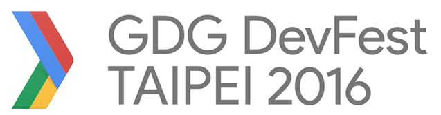

## 前提:

很開心聽到有 [GDG DevFest Taipei ](http://gdg-taipei.kktix.cc/events/devfest16) 場的活動，身為 Google 的語言 Golang 的台灣使用者社群共同協辦者，當然也要去參與這個盛會．

不過既然要參與 Google 開發者嘉年華會，當然得用 Golang 的 Present 工具來做投影片，但是其實還真不是那麼的簡單．這裡做一些簡單的筆記．

## Golang Present 

### 什麼是 Golang Present ? 特色是什麼?

Golang [Present](https://godoc.org/golang.org/x/tools/present) 是 Golang 社群開發出來的簡單的工具，透過簡單的語法可以來製作投影片（語法相似於 Markdown)

[Present](https://godoc.org/golang.org/x/tools/present) 也是主要的 Golang Talk 的投影片製作工具，這裡可以看一個範例 [State of Go](https://talks.golang.org/2016/state-of-go.slide#1) ． 你會發現有以下的特色:

- 簡單，樸素．沒有任何 Theme (特色 :p)
- 可以顯示，並且跑 Golang 程式碼．
- 可以在自己的電腦上顯示，當然也有人做好了 GAE 來跑．

### 如何透過 Golang Present 來製作投影片

以下會簡單的介紹，如何透過 [Present](https://godoc.org/golang.org/x/tools/present) 這個工具來製作投影片．

- 安裝 Golang (恩... 畢竟要透過 Golang 來跑代碼)
- 安裝  [Present](https://godoc.org/golang.org/x/tools/present)  `go install golang.org/x/tools/cmd/present` 
- 參考這個範例

```
Title of document
Subtitle of document
15:04 2 Jan 2006
Tags: foo, bar, baz

Author Name
Job title, Company
joe@example.com
http://url/
@twitter_name
Some Text

* Title of slide or section (must have asterisk)

Some Text
```

- 在該目錄執行 `present` 可以在本地端的 `http://127.0.0.1:3999` 看到結果．


- 或者可以 push 到 github 上，透過 GAE 來看． 這裡有個範例 `http://go-talks.appspot.com/github.com/....` 就可以跑．

## 筆記：

實地的透過 [Present](https://godoc.org/golang.org/x/tools/present) 來製作投影片．其實有一些麻煩的地方．挺值得記錄一下的．

- 圖片的大小無法自動縮放，建議使用 600 x 600 左右的大小
- 如果要放 GAE 上面來跑 Golang code ，記得所有跟 `net/http` 不太方便 demo server ．因為 http port 會被擋（建議使用本地端來跑）
- GAE 來播放投影片會透過相當程度的 cache ，也就是大概是你今天改好的投影片，大概要一會兒才會看到最新版本． 		


## Reference:

- [Go presentation tool](http://halyph.com/blog/2015/05/18/golang-presentation-tool.html)
- [Godoc Present](https://godoc.org/golang.org/x/tools/present)
- [Golang Talk Github](https://github.com/golang/talks)

