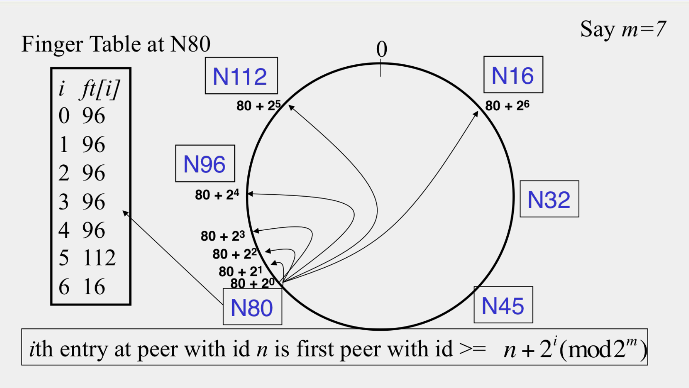

### 課程鏈結:  [這裡](https://www.coursera.org/learn/cloud-computing#)

#### 學習鏈結:

- [Week 1-2](http://www.evanlin.com/moocs-coursera-cloud-computing/)
- [Week 3](http://www.evanlin.com/moocs-coursera-cloud-computing/)
- [Week4](http://www.evanlin.com/moocs-coursera-cloud-computing-3/)
- [Week5](http://www.evanlin.com/moocs-coursera-cloud-computing-4/)
- Mini Project (Gossip Protocol)

## 課程內容:

這裡先簡單的介紹整系列的課程內容，希望能讓大家了解這個課程想做什麼．

這整堂課主要是圍繞著 Cloud Computing 經常會使用到的技術與相關的概念． 整堂課其實只有一個程式語言作業:

		使用 C++ 寫 Gossip Protocol
		
雖然課程裡面程式語言的作業不多，但是整體上的內容還算不少． 除了有談到一些雲端技術的基本概念:

- Map Reduce
- Multicasting and Gossip Protocol
- P2P Protocol and System
- K/V DB, NOSQL, and Cassandra (畢竟都談了 Gossip)
- Consensus Algorithm - Paxos, FLP Proof

其實課程內容很有料，也可以學到很多的東西．

## 前提:

最近決定要把這堂課學完，於是付錢並且開始從 week3 繼續我的學習進度．

Week3 卡住相當久，由於裡面有許多東西需要好好的計算．往往就很難靜得下心來算．加上內容相當充實，介紹了許多種 P2P 軟體的運作方式，不僅僅有 Napster 還有 Bittorent 的運作方式，更有 Gnutella 與具有 Consistent Hashing 架構的 Chord 

## Week3 P2P (Peer-To-Peer) System

這一週主要講到 P2P (Peer To Peer) 不僅僅有提到基本的概論外，也有將各種 P2P 軟體的傳輸方式做一個簡單的整理．

### Napster

伺服器不存檔案，但是存每個節點的資料與檔案清單．並且也存放節點網路狀況．

- Server maintain <file, ip_address> tuple
- How client search:
	- Send key word to server
	- Server search tuple list, return ip list
	- Client ping each node to find transfer rate.
	- Client fetch file from best host.
- Using TCP

#### Problem:

- Centralize server
- Server cannot fixed SPOF
- No security (plaintext)

### Gnutella

下一代的 Napster ，主要針對 Napster 集中式伺服器的問題來解決．Client act as server call **Servents**

**Gnutella 有五種訊息種類:**

- Query (Search)
- QueryHit (Reponse for Search)
- Ping (Hearbit)
- Pong (Response for Heartbit)
- Push (Init for transfer)

**Message Format:**

- Descriptor ID
- Payload Descriptor (Messavge Type)
- TTL (Time To Life)
- Hops (Increase by each node (hop) )
- Payload Length

P.S.:

- TTL only use for QueryHit to provide distance of overlay network.
- 透過 HTTP 傳遞檔案
- 具有 Reverse-Routed 功能的只有 QueryHit ，因為他是回應 Query 的答案，需要具有回傳的的功能．

**避免過多的 Query 流量**
- 每個節點記住傳過的清單
- 每個節點只會轉達 "一次" 相同來源的 Query
- 重複的 Qeury 會被 drop 

#### Problem:

- 太多的 Ping/Pong 網路流量．(約莫 50%)
	- 解法: 透過 cache 解決 heartbit 流量．

### Fasttrack and Bittorent

#### Fasttrack 的特點

- 混合  Gnutella 與 Napster 的優點
- 某些節點( node )會變成 Supernode 也就是可以作為目錄的節點．

#### Bittorent 

流程:

- 下載 .torrent 檔案
- 讀取裡面所有的 tracker (所謂的 tracker 就是管理所有 peer 的清單的伺服器）
- 分別到 tracker 去下載相關的 peer 清單
- 跟每一個 peer 去要求下載自己所需要的 block

選取檔案策略

- 採取 Local Rarest First 也就是會先找重複性最少的 block 來下載
- 如此一來可以增加檔案的健康度

### Chord 

#### 效能比對

|  | Memory  |  Lookup Latency | Message for lookup  |
|:-:|:-:|:-:|:-:|
| Napster  | O(1)  |  O(1)  |  O(1)  |
| Gnutella | O(n)  | O(n)  | O(n)  |
| Chord  | O(log(n))  | O(log(n))  | O(log(n))  |

#### What is Chord

- A DHT (Destributed Hash Table)
- Using consistent hashing

#### Finger Table 計算方式

根據上圖

- 如果 m = 7
- 那麼如果要找出 N80 的 ft(finger table of N80 ) 就會是:
	- 80 + $$2^0$$ = 80+ 1 = 81 > 80 --> 96 
	- 80 + $$2^1$$ = 80+ 2 = 82 > 80 --> 96 
	- 80 + $$2^2$$ = 80+ 4 = 84 > 80 --> 96 
	- 80 + $$2^3$$ = 80+ 8 = 88 > 80 --> 96 
	- 80 + $$2^4$$ = 80+ 16 = 96 = 96 --> 96 
	- 80 + $$2^5$$ = 80+ 32 = 112 > 96 --> 112
	- 80 + $$2^6$$ = 80+ 64 = 144 mod 128 = 16 = 16 --> 16 

#### How to handle Chord Failure?

##### 尋找繼承者節點 (successor)

- N32
	- successor N45
	- presuccessor N16
- N112
	- successor N16
	- presuccessor N96

##### 備份方式:

通常會有 r 份備份 $$ r = 2 log(N) $$

#### 新增節點

如果增加新節點 N40 在 N32 與 N45 之間，那麼**有經過這兩個的上的 FT** (並不是代表這兩個節點..) 就需要重新計算．
	
### Pastry

**特色**

- 相當類似 Chord 使用consistent hashing table 
- 每個葉節點 (Leaf Node) 會知道自己前一個( Predecessor ) 葉節點跟後一個( Successor )葉節點
- Routing Table 採取 **Prefix Matching**
	- 時間複雜度就是 $$ log(N) $$
	- 由第一個位元開始比對，相同 prefix 最多的就是 "best next-hop"

ex:

10110110111

的 best next-hop 就是 101101101"0"1
	
