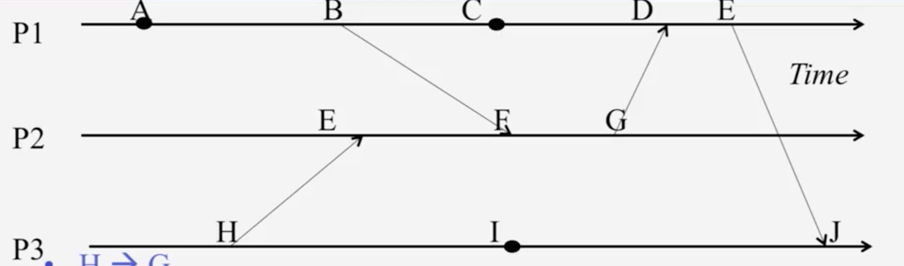
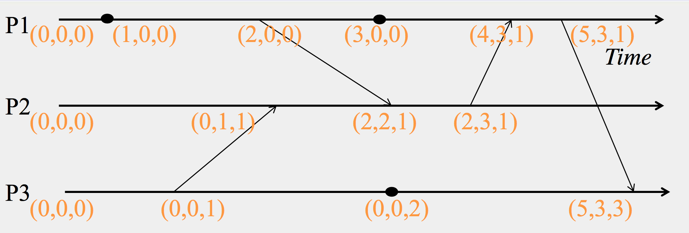

### 課程鏈結:  [這裡](https://www.coursera.org/learn/cloud-computing#)

#### 學習鏈結:

- [Week 1-2](http://www.evanlin.com/moocs-coursera-cloud-computing/)
- [Week 3](http://www.evanlin.com/moocs-coursera-cloud-computing/)
- [Week4](http://www.evanlin.com/moocs-coursera-cloud-computing-3/)
- [Week5](http://www.evanlin.com/moocs-coursera-cloud-computing-4/)
- Mini Project (Gossip Protocol)

## 課程內容:

這裡先簡單的介紹整系列的課程內容，希望能讓大家了解這個課程想做什麼．

這整堂課主要是圍繞著 Cloud Computing 經常會使用到的技術與相關的概念． 整堂課其實只有一個程式語言作業:

		使用 C++ 寫 Gossip Protocol
		
雖然課程裡面程式語言的作業不多，但是整體上的內容還算不少． 除了有談到一些雲端技術的基本概念:

- Map Reduce
- Multicasting and Gossip Protocol
- P2P Protocol and System
- K/V DB, NOSQL, and Cassandra (畢竟都談了 Gossip)
- Consensus Algorithm - Paxos, FLP Proof

其實課程內容很有料，也可以學到很多的東西．

## 前提:

總算到了第四個禮拜了，本週的內容相當的充實．主要就是討論 Cassandra, HBase 之外，就是討論 Cloud Computing 裡面關於時間順序的問題．

時間的對應對於 Cloud Computing 一直都是一個很難解的問題，因為多個主機間的時間必定不相同．如何確保訊息間的因果關係 (Causal) 關係是不變的，這裡介紹了兩個方式: 

Leslie Lamport 的 [Lamport Timestamps](https://en.wikipedia.org/wiki/Lamport_timestamps) 還有 [Vector Timestamps](https://en.wikipedia.org/wiki/Vector_clock) ．

看完這個，也能了解為何 Leslie Lamport 會為了解決 timestamps 的問題造就他寫出 Paxos 了．

## Week4 - Key-Value Stores, Time, and Ordering

### Cassandra

#### Replica Strategy (備份的策略)

##### Simple Strategy:

就是簡單地透過 Partition 來在同個地方備份多份資料． 這邊有兩種方式:

- Random Partition: 類似 Chord 的 Hashing (Consistent Hashing Ring) 
- ByteOrderedPartitioner: 直接給予一個範圍的來做切割

##### Network Topology Strategy:

如果你的 Cassandra 是跨多個 DC(Data Center) 的話，你就必須要參考這樣的備份方式． 可能是一個資料中心 (DC) 有 2~3 份的備份．

**NetworkTopologyStrategy:**

- 會不斷的尋找 replica 直到不同 rack 為止．
- 舉例: Clockwise N1 ~ N6. N1, N2 in Rack1. N3 N4 in Rack2.. N5, N6 in Rack 3.
	- 如果第一個 Replica 在 N3 ，則下一個 Replica 會出現在 N5． 因為要透過 clockwise 尋找出不同 Rack 的機器． N4 在同一個 Rack 所以不選．要選下一個 N5 ．

對於 Network Topology 方式而言， **Snitches** 提供一個方式可以針對資料中心 (DC) 以及機架 (Rack) 來辨識的方式． 提供以下方式，細節可以看[文件](http://docs.datastax.com/en/archived/cassandra/2.0/cassandra/architecture/architectureSnitchesAbout_c.html):

- Simple Snitch: 不在意各種網路架構（連 Rack 也不在意)
- RackInferring: 假設分類與你的 IP 有關:
	- ` 102.103.104.105 = X.<DC>.<Rack>.<Node>`
	- 舉例而言:  
		- 同個 Rack : 102.103.104.122, 102.103.104.123
		- 同個 DC 不同 Rack: 102.103.**104**.122, 102.103.**112**.123

- PropertyFile Snitch: 透過設定檔
- EC2 Snitch: AWS EC2 的區域來判別 DC, Zone-> Rack
	- Eg:  `X.<EC2 Region>.<Avaliable Zone>.<Node>`

#### 讀與寫的方式

##### Write:

- 如果某個 replica 斷線， Coordinator 會先寫在自己這邊等待恢復
- 如果全部的 replica 都斷線， Coordinator 會本地端暫存一下 (buffer)

當一個 Replica 收到 Write 的指令:

- 先寫 commit log file
- 寫在 MemTable 
- 記憶體滿的話，就 flush 到 SSTable (Sort String Table)
- 透 Bloom Filter 來尋找有沒有存放該資料

刪除(Delete)

- 不會馬上刪除，會加上一個 tombstone (墓碑)
- tombstone 的資料再 Compaction (SSTable  滿了需要壓縮與精簡) 發生的時候就會刪除

##### READ:

- 任何命令都會發送給 Coordinator ，然後尋找真正資料儲存的 Partition
- 發送查詢到所有的 replica ，等到"特定個數 X "的 replica 回覆就回答給查詢的人
- 收到各個 replica 的資料會比對，如果有不同會做一個 read repair 的動作來更新錯誤的 replica

##### Suspicion Mechanisms

Cassandra 透過 suspicion mechanism 來處理斷線或是結點出問題．

PHI 代表一個 heartbeat 變異數，也就是 timeout 的間隔．

`Eg: PHI=5,  timeout 10 ~ 15`

Note: This already [deprecated](https://docs.datastax.com/en/drivers/java/2.0/index.html?deprecated-list.html) by Cassandra

### CAP Theorem 

資料庫的三大定理:

- Consistency: 所有節點都要能在同一個時間讀到相同資訊
- Availibility: 系統要在任何狀況下都要能夠運作，並且快速回覆．
- Partition-Tolerance: 系統即使被切割的狀況下，要能夠繼續運作．

在一般的分散式系統中，通常只能有兩個能夠滿足．或是應該說三個只能有兩個被完全滿足，第三個可能會部分滿足．

Eg:

- Cassandra:
	- Eventually (weak) consistency, Availiability, Partition-tolerance.
- RMDBSs:
	- Strong consistency, Availiability, no Partition-tolerance.

**BASE** (Basically Available Soft-state Eventual consistency)

	
#### Eventually Consistency:

If all writes stop all its values will converge eventually.

#### Quorem

Quorem 就是選舉 Leader 的機制，而對於參加選舉的主機

R: 具有讀取的主機數
N: 所有的主機數
W: 具有寫入權限的主機數

必須滿足以下的格式：

- `W + R > N`
- `W > N/2`
 
#### Consistency 系列

- Strong Consistency (RMDBs)
	- 就一般的強一致性
- CRDTs
	- 只允許每次加一的變更數值．
- Probabilistic
- Red-Blue
	- 分成藍色指令跟紅色指令，紅色必須要在同個 DC 中保持特定順序，藍色則不需要．
- Per-key sequential 
- Causal
- Eventual
	- 所有寫入動作停止後，資料就全部會一致

### HBase

**Feature**:
 
- Yahoo 開源
- Facebook 內部使用
- API:
	- Get/Put (row)
	- Scan (row range filter)
	- MultiPut
- 比較重視 Consistency
 
**架構**:

- 切割成不同區域 (regions) 分散在不同的備份主機上
- ColumnFamily 就是一群的欄位 (column) 	
- Store:
	- 就是一個 ColumnsFamily + Region
	- MemoryStore 放在記憶體中的 Store

**HFile 結構**:

Refer to [Cloudera Blog: Apache HBase I/O – HFile](http://blog.cloudera.com/blog/2012/06/hbase-io-hfile-input-output/)
 
- 主要都是 key/value 架構，一個 HFile 包含多個 key/value pair
- 每一個 key/value 內容包含著
	- Key length
	- value length
	- row id
	- col family length
	- col family
	- ts
	- key type
	- value 

#### 如何達到 Strong Consistency : Hbase Write-Ahead Log

**流程**:

- client 寫入數個資料 k1, k2, k3, k4
- 透過 HRegionServer 查到 k1, k2 在 region 1 而 k3, k4  在 region 2 
- 透過 HRegion 找到相關的 HFile
- 這時候先將 log 寫到 HLog ，可以寫入失敗的時候可以再度重做
- [預防資料遺失] 先將資料寫入 Hlog 然後才會去修改 MemStore
- 透過 Store 裡面的 MemStore 將 HFile 裡面的數值修改

## Time and Ordering

### Introduction

時間 (time) 指的是各個系統中用來同步的 clock ，在單機上面都是使用 CPU 的時脈作為所有內部軟體的時間資訊，來同步之用． 

但是在分散式系統下，時間就變得難以同步．而每一個網路中的動作都需要的 ts 也就難以同步． 困難的地方有： 

- 每一台機器有自已的 CPU 時脈
- 如果時間沒有同步 Message Delay 跟 Process Delay 就無法正確的限制

這裡有兩個名詞:

- **Clock Skew**: 指的是兩個時間 (clock) 在速度上相同但是有起始點的差異
- **Clock Drift**: 指的是兩個時間 (clock) 雖然起始點相同，但是在速度上不同

所以相同速度，不同起始時間的兩個 clock 有著 non-zero clock skew but **zero** clock drift

**多久需要同步一次兩個 clock ?**

如果最多能夠忍受時間相差 M 分鐘 (Clock Skew M)  那麼 `M/(2 * MDR)` 就需要同步一次．

 
#### 參考: 

- [HBase – 存储文件HFile结构解析](http://hbasefly.com/2016/03/25/hbase-hfile/)

### Network Time Protocol (NTP)

NTP 為一個樹狀結構的方式來同步時間

根據以上的圖形

- offset = ((t1-t0) + (t2-t3))/2
- round-trip delay = (t3-t0) - (t2-t1)

### Lamport Timestamps 

這個定理就是由 Paxos 的作者提出的，當初他就是在做 Lamport Timestamps 的時候想到利用類似的方是可以解決 Consensus Problem 的方法．

#### 基礎定理與標記

--> : 代表的是 Happen Before ，也就是左方的事件一定比右方的事件還早發生，不論雙方的時間究竟有沒有同步．

- a --> b : time(a) < time(b) 同步過的時間必定 time(a) < time(b)
- send(m) -> receive(m) : 因為傳送必定有網路需要傳遞的時間，所以開始傳送的時間必定比接受到的時間還前面．
- 遞移律 a --> b, b --> c 則必定 a --> c

#### 透過一張圖來講解更多關於 Lamport Timestamp 

針對這張圖，稍微講解:

- P1, P2, P3 不一定是具有同步的 timestamp
- P1 左到右是直線的，具有因果關係．也就是 A --> B (A happen before B)
- 有向的箭頭代表著某人傳訊息給另外一方． B ->(箭頭) F 代表著是 B 傳訊息給 F ，由於基礎定理 send(b) -> receive(f)．所以 B --> F (B happen before F)

幾個範例：

- F --> G
- F --> J
- H --> J
- C --> J
- A --> F : A--> B ; B --> F ; A --> F

針對 Lamport Timestamp 計算時間上，如果 send(b) -> receive(f) ，則透過時間算法為:  

		max(local clock, message timestamp) + 1
		
		
  
### Vector Timestamps 

這邊會有三個資料 (x1, x2, x3) ，其中 x1 代表循序的 P1 timestamps, x2 代表 P2 的 timestamps ...

而傳訊息的時候，就會把其他兩個傳給對方．舉例而言， P1 （2, 0, 0) -> P2 原本前面是 (0, 1, 1) 本來應該是 (0, 2, 1) 但是由於 (2, 0, 0) --> (2, 2, 1) 就是 `(max(x1, y1), max(x2, y2), max(x3, y3))`

### Lamport Timestamp v.s. Vector Timestamps

|   | Lamport Timestamps  |  Vector Timestamps |  
|:-:|:-:|:-:|
| Timestamp Data  | Single Integer  | Tuple (x1, x2, ...) |
| Causality  | obey  | obey  |
| Identify Concurrent Events  | No  | Yes  |

## 關於作業 Homework

其實作業就是一堆 Lamport Timestamps 與 Vector Timestamps 的計算．整個計算相當的花時間，不過可以了解兩個算法之間的差異也相當的有趣．
