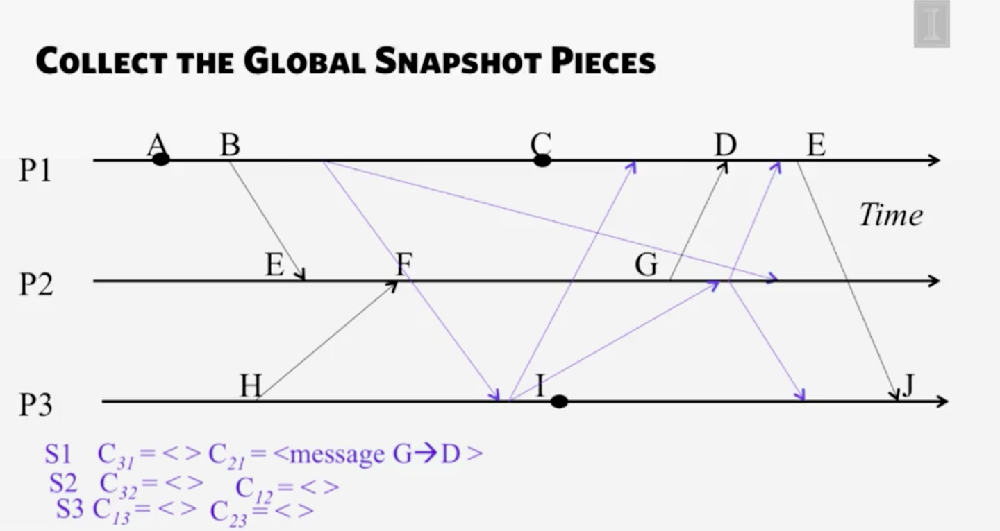

### 課程鏈結:  [這裡](https://www.coursera.org/learn/cloud-computing#)

#### 學習鏈結:

- [Week 1-2](http://www.evanlin.com/moocs-coursera-cloud-computing/)
- [Week 3](http://www.evanlin.com/moocs-coursera-cloud-computing/)
- [Week4](http://www.evanlin.com/moocs-coursera-cloud-computing-3/)
- [Week5](http://www.evanlin.com/moocs-coursera-cloud-computing-4/)
- Mini Project (Gossip Protocol)

## 課程內容:

這裡先簡單的介紹整系列的課程內容，希望能讓大家了解這個課程想做什麼．

這整堂課主要是圍繞著 Cloud Computing 經常會使用到的技術與相關的概念． 整堂課其實只有一個程式語言作業:

		使用 C++ 寫 Gossip Protocol

雖然課程裡面程式語言的作業不多，但是整體上的內容還算不少． 除了有談到一些雲端技術的基本概念:

- Map Reduce
- Multicasting and Gossip Protocol
- P2P Protocol and System
- K/V DB, NOSQL, and Cassandra (畢竟都談了 Gossip)
- Consensus Algorithm - Paxos, FLP Proof

其實課程內容很有料，也可以學到很多的東西．

## 前提:

# Snapshots

## Global Snapshot

**Global Snapshot** =

- Global State =Individual state + communication channel

**時間不同步的時候所造成 Global Snapshot 會失敗的原因**

- 時間不正確
- 無法抓到溝通的狀態

任何造成 Global Snapshot 變動的原因:

- Process send/receive message
- Process move one step

### 以一個範例來解釋演算法

基本定義:

- There are no failures and all messages arrive intact and only once
- The communication channels are unidirectional and FIFO ordered
- There is a communication path between any two processes in the system
- Any process may initiate the snapshot algorithm
- The snapshot algorithm does not interfere with the normal execution of the processes
- Each process in the system records its local state and the state of its incoming channels

#### Chandy-Lamport Global Snapshot Algorithm

[Wiki](https://en.wikipedia.org/wiki/Chandy-Lamport_algorithm)

- 隨便挑一個 Process ($$P_i$$) 來對所有其他的 Process 傳送一個 Marker 訊息 $$ C_ik$$ )
	- 並且開始記錄所有進來的 Message (InComing Msg)
- 如果收到的 Process $$P_j$$ 並沒有收過 $$C_ij$$ 
	- 先將該訊息 $$C_ij$$  的 State 標示為 "empty"
	一樣開始傳送 $$P_jk$$ Marker 給其他 Process
- 如果已經收過了
	- 代表所有 Process 已經開始在傳遞 Marker 而其他訊息已經完整的到了．
- 停止條件:
	- 當所有節點都收到 Marker 代表儲存的資料已經完成．
	- 當所有 Process 收到其他訊息都是 Marker (需要有 N - 1 個)

最後還要把各個分開的 Snapshot 組合成 Global Snapshot

停止條件，所有節點都收到 Marker 外，所有等待外部回來的資料 (marker) 也都收到．

將 Snapshot 統一回收整理成一個大的 snapshot
	

P.S. 這個演算法並不記錄對外的資料，因為由收到資料的人統一來記錄結果．

## Consistent Cut

講解到 Snapshot ，不免俗就要講到擷取 snapshot 的時間點 (cut)．

**Consistent Cut**

- A cut C is a consistent cut if and only if:
for (each pair of events e, f in the system)

也就是說每一個 pair f->e (f happen before e) 如果有 e in the cut 那麼必須 f 也必須要 in the cut． 反之不需要滿足．

	透過 Chandy-Lamport Global Algorithm 截取的 Snapshot 都滿足 Consistent Cut

*證明:*  **$$e_j$$ in the cut (透過 $$P_j$$ 記錄到) 那麼 $$e_i$$ (透過 $$P_i$$ 記錄到) 必定也在 snapshot 之中．**

- We already know $$ e_i -> e_j $$ 
- We also know $$ e_j $$ in the cut but $$ e_i $$ not in the cut
- Because $$ e_i -> e_j $$ and $$ P_i $$ already record state for $$ e_i $$
- Since  $$ e_i $$ happen before $$ e_j $$, if $$ e_i $$ not in the cut so $$ e_j $$ must not in the cut too.
- Contracdition.

## Safety and Liveness

Conrectness => Liveness or Safety

### Definition:

- **Liveness**: something good *eventually* happen
- **Safety**: Guarantee something bad *never* happen

### Chandy-Lamport Algorithm 與 Safety, liveness 的關係:

- 一旦 Stable 就會一直保持 Stable
- 只能滿足 Liveness but non-safety

# Multicast

Communication 的種類:

- Unicast: 訊息從一個傳送者送到一個接收者
- Multicast: 訊息寄送給一群的人
- Broadcast: 訊息寄送給全部的人

## Multicast Ordering

探討順序的時候，有以下三個方式的 multicast :

- FIFO Ordering
- Causal Ordering
- Total Ordering

### FIFO Ordering:

這邊的 FIFO 代表的是，先發送的人就會被收到．（同一個 Process 上):

- 先發送的人，會先被人收到． (同一個發送的人，先後順序在某個節點上應該會保持一樣的順序．)
- Ex:
	-  $$P_i -> P_j, P_k, P_l$$, $$P_m -> P_j, P_k, P_l$$
	-  根據 FIFO 原理
	-  $$P_j$$ 收到順序也會是 $$  P_i (P_ij), P_m(P_mj)$$

### Causal Ordering:

Causal Ordering 代表的是因果的關係，也又是接受到的人絕對比傳送的人還晚． （因為傳送過程的 latency) 這邊指的是跨 Processes ，的因果關係．

	Causal Ordering -->(imply) FIFO Ordering

由於 Causal Ordering 可以跨 processes 跟同個 process ．
如果是在同個 Process 的話，就是指的是先入先出 (FIFO) 因為同一個的先後順序必定影響該 multicast  的順序．

### Total Ordering:

所有 process 收到訊息的順序都相同．

### Hybrid ordering

- FIFO-Total:
- Causal-Total:

## Implement of multicasting

### Implement FIFO Ordering

拿這張圖來解釋如何讓 FIFO Ordering 能夠滿足:

- P1 有兩個 multicasting [1,0,0,0] 與 [2,0,0,0]
- 會看到在 P3 那邊 [2,0,0,0] 比起 [1,0,0,0] 先到
- 所以後面的需要先等一下 (buffered) 改成 [0,0,0,0] 等到後面到了才能改．
- 但是 P1, seq: 2 與 P3 seq: 1 不會有這樣的問題．因為 FIFO Ordering 並不局限於跨線程

### About total ordering

就是計算每個人收到的順序必須要跟開始發送的順序一樣（可跨程序） 就算是．計算的方式就是去累進收到的順序．

### Implement Causal Ordering

滿足條件:

		所有的接收者都必須有著相同的接受順序（跨程序）．
		
		If multicast(g,m) -> multicast(g,m’)
		then any correct process that
		delivers m’ would already have
		delivered m.

做法:

- P1 與 P2 原本就滿足 Causal Ordering ，故不提．
- P3 先收到 P2 msg ，這時候就知道要等待 P1 msg 因此就 buffer
- P3 後來又收到 P4 msg ，又必須要等待 P1 msg 所以就 buffer
- P3 要一直收到 P1 msg 之後，才會把 P2 與 P4 msg 收起來
- 如此一來就滿足 Causal Ordering

## Reliability of multicast

		Reliability = Correctness = Ordering 

在此討論的 Reliability 都是基於 non-Faulty (沒有錯誤發生的) process 上面來討論．

###  現實中的實現方式

在現實中如何透過實現類似 multicast 的確保方式？ 

		每個 process 收到之後，在發送 multicast 給其他 process 作為標記

透過這樣的方式，才能確保每個 process 收到的 msg 順序是正確的，因為順序需要有外部的資訊來紀錄．

## Virtual Synchrony

### View

每個 Process 都維護一套自己的 member list ，那樣的 member list 就稱為 "View"

### View Change

當 Process 發生了 "新增", "離開", "故障" .. 等等影響 member list 的事情就稱為 View Change

### Virtual synchrony 		

Virtual Synchrony 保證所有的 View Change 都會發生於相同的順序上．

ex:
	
- P1 join 
- {P1, P2}, {P1, P2, P4} , {P1, P2, P3} are all view change
- 所以 P2 會收到 一樣順序 {P1, P2}, {P1, P2, P4} , {P1, P2, P3} 

# Paxos

## Consensus Problem

**問題釐清:**

	為何 SLA 永遠都是 five-9' 獲釋 seven-9' 永遠不能夠 100%?
	
	解答:
	所謂的錯誤，不光是任何人員控管與公司流程上的錯誤．當然也不在於機器本身的錯誤． 而是在於是否能夠達到一致性( Consensus )．

#### Consensus Statement:

#### Consensus Constraints:

- **Validity**: 需要全部人提議相同數值才能決定．
- **Integrity**: 最後決定的數值必定是某個 process 提議出來（不是無中生有)
- **Non-triviality**:  至少有一個初始狀態，而不是常見的 all-0, all-1

## Consensus In Synchronous Systems

Synchronous Systems 的特性:

- 訊息有時間限制
- Process 間交換訊息有時間限制 (round: f, upper bound)

如果能夠解決 Synchronous Systems 的一致性 (Consensus) 問題 ，那麼是否能夠解決 Asynchronous System 

--> 將訊息交換的時間限制延長到 N

## Paxos

### 關於 Paxos

並沒有完全解決 Consensus 的問題，

但是可以提供兩種主要特性:

- Safety: 
	- 不違背一制性
- Evantual liveness: 
	- 如果有問題發生，還是可以達成一制性． (但是不保證，原因後續）

並且在以下系統都有使用:

-  zookeeper
-  Chubby

### Paxos 三個階段:

#### Election

- 每個節點 (node) 會送出 election request
- 需要達到大多數 (majority) (或是稱為 Quorum)
- Paxos 允許 multiple leader (這裡先不討論那麼複雜)

產出會有一個(或多個) Leader 

#### Bill

- Leader propose value (v)
- 如果節點同意會回覆

#### Law

- 如果 Leader 獲得大多數的同意
- 會發出 Law (or Learn) request 給每個節點，確認數值的紀錄

