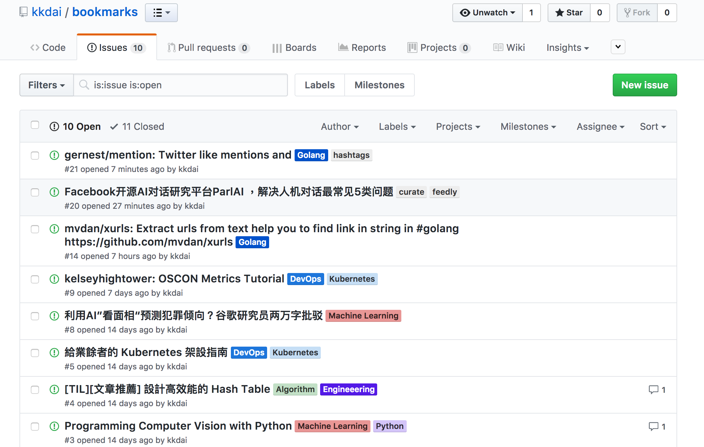
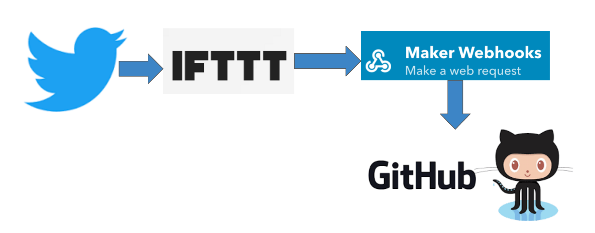

本篇提到的開源專案:

#### [https://github.com/kkdai/bookmark-makerserver](https://github.com/kkdai/bookmark-makerserver)
#### [https://github.com/kkdai/bookmarks](https://github.com/kkdai/bookmarks)

## 起因

平時習慣拿 twitter 作為 bookmark 的概念，看到喜歡的鏈結或是網站就直接 tweet 出來． 但是都沒有記錄下來． 

之前有想過透過[程式設計週記](http://www.evanlin.com/categories/#程式設計週記-ref)的方式來記錄下來，但是又覺得太過流水帳而且沒有辦法有系統的分類．

想著想著就想到透過 Github Issue 來做這件事情，有以下的好處:

- 可以透過 Label 來分類
- 可以使用 Github 的搜尋功能來尋找想找的部分
- 可以補充很多的 comment 在同一個 issue 上面做為閱讀後的心得記錄．更方便未來搜尋．

## 架構

一如往常，我依舊使用許多免錢的架構．並且將整個流程都開源給大家分享，大家應該可以在五分鐘內建立自己的整體流程．

你可能要自己做的事情如下:

- 取得 Github Auth Token (去[這裡](https://github.com/settings/tokens))
- 取得 IFTTT Maker 帳號與權限
- 修改一下 IFTT Maker 資料．

詳細流程都在 [https://github.com/kkdai/bookmark-makerserver](https://github.com/kkdai/bookmark-makerserver)  

## 支援的語法範例

這裡提供一些 tweet 的範例，還有他會變成何種 github issue

`gernest/mention: Twitter like mentions and #hashtags parser for Go(Golang) # easy way to get hashtag in #golang https://github.com/gernest/mention`

- Title:  `gernest/mention: Twitter like mentions and #hashtags parser for Go(Golang)`
- Content: `easy way to get hashtag in`
- Labels: `hashtags`,`golang`
- Link:  https://github.com/gernest/mention

希望能提供給一些需要的人，有任何問題歡迎發 issue 討論 ..

## 未來發展

幾個階段...

- 第一個階段應該會先支援 Facebook 貼文，並且根據我臉書文章格式來貼 Github issue
- 等收集好大量的 Github issue 後，應該會寫另外一個工具來定期（每個禮拜） 根據 Github issue 來產出 Monthly_README.md 
- 甚至可以把這個機制弄成電子報... 恩... 應該說是部落格好一點．