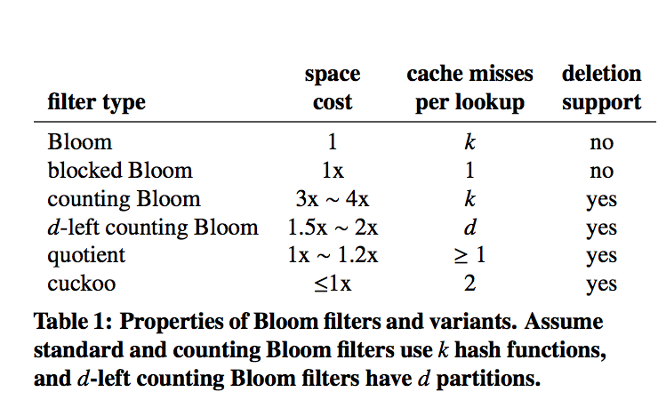

(Image: [Coolshell](https://coolshell.cn/articles/17225.html))

## [[Cuckoo Filter: Practically Better Than Bloom](http://www.cs.cmu.edu/~binfan/papers/conext14_cuckoofilter.pdf)] [[slide](http://www.cs.cmu.edu/~binfan/papers/conext14_cuckoofilter.pptx)]

接續前文， [Bloom Filter 深入討論](http://www.evanlin.com/BloomFilter/)

## 複習一下 Bloom Filter 與 Counting Filter

Bloom Filter 快速的搜尋索引結構，具有以下**優點**:

- 能夠在 $$O(1)$$ 的時間複雜度下快速確認該物品有沒有存在（* 具有 False Positive) 

**缺點:**

- 但是只支援新增節點卻無法刪除節點． (* 需要透過重新建立 Bloom Filter) 
- False positive 的問題，需要透過增加節點(m)來減少，但是這樣又會造成空間複雜度的增加．

為了要解決刪除節點需要重新建立整個 Bloom Filter 的缺點， Counting Filter 就因為這樣而產生．

## Counting Filter 缺點

### 空間過大

原先 Couting Filter 藉由增加一個資料欄位來讓 Bloom Filter 無法刪除資料點的限制去除．但是卻又因為每個節點需要增加一個資料欄位而讓空間使用上變得相當沒有效率．

空間的利用率上，根據這篇論文提到． 你可能需要使用到 3~4 倍的空間使用率來維持相同的 False  Positive Rate ．

### 為何使用 Couting Filter 的空間複雜度會增加 3~4 倍

主要是因為要能夠符合 dynamic deletion 這個條件限制，所以在插入資料的時候會選擇 $$k$$ 的個數來插入你的資料． （也就是一份資料 duplicate 到 $$k$$ 份） 

原因如下：

- 由於需要符合 dynamic deletion ，雖然增加了一個數值單位來記錄總共有幾個．但是如果只有一份的話，再刪除的時候很容易刪除掉其他 hashing collision 的資料
- 避免這樣的問題，只好多複製幾分來做為 hashing collision 的解決方式．

### 細談增加 3~4 倍的原因

在這裡列出一些符號如下:

- 第 i 個 counting filter 被增加 j 次的機率
- $$n$$ 元素個數
- $$k$$ hashing 個數，也就是你需要複製幾份
- $$m$$ 為原來的 couter 的表現大小的個數．

$$ P(c(i) = j) = (^nk _j) (1/m)^j (1-1/m)^nk-j $$

之前的 Bloom Filter 對於 $$k, m, n$$ 的限制: $$ k ≤ (ln2)m/n $$ ，所以式子可以改成:

$$ P( (max)_i c(i) >= j)  <= m  ((e ln 2)^j/ j) $$

所以如果 counter $$i$$ 是 4 個，那麼 $$j$$ 就得 16 才能滿足以上的式子．

透過這樣的方式來計算，大概需要 3~4 倍的空間複雜度，來滿足原先 Bloom Filter 的條件．

## Cuckoo Filter

### 優點:

在提到更多的 implement 的過程中，我們先來查看整個 cuckoo filter 的優點．

- 支援動態的新增，刪除節點（跟 Counting Filter 相同)
- 當整個結構接近使用完畢的時候， Cuckoo Filter 具有更好的 Lookup 效能 (95% 空間利用率)
- 比起 quotient filter 更容易實現
- 具有 False Positive Rate 比 Bloom Filter 更小 (< 3%) 並且具有更少的空間使用率

### 與其他結構的比較一覽: 

(image from paper "Cuckoo Filter: Practically Better Than Bloom")

這一張列表清楚列出 Cuckoo Filter 的優點．可以看得出來， 以下稍微做個條列式:

- Bloom Filter 與 Blocked Bloom Filter 都不知元 deletion (指的是動態支援)
- Counting Filter 需要到 3~4 倍左右的空間成本．

### 原理:

Cuckoo Filter 的原理相當簡單:

- 透過 `footprint` 來計算每個資料的特徵值（作為插入節點用得值），再次要注意一下， `footprint` 的存在使得 Cuckoo Filter 的 loopup 效能相當的快．
- 當要插入的 bucket 已經有值的時候，就會學 Cuckoo 把原先的鳥踢出去依樣． 將原先的數值踢走，該數值再透過另外的 hashing function 找到下一個位置．如果又有人，就把它踢掉．（以此類推） 
- 如果踢走元素的次數，超過了自定義的 MaxCount ．代表整個資料已經滿了，還是需要增加節點，重現建構．

### 缺點:

還是有一些缺點，可以分享一下：

- 由於進行 XOR 的運算，使得 Filter 個數必須為 2 的整數次冪（也就是 2 的某個次方數）
- 儲存 `footprint` 在 filter 內當作該數值的特徵值，雖然有一些好處．但是也多了另外一個方面的碰撞機會而造成 false positive 

## Source Code

這裡有寫了一個簡單的[範例](https://github.com/kkdai/cuckoofilter)，當然我推薦看看這個很棒的[範例](https://github.com/seiflotfy/cuckoofilter)．

## Reference

- [Hacker News:](https://news.ycombinator.com/item?id=14956322)
- [DK: Quotient filter](https://blog.gslin.org/archives/2017/08/09/7500/quotient-filter/)
- [DK: Cuckoo Filter：比 Bloom Filter 多了 Delete](https://blog.gslin.org/archives/2016/08/08/6718/cuckoo-filter%EF%BC%9A%E6%AF%94-bloom-filter-%E5%A4%9A%E4%BA%86-delete/)
- [CUCKOO FILTER：设计与实现](https://coolshell.cn/articles/17225.html)
- [github: Cuckoo Filter in Go](https://github.com/joeshaw/cuckoofilter/blob/master/filter.go)
- [jiaomengjiaomeng: Counting Bloom Filter](http://blog.csdn.net/jiaomeng/article/details/1498283)
