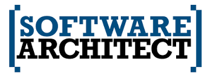

### 原文: [infoq: Are You a Software Architect?](https://www.infoq.com/articles/brown-are-you-a-software-architect?utm_source=reddit&utm_medium=link&utm_campaign=external) 

## [你是一個合格的軟體架構師嗎?] 快速中文導讀..

最近看的文章之中，這篇文章相當適合推薦給大家．不論你已經是軟體架構師，或是你正想將你的專業領域網軟體架構師來邁進，都建議來看一下．

其中的許多部分加入了我個人的經驗與觀點，請觀看時斟酌思考，如果有錯誤的部分，歡迎提供任何意見．

## 本文部分

身為一個軟體架構師，最重要的兩個能力如下:

- Definition of the software architecture
- Delivery of the software architecture 

以下開始解釋這兩種能力的細節，以及為何需要這兩種能力．

### A. Definition of the software architecture (定義出軟體架構)

裡面建議在勾勒出整個軟體架構的時候必須要有的幾個面向為:

1. Management of non-functional requirements 
2. Architecture definition
3. Technology selection
4. Architecture evaluation
5. Architecture collaboration

以下開始逐一解釋每個細項的部分

#### 1. Management of non-functional requirements (管理非功能面的需求)

這裡解釋一下，所謂的"非功能面需求" (non-functional requirements) 一般指的就是跟功能本身無關的需求，比如說： 系統的反應速度，系統容納上限，是否有 HA 與 Fault-tolerance? ． 

要針對功能面向來定義與管理比較容易，要有相當的經驗的人才能了解 non-functional requirements 的重要．

在設計軟體架構的第一個面向應該馬上將功能面以外的需求加以管理，並且確認清楚，不要讓該需求無限擴張． 比如說你的系統如果不需要 24x7 的營運保證，或許就可以讓他有系統更新與修改的時間與機會．或是可以釐清究竟需要多少的連線速度．

 
#### 2. Architecture definition (定義出軟體架構)

當你透過管理而清楚地條列出非功能性需求後，你對於整個系統的效能與容錯率有了一個定義與概念．

接下來就是要定義出你的軟體架構，不論是透過將原先已經有的軟體架構加以修改，或是重新定義出一個軟體架構． 

#### 3. Technology selection (技術的選擇)

如何選擇你的架構，主要有以下的考量點:

- 舊的技術有什麼缺點? 是否一定要使用新的技術?
- 每個服務之間是透過哪一種的 licensing 
- 如果使用開源該社群活不活耀？
- vendor 支援如何?

每一個係項都是需要好好思考的問題，你思考的越多在技術的選擇上就會有更多的考量，自然之後就更不容易有遺漏的地方．

#### 4. Architecture evaluation (架構的評估)

關於評估(evaluation)，這裡有兩個面向:

- "假設"系統會如預期的運行
- "證明"系統會如預期般的完美運行

不論是功能性的需求或是非功能性的需求(Non-Functional Requirement)對於系統架構的建置評估上，都是具有相當風險．

再評估系統架構上，我們可以透過各種的分別的服務壓力測試來給予我們足夠的信心來評估我們的系統架構． 比如說，在決定 Message Queue 系統架構時，可以考量 Kafka, Redis, 或是其他 MQ 給予的壓力測試數據，加上該系統可以裝載的資訊類別來評估是否符合你的系統設計． 

所以根據前面的範例，在設計上我們都會先“假設" Kafka 能夠符合你的系統設計需求再來查看 Kafka 的可以乘載的資料類別與限制，加上他的壓力測試數據．來"證明“系統架構上是可行的．

#### 5. Architecture collaboration (架構上的合作與溝通)

一個好的服務架構往往需要跨組織，跨區域性的合作．很多時候需要許多系統內部甚至是外部的參與者的合作才能造就整個系統的穩定與完整． 比如說： 

- 外部資料提供者需要給予足夠文件的說明
- 外部服務提供者（或是需求者）能夠了解系統的架構與限制

所以，這時候良好的文件與溝通就無法省略．雖然不容易，但是這是一個很軟體架構師重要的工作職責，確認讓所有的合作夥伴能夠無縫的溝通與合作．

### B. Delivery of the software architecture (將定義出來的軟體架構交付出來）

如何能夠將軟體架構交付出來的部分，也有列出以下幾個所需要的能力：

1. Ownership of the bigger picture
2. Leadership
3. Coaching and mentoring
4. Quality assurance
5. Design, development and testing

這幾個項目其實在這幾年的專案管理過程中，不斷的有運用到所以相當推薦這些項目給軟體架構師．

#### 1. Ownership of the bigger picture （隨時都具有廣大願景與目標）

身為一個好的軟體架構師，你的軟體架構要能夠被交付出來．這時候，你需要：

- 確保團隊的每個人對於系統設計的目標與願景有清楚的了解
- 完全地參與專案的進行，能夠不斷地將目標與願景植入團隊的每一個人心中．

這兩個部分相當的重要，舉例而言： 如果你要打造一個反應速度相當迅速的電商平台，那麼團隊中的夥伴們都要能夠清楚的體認這個大方向的概念，才能避免在一些細節上做出會讓整體效能延遲的決定．

#### 2. Leadership (展露你的領導能力）

在軟體專案進行的時候，身為軟體架構師也要能夠適時地展現你的領導能力．需要透過參與實際的專案運作，了解每個成員目前的狀況，開發是否有任何困難．並且適度的扛起責任，當團隊成員有任何疑慮或是需要抉擇的時候做出許多的決定．

#### 3. Coaching and mentoring (教導與指導)

在軟體開發流程上教導與指導雖然是有些過度干涉的成分，但是身為軟體架構師要能夠在架構的討論上，對於團隊有足夠的教導與指導．不是針對團隊面對的程式邏輯的問題，要能夠處理系統相關與設計架構上可能造成的效率取捨．對於架構流程上的教導，並且指導團隊方向引領到正確的設計方向．

#### 4. Quality assurance(品質的確保）

不論是哪一種完美的軟體架構都有可能因為交付的品質而毀於一旦，品質的確保就相當的重要．這裡分享以往在軟體開發的經驗，就是要能夠仔細地將足夠的測試資源投資在正確的地方．比如說： 你的系統是電商系統，那麼你就必須要有足夠的安全性測試，然後再投資到使用者的使用流程．

#### 5. Design, development and testing (設計，開發與測試）

你是一個親自參與(hand-on)的軟體架構師嗎？  許多公司不會讓軟體架構師參與整個開發的流程，因為他們太珍貴．在作者的建議裡面，這不是一個好的態度．一個好的軟體架構師必須要能親自動手做，要能夠在團隊裡面了解相關的程序，做出必要的貢獻．

然後親自參與也不是要軟體架構是必須要把所有的時間都花在代碼的編寫上．親自下來參與並且了解整個專案建置的流程也是很重要的．

### 你是一個軟體架構師嗎?

軟體架構師不是一個就達成的職業，他需要不斷的參與軟體的開發流程，並且具有實際動手做的能力與毅力． 要能檢視自己是不是足夠的軟體架構師，就要能不斷的檢視自己的每個實作的能力與對於系統的透徹程度．

### 心得:

之前在網路上有個有趣的討論，究竟前端工程師需不需要了解演算法．這就讓我思考到，一個好的專案管理人員與一個好的軟體架構師到底需不需要自己下來動手做？ 答案當然是肯定的，不斷的參與專案的開發流程，並且適度的參與是軟體開發人員必備的能力．

Keep coding....	
