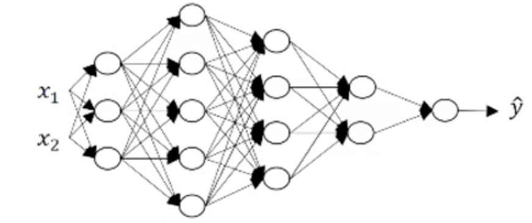

總算完成 deeplearning.ai 第一階段課程 "Neural Networks and Deep Learning"

真的相當有趣的基礎課程，基本上上完了就等於把o'reilly deep learning 的[整本書](https://www.tenlong.com.tw/products/9789864764846)都上完．並且有實際透過 numpy 寫完部分的 DNN 的分類器的作業．

## 起源

本來就想把 Deep Learning 學一下， 因緣際會下看到這一篇 [Coursera 學習心得](https://medium.com/@ywchen88/andrew-ng-deep-learning-specialization-%E8%AA%B2%E7%A8%8B%E6%84%9F%E6%83%B3-1-3-6acf4d6c5c82) 試讀了七天，除了提供 Jupyter Notebook 之外，作業也都相當有趣，就開始繼續學了． 目前進度到 Week2 相當推薦有程式設計一點點基礎就可以來學．裡面的數學應該還好． 學習的過程中還可以學會 Python 裡面的 numpy 如何使用，因為裡面主要就是要教導你如何使用 numpy 來兜出 Neural Network ．

### 課程鏈結:  [這裡](https://www.coursera.org/learn/neural-networks-deep-learning/home/welcome)

#### 學習鏈結:

- [Week 1-2: Introduction to deep learning & Neural Networks Basics](http://www.evanlin.com/moocs-DLS-NN-DL/)
- [Week 3: Shallow neural networks](http://www.evanlin.com/moocs-DLS-NN-DL2/)
- [Week 4: Deep Neural Networks](http://www.evanlin.com/moocs-DLS-NN-DL3/)

## 課程內容:

### 第四週: Deep Neural Networks

#### 基本符號解釋:

- Deep Neural Network 的 Layer 數，不包括輸入層．有包括隱藏曾與輸出層．
- $$N^[l]$$ 代表第幾層裡面的個數．
- $$X$$ (輸入層) 通常也可以表示成 $$a^[0]$$

那麼簡單的式子可以表達成以下的方式:

$$
Z^{[1]} = W^{[1]}  * X + b^{[1]} \\
a^{[1]} = g^{[1]} * (Z^{[1]}) \\
Z^{[2]} = W^{[2]} * a^{[1]} + b^{[2]} \\
a^{[2]} = g^{[2]}*(Z^{[2]})
$$

...

其中別忘記 $$X -> a^{[0]}$$

透過這樣，可以簡化成:

$$
Z^{[l]} = W^{[l]} \\
a^{[l-1]} + b^{[l]} \\
a^{[l]} = g^{[l]}(Z^{[2]})
$$

Where $$ l = 1, 2, ... L$$

#### Hyperparameters

用來決定 $$w$$ 與 $$b$$ 的都算是 hyperparameter ，舉凡:

- Learning rate
- Hidden layer and hidden Unit
- Choice of activation function

#### 關於 DNN 的 Layer 與 weight 的 shape

透過這張圖，其實有不少關於 Deep Neural Network 可以談的:

- 這個 NN 總共有 5 Layer，其中有 4 Layer 是 Hidden Layer．不包括輸入層．
- 每一層的 Neural 數為:
  - A^0 = 2
  - A^1 = 3
  - A^2 = 5
  - A^3 = 4
  - A^4 = 2
  - A^5 = 1
- 其中 W 的 shape 個數分別為:
  - W1=(3,2)
  - W2=(5,3)
  - W3=(4,5)
  - W4=(2,4)
  - 推導出來表現方式為 $$W^l = dim(l, l-1)$$

  $$W^l = dim(l, l-1)$$ 舉個例子是:

推倒的式子為: Z1 = W1 * X + B1
[3,1] = W1 * X[2,1] + B1 (先假設 B1 = 0)
=> W1 * [2,1] = [3,1]
=> W1 --> [3, 2] --> [3, 2] * [2, 1] --> [3, 1]
=> W1 * X + B1
=> B1.shape = W1*B1 = [3, 1]

#### 總複習:

##### Init Parameter:

- Init $$W$$ and $$B$$
- $$W$$ could not be zero, because it is hard to moving to balance.
  - shape: 
    - 	W1: (input hidden layer size, input layer size)
      - WW: (output layer size, input hidden layer size)
      - ((l-1)layer dim, l layer dim)
- $$B$$ suggest using zero for init values.
  - shape: 
    - B1: (input hidden layer size, 1)
    - B2: (output layer size, 1)

##### Init deep parameters:

- You need init every layer (W, B) as well.

##### Linear forward:

- Caculate `Z= WX + b`
- Need cache parameter `cache = A, W, b`
- Need return `Z`, `cache` as wll

##### Linear Activation forward

use `sigmoid` or `relu` to transform your `Z` to activation (denoe: A).

use `A_prev` (A from previous layer) to get `Z` and transform to `A`.

##### L model forward

- Caculate each hidden layer with `relu` activation function.
- Use `sigmoid` as output layer activation

##### Compute cost 

$$
cost (J) = - 1/m \sum\limits_{i = 1}^{m} (y^{(i)}\log\left(a^{[L] (i)}\right) + (1-y^{(i)})\log\left(1- a^{[L](i)}\right)) 
$$

##### Backward propagation  - Linear backward.

$$
 dAL = - (np.divide(Y, AL) - np.divide(1 - Y, 1 - AL))
$$

##### L-Model backward

$$
dZ^{[l]} = dA^{[l]} * g'(Z^{[l]})
$$

##### Update parameters

$$
W^{[l]} = W^{[l]} - \alpha \text{ } dW^{[l]} \\
b^{[l]} = b^{[l]} - \alpha \text{ } db^{[l]}
$$

​	
