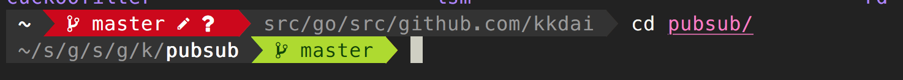

## 起源

Fish Shell 強大的親和力，並且讓我很簡單就上手．讓我使用上相當方便． 但是隨著許多軟體的安裝都還是需要 bash 並且在 [vim 的更新上變得相當困難](https://github.com/VundleVim/Vundle.vim/wiki#i-dont-use-a-posix-shell-ie-bashsh)．  我其實有開始想要把 fish 換到大家比較常使用的  zsh ．

原本看了這篇文章 [超簡單！十分鐘打造漂亮又好用的 zsh command line 環境](https://medium.com/statementdog-engineering/prettify-your-zsh-command-line-prompt-3ca2acc967f) 要打算把自己的 fish shell 換到 zsh．

不過考量許多原因，做了一些小修改:

## Fish shell failure update Vundle in Vim:

Refer:  I don't use a POSIX Shell (i.e. Bash/Sh)](https://github.com/VundleVim/Vundle.vim/wiki#i-dont-use-a-posix-shell-ie-bashsh)

解法: add `~/.config/fish/functions/updatevim.fish`

```
function updatevim
    set -lx SHELL (which sh)
    vim +BundleInstall! +BundleClean +qall
end
```

## Zsh PowerLevel9k 看起來實在很威

[PowerLevel9K](https://github.com/bhilburn/powerlevel9k) 實在很方便，所以找了一個 Fish Shell 可以使用的 [bobthefish](https://github.com/oh-my-fish/oh-my-fish/blob/master/docs/Themes.md#bobthefish)


不過 [bobthefish](https://github.com/oh-my-fish/oh-my-fish/blob/master/docs/Themes.md#bobthefish) 資訊太多了，需要一些調整．

```
#OMF setting for bobthefish
#
set -g theme_display_date no
set -g theme_nerd_fonts yes
set -g theme_display_k8s_context no
```


### 換漂亮的字型 nerd-font


後來有換這個[字型](https://github.com/ryanoasis/nerd-fonts)，看起來還挺順眼的． 



## 還有.. 

VSCode Integrated terminal 還是會有亂碼，目前還在解決中． 可以參考這個[VSCode integrated terminal versus nerdfont-complete #672](https://github.com/bhilburn/powerlevel9k/issues/672)


## Reference

- https://github.com/oh-my-fish/oh-my-fish/blob/master/docs/Themes.md#bobthefish
- [超簡單！十分鐘打造漂亮又好用的 zsh command line 環境](https://medium.com/statementdog-engineering/prettify-your-zsh-command-line-prompt-3ca2acc967f)
- [VSCode integrated terminal versus nerdfont-complete #672](https://github.com/bhilburn/powerlevel9k/issues/672)
- [Powerline fonts in terminal incorrect #7116](https://github.com/Microsoft/vscode/issues/7116)​