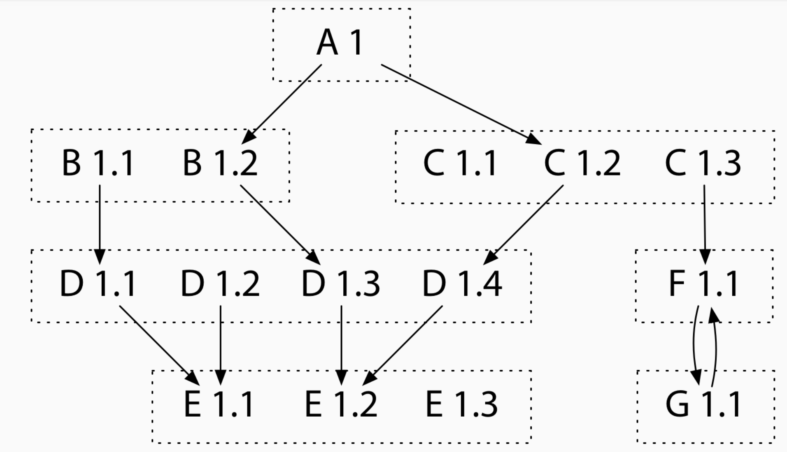

# 目錄:

- [對於 Version and Go 相關詳解(part1)](http://www.evanlin.com/til-vgo-explain/)

- [開始實戰 vgo (part2)](http://www.evanlin.com/til-practical-in-vgo/)


# 摘要

 [vgo](https://blog.golang.org/versioning-proposal) 是 Golang 將在 1.11 提出的新功能．提供著套件的管理與版本的控制．

本篇文章會解釋 [vgo](https://blog.golang.org/versioning-proposal) (versioning go) 與 [dep](https://github.com/golang/dep) 在 sub-package的挑選上有什麼不同． 並且解釋出 [vgo](https://blog.golang.org/versioning-proposal) 如何解決掉大家的問題．  並且在 Go versioning 的準則 (principles) 上， Russ Cox 有列出以下的準則:

- Compatibility
- Repeatability
- Cooperation

接下來，我會整理一下近期學習的經驗．試著讓各位能在這篇文章中了解．

## Compatibility


這邊講的是套件在開發上的"兼容性"，他也很強調所謂的 “Semantic Import Versioning” ． 也就是如同上圖所顯示的部分一樣，任何的產品與套件都應該遵循以上的版本法則．

- Major version: 具有向後不相容的變動，就要變更．
- Minor version: 當有新的功能加入，就要變更．
- Patch version: 只是問題的修復．

在這裡，只要是 Major version 是一樣的話，就`不應該`產生有任何向後不相容的變動．也建議不要有 API  的版本變動．

## Repeatability

為了讓每個使用軟體（或是套件）上能夠讓每個人在任何時間都能夠透過相同的程式碼與相同的套件版本來使用． 

在 [Opening keynote: Go with Versions - GopherConSG 2018](https://www.youtube.com/watch?v=F8nrpe0XWRg&list=PLq2Nv-Sh8EbbIjQgDzapOFeVfv5bGOoPE&index=1) 演講的時候 ， Russ Cox 曾經提到一個很重要的概念．

```
What is software engineering?

Software engineering is what happens to programming when you add time and other programmers.
```

也就是說 Software Engineering 是經過一段時間的開發，並且是跟其他人一起開發． 所以來說"版本的可重複性"(Repeatability) 就格外的重要． 

- 你必須要在半年後接手開發的人，能夠拿到跟你目前一樣狀態的品質與原始碼． 
- 你也必須要讓其他人不論本地端是否有預裝哪些套件，也要能夠拿到相同的代碼

在提到其他的部分之前，我們得提一下跟 Repeatability 相反的部分． Low-Fidelity Builds

## Low-Fidelity Builds 

這裡解釋一下，何謂 "Low-Fidelity Builds" ．並且解釋為何 [vgo](https://blog.golang.org/versioning-proposal) 能夠達成 High-Fidlity Build.

Low-Fidelity Builds (低忠誠度的版本)，也就是表示你的版本控管並不嚴謹．使得你的套件在版本變更的時候，會讓你的產品穩定度低下．

假設我們開發套件 A ，裡面使用到 B 與 C 套件．假設 A 必須要使用到 B1.2 與 C1.2 才能正常運作．




### 範例 1: 使用 `go get` 

當你使用 `go get` 他會檢查目前 `GOPATH` 資料夾內是否有相關套件， 條件如下:

- 當套件存在的時候，他會直接使用該套件（不論版本是否新舊）
- 當套件不存在的時候，會抓下最新的套件．

####  問題:

當你 `GOPATH` 裡面有 `B1.1` 這時候跑 `go get` 就不會更新套件，而造成你在跑的時候可能會造就 build fail 的狀態．

### 範例 2: 使用 `go get -u` 

使用 `go get -u` 會無條件將所有使用的套件更新到最新版本，這並不是代表沒有問題的．

####  問題:

如同以上的圖示，如果執行到 `go get -u` 就會抓下最新的套件 B 與 套件 C ．也就是說會抓下 `B1.2` 與 `C1.3` ．由於套件 A 在開發的時候，並沒有測試過 `C1.3` 這個版本的套件，這時候可能會造成錯誤的產生．


### 結論

所以可以看得出來，不論是原生的 `go get -d`  或是更新套件 `go get -u` 的方式．透過這些方式所產生的套件管理都是具有低忠誠度的版本控管．

接下來會來解釋，透過  [vgo](https://blog.golang.org/versioning-proposal)  能夠如何來管理套件的版本並且解決原始 `go get` 所帶來的問題．

接下來會帶到 vgo 如何透過 Minimal Version Selection 來解決這樣的問題．


下次文章會開始解釋 MVS (Minimal Version Selection)

# Reference

- [Opening keynote: Go with Versions - GopherConSG 2018](https://www.youtube.com/watch?v=F8nrpe0XWRg&list=PLq2Nv-Sh8EbbIjQgDzapOFeVfv5bGOoPE&index=1)
- [A Proposal for Package Versioning in Go](https://blog.golang.org/versioning-proposal)
- [Go & Versioning](https://research.swtch.com/vgo)