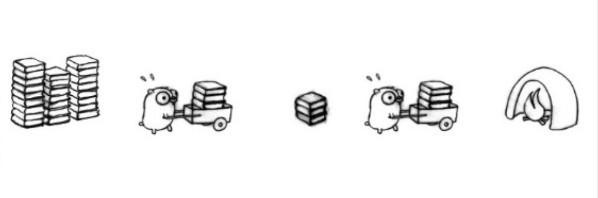
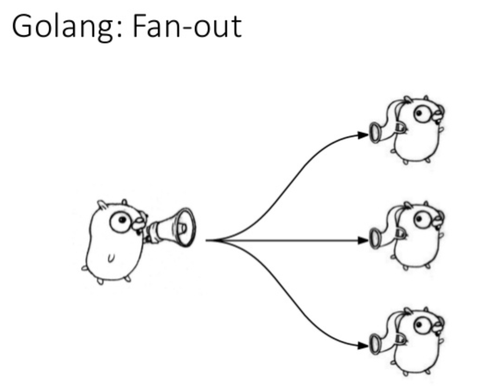

# 前提

如何說明一個人 Golang 寫得夠不夠熟練，我大部分都是問 " 可以請你解釋一下 buffered 跟 unbuffered channel 的差異?"

往往這樣的題目都會問倒一堆人．不是大家對這個語言不熟悉，而是一般人在學習 golang 的 goroutine 的時候，原本就已經很少使用 channel 來管理，更別說使用 buffered channel ．

這篇文章，我會稍微提一下 buffered/unbuffered channel 的差異．並且透過最近遇到 pipeline 的問題來討論一下． 

# Buffered/Unbuffered Channel

## Unbuffered Channel

先講 unbuffered channel ，也就是最基本大家使用的 channel

```go
ch := make(chan bool)

go func() {
    ch <- true
}()

// keep waiting after goroutine run
<-ch
```

這邊是一個最簡單的 unbuffered channel 的案例，這邊需要注意的相關事情．

- 由於 unbuffered channel 只有一個位置，所以當你已經存入之後． (e.g. `ch <- true`)  第二個要存入也會卡住（直到第一個 pop 出來)
- `<-ch` 會造成 STW(Stop The World) ，才會驅動 goroutine 驅動．也才能導致 `ch <- true` 才能跑得到．不然會卡死．這也是如果你想在同一個 goroutine 跑 chan push 跟 pop 會沒有作用的原因．

## Buffered Channel

Buffered Channel 顧名思義就是具有多個的 channel，參考一下:

```go
ch := make(chan int, 3) //建立大小為 3 的 buffered channel
go func() {
    ch <- 1
    ch <- 2
    ch <- 3
}()

fmt.Println(<-ch) //1
fmt.Println(<-ch) //2
fmt.Println(<-ch) //3
```

這是一個很簡單的例子，既然 channel 為一個 slice ，當然也可以  iterate 。

```go
ch := make(chan int, 3) //建立大小為 3 的 buffered channel
go func() {
    ch <- 1
    ch <- 2
    ch <- 3
}()

for n := range ch {
    fmt.Println(n)
}
```

當你覺得好像很正確的時候，跑下去就會發生有問題． 參考 [playground](https://play.golang.org/p/3difEgQOtF_K)

###  問題發生在哪?

可以參考一下 Go By Example的這段說明．   https://gobyexample.com/range-over-channels

```
This range iterates over each element as it’s received from queue. Because we closed the channel above, the iteration terminates after receiving the 2 elements.
```

必須改成以下的方式:

```go
ch := make(chan int, 3) //建立大小為 3 的 buffered channel
go func() {
    ch <- 1
    ch <- 2
    ch <- 3
    close(ch)
}()

for n := range ch {
    fmt.Println(n)
}
```

參考 [playground](https://play.golang.org/p/un5vuLB_gwV)

# Pipeline pattern

pipeline 可以很方便地處理多步驟地處理流程，比如說 ETL 或是 影像處理． [官方的 pipeline blog](https://blog.golang.org/pipelines)  有很詳盡的範例介紹.

在這裡先簡單的串起來一下，

```go
func gen(nums ...int) <-chan int {
	out := make(chan int)
	go func() {
		for _, n := range nums {
			fmt.Printf("%d into first queue \n", n)
			out <- n
			fmt.Printf("%d completed into first queue \n", n)
		}
		close(out)
	}()
	return out
}

func sq(in <-chan int) <-chan int {
	out := make(chan int)
	go func() {
		for n := range in {
			fmt.Printf("%d into second queue \n", n)
			out <- n * n
			fmt.Printf("%d completed into second queue \n", n)
			time.Sleep(1 * time.Second)
		}
		close(out)
	}()
	return out
}

func main() {
	// Set up the pipeline.
	c := gen(1, 2, 3, 4, 5, 6, 7, 8, 9, 10, 11)
	out := sq(c)

	// Consume the output.
	for v := range out {
		fmt.Println("Result:", v)
	}
}

//1 into first queue 
//1 completed into first queue 
//2 into first queue 
//1 into second queue 
//1 completed into second queue 
```

[這個範例](https://play.golang.org/p/t0XuGd3iBnt)你可以很清楚看到，由於使用 unbuffered channel 所以 `1` 要先離開第一個   channel 之後，`2` 才能進去．

## Fan-out with Pipeline



Fan-out 是一個作法就是一次讓多個 goroutine 來跑．也是可以搭配著 pipeline 來跑 fan-out ． 讓我們來看以下的範例．

```go
func sq(in <-chan int) <-chan int {
	out := make(chan int, 1000)
	for i := 0; i <= 3; i++ {
		go func() {
			for n := range in {
				out <- n * n
				fmt.Printf("%d is out queue \n", n)
				time.Sleep(1 * time.Second)
			}
		}()
	}
	return out
}
```

參考:  [Playground](https://play.golang.org/p/gqNGaVniqT2)

你會發現這個無法跑完，因為他會卡住而跑出

```
fatal error: all goroutines are asleep - deadlock!
```

原因就出在之前提過的忘記 close channel ． 記得，如果前面一個 pipeline 沒有 close channel ，後面的 `for range` 就會卡住．

那要如何能夠精準地知道何時才能 close channel?

## 最後解法

最後改法，加上 waitgroup 的方式來等到 fan-out 的結果:

<script src="https://gist.github.com/kkdai/7389b18f37f60115e48d42fa36b663be.js"></script>
Refer: [Playground](https://play.golang.org/p/8PclrqJikez)