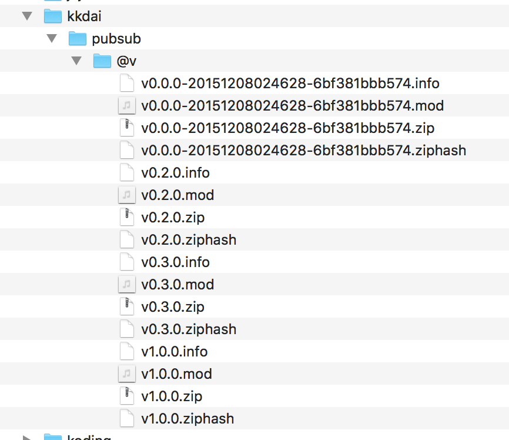
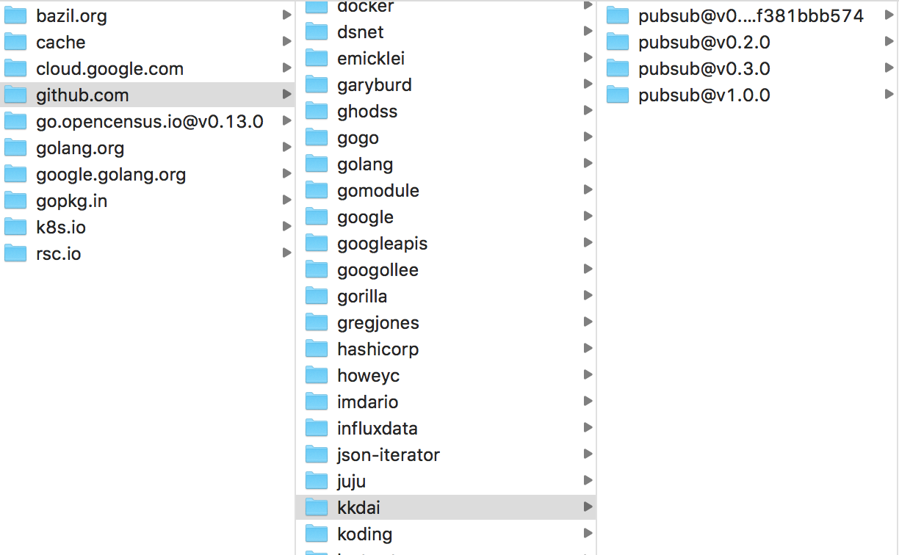

# 目錄:

- [對於 Version and Go 相關詳解(part1)](http://www.evanlin.com/til-vgo-explain/)
- [開始實戰 vgo (part2)](http://www.evanlin.com/til-practical-in-vgo/)

# 摘要:

 [vgo](https://blog.golang.org/versioning-proposal) 是 Golang 將在 1.11 提出的新功能．提供著套件的管理與版本的控制．上面解釋過相關功能後，這篇文章我們將透過 vgo 實際建立一個簡單的專案．並且解釋相關操作． 

# 資料存放地點

##  govender/dep/godep 

原本套件管理系統，不論是 govendor, dep 或是 godep 都是透過 [go 1.5 vendor experimental](https://github.com/golang/proposal/blob/master/design/25719-go15vendor.md) 裡面的管理方式， 將你的套件存放在 `vendor`  目錄底下． 存放的方式就是跟 `GOPATH` 一樣的擺放方式，只是 Golang system 會先搜尋 vendor 目錄底下的原始碼，再去搜尋 GOPATH. 也就是說全部人都是使用同一個套件下面的原始碼．

聽起來或許很美好．但是那是第一層的狀況下，也就是說如果你第二層的套件要去找相關的 source code 仍然會去你的 GOPATH 來尋找，當然你也可以全部包在最上面套件管理系統內．

## vgo

`vgo` 存放的方式跟一般的套件管理系統不同，由於他不是使用 舊有的 golang vendor 的管理方式，而是將套件分別存放在每個人的系統裡，目錄結構為

### $GOPATH/src/v/cache (壓縮過的版本)

別且透過不同的版本與版號來將原始碼 `壓縮過後保存起來` ．



如同上面保存的類似，這邊

### $GOPATH/src/v (Sourecode 版本) 

此外，也會在另外一個地方放上 source code 的版本（未壓縮過的版本），這個地方是存放透過 vgo 所下載的部分． 

值得注意的是這邊存放的位置也都會根據版好的資訊來分開資料夾，如果沒有特定版號 tag 的話，就會使用 `{package_name}@v0.0.0-{date}-{commit_id}` 的方式來存放． (e. g. go-socket.io@v0.0.0-20180212073242-3d2b7eec9891)




# 版號的控管方式

vgo 使用的版號控制是透過 `git tag` ，而關於他的格式就是依照目前 github 對於 release 的版號規格:

- 必須為三碼 `v0.0.0`，第四碼出現會 `vgo` 抓不到
- 第一個 `v` 必須為小寫，大寫一樣會抓不到
- 後面不能加上其他的敘述，必須為單純的三碼 `v0.0.0` ． `v1.0.0_20180702` 就抓不到

可以透過 `vgo list -t 套件名稱` 來查詢套件的版號

# 開始透過抓取你的專案

你可以透過兩種方式開始使用 `vgo` 不論是套用在舊的專案上，或是開啟一個全新的專案．

## 開啟全新專案 

`vgo` 讓你可以不需要在 `gopath`下面建立你的專案，但是你需要打上以下資訊．

```
pakcage main // import "github.com/yourname/yourproj"

...
```

對..你必須要打上一個 build tag `// import 某個 remote path` 才能讓 vgo 正確抓到資料，正確開始跑．

然後再 `touch go.mod` 再來開始 import  你需要的版號，就可以．

## 套用在舊的專案上

將 vgo 套用在已經 Production 的專案上其實也不會有危險，因為他跟 govendor, glide 跟 dep 都是可以共存的．

要套用到舊專案的方式也很簡單，方式如下:

- 如果是 web service 或是 console app 到舊專案執行目錄

- 執行 `vgo build`

- 這樣會幫你自動建立 `go.mod` 

不過極有可能建立出類似一下的 go.mod : 
```
github.com/docker/spdystream v0.0.0-20170912183627-bc6354cbbc29
```

你會發現你許多套件的版本號碼都是有問題的，請先注意，以下事情:

- 版號為 `v0.0.0` 並不是代表你拿到的 code 是最舊的，而是代表你沒透過 vgo 去拿套件，所以沒有正確版好（此問題在 go 1.11 將會修復）
- 如果你要去使用版號來抓，請注意當著的 commit ID 對應的版本號碼．避免不小心拿到不能正常運行的版本．

要更新版號方式有以下兩種:

- `vgo get -u` 來拿到最新版號
- 修改 `go.mod` 指定相關套件版號，來抓取正確的版本

# 待續

本篇文章先介紹到這裡，由於 go 1.11 已經正式將 `vgo` (正式名稱為 [go module support](https://t.co/A8LGP26kew)) 加入 ． 我將會研究一下新版本的差異，在下一篇文章跟大家分享．

# Reference

- [Golang — vgo vs dep — Dependency Management Tools Explained](https://blog.spiralscout.com/golang-vgo-dependency-management-explained-419d143204e4)
- [Opening keynote: Go with Versions - GopherConSG 2018](https://www.youtube.com/watch?v=F8nrpe0XWRg&list=PLq2Nv-Sh8EbbIjQgDzapOFeVfv5bGOoPE&index=1)
- [A Proposal for Package Versioning in Go](https://blog.golang.org/versioning-proposal)
- [Go & Versioning](https://research.swtch.com/vgo)
- [go modules have landed](https://t.co/A8LGP26kew)