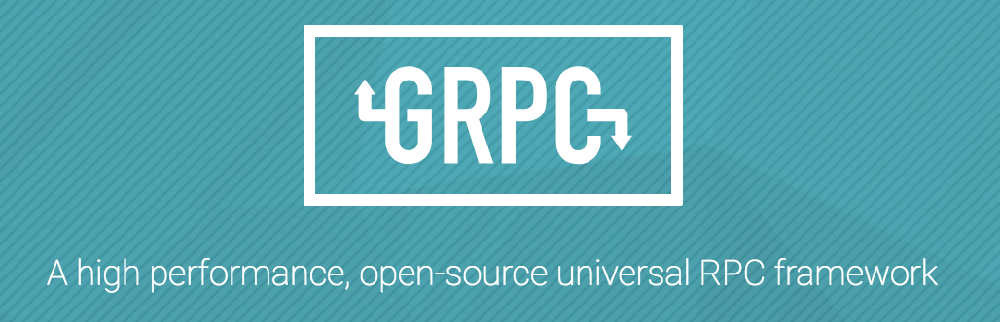

# 前言:

之前為了幫公司的產品加上一個中間層的服務處理，需要把許多原先預設的 GRPC 服務參數都改掉，或是新增不少功能．在這裡整理一下，分享給大家．

本文會提供一個簡單的 repo 裡面有提到會使用到的一些功能，並且附上一個 Kubernetes 部署的 yaml 檔．

## Show Me The Code

#### 不囉唆，先看 REPO https://github.com/kkdai/grpc-example

# 原先的 GRPC 服務開始擴展:

一開始，我們先以 Hello World 為範例，並且省略相關的部分． 一開始 `SayHello` 的範例建置好之後． 這個[範例(hello world)](https://github.com/grpc/grpc-go/tree/master/examples/helloworld) 相當簡單，就是一個 SayHello 然後傳回一個回覆． 我們可能會開始收到其他的需求...

以下的需求最後將整合到一個範例 repo  https://github.com/kkdai/grpc-example

# 1: 能不能一次送多個指令 (streaming request)

你可能收到需求，需要在原先的服務上面新增一個接口可以處理連續性的請求 (streaming request) ．或是在處理資料的時候不要一次都處理完才回復，而是處理完其中一個部分請求就先回傳 (streaming response)．

<script src="https://gist.github.com/kkdai/8b0b7752fce2438c8d8ed5d0ae76fc76.js"></script>

這是一個相當範例，可以看到 `SayStreamHello` 並沒有增加新的資料欄位．而是沿用舊的資料欄位

```django
rpc SayHelloStreamServer (HelloRequest) returns (stream HelloReply) {}
```

在 proto buffer 裡面其實要改得很少，但是處理方式就不太依樣．以下開始放相關的處理代碼．

### 首先看 Streaming Server 的 server 端的部分

<script src="https://gist.github.com/kkdai/55c19cc6c0afdeae062cd23adf1b47a6.js"></script>

這邊稍微解釋一下，由於你將回傳的資料改成了 streaming 的結果．所以你必須要將資料一筆一筆的傳回去． 這段範例中，我加上了兩秒的 sleep  讓 streaming 更有感覺．

## 再來看 Streaming Server 的 client 端的部分

<script src="https://gist.github.com/kkdai/8c4624c8484af2301a60012a170083b6.js"></script>

由於資料都是由 `stream.Recv()` 取出來，所以你需要做檢查是否資料傳完了沒．這裡是透過 `err == io.EOF` 來檢查．

### Streaming client 的部分，由於差不多請直接看程式碼  `SayHelloStreamClient`

# 2. 如何控制 GRPC service  的連線時間?

接下來能夠連續傳送資料之後，再來就是你會希望能夠讓你的 GRPC call  能夠更久一點．那麼你就會需要去修改你的連線方式．

<script src="https://gist.github.com/kkdai/b35b45fb6046cbec7a4bba2d2d1b570f.js"></script>

這段程式碼裡面，可以看到 `20*time.Second`  就是我們連線的時間限制．你可以延長這個時間來達到增加呼叫時間，當然你也可以換個方式透過這個方式來控制你的時間限制．

# 3. 能不能大量的資料?

既然你的 GRPC 服務已經可以傳送大量的資料，那麼接下來就會有另外的需求： 能不能傳送相當大量的資料呢?  這裡定義的大量資料可能是超過 5MB 以上，因為 GRPC 預設的大小限制為 4 MB ([source code](https://github.com/grpc/grpc-go/blob/07ef407d991f1004e6c3367c8f452ed9a02f17ff/server.go#L56))

```
	defaultServerMaxReceiveMessageSize = 1024 * 1024 * 4
```

那如果要修改的話，就依照以下的方式來修改．

<script src="https://gist.github.com/kkdai/e7bbf10eac801844da7fbc280ca81ad2.js"></script>

這一段是要改成 server 將傳送的大小限制從 4MB 改到 8MB ，因為傳送資料是在 client -->  server 這邊做第一次的控管，所以是由 server 來決定最多能傳送多大的資料．當然如果你希望 server 回傳資料可以傳大量的資料，就反過來要改在 client

<script src="https://gist.github.com/kkdai/2c19acb421b237c0a026d6c68ea40410.js"></script>

當然，如果你想改 python 的 grpc server ，可以參考一下方式:

<script src="https://gist.github.com/kkdai/a6110f342f108906f3057394d4349e71.js"></script>

另外一方面.. C++ 的 GRPC server 可以參考:

<script src="https://gist.github.com/kkdai/871419ddaed26ca46772f89f1457cdf6.js"></script>

# [更新 20180819]  4. 關於部署到 Kubernetes 可能發生的問題


要部署到 Kubernetes 上，需要兩部分的 yaml  設定．而這裡可能會有一些問題發生． 首先讓我們來看 Deployment 的部署 yaml

## Kubernetes Deployment yaml file

<script src="https://gist.github.com/kkdai/c3c4f4ed389fb6ee7255412eb9b5698e.js"></script>

這邊的部署方面沒有太多問題，當初在 [Dockerfile 設定](https://github.com/kkdai/grpc-example/blob/master/Dockerfile)也是將 `client`  跟 `server` 的檔案包在同一個 docker iamge ． 然後透過不同的 entrypoint 來修改．

## Kubernetes Service yaml file

<script src="https://gist.github.com/kkdai/b2a964963210a153591ba5d320bc28d5.js"></script>

這邊設定還算簡單，但是可能有個雷在這裡要小心．

### 關於 Kubernetes 服務 (service) 部署的小雷

這邊主要要注意到 service 的 selector 設定，要注意好

````
  selector:
    name: grpc-example 
````

如果設定不正確，將會導致 client 再透過 `grpc-example.default` 的連線方式如法正確找到 service ．除錯的方式如下

#### 除錯方式:

第一個先透過 `kuberctl get endpoints` 來確認每個服務(service) 都有相對應的 endpoint ，如果設定不正確可能會出現 endpoint 是空的狀態．

這時候建議回來檢查  service selector 確認是否能夠跟原本的 deployment 對應再一起，這裡建議的 selector 方式使用 name 來找是最簡單的．

# 總結:

這篇文章整理了幾個容易在撰寫 GRPC 服務的時候卡關的問題，希望能幫助到大家．所有的相關範例程式碼在:  https://github.com/kkdai/grpc-example

# 參考

- https://stackoverflow.com/questions/42629047/how-to-increase-message-size-in-grpc-using-python
- https://nanxiao.me/en/message-length-setting-in-grpc/