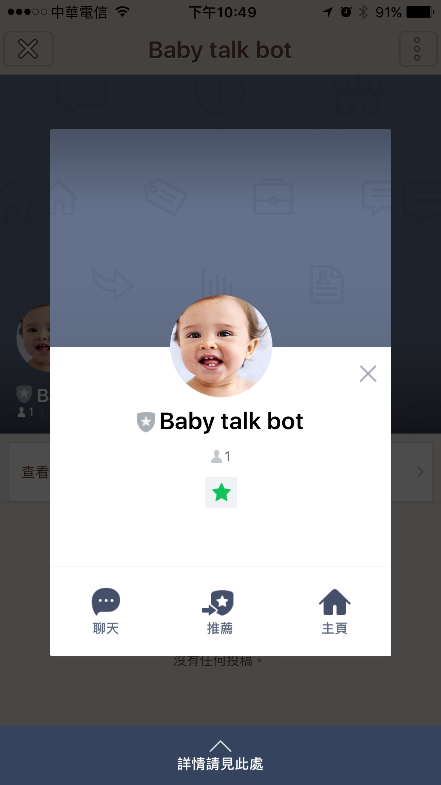
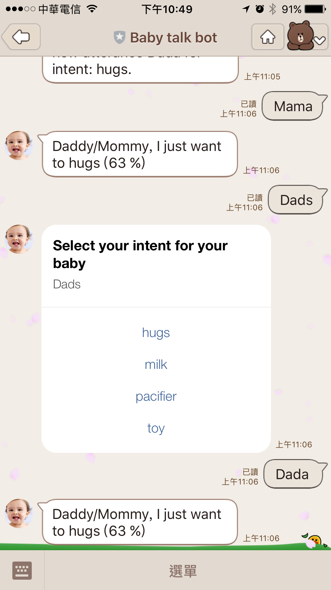
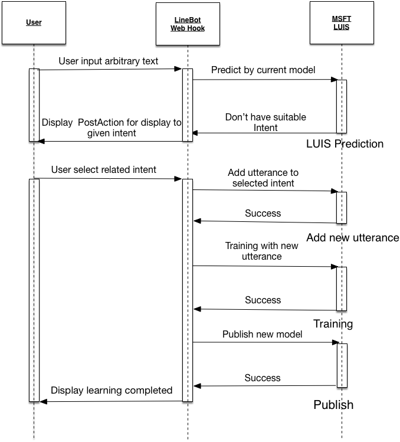
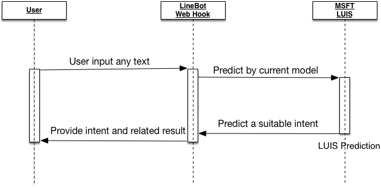

# 前言:

這篇文章其實講解了兩年前為了去 COSCUP 弄的專案(https://github.com/kkdai/LineBotBabyLuis) ，因為當初其實也沒有花太多時間講解開發的內容． 並且也沒有講解如何實現．

如果有興趣當初演講內容的話，可以查看以下兩份投影片:

- [2016/08/24: Modern Web 2016: Using Golang to build a smart IM Bot](http://www.slideshare.net/EvansLin/modern-web-2016-using-golang-to-build-a-smart-im-bot)
- [2017/04/27 iThome Chatbot Day: 透過 Golang 無痛建置機器學習聊天機器人](https://docs.google.com/presentation/d/1OKlV0s8ECdo5efMhgIuwIWvB9mh05v0tygO2LvcvwIc/edit?usp=sharing)

這篇文章主要講解最近一週，為了讓這個機器人復原所做的一些修改的部分．並且補充了 LineBotLUIS 的執行循序圖，希望讓有興趣的人能夠更清楚的了解．

# 關於 LineBotLUIS 的簡單介紹:

LineBotLUIS (https://github.com/kkdai/LineBotBabyLuis) 主要是兩年前開發的實驗性質產品．那時候想要結合 NLP 學習的 AI 引擎 (MSFT LUIS) 並且透過 LineBot 的交互式對談的方式，能夠讓這個機器人做到自我學習．

整個機器人就是模擬一個小孩子啞啞學語機器人，大致上流程如下．細節可以再看(循序圖):

- 輸入小孩子講的話語 (e.g.  shi shi,  mi~ mi~, ㄋㄞ  ㄋ ㄞ ..)
- 如果她已經學會了，他會告訴你以往的意圖．如果不會它會問你說這句話的意圖是什麼
- 你可以從 抱抱，牛奶，奶嘴或是玩具之中選擇一個小孩子可能的意圖．（可能就是你了解你小孩子想什麼之後）
- 然後透過 LUIS 就會學習到，並且之後打出類似的話語就會辨識出來小孩子的意圖．

聽起來很神奇？其實並不難...

# 架構與近期修改的部分:

這個部分除了 LineBot Webhook (https://github.com/kkdai/LineBotBabyLuis) 的相關處理外，另外還有一個要處理 LUIS API 的 LUIS SDK  ．這邊是透過我兩年前開發的套件 (https://github.com/kkdai/luis) ，並且也於日前將 API 升級到了 2.0 ．

其實本來也沒有太大問題，不過主要是因為微軟日前已經將 LUIS 1.0 API deprecated 掉了．導致我必須將相關的 API 服務都改成 2.0 的服務．

最後， LineBot SDK 也有一些改動．兩年前的 Token 傳遞方式也有變動，造成我必須更新 LineBot Go SDK 的版本之外，其實他們對於 PostAction 的反應也有修改．這邊也會稍微提一下．

# 關於 LUIS v2.0 修改的部分: 

講到 LUIS，就是微軟開發的語意學習引擎 ([luis.ai](https://luis.ai))，他將每一句會區分為 [Intent(意圖)](https://docs.microsoft.com/en-us/azure/cognitive-services/luis/luis-concept-intent) 與 [Entity (物件)](https://docs.microsoft.com/en-us/azure/cognitive-services/luis/luis-concept-entity-types) ．而學習出來的機器模型會根據你輸入的 [utterance(話語)](https://docs.microsoft.com/en-us/azure/cognitive-services/luis/luis-concept-utterance) 來 Predict(預測) 你的意圖．

先來提提 LUIS 改變到 v2.0 API 的相關修改:

- Training 跟 Publish 分開來，Training   後必須要 Publish 才能讓你的 Prediction 拿到最新的資料．
- Prediction 的 API 網址有變動．這邊比較奇怪的是，他不像是一般的 API 從 1.0  換到 2.0 而是整個網址換掉．並且跟其他的 API entrypoint 都不一樣．
- 其他還有就是要加入 Intent 變得更加的麻煩，不過還好 LineBotLUIS 本身並沒有提供新增 Intent 的方式．

# 關於 LineBot SDK 的更新:

那回過頭來談談，這一年多來其實 LineBot Go SDK (https://github.com/line/line-bot-sdk-go) 也有一些修改．加上 Line Bot Webhook 的 calling sequence 也有一些些修改如下．

- Token 的存放位置有變，這邊並不需要改 code ，你只需要更新 Line-Bot-SDK-Go 套件就可以了．
- 對於 PostAction 的回覆，之前只會傳回一個 Message Event 為 `EventTypePostback` ．更改過後，會傳兩個進來．一個為原有的 `EventTypePostback` ，又多傳一個 `TextMessage`． 根據官方部落格文章 [開發LINE聊天機器人不可不知的十件事](https://engineering.linecorp.com/tw/blog/detail/183) ，可以了解官方建議你如果要設定 PostAction 的文字，就必須要設定一個無法再 TextMessage 裡面產生作用的特殊字元組合． (e.g.  [我要喝牛奶mileQQ~~~])  類似.. 

# LineBotLUIS 的學習循序圖 (Sequence Diagram):

以上是如何讓 LUIS LineBOT 學習的循序圖，幾個重點可以跟大家分享一下．

- 使用者輸入任意的文字
- 如果是 LUIS model 不認識的，或是無法找到最高分的意圖(intent)
- 這時候就會透過 LineBot Webhook 傳回 Post Action 也就是會顯示目前系統本來就有的意圖(intent)來讓使用者選擇
- 這時候使用者選擇相對應的意圖後，馬上就會加入該話語到意圖中．並且啟動訓練(training)，這就是故意要造成 Streaming Learning 的狀態．
- 除了要 Training 之外，還要馬上將訓練好的模型發布(publish)出來．讓下一次輸入類似的話語就會找到相對應的意圖．

找得到的循序圖就相對應的簡單，只要找到相對應的意圖馬上就回覆給使用者．

# 待續

LineBotLUIS 透過呼叫微軟的 LUIS 人工智慧學習引擎，企圖製造出一個會學習的簡單機器人．並且透過 LUIS 似乎也可以打造出一個雖然沒有任何資料庫，但是也不會因為 Heroku 而會重新開始的學習機器人．

