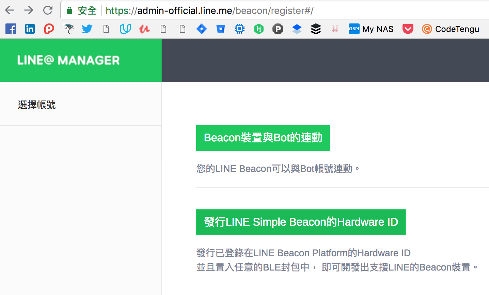

# 前言

上週五去參加了 LINE 的技術者聚會活動，也同時聽到如何透過 LINE Beacon 來跟 LINE Bot 結合．於是決定把整個官方範例串接起來，並且將整個流程寫的更容易了解． 

# LineBot Beacon 流程


在這個流程圖裡面，你可以看到整個流程有一點小複雜:

- 首先使用者的手機接受到 Beacon 的訊號後，手機會將藍牙訊號傳送到 LINE App
- LINE App 收到後，發送 Beacon hardware ID 給 LINE Server
- LINE Server 根據 hardware ID 轉發給相關的 LINE Bot (也附上該使用者的 token)
- 這時候 LINE Bot Webhook 就會收到使用者發送一個 beacon 的 event
- 跟據不同 Beacon ID 跟 Event (Enter/Leave) 來定義不同的反應方式

根據這樣的流程，可以知道以下幾件事情:

- Beacon 的控制的事情其實有限 (Enter/Leave)
- Beacon event 本身提供訊息也只有以下的部分

```
string Msg         //beacon string
string type        //beacon type
string hardware ID //beacon hardware ID to determine b
```

根據這些訊息，其實還是能做出很多有趣的運用就要看各位如何發揮想像力．

# 沒有 LINE Beacon 可以測試? 先試試看官方 nodejs 範例


### 官方範例: https://github.com/line/line-simple-beacon 

## node 10 的 MacOSX 藍芽上似乎有問題

先來透過官方範例來看看，結果似乎有點問題 (20180825): 

```
internal/modules/cjs/loader.js:583
    throw err;
    ^

Error: Cannot find module 'xpc-connection'
    at Function.Module._resolveFilename (internal/modules/cjs/loader.js:581:15)
    at Function.Module._load (internal/modules/cjs/loader.js:507:25)
    at Module.require (internal/modules/cjs/loader.js:637:17)
    at require (internal/modules/cjs/helpers.js:20:18)
    at Object.<anonymous> (/Users/Evan/src/go/src/github.com/kkdai/line-simple-beacon/tools/line-simplebeacon-nodejs-sample/node_modules/bleno/lib/mac/highsierra.js:10:21)
    at Module._compile (internal/modules/cjs/loader.js:689:30)
    at Object.Module._extensions..js (internal/modules/cjs/loader.js:700:10)
    at Module.load (internal/modules/cjs/loader.js:599:32)
    at tryModuleLoad (internal/modules/cjs/loader.js:538:12)
    at Function.Module._load (internal/modules/cjs/loader.js:530:3)
```

跟工程師討論的結果，似乎 node10 再 xpc-connection (也就是要跑 mac 藍牙的這個部分) 所以可能還是要使用 node8 是比較穩定的．

## 那來幫 nodejs 降版吧

如果你跟我一樣使用 Homebrew 作為套件的管理系統，那麼從 node10 降板到 node8 的方式如下．  

```
brew uninstall        //uninstall node10
brew install node@8   //install node8
```

這裡要注意，如果以之前有透過 npm 安裝的部分．最好砍掉重新安裝比較穩定．

# LINE Beacon 綁定在 LINE Bot 上

首先先到 [LINE@ Manager](https://manager.line.biz/beacon/register) 來建立開發者帳號 (developer trial) 的 Beacon Hardware ID



記得要將你的號碼掛在你需要附屬的 LINE Bot 上面．


# LINE Bot 上面的相關修改

你必須要在你的相對應的 LINE Bot 上面做了以下的修改，才能讓你的 LINE Bot 在收到 LINE Beacon 訊息的時候給予適當的提醒．

<script src="https://gist.github.com/kkdai/065948faeece21cdbeb753a85d4f2c36.js"></script>
這只是一個最簡單的 code ，但是主要可以顯示出來 Beacon 會傳來 Enter 的 Event 。 （請注意 Leave event 已經於 2019 deprecated)


# 參考鏈結

1. https://developers.line.me/en/docs/messaging-api/using-beacons/
2. https://developers.line.me/en/reference/messaging-api/#beacon-event


