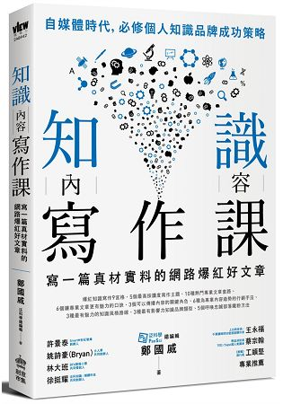

# 前言:


這本書其實已經看完幾個禮拜了，不過一直到這幾天放長假(?) 之後才有時間來寫． 這一本書是 Redhat 的大大提供建議的好書．雖然書名跟摘要會讓人覺得好像跟資訊技術人員沒有關係，但是裡面的內容其實都是通用的．讀完之後覺得有滿多地方可以推薦給大家．同時我會一併轉換到資訊技術人員來說，該怎麼去改善自身的撰寫方式．

其實我經常在演討會的摘要或是投影片上面都有運用到相關技巧，也歡迎大家相互討論指教．


# 內容簡介:

這本書是[泛科學](https://pansci.asia/)總編輯與泛科知識公司的知識長-鄭國威所撰寫的書．主要就是敘述他如何讓[泛科學](https://pansci.asia/) 這樣介紹科學的知識網站如何獲得大眾的青睞． 如何透過「有趣」並且吸引人的內容來讓更多人了解艱澀的科普知識．

整本書的內容圍繞在三個大流程:

- 如何寫出受人歡迎的知識內容? (知識寫作的九宮格)
- 如何宣傳你的知識文章
- 建立個人知識品牌

接下來就簡單介紹一下這本書裡面的內容，希望會讓大家更欣賞這本書．我會一併轉換到資訊技術人員來說，該怎麼去改善自身的撰寫方式．


## 如何寫出受人歡迎的知識內容? (知識寫作的九宮格)

**知識寫作的九宮格**是一個工具，幫助你將你的知識鋪成文字並且吸引人來吸收．一個良好的知識需要足夠吸引人的文字來架構，並且需要有足夠好的內容與標題吸引人來閱讀．

### 1. 熱點:

透過流行文化與名人的話題來吸引人進來，對於資訊相關的知識而言．比如說最近的支付話題相當的盛行，不論是  [Line 一卡通](https://www.cool3c.com/article/137602)的新聞或是麥當勞[大麥克之亂](https://news.ebc.net.tw/news.php?nid=128952)的都是很適合拿來寫作並且你腦袋裡面的知識帶入到文字之中．


### 2. 場景:

透過令人熟悉的故事，場景或是時空來讓讀者更容易吸收一些知識． 比如說透過 [棋靈王](https://zh.wikipedia.org/zh-tw/%E6%A3%8B%E9%AD%82) 吸引人來聽 AlphaGo 甚至是 Tensorflow．  透過  [Pokemon Go](https://pokemongolive.com/zh_hant/) 的圖片與熱潮來解釋 [Kubernetes](https://kubernetes.io/) 如何自動化擴展節點的優點都是．


### 3. 誰:

你的文章想要寫給誰看？ 你的演講想要對誰說？ 這個場地大多是哪一些人？ 都是我每次一到了演講會場都會花時間去了解的． 如果是 [ModernWeb](https://modernweb.tw) 的場子，大多會是前端的人才， [COSCUP](https://2018.coscup.org/) 大多會是學生而各種不同的 Conference 都會充滿著各行各業的人． 「你如何透過他們的語言」將你的知識解釋給他們聽？ 才是講者真正的功夫．


### 4. 為什麼? 怎麼做？

先建立好整篇文章（演講）的情境後，接下來就是你要文字（演講）的架構． **為什麼**就會是一個很重要的問題，因為你的整篇文章都是圍繞著這個為什麼？

```
為什麼: 就是讓使用者省思，並且吸引他跟你一樣的思考
```

以下提供一些我過往的例子：

- 因為聊天機器人只會回答一般的文字，所以我們希望能幫他加上人工智慧
- 經常在外面看到一些物品不知道叫什麼名字？ 幫你的聊天機器人加上 ImageNet 的人工智慧吧

這些都是「為什麼」你要怎麼做，他是一個 hook 可以鉤住讀者的目光．依照你的脈絡來開始閱讀你的文字． 


而怎麼做就是比較有趣的部分，很多時候大家很急著把結果快速地寫出來．對於資訊相關人員而言，直接破題告訴你怎麼解決問題是沒有任何意義的． 因為必須要寫出來如何找到問題點，甚至如果能寫出 debug 的整個流程都是相當的好的．


### 5. 結果:

對於一般科學而言，這裡提到的是數據，歷史與結論．但是對於資訊從業人員而言，這裡可能就是某些解決方式或是某種現象． 比如說， 使用 Tensorflow 的訓練流程，透過 Kubernetes  來部屬你的服務方式．


### 6. 展望:

這個部分主要是討論在文章的後端，需要呼應到你一開始的「為什麼？」這個部份．對於資訊人員，舉例而言：了解了如何透過 K8S 來部屬你的服務之後，你必須馬上在文章的末端再給他加強印象．你可以透過 K8S  逐步將你手邊的應用程式方便的部屬，並且有 OOXX 的優點． 

這個方式可以再三給讀者強烈的印象，前後呼應並且讓他深刻了解．


### 7. 感受:

連接者「展望」，讀者再三地強調「為什麼？」而做之後．就需要知道你希望他們產生的相關行動．一篇教導打造聊天機器人的文章，當然就希望讀者自己動作來寫一個．一個 K8S  部署的文章，會告訴讀者可以從哪個方向入手．


### 8. 參考資料:

這是我很習慣的部分，但是不少寫作的朋友可能都會忘記．附上相關鏈結可以補足你可能遺漏的部分．更可以讓讀者可以去閱讀更多的相關資料．也同時是鼓勵讀者回來回饋，如果有錯誤的話？  :p  


### 9. 圖文影音:

這部分屬於觀感部分，人類對於文字的吸收與記憶能力不如圖文與影音．所以可以的話，儘量加上一些圖片可以幫助讀者放鬆．


## 如何宣傳你的知識文章

文章寫好了，該如何宣傳你的文章？ 這邊有幾個很值得分享的內容，你需要「三種關鍵角色來幫你推廣」：

### 連接者:

如果一篇 DevOps 的文章能夠放在 DevOps  社群的話，當然可以得到更多的讀者共鳴． 所以一個好的文章也需要好的地方「投放」．

### 專家：

如果你寫了一篇好的文章，你恰巧認識相關領域的專家．可以請他們幫你推薦．一本好的書，一定要能找到專家來寫序或是推薦文．可以為你的知識站台加分．

### 推銷員:

這邊講的不是像 Sales 那種推銷員，而是很喜歡分享內容的人．透過這樣的人可以讓你的文章獲得更多人的目光．更有可能他們還可能透過一些註解讓你的文章更吸引人進來． （ex: retweet,  臉書分享...)


## 建立個人知識品牌

這裡有建議的三個階段，快速的整理一下:

### 熱門平台做可行性測試：

透過 臉書， Twitter 上面直接寫文章的前言．來測試人們對妳話題的感興趣程度．如果很熱門，就可以放更多的心思將它完成．

### 建立自己渠道:

建立自己獨有的管道，不論是部落格，臉書粉絲頁面，或是社團討論區都可以．你需要建立自己在相關群組人裡面的專業形象．

### 與其他人合作:

不論是透過其他的社群，其他的討論版面．適當的擴大你的讀者群，是個重要的方向．你需要不僅僅讓你圈圈的人喜歡閱讀你的內容，更要讓不了解你領域的人試著閱讀你的文章．


# 心得:

這本書真的很棒，雖然大部分的內容都是筆者在通用科學與歷史偏重的泛科學的例子．但是我在閱讀的時候一直都轉換成資訊相關的內容，吸收起來格外的好．希望各位在讀的時候也能有一樣的感受．