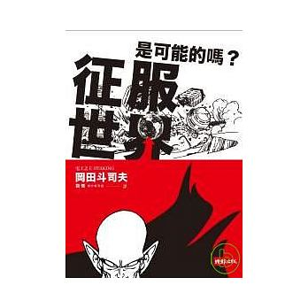
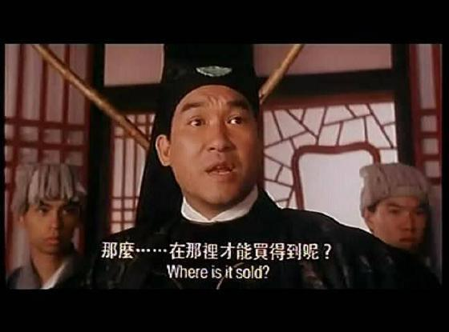

# 前言:

最近把一些之前沒看完的書開始拿出來讀完，這一本就是在閒暇時間拿來消遣用的書．但是雖然最近 [Kobo 大幅度特價](https://www.rakuten.com.tw/shop/rakutenkobojapan/product/koboauraonejp/)來台灣打廣告，我還是喜歡紙本的書啊（書櫃表示滿了..)

這一本不諱言當初是因為封面的[比克大魔王](https://zh.wikipedia.org/wiki/%E7%9F%AD%E7%AC%9B_(%E4%B8%83%E9%BE%99%E7%8F%A0)) 而買下來的，但是其實內容相當有趣所以當初也是一次幾乎都看完了．一直到了最近才有時間去寫讀書心得．這系列其實跟[「空想科學讀本」](http://okapi.books.com.tw/article/9312)系列很像，屬於幻想的科學系列．但是作者們都用很嚴謹的角度來看待當初埋藏在各位心裡的奇怪想法．

**tldr**: 如果你沒有看過以下的漫畫讀物，強烈建議你「不」要買這本書來看．因為作者 岡田斗司夫 是動畫公司的創辦人，並且是美少女夢工廠當初創辦的公司． 裡面的範例也超級「宅」 ，如果是愛看漫畫的人或許可以完全融入作者的幻想科學裡．

# 內容簡介:

「征服世界」 已經忘記有多少動漫畫的反派夢想似乎都是這個，透過征服世界來達到自己的夢想．這本書也很有趣的由這裡展開．本來只是作者 岡田斗司夫 在暑假一個有趣的研究的分享，「一起征服世界吧」的演講． 卻被出版社聯絡，決定要出了這本有趣的書．  不過作者也不是泛泛之輩，他就認真的開始分析各個動漫反派的動機與方法論．整本書的架構如下：

## 征服世界的目的是?

一開始作者先透過一些動漫角色 「假面騎士」還有「北斗神拳」裡面的來分析這些反派為何要征服世界．每個人都有不同的目的：

- **消滅人類**： 宇宙戰艦大和號- 科美拉星人
- **我要錢**： 
- **老是被人管，想要統治別人**
- **推廣邪惡**: 這個酷了吧？ 竟然是七龍珠裡面的比克大魔王

## 哪類的統治者?

這邊就統治者（也就是我們說的大反派）來分析他們的人個特性，你看是不是相當認真．

想要征服世界的大反派，其實分成四型:

- 魔王型
- 獨裁者型
- 昏君型
- 幕後黑手型

## 那麼如何征服世界呢?

這邊就認真的討論，如果真的想要征服世界的人該如準備？

- 設定目的
- 確保人才
- 調度資金
- 作戰計畫管理及肅清屬下
- 征服世界之後（繼承人問題）

## 真正有可能征服世界嗎?

這個章節也認真的討論（但是還是舉了很多動漫的例子）征服世界的好處，還有統治世界的重點．

# 心得:

這本是相當適合當作休閒刊物，當然前提你還是要有相當程度的「宅」才能看懂裡面所舉的範例．作為一個放鬆毒物其實相當的棒．但是除了動漫的角色之外，也是可以看到作者對於歷史與人類管理相關的演進過程有一定程度的研究．有許多相關內容也潛移默化的導入到有趣的範例內．

