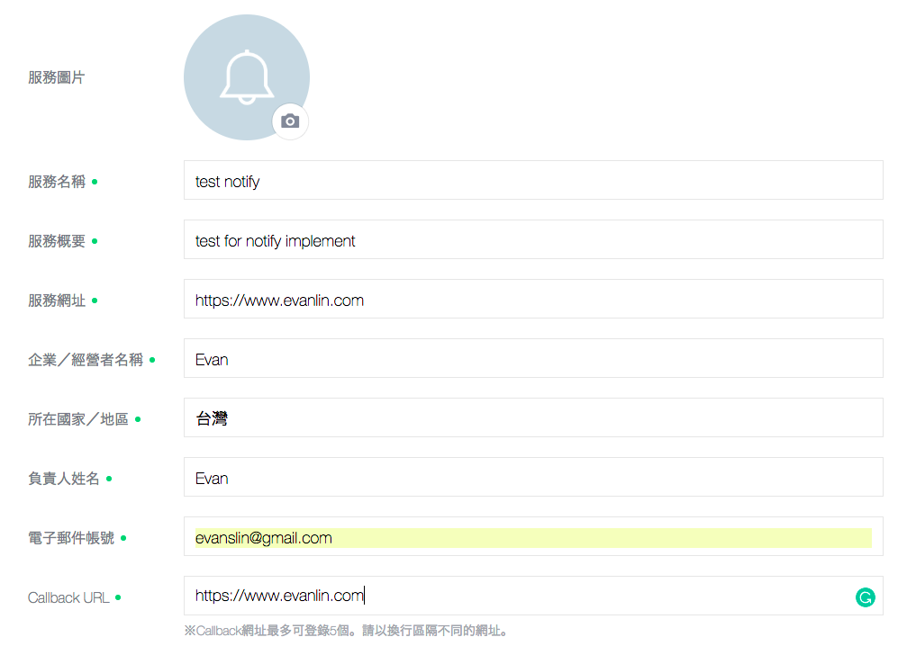
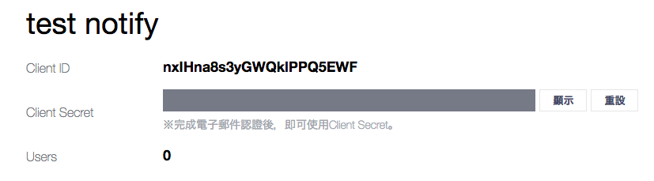
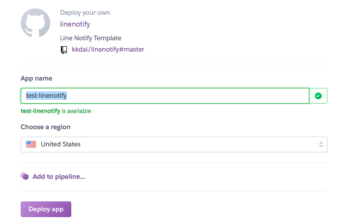
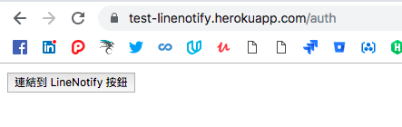
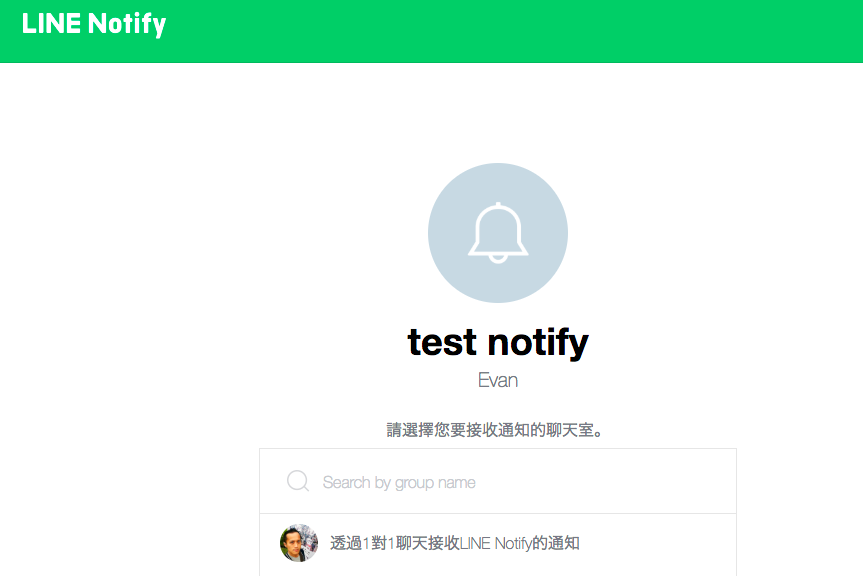
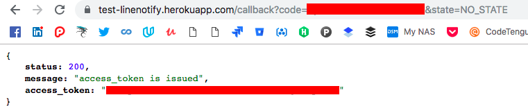
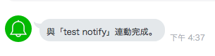

# 前言

LINE 在 2017 年其實推出了一個「通知」的服務，名稱為 [「LINE Notify」](https://notify-bot.line.me/zh_TW/)．這個服務跟 LINE Bot 裡面的推送(Push Message) 其實是分開來的，而且服務也是需要另外申請的． 

本篇文章將簡單的介紹這個機制運作的方式，並且暨[「[Golang][教學] 在 Heroku 建立你自己的 LINE 機器人 (LINE Bot API)」](http://www.evanlin.com/create-your-line-bot-golang/) 之後，在寫一個 [LINE Notify Template](https://github.com/kkdai/linenotify) 的服務． 讓各位可以快速部署出自己的 LINE Notify 的服務．

# LINE Notify

[LINE Notify 的申請頁面](https://notify-bot.line.me/zh_TW/) 跟 LINE Bot 的不同，建議各位可以先去申請 Github 或是 IFTTT 的服務．  

你會發現有一個新的帳號加你為好友，`千萬不能封鎖` 不然所有的 LINE Notify 都會收不到．

如果你可以正常的串接 Github 或是 IFTTT 的 Line Notify ，我們就可以繼續以下的相關工作．

# 開發 LINE Notify 服務

講到要如何開發一個 LINE Notify 的服務，主要需要進行以下幾件事情:

- 到 [LINE Notify 的申請頁面](https://notify-bot.line.me/zh_TW/) 註冊你將要啟動的服務，來取得 `Client ID` 跟 `Client Secret`
- 一個靜態網頁來負責開啟 POST 資訊到 LINE Notify 並且讓使用者在 LINE Notify 上面登入帳號與傳送相關資訊
- 開發一個 API 端口(auth)負責跑 LINE Notify oauth 來讓使用者的 LINE 帳號與 Line Notify 的服務器登陸服務
- 開發另一個端口(callback)來接收，傳送回來的 token 並且儲存作為之後通知之用
- 最後有一個發送通知的端口（或是服務器透過資訊變更而啟動） 的端口 (notify) ，負責將要更新的資訊傳送給 LINE Notify 服務器來轉發到 Line Noty 的帳號上

在服務的說明上，可以參考 [Line Notify 的官方網頁](https://notify-bot.line.me/doc/en/) 或是 [Poy Chang 所寫的「實作 Line Notify 通知服務 (1)」](https://poychang.github.io/line-notify-1-basic/) 都相當清楚． 但是本篇文章是希望能快速帶領各位完成一個 LINE Notify 的服務，所以接下來會使用我所開發的 LINE notify repo 來介紹．

# 透過 Line Notify Template 快速建立服務

### Line Notify Template Repo: https://github.com/kkdai/linenotify

接下來的文章，將會一個個來解釋該如何透過 LINE Notify Template 來快速進行開發：

## 申請一個 Line Notify 服務:

記得到[這個網址](https://notify-bot.line.me/my/services/new)來申請你需要的 LINE Notify 服務，關於網址的部分可以先隨便輸入．稍後服務建立起來後再申請．

 

 

建立好服務後，記得將兩個重要資訊抄錄下來 `Client ID` 跟 `Client Secret`:

 

## 透過 Heroku Deploy 快速搭建出已經建立好的 LINE Notify Template

這裡會先假設各位都已經有 [Heroku 帳號](https://www.heroku.com/)  ，接下來各位到這個 repo

### LINE Notify Template Repo: https://github.com/kkdai/linenotify

點下 「 Deploy to Heroku 」來將這個服務部署到你自己的 Heroku 伺服器（不需要花費)

這時候會需要輸入  App Name 代表你服務的名稱與網址請隨意輸入．但是稍後要記錄起來． 

範例裡面我們將輸入 `test-linenotify` ，區域就沒有差別． (這個名稱是 unique ，請勿跟我一樣 XD )

 

 然後到 Setting Tab 去打開 `Reveal Config Vars` 加入以下的參數:

- `CallbackURL`:
  - 這裡需要輸入你 App 網址，假設你 app 叫做 `test-linenotify` 那麼網址就會是 https://test-linenotify.herokuapp.com/callback 
- `ClientID`:
  - 輸入 Client ID 從 Line Notify 註冊頁面所取得的資料
- `ClientSecret`:
  - 一樣，輸入 Client Secret 從 Line Notify 註冊頁面取得的資料

## 回到 Line Notify 服務頁面來修改相關資料:

你需要回到當初[設定的服務網址](https://notify-bot.line.me/my/services/)去修改相關網址．依照以下方式來修改:

- 服務網址:
  - 依照這個範例， `https://test-linenotify.herokuapp.com/auth`
- Callback URL:
  - 依照這個範例， `https://test-linenotify.herokuapp.com/callback`

就這樣.. 全部設定完成．

# 如何使用 LINE Notify Template 來測試:

根據這個範例，你需要到這個網址  https://test-linenotify.herokuapp.com/auth

 

 你會看到一個按鈕，這個時候你可以按下`連接到 Line Notify按鈕` ， 他會要求你登入 Line 的服務然後連接到以下的網頁．

 

這時候建議選擇 「透過 1 對 1 聊天接收通知」，然後就會導到一個成功的網頁．

 

 並且在 Line Notify 會出現以下綁定成功的訊息．

 

## 發送測試 LINE Notify 訊息吧

由於這個範例程式`不具備資料儲存`的功能（他也只會記住前一次登陸的 token ），所以建議連動成功之後馬上就開始測試． 

根據這個範例，你可以馬上輸入 `https://test-linenotify.herokuapp.com/notify?msg=test1` 這個指令是會傳送文字 `test1` 到你的 Line Notify 去．然後你就會看到以下資料．

 

#   未來的工作:

這個範例只是讓各位能夠快速了解 LINE Notify 運作的原理與一個服務需要哪些 API ．但是離正式上線還有許多功能要做，如果你要開發一個正式的服務，可能需要以下相關服務．

- **更詳細的服務登入網頁**:
  - 需要一個更清楚的網頁讓使用者知道明瞭，該 LINE Notify 是提供哪些服務．
- **資料庫來儲存所有的使用者 Token**:
  - 要傳送給相關使用者，你需要一個清單來記住所有註冊的使用者 token ．
  - 由於 Heroku 並不提供資料庫功能，而這個範例程式也只有存在記憶體中． 也就是隨時會被改調或是因為 Heroku 進行每天六個小時的停機而清除掉．
- **更好的內容提供**:
  - 飯粒提供的內容相當簡單，只是一個 Query String 來傳送資料．正常狀況可能是監控一系列的機器，或是做網路爬蟲等等相關工作．
  - 身為服務提供商，需要定期抓取資料並且決定要不要送給使用者（或是送給哪位使用者）

# 參考

- https://notify-bot.line.me/doc/en/
- https://poychang.github.io/line-notify-1-basic/
- https://mr117119.wordpress.com/2017/08/15/line-notify-line-%E6%8F%90%E4%BE%9B%E7%9A%84%E5%85%8D%E8%B2%BB%E9%80%9A%E7%9F%A5%E6%9C%8D%E5%8B%99/

