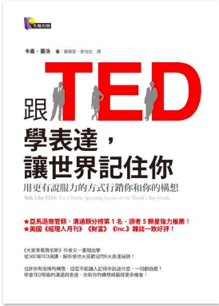

- 跟TED學表達，讓世界記住你 - 用更有說服力的方式行銷你和你的構想
- Talk Like TED : The 9 Public Speaking Secrets of the World's Top Minds
- 作者：卡曼．蓋洛  
- 原文作者：Carmine Gallo  
- 譯者：羅雅萱、劉怡女 
- 出版社：先覺出版
- 出版日期：2014/05/29

書籍網址：  http://moo.im/a/23bdVW

# 前言:

最近即將在年底的大活動來講比較軟性的題目。公司提供很好的福利給來分享的講者適當的訓練 ，為了能夠更了解，特地去買了電子書閱讀器 (readmoo)，也買了一堆電子書來好好閱讀。

記得曾經聽誰說過『越硬的內容，講起來越軟（代表簡單）；而越軟的內容，講起來越硬（代表很難）』，所以開始不斷的閱讀一些如何說出一個好演講的書籍。有兩本其實相當推薦。這是其中一本，另外一本是「跟TED學說故事，感動全世界」。 

此外，為何說「越硬的內容越好講？」因為越艱深的內容，最重要的課題是要講的「淺顯易懂」這樣就已經成功了八成，只要在中間再加上一點點笑話，就是一場完美的演講。 但是軟性的演講是需要聽眾 call for action 的，更是因為每一張投影片可能都相當的容易了解。所以要能講到內心深處就格外的困難。要能夠讓聽眾感同身受，並且像是受到佈道般的激動感受。

# 內容簡介:

這是一本精心挑選了很多傑出的 TED 演講的書籍，並且詳細的解讀了每一個成功的演講背後的原因。

以下幾個是擷取出來的推薦，也是我最喜歡的幾個章節之一。

**▍羅賓森爵士如何幽默的談教育，使他的談話成為迄今最受歡迎的TED演說，勝過許多名人？**
POINT！關鍵的第一步聽起來可能違反我們的直覺──別企圖表現得很幽默！帶有幽默感的敏銳觀察，才是最恰當，也最有效的。

**▍比爾‧蓋茲為什麼要把蚊子帶上TED講台，是什麼原因讓他的演講5年後依然被討論？**
POINT！在演說中加入令聽眾瞠目結舌的橋段，那麼這段教他們難以忘懷的演說就能緊緊抓住他們的注意力，並且在演說結束後仍久久不忘。

**▍發現鐵達尼號的深海探險家巴拉德，如何在18分鐘內讓人們重新認識海洋？**
POINT！告訴聽眾一些他們從來沒聽過的資訊，並且以別出心裁的方式來包裝這些資訊；或針對行之有年的老問題提出新鮮、新奇的解決之道。

# 心得:

這是一本相當好的書籍，雖然整本書都是以介紹 TED 的成功演講為案例。但是非常清楚地解釋了每一段演講成功的原因，並且有附上相關演講的  QR code 。 雖然之前有一段時間我中午都是邊吃飯邊看 TED ，但是裡面還是有相當多段影片是我沒有看過的。 

首先推薦的就是羅賓森爵士這段 TED 史上點擊率最高的演講，真的是相當的幽默風趣。讓每個聽的人都會會心一笑之外，也會認真的思考教育本質的問題。就如同他一直說的，「如果你的演講不有趣，就不會有人聽你說話。」再來我也很推薦比爾蓋茲的思路，首先透過不斷的清楚堆砌故事來深入人心之後。最後透過放蚊子的方式來打破每個人的防禦心，讓故事深刻的打到每個人的心理。

相當推薦這本書可以給以下兩種人：

- 如果你很喜歡看 TED 的演講影片，但是不知道哪幾篇是最受歡迎的。可以來看看這本分析，會讓你欣賞精彩的演講之外，深刻的了解許多背後的用意。
- 如果你跟我一樣，有一個機會要講比較軟性的演講。也很推薦你先從這一本看起，因為他會先開始讓你有學習的動機。先從欣賞一場好演講開始。
