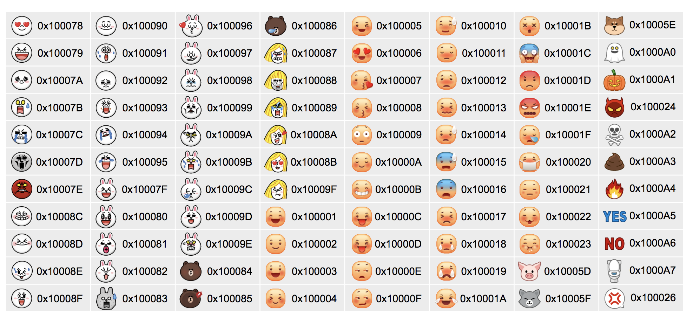

# 前言

大家都知道 LINE 有一些自己獨特的表情符號（而非一般的 emoji) ，如果真的想要在 chatbot 中來顯示表情符號其實沒有那麼簡單。剛好發現其實網路上的資源也不多，順便寫一下相關資料分享給大家。


## 顯示一般的表情符號 (Emoji)

⚽️ 🏀 🏈 ⚾️ 🏐 🏉 🎾

如果要顯示 emoji ，其實他的代碼可以直接複製。這裡有兩種方式可以顯示。

- 直接將 emoji 複製起來，貼到字串裡面即可 `str := 🍆` 即可

如果要顯示完整 emoji 列表[可以去這裡找](https://getemoji.com)


如果要透過 Golang 來顯示，可以透過以下的程式碼:

<script src="https://gist.github.com/YamiOdymel/6f3aa12a945fa8b2f8c3b1682fff3d6c.js"></script>


## 關於 LINE 自訂的表情符號 

首先要先解釋一下， 一般來說如果要在官方帳號(OA) 上面直接發送具有 LINE 特定的表情符號可以透過以下方式。 

```
\uDBC0\uDC84  
```

這一段代表的就是顯示熊大的表情符號。但是你會發現不論你如何顯示都無法正常顯示。


經過尋找過後，發現以下的 issue 已提醒相關的資料。[Python LINE SDK discussion](https://github.com/line/line-bot-sdk-python/issues/54)

裡面有提到兩件重要的事情:

- LINE Emoji 是自定義的，要參考 [LINE Emoji document](https://devdocs.line.me/files/emoticon.pdf)
- 透過另外一個討論 [Java LINE SDK discussion](https://github.com/line/line-bot-sdk-java/issues/179) ，會發現 LINE Emoji 需要透過 utf32 來轉換到 utf8 。 （因為 Golang 本身都是透過 utf8 來處理字串）

所以處理方式如下：

- 透過 [LINE Emoji document](https://devdocs.line.me/files/emoticon.pdf) 來查表，找尋需要的 熊大 Brown 表情 `0x100084`
- 由於是 32 位元，前面補零 0x00100084
- 產生 utf32 decoder 
- 轉換 utf32 成 utf8

那就直接來看程式碼:

<script src="https://gist.github.com/kkdai/01a761b68f1c35766eeea16c3260005e.js"></script>


# 參考

- [LINE Emoji document](https://devdocs.line.me/files/emoticon.pdf)
- [Python LINE SDK discussion](https://github.com/line/line-bot-sdk-python/issues/54)
- [Java LINE SDK discussion](https://github.com/line/line-bot-sdk-java/issues/179)
- [Golang UTF32 API](https://godoc.org/golang.org/x/text/encoding/unicode/utf32#UTF32) 
