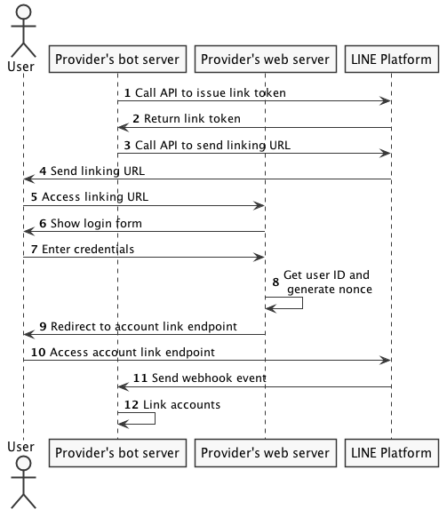

(圖片來自: [LINE Developer Document: Link user account](https://developers.line.me/en/docs/messaging-api/linking-accounts/) )

# 前言

經營有成的電子商務網站，如果想要透過 LINE 官方帳號( OA: Official Account) 與聊天機器人來觸及更多使用者應該要怎麼做呢？ 你要如何透過安全又有效的方式來串連網站與 OA 的互動呢？ 

這篇文章將介紹 LINE account binding，透過 account binding 可以讓你的 chatbot 了解面對的使用者身份。並且透過綁定帳號的方式來提供使用者一制化的體驗。並且透過一個範例來讓你更容易快速建置出來。 

# 範例程式碼

https://github.com/kkdai/line-account-link

# 如何部署範例程式碼:

- 到 [LINE Developer Console](https://developers.line.biz/console/) 建立相關的 Provider 跟 Channel

- 建立一個 [LINE@](https://at.line.me/tw/) 並且打開 MessageAPI 的功能，並且將以下兩個資訊記住:

  - Channel Secret
  - Channel Token

- 到 https://github.com/kkdai/line-account-link  按下  Heroku Deploy ，建立該帳號並且部署該服務。這時候會要輸入三個資訊:

  - LINECORP_PLATFORM_CHANNEL_CHANNELSECRET
  - LINECORP_PLATFORM_CHANNEL_CHANNELTOKEN
  - LINECORP_PLATFORM_CHANNEL_SERVERURL
    - 這個資訊根據你的 heroku app 名稱來決定，假設你的 Heroku app 名稱叫做 `test-api-1234` 那麼你就該填 `https://test-api-1234.herokuapp.com/`

- 記得把 `https://test-api-1234.herokuapp.com/callback` 加到 LINE chatbot web hook 才能正確地啟動聊天機器人。

# 範例應用場景

這個範例想要表的是一家電子商務公司有 三個使用者 (ID: 11, 22, 33) 也都有相關的身份資料在該電子商務網站。而這個聊天機器人可以展示如何透過 LINE account binding 來串連你的使用者與聊天機器人。

整個場景都流程分成以下幾個步驟:

- 使用者加入電子商務的官方帳號 。
- 在官方帳號選單的聊天機器人視窗中，選擇“帳號綁定” (link)。
- 連線到該電子商務網站，輸入原本已經有的帳號跟密碼。
- 確認帳號訊息無誤後，倒回聊天機器人並且進行帳號綁定。

# 實際跑一個範例

- 先 Deploy  該範例專案，或是直接加入測試機器人 @yzy8635g (也可以掃描以下 QR Code)
- 
- 加入帳號後 ，輸入任何字串都是會顯示帳號尚未綁定。你可以連到該商業網站顯示帳號 (list) 或是直接開始綁定帳號 (account link)

- 按下 "list" 會傳回顯示所有使用者的網址．按下 "link" 則顯示登入頁面開始登入。

- 到了登入網頁，就輸入該商業網站的帳號跟密碼。 這個範例程式裡面是 11, pw11 （假定使用者叫做 Paul)
- 登入成功之後，就會收到 chatbot 回報帳號綁定成功。把綁定帳號網頁關閉即可。（要做得更好，可以透過 LIFF 來做 account binding 就可以自動關閉網頁）
- 回到聊天機器人，這時候帳號就顯示綁定完成。表示 chatbot 能夠將你與商業網站的使用者連接一起。 chatbot 也就已經將使用者 Paul 的帳號綁定。

# 流程圖與程式碼解釋

根據以上的流程圖，稍微說明一下每個角色代表的意義：

- **User:**
  - 就是指的是 LINE 上面的用戶。
- **Provider's bot server:**
  - 這邊指的就是該商業服務的 LINE 官方帳號的聊天機器人伺服器。
- **Provider's web server:** 
  - 這個就是該商業服務的網站伺服器，如果是購物網站就是該購物網站的後台伺服器。
- **LINE Platform:**
  - 這個就是指 LINE 平台的資料處理系統。

了解每個角色代表的意義之後，我們開始解釋每個流程所代表的意思．通常在 [Account Link](https://developers.line.me/en/docs/messaging-api/linking-accounts/) 發生的時候，商業網站的官方帳號會發送一個「是否要連接你的 LINE 帳號與商業網站？」的請求．當使用者同意之後，才會啟動以下的相關步驟：

1. 官方帳號的 LINE bot 會對 LINE 平台發送一個該使用者要求 account link 的 token 請求。

2. 如果請求資料正確， LINE 平台就會回覆一個 token 。 

   > `res, err := bot.IssueLinkToken(userID).Do()` 這樣可以透過該使用者帳號直接 issue token

3. 官方帳號的 LINE bot 透過取得的 token 跟 LINE 平台請求將兩個資料做連接。

4. LINE 平台會傳回一個網址，讓使用者透過該網址來做資料的連接。

   > 這邊就傳回 該網站的 `/link`以這個作為鏈結的網址。

5. 使用者連線到該網址（這裡通常是透過 LINE bot 直接送出 URL scheme 讓使用者點選導向該網頁）．請注意這個網址會是直接連接到商業網站之中。

6. 顯示該商業網站的登入畫面，讓使用者登入該綱頁網站。

7. 使用者在商業服務平台輸入了自己的登入資訊。

8. 商業服務平台透過使用者的帳號資訊產生了一個隨機數 (nounce)。

   > 雖然說 nounce 為隨機數，其實有產生的規則與限制
   >
   > - 使用 secure random number generator
   > - 建議透過 base64 encode 

9. 商業服務平台將使用者導向到 LINE 平台的 account-linking 的進入點。

10. 使用者讀取 account-linking 進去點，並且將商業服務平台的隨機數帶進去。

11. LINE 平台傳回同一組隨機數與使用者 ID (UID) 到商業服務平台的 webhook 用來作為綁定之用。 

12. LINE bot 這時候收到該隨機數 (nounce) 的認證，透過這個隨機數 (nounce) 將使用者在 LINE 上面的身份與商業服務平台帳號取得綁定。

    > 也就是最後要將這些資訊傳回給 Server ，作為綁定成功地確認`https://access.line.me/dialog/bot/accountLink?linkToken={link token}&nonce={nonce}`

13. 這時候 chatbot 會收到 `EventTypeAccountLink` 的 event 並且透過結果可以知道該使用者綁定成功。 nounce 也會提供給你作為帳號比對的資訊。
  

# 為何要使用 Account Link 

透過 account link 可以讓 chatbot 裡面的使用者與原先商業網站的帳號相互的綁定。透過的機制就是一開始 issue link token 並且在登入成功後將 token 帶回到 chatbot 裡面，並且透過產生的 nounce 可以確保雙方資料的無誤與正確性。 整體來說，使用 account link 具有以下的優點:

- **步驟簡單**：透過 `IssueLinkToken` 與 API call 即可完成整個綁定流程。
- **安全**：透過改使用者申請的 token 才能夠作為 accountLink 的回傳 token ，可以確保手續完整性。

# 什麼樣的情況會需要使用 Account Link

這個部分將會討論，什麼樣的情況下會需要使用 account link:

- 已經有大量的使用者族群在原有的商業網站上面
- chatbot 需要綁定原有的使用者資訊

# 總結

對於已經有相當量使用者的服務提供商而言，透過 account link 可以讓 chatbot 的使用者與原有服務的帳號資訊綁定，讓使用者有著一致的服務體驗。方法上也相當簡單，希望透過這個範例可以讓開發者更容易了解整個流程與概念。

# 參考

- https://developers.line.biz/en/docs/messaging-api/linking-accounts/
- https://github.com/kkdai/line-account-link
