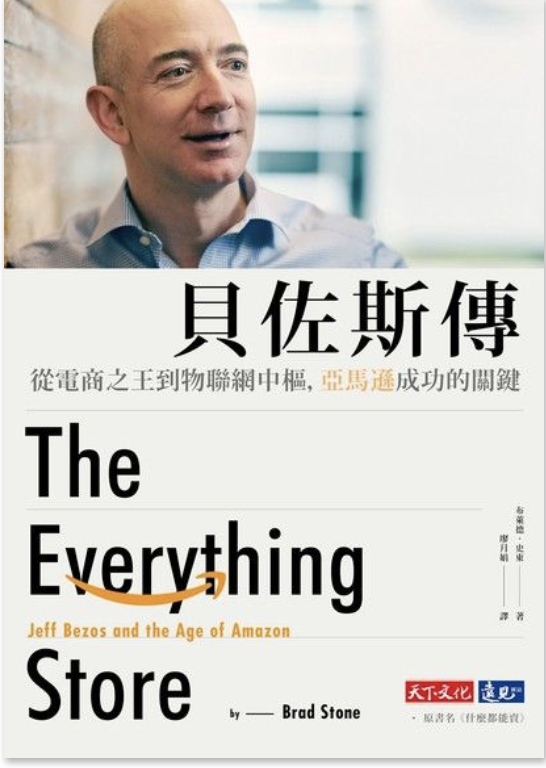

(圖片參考 [讀墨](http://moo.im/a/14auRV))

```
貝佐斯傳
從電商之王到物聯網中樞，亞馬遜成功的關鍵
The Everything Store : Jeff Bezos and the Age of Amazon
```

#### 買書推薦網址: http://moo.im/a/14auRV


# 前言:

最近要開始撰寫一些之前看完的書籍的書，這一本貝佐斯傳應該是很久以前就想要拜讀的一本書。被《哈佛商業評論》評為「全球最佳現任CEO」，貝佐斯除了無止境的創造力與才能之外，大概為人熟知的就是跟賈伯斯齊名的暴躁性格。身為世界前三大（不斷輪替的排名）的企業執行長。到底是透過哪些轉折與哪些堅持才能讓亞馬遜到達今天的高度，都是我在開啟這本書之前的疑問。


# 內容簡介:

一開始就從奇特的前言。一本被敘述天才兒童的書籍<引爆天才>一本敘述著12歲但是穩重的天才兒童的書籍。「身材瘦小，待人和善但是個姓嚴肅」是這本書這樣敘述著這個稱為“提姆”的天才兒童。後來畫面一轉才帶到，他就是我們這本書的主角貝佐斯的小時候。

書籍一開始開始敘述著貝佐斯的性念。喜歡讀書的貝佐斯，辭掉了在華爾街的風險交易公司大筆薪水。隻身決定創立亞馬遜一個網際網路販賣書籍的電子商務。信念就是要滿足客戶所有的需求，以及要讓客戶獲得最大的利益。透過這樣的信念，從一開始的網路商城的販賣，到經歷著千禧年的網路泡沫的風暴。亞馬遜就是不段秉持著要讓客戶獲得最佳購買體驗的堅持下。不斷的修改與擴充著網站的功能。一鍵購買， Amazon Prime, 到相關推薦的功能。每一個都是亞馬遜的獲勝關鍵，但是回過頭來看卻都是最能夠讓使用者方便購買與提升滿意度的功能。

第二段提到他的文學素養，從他從小喜歡閱讀書籍開始。不喜歡事情被簡化處理，於是要求部門報告捨棄投影片的格式。使用六頁的文字報告。除了要求報告的人要能夠清楚的報告與敘述問題之外，也要求他們要能夠有效的將要講解的事情縮短在六頁的內容之中。再來，喜歡閱讀的個性根深蒂固。也造就了電子閱讀器 Amazon Kindle 這個亞馬遜劃世代的秘密武器的誕生。這本書也清楚地刻畫了電子閱讀器如何在亞馬遜誕生的過程。從硬體的製造，到內容的產生如何縝密的企劃，造就 Kindle 上市的時候熱賣的熱潮。

最後面提到貝佐斯常常自詡是傳教士，希望能夠讓客戶獲得最方便最合理的價格來獲得他們要的商品。但是貝佐斯也不得不提他的商業手段。不論身為執行長的快速理解的能力，並且能夠正確的看穿每個人報告的盲點，毫不留情面的批評（恩，可能到罵）也是貝佐斯為人熟知的一面。

「這份文件是Ｂ咖團隊寫的，請給我一份Ａ咖團隊的文件」「你這個人到底是懶惰，還是無能？」這些都是貝佐斯不留情面的批評。但是由於能夠批評到正確的點，讓團隊的每個人都能夠信服。自詡為傳教士的貝佐斯也說「我寧可當傳教士，再怎麼樣也不會去當傭兵。弔詭的是通常傳教士賺的比傭兵多」 XDDD

當然這本書也有亞馬遜在商業上的專注與霸道的一面。從聯合使用者來大砍傳統書商的價錢，到電子書方面的手法都是相當的高明。也是這本書很推薦的一個部分。


# 心得:

起初看貝佐斯的時候，會以為他比較像是賈伯斯一樣的是極端的完美主義者。但是飽讀詩書的貝佐斯又不僅僅是完美主義者。更是完美的現實主義者。透過許多實際的手段要達到他心目中的理想境界。 在亞馬遜連續虧損的狀況下，卻能夠堅持已見不段打造出強大的亞馬遜王國。透過他自己的夢想，一個喜歡閱讀書籍，喜歡太空產業的小男孩。搖身一變成為世界上數一數二強權的執行長。這本書的敘述會讓你覺得一點都不是運氣，是不斷的堅持，不斷的努力。 日以繼夜地思考與努力打磨著最好的消費者體驗的結果。

這本書會像是看著一個記者不斷的從旁側寫的狀況來敘述。但是又能夠清楚的讓人了解貝佐斯的理念與想法，是如何深刻的影響他的處世與亞馬遜企業的核心價值。相當推薦大家來看看這本書。