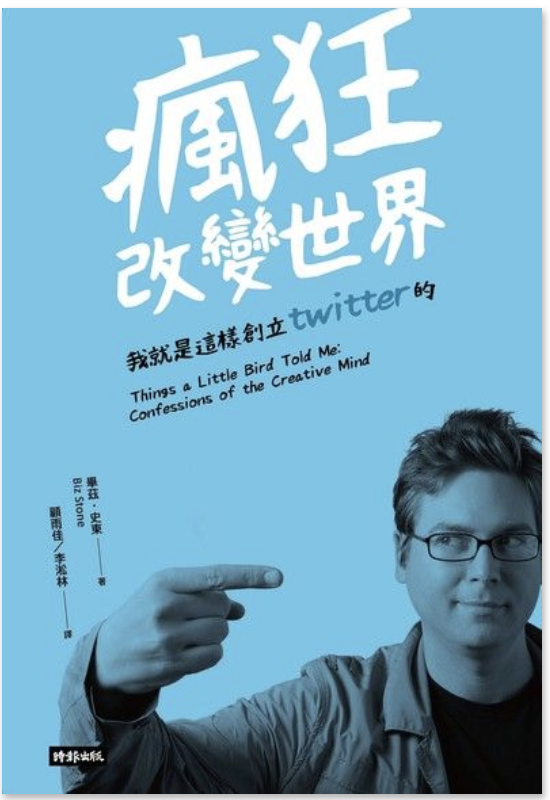

(圖片參考 [讀墨](http://moo.im/a/5bvHJO))

```
作者：畢茲．史東  
原文作者：Biz Stone  
出版社：時報出版
```

#### 買書推薦網址： http://moo.im/a/5bvHJO

# 前言:

雖然沒有工程的背景，卻用滿滿的熱情進入了 Google 工作。卻又因為自己想要創業的想法而離開 Google 並且透過熱情與創意的想法，建立了 Twitter 。這個 140 字卻具有天馬行空想像力的社交平台，全世界最受歡迎的社群網路之一。 

這本書的文字不多，但是卻讓人讀起來相當的過癮。我週六就迫不及待的把它讀完。算是年假中心靈上第一個讓我覺得充實的收穫。

# 內容簡介:

就如同我提到的，一開始沒有工程背景的 Biz Stone 就透過 Google 的自我推薦的勇氣並且勇敢地參加 Google 的面試流程作為第一個章節的開場。 這本書主要的內容在敘述著：自我追求，勇氣與透過熱情來追求自己喜愛的事業。 

之後開始敘述 Biz Stone 與 Evan Williams (部落格的創始人)一同離開 Google 之後想要尋找自己熱愛的下一個行業。當然過程中也沒有那麼順利，從 Odeo (podcast 的新創公司) 到重新決定要透過內部創業來思索下一個產品。充滿的熱情喜愛自由的  Biz Stone ，充分的發揮他的不畏懼任何失敗與自由的想法。 以下分享兩個書中提到的例子：

1. 大學時候的  Biz Stone 拿到了全額的獎學金在設計學院之內。但是同時也在幫雜誌社擔任搬運的工讀生工作。因緣巧合下，偶爾的把自己的作品讓編輯看到大獲好評。當時也就勇敢的休息來擔任當全職設計師。邊在工作，邊學習設計相關的產業。
2. 聽到 Blogger 被 Google 收購後，勇敢地寫下慶祝信件給沒見過面的  Evan Williams 並且毛遂自薦 Google 應該錄取他。

這些都充分地展現出來他骨子裡的勇氣與自由的因子。這些也都是造就 Twitter 的成功因素。全書也大部分在分享著他的自己是如何看到失敗，如何面對著疑惑的時候如何鼓起勇氣大膽做出具有創造力的嘗試。


# 心得:

這本書頁數不算多，但是讀起來相當的引人入勝。並不是因為你見證了網際網路裡面最瘋狂的因子，而是  Biz Stone 想要透過這短短的頁數來分享他是如何「瘋狂」 ，應該是說他是如何的無懼去面對每一個疑惑的選擇，透過從小的許多故事。你可以了解他如何來面對這些時刻，如何的勇敢到近乎瘋狂的狀態來處理每一個抉擇。 Twitter 無疑是網路上最自由的想法，如同他的圖示一般。自由而不受拘束的想法。

如果讀者們常常感受到疑慮，害怕失敗而不敢做決定，不敢往前邁進。建議來看看這本書。做個瘋狂而自由的自己。