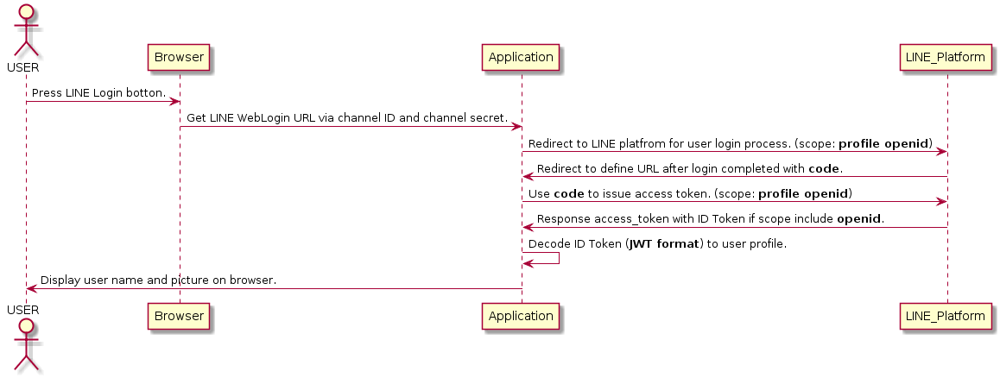

(圖片來自: [Integrating LINE Login with your web app](https://developers.line.biz/en/docs/line-login/web/integrate-line-login/) )


# 前言

接著上篇文章["[Golang][LINE][教學] 導入 LINE Login 到你的商業網站之中，並且加入官方帳號為好友"](http://www.evanlin.com/line-login/) 之後，接下來這篇文章會更深入地提到使用 LINE Login 來取得使用者資訊的兩種方式，並且透過原先提供的範例程式結合來更了解整個流程。由於這部分的程式碼會不斷使用到 [LINE Social API](https://developers.line.biz/en/docs/social-api/overview/)，在此也將相關的部分整理成 [LINE Social API SDK in Go](https://github.com/kkdai/line-social-sdk-go)，希望讓開發者能夠更快上手並且更了解整個用法。

接下來閒聊部分，其實這篇文章是重打第二次。上一次在過年期間打了五天的文章因為只有 local commit 而忘記 push 到 github (想說還是 draft) ，[電腦壞掉等待維修](http://www.evanlin.com/til-restore-nb/)只好再重打一次。


# SDK and Sample code

## LINE Social API SDK in Go

#### https://github.com/kkdai/line-social-sdk-go

[LINE Social API SDK in Go](https://github.com/kkdai/line-social-sdk-go) 把所有經常在 [LINE Login](https://developers.line.biz/en/docs/line-login/overview/) 會使用到的相關功能與 [LINE Social 所有的 API](https://developers.line.biz/en/docs/social-api/overview/) 都包裝好成一個 SDK ，方便開發者使用。 


## LINE Login starter in Go

#### https://github.com/kkdai/line-login-go

本 LINE Login starter 除了開一個馬上就可以使用的範例之外，並且搭配著[一篇教學的文章](https://www.evanlin.com/line-login/)來告訴各位該如何使用這份 starter 。這份 starter 也會有完整的 LINE Social API 相關的使用方式。


# 使用 OpenID 來取得使用者資訊




以上循序圖是根據 LINE 官方文件中的 ""[Integrating LINE Login with your web app](https://developers.line.biz/en/docs/line-login/web/integrate-line-login/)" 教學文件所繪製的循序圖，稍後將依據這份循序圖上的每個流程來仔細討論該如何透過 [LINE Social API SDK in Go](https://github.com/kkdai/line-social-sdk-go) 來使用。

## 流程: 使用 OpenID 來取得使用者資訊

#### Press LINE Login botton:

這個部分就不解釋，準備好一個按鈕並且按下後會開始跑下一個階段的產生 WebLogin URL 即可。


#### Get LINE WebLogin URL via channel ID and channel secret:

主要是透過輸入 LINE login 的 channel ID 跟 channel secret 來產生相關的需求的網址。詳細流程可以參考文件"[Making an authorization request](https://developers.line.biz/en/docs/line-login/web/integrate-line-login/)"。 進行這個階段的時候，需要確認幾個需求才能讓導向 LINE Platform 的 LINE Login 流程能夠拿到正確的


以下透過程式碼來敘述該如何使用 LINE Social API SDK 之外，也教導該如何拿到正確的 WebLoogin URL:

<script src="https://gist.github.com/kkdai/954b2337bdcb94fff45c845f75739d12.js"></script>

這邊分成幾個部分來解釋:

- 首先一開始需要初始化 Social API SDK 套件，這邊只要提供 Channel ID 跟 Channel Secret 就可以
- 接下來提供如何取得 `GetWebLoginURL`
- 在之前請注意需要產生 state 與 nonce 做之後的比對認證之用。
- 透過 `http.Redirect(w, r, targetURL, http.StatusSeeOther)` 就可以正確轉轉址 LINE platform 繼續進行 LINE Login

#### Redirect to LINE platfrom for user login process. (scope: **openid**)

這邊提的就是透過 `http.Redirect(w, r, targetURL, http.StatusSeeOther)` 將此用者正確自動轉向到 LINE Platform 的登入網頁。

#### Redirect to define URL after login completed with **code**.

這時候就會透過 LINE Login 的網頁讓使用這輸入帳號資訊。[並且只要是使用 LINE Login v2.1 就可以讓使用者直接透過 QR Code 來登入。](https://developers.line.biz/en/news/#line-login-you-can-log-in-with-a-qr-code-2019-02-05) 並且會透過開發者當初登入的 callback address ，回傳資料 `code` 。 這樣的資訊需要儲存起來作為稍後索取 access token 之用。


#### Use **code** to issue access token. (scope: **openid**)

<script src="https://gist.github.com/kkdai/4526cb8b4fa1032eed2bb7cd69c3ad5a.js"></script>


#### Response access_token with ID Token if scope include **openid**.

接下來會收到 LINE Platform 傳進來的 `Access_Token` ，由於 scope 裡面具有 OpenID 所以回傳回來的 access token 會多一個資料為 `id_token`。

```
{
    "access_token": "bNl4YEFPI/hjFWhTqexp4MuEw5YPs...",
    "expires_in": 2592000,
    "id_token": "eyJhbGciOiJIUzI1NiJ9...",
    "refresh_token": "Aa1FdeggRhTnPNNpxr8p",
    "scope": "profile",
    "token_type": "Bearer"
}
```

(此範例結果為[官方文件回傳](https://developers.line.biz/en/docs/line-login/web/integrate-line-login/#spy-getting-an-access-token)的資料)

#### Decode ID Token (**JWT format**) to user profile.

接下來就可以透過 `id_token` 裡面的資料將使用者的資訊解析出來，這裡可以直接使用 Social SDK in Go 的方式來使用。 

<script src="https://gist.github.com/kkdai/d5e9fc8356338d7b308d0332ec8b2fb0.js"></script>

- 裡面的 `channelID`主要是拿來作為檢驗之用。

```
type Payload struct {
	Iss     string `json:"iss"`
	Sub     string `json:"sub"`
	Aud     string `json:"aud"`
	Exp     int    `json:"exp"`
	Iat     int    `json:"iat"`
	Nonce   string `json:"nonce"`
	Name    string `json:"name"`
	Picture string `json:"picture"`
}
```

解碼出來的資料如上，就可以直接拿 Name 與 Picture 來使用了。

#### Display user name and picture on browser.

這邊就不解釋了。


## 小結：透過 OpenID 的方式來取得使用者資訊

本段流程與範例程式碼展現了如何透過 OpenID 的方式在使用者透過 LINE Login 登入的時候，一次就能夠取的使用者的資訊。雖然能夠一次就取得使用者的資訊，但是其實資訊是需要自己來解碼處理的。接下來將介紹透過另外一個方式來取得使用者的資訊。


# 使用 Access Token 來取得使用者資訊


以上循序圖是透過 Access Token 再去取的使用者資訊的方式，稍後將依據這份循序圖上的每個流程來仔細討論該如何透過 [LINE Social API SDK in Go](https://github.com/kkdai/line-social-sdk-go) 來使用。

## 流程: 使用 Access Token 來取得使用者資訊

以下有不少重複的地方，就跳過不在贅述。

### Press LINE Login botton.

### Get LINE WebLogin URL via channel ID and channel secret.

### Redirect to LINE platfrom for user login process. (scope: **profile**)


<script src="https://gist.github.com/kkdai/f62a8777119970ec4f44b14fd78289b7.js"></script>

以上的部分，可以發現跟前一段不同的方式就是 scope 裡面的數值不同。透過這樣取得的 `code` 只能夠拿到 profile 的 access token 權限。

### Redirect to define URL after login completed with **code**.

### Use **code** to issue access token. (scope: **profile**)

### Response access_token. (without ID Token)

因為使用的 `code` 的 scope 並不具有 OpenID 的部分，所以資料也只有以下的範例。

```
{
    "access_token": "bNl4YEFPI/hjFWhTqexp4MuEw5YPs...",
    "expires_in": 2592000,
    "refresh_token": "Aa1FdeggRhTnPNNpxr8p",
    "scope": "profile",
    "token_type": "Bearer"
}
```


### Use **access token** to get user profile via Social API (https://api.line.me/v2/profile)

<script src="https://gist.github.com/kkdai/6b7e19b255c45fb25a48ecc51088ef64.js"></script>

稍微對於上面一段的程式碼做了一些修改，可以看得出來透過 `token.IDToken` 長度的判斷。其實可以知道原先的 scope 有沒有 OpenID 。

如果是透過 access token 要做，需要再透過 access token 去呼叫 Social API 的 [Get user profile API](https://developers.line.biz/en/reference/social-api/#get-user-profile) (`https://api.line.me/v2/profile`) 的方式來取得使用者的資訊。

跟前一個方式不同的是，雖然還需要多呼叫一次來取得使用者資訊。

### Response with user profile with user name and picture. (email by request)

由於是透過 Social API 的 [Get user profile API](https://developers.line.biz/en/reference/social-api/#get-user-profile)  來取得使用者資訊，也不用特別的相關處理。

```
{
  "userId":"U4af4980629...",
  "displayName":"Brown",
  "pictureUrl":"https://example.com/abcdefghijklmn",
  "statusMessage":"Hello, LINE!"
}
```

(這邊為[官方範例](https://developers.line.biz/en/reference/social-api/#get-user-profile)的回傳範例資料)

### Display user name and picture on browser.

這段就不解釋了。


# 完整的相關範例:


最後修改了前一篇文章所提供的範例程式碼，並且完整的提供相關的處理流程給讀者們參考。 讀者可以到 https://github.com/kkdai/line-login-go 的地方去查看如何快速部署。或是可以直接使用 [https://login-tester-evan.herokuapp.com/](https://login-tester-evan.herokuapp.com/) 來使用即可。


#### 範例網站 [https://login-tester-evan.herokuapp.com/]( https://login-tester-evan.herokuapp.com/)

# 比較表格

對於兩種方式的簡單比對希望透過表格的方式能夠清楚的了解兩者的差異。

| 透過 LINE Login 取得使用者資訊的方式 | Open ID          | Access Token |
| ------------------------------------ | ---------------- | ------------ |
| LINE Login 的時候要求的 scope 權限   | `profile openid` | `profile`    |
| 需要透過 access token 另外呼叫       | 不需要           | 需要         |
| 需要額外處理回傳資料                 | 需要處理 JWT     | 不需要       |


# 總結:

這篇文章主要介紹了一個方便各位使用 LINE Social API 的 SDK 套件，並且詳細解釋了 LINE Login. 兩種取得使用者資訊的方式。 希望透過這些流程可以讓讀者更清楚 LINE Social API 的使用方式，並且也對於使用者資料更了解該如何取得。


# 參考

- [LINE Social API](https://developers.line.biz/en/docs/social-api/overview/)
- [LINE Social API SDK in Go](https://github.com/kkdai/line-social-sdk-go)
- [Linking a bot with your LINE Login channel](https://developers.line.biz/en/docs/line-login/web/link-a-bot/)
- [Integrating LINE Login with your web app](https://developers.line.biz/en/docs/line-login/web/integrate-line-login/) 
- https://github.com/kkdai/line-login-go
