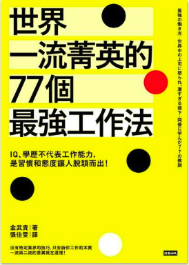

(圖片參考 [讀墨](http://moo.im/a/notuLN))

```
作者：金武貴  
原文作者：ムーギー．キム  
出版日期：2018/10/30
```

#### 買書推薦網址： http://moo.im/a/notuLN

# 前言:

這本書會買是因為好像在 [讀墨](https://readmoo.com/book/210098682000101)的一篇文章推薦裡面，本書介紹的工作法真的很值得學習。就買了電子書來看。 而且這本書的寫作方式相當符合暢銷文學作品的方式，比如說命名法，還有文章排版，可以參考[『這本書要賣100萬本』](http://www.evanlin.com/e8-ae-80-e6-9b-b8-e5-bf-83-e5-be-97-e3-80-8e-e9-80-99-e6-9c-ac-e6-9b-b8-e8-a6-81-e8-b3-a3100-e8-90-ac-e6-9c-ac-e3-80-8f/)的讀書心得。

這本書主要敘述作者身為財經專欄專家的金武貴，分享他在跟世界上不同國家的工作菁英工作時候發現對方的小習慣。並且用條列式與許多的範例來讓讀者更容易了解為何這些工作方式重要。 

這些工作方式真的很值得學習： 從細節，專注，到堅持，自我學習與成長與熱愛你的工作。 每個工作法都是菁英的思維，很建議常常苦於工作成長受限的人來學習。


# 內容簡介:

本篇文章將七十七個工作心法（也可以說是良好的工作習慣）加以分類為以下的類別:

- **基本功（最基本，連這些都沒有無法自詡為菁英）:**
  - 細節的筆記
  - 簡單扼要的信件
  - 串連想法的能力
  - 對於工作熱情的傳遞
  - 透過聲調的討論來講解溝通的重要
- **自我管理：（比較像是良好的生活與工作心態，也是我最欣賞跟努力的部分）**
  - 早起
  - 守時
  - 自我約束
  - 定時運動
  - 壓力管理
  - 學習習慣
- **心裡的素質（有能力的人，往往心理素質都強人一等）：**
  - 自主性
  - 工作品質（論如何將一個小事情做到最好，最細）
  - 先見之明
  - 超乎期待（做超過自身待遇與被期待賦予的事情，絕對不要說不是我的事情就擺著爛！！）
- **一流的領導人（當菁英變成主管後，該如何領導下屬）：**
  - 親切
  - 尊重
  - 讓部屬成長與得利
  - 以身作則
- **自我實現（工作以外，更需要思考的好習慣）：**
  - 想做的事情，就要去做（選定自己熱愛的工作）
  - 熱愛你的工作，天賦的人不會退休
  - 活用強項（當你某件事情做得很好的時候，絕對不要免費幫人做）
    - “**If you**'re **good** at something, **never do it for free**.”
  - 組織團隊
  - 自我挑戰


# 心得:

如何變成受人尊重的職場菁英，如何讓自己在工作上能夠更加的順利與有成就，一直是常常被人拿出來的話題。不少的書籍都在講解如何做好筆記，如何管理上司與部屬之外，卻少有書籍像這本一樣有些章節從心理素質講起。

自職場上見過許多有能力的人，往往都是對於自我約束更努力的人。 最間單的就是對於食物，對於運動的堅持。我也是認為，一個成功的人往往對於自己訓練極致苛刻，對於時間的掌握能夠無比精確。  因為對於時間，對於自我約束的人都是在默默持續努力的人。

見過很多人對於工作很認真，但是對於自己生活的習慣無法約束。不能拒絕美食，不能持之以恆的運動（或是健身），每次喊著要學習卻無法認真學習玩一個段落。 都不是一個工作上菁英的表現。

這本書能夠鏈結這些心理素質到工作的習慣，工作的態度是我當初會選擇這本來讀的原因。許多的範例與案例也是讓人閱讀得津津有味。

另外一個喜愛這本書的原因也是作者很強調必須要熱愛自己工作的原因，經常看到不少人抱怨自己公司很累，常常被要求做一些不是自己該做的事情。這本書教導讀者應該要找到適合你天賦的工作，然後熱愛你的工作。這些會讓你在處理工作上許多小細節的事情能夠更加的樂觀與豁達。不再去怨天尤人抱怨公司虐待你，而是主動去思考該如何讓自己工作上更有成長，更有樂趣。

很推薦大家來讀這本書，也希望每一個讀者都能夠找到讓自己更快樂的工作習慣。