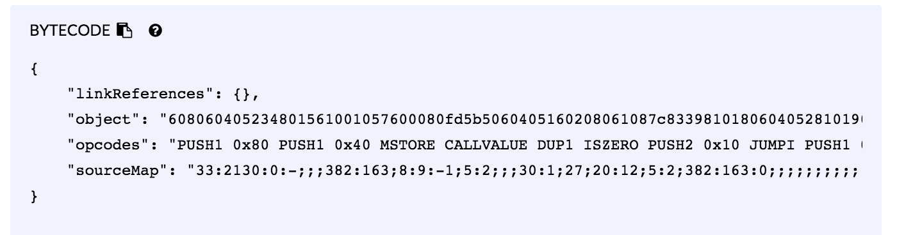

# [Blockchain Specialization](https://www.coursera.org/specializations/blockchain) 系列上課心得

- [Blockchain Basics](http://www.evanlin.com/moocs-bitcoin-basis/)
- [Smart Contract ](http://www.evanlin.com/moocs-smart-contract/)(本篇）
- Decentralized Applications (Dapps)

## Smart Contract 課程鏈結:  [這裡](https://www.coursera.org/learn/smarter-contracts/home/welcome)

# 文章鏈結:

- [Smart Contract (一）: Week 1 ~ week2](http://www.evanlin.com/moocs-smart-contract/)
- [Smart Contract (二）:Week3  ~ week4](http://www.evanlin.com/moocs-smart-contract2/) 
- [Smart Contract (三) : 期末作業](http://www.evanlin.com/moocs-smart-contract3/)

# 前言：

第二堂課其實拖得有點久，原本是在 LINE 就職前希望可以完成，但是也是拖到現在才完成。 不過這堂課有許多關於 Smart Contract 的細節討論，並且有不少程式碼可以寫 (Solidity) 。

透過線上模擬器 [Remix]( https://remix.ethereum.org/)  來學習 smart contract 其實蠻酷的，除了可以模擬 gas 的消耗外並且可以模擬多個點跑 smart contract 的結果。

# 課程內容:

這部分的課程其實還蠻有趣的，包含以下的部分:

- 了解 Smart Contract 的內容元素
- Smart Contract 的程式語言 Solidity 的語法與語義
- 如何透過 Smart Contract 來解決問題
- 透過 Remix ( A Web IDE of Solidity) 來建立與部屬你的 Smart Contract

## Week1:

### 提出者 : Nick Szabo 

在 1994 年首次提出 ["Smart Contracts: Building Blocks for Digital Markets"](http://www.fon.hum.uva.nl/rob/Courses/InformationInSpeech/CDROM/Literature/LOTwinterschool2006/szabo.best.vwh.net/smart_contracts_2.html)  

### 透過 Remix 來撰寫第一個 Smart Contract

Remix 網址  https://remix.ethereum.org/

這個範例很簡單，主要是拿來知道語法之用．

### 具有資料儲存的 Smart Contract

接下來要撰寫一個具有儲存空間的 Smart Contract ，其實也很簡單．就是透過 member variables 來儲存，並且可以透過 `at the address` 來建立兩個 Smart Contract ，並且可以檢查到兩個 Smart Contract 資料其實是互通的．（因為在同一個 node 上面）

#### 一些需要在注意的細節:

1. **能夠用來決定 Smart Contract 位址的為:**

- 建立者的位址

- 建立者的隨機碼 (nounce)

  

2. **透過線上Remix 系統，你要如何能夠找到 smart contract 的 bytecode**

- Compile 之後透過 detail 來查詢，結果如下。

3. **如何來區別 Smart contract 的交易流程**

- Block number 跟 block 的總量。

## Week2:

### Smart Contract 基礎特性

- Smart Contract 可以繼承(inherited) 來自另一個 Smart Contract
- 執行 Smart Cotract 的需要消耗 Gas 其單位可以是 Ether 或是  Wei ， 而 $$ 1 Ether = 10 ^ {18} Wei $$   

### Solidity 的一些特性

- Int/uint 長度為 256 bits 。

- 資料預設均為 private ，需要透過 get/set 來做存取。

- 基本時間單位為: Second

- **Address**: 20 bytes 的 Ehteruem address

- **Mapping** 是一個 key -> value 

  - 可以是 uint -> string
  - Struct -> struct 也可以

- **Message**: 由兩個格式組成

  - **Sender**: 傳送的來源位置 (`msg.sender`)
  - **Value**: 傳送者送過來的 Wei (`msg.value`)

  

#### Solidity FAQ (會依據你使用的 Solidity 版本有關)

- [Frequently Asked Questions — Solidity 0.4.24](http://solidity.readthedocs.io/en/v0.4.24/frequently-asked-questions.html)

- [Frequently Asked Questions — Solidity 0.5.3](https://solidity.readthedocs.io/en/v0.5.3/frequently-asked-questions.html)

### 範例講解 miner  

這個範例為課堂提供的範例，講解了關於 Solidity 的語言特性範例。裡面包含了 address, mapping 與 message。 稍微講解一下。

- 兩個參數 miner (儲存一個位置, Balance 為一個 mapping (address => uint) 
- 透過兩個 function 來操作，但是都需要輸入 address 
  - Mint: 代表類似挖礦的功能，會挖出自定義的貨幣 (coin) 。
  - Send: 代表轉帳類似的，會將自己的 Balance 內取的的 coin 轉給人。

### Modifier 

透過 modifier 能夠在 function 的進入點做資料一致性( Integrity ) 的檢查，寫法為：

這是一個 modifier 的範例，之後再 functiuon 只要加上:

- `public validStage(Stage.Reg)` 會再進入 function 前檢查 `Stage.Reg == stage`，不然就不會跑 function

# 小結:

到了系列課程的第二個部分，一開始就給了不少的 Solidity 的範例程式碼來幫助了解整個語法與運作方式。 其實對於學習上來說是相當快速的。目前也只是介紹了一些簡單的語法，但是給的範例都還蠻實用的。除了有類似選票機制的 smart contract ，也有類似挖礦與轉帳機制的 smart contract。

# Reference:

- https://medium.com/@fukuball 
- [Ethereum, tokens & smart contracts.](https://medium.com/@k3no/ethereum-tokens-smart-contracts-80f639f5c46b)
- [Decoding the enigma of Bitcoin Mining — Part I : Mechanism](https://medium.com/all-things-ledger/decoding-the-enigma-of-bitcoin-mining-f8b2697bc4e2)

